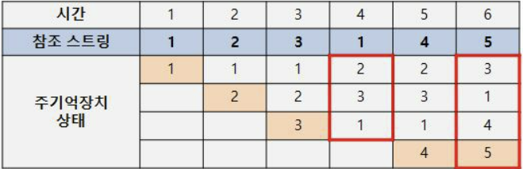

## 페이지 교체 알고리즘

 

[TOC]

 

---

> 페이지 교체 알고리즘은 페이징 기법으로 메모리를 관리하는 운영체제에서, 페이지 부재가 발생 하여 새로운 페이지를 할당하기 위해 현재 할당된 페이지 중 어느 것과 교체할지를 결정하는 바업이다. FIFO, LFU, LRU의 세가지가 있다.

### 1. LRU(Least Recently Used Algorithm)

* 가장 오랫동안 참조되지 않은 페이지를 교체한다. 프로세스가 주 기억 장치에 접근할 때마다 참조된 페이지에 대한 시간을 기록해야 한다. 큰 오버헤드가 발생한다. 

  **Input : 123145**

  **Output : 5413**

