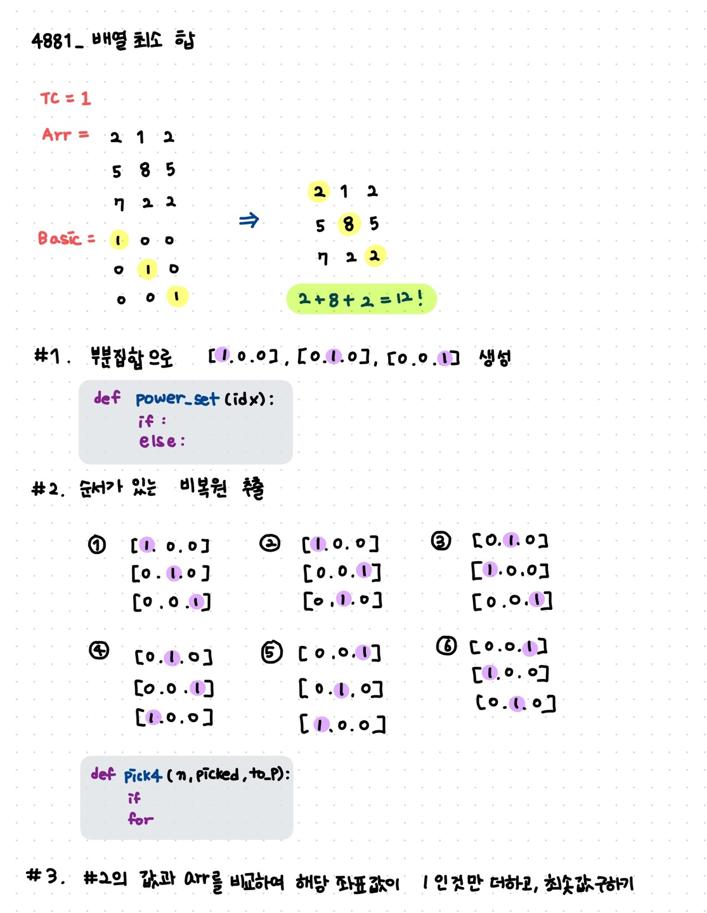

## **4881_배열 최소 합** 


1. 설명



2. 전체 코드

```python
import sys
sys.stdin = open('sample_input.txt')


# [1, 0, 0], [0, 1, 0], [0, 0, 1]] 출력하기
def power_set(idx):
    if idx < len(data):
        is_selected[idx] = 1
        power_set(idx + 1)
        is_selected[idx] = 0
        power_set(idx + 1)
    else:
        total = 0
        for k in range(len(data)):
            if is_selected[k]:
                total += data[k]
        if total == 1:
            results.append(is_selected[:])

        return results


# [[[1, 0, 0], [0, 1, 0], [0, 0, 1]], [[1, 0, 0], [0, 0, 1], [0, 1, 0]], [[0, 1, 0], [1, 0, 0], [0, 0, 1]], [[0, 1, 0], [0, 0, 1], [1, 0, 0]], [[0, 0, 1], [1, 0, 0], [0, 1, 0]], [[0, 0, 1], [0, 1, 0], [1, 0, 0]]]
def pick4(n, picked, to_pick):  # n개에서 to_pick개를 뽑겠다.
    global result, arr, N
    if to_pick == 0:
        result += picked

    for m in range(0, n):
        if results[m] not in picked:
            picked.append(results[m])
            pick4(n, picked, to_pick - 1)
            picked.pop()


# 최댓값 찾기
TC = int(input())
for tc in range(1, TC+1):
    N = int(input())
    arr = [list(map(int, input().split())) for _ in range(N)]
    
    # 1. list만들기
    data = [1] * N
    is_selected = [0] * N
    results = []
    power_set(0)  # 자릿수 가져오기 0열 부터 시작하겠다
    # print(results)

    # 2. 1에서 만든 리스트 순열로 불러오기
    elem = []
    result = []
    pick4(N, [], N)
    for i in range(len(result) // N):
        elem += [result[N * i:N * i + N]]
    # print(len(elem), elem)

    # 3.  출력하기
    my_sum = []
    for k in range(len(elem)):
        s = 0
        for i in range(N):
            for j in range(N):
                if elem[k][i][j]:
                    s += arr[i][j]
        my_sum.append(s)
                    
    # print(min(my_sum), my_sum)
    print(f'#{tc} {min(my_sum)}')
```

