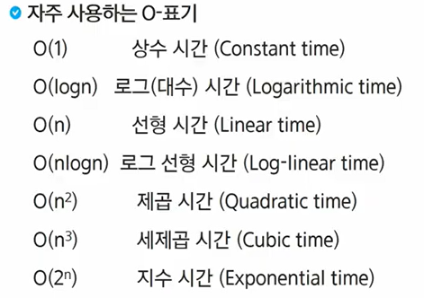
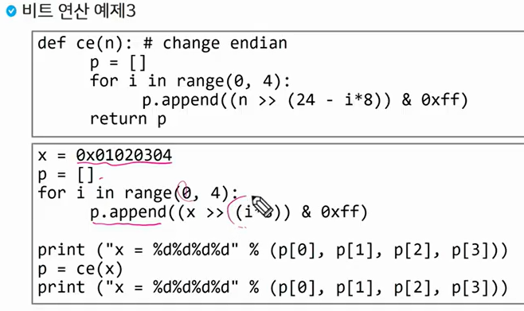
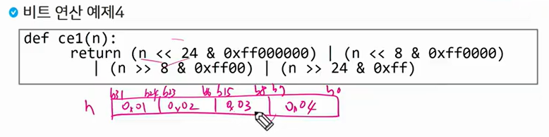

# 03.23

## Start(Live 수업)

<br>

### 1. SW 문제 해결

* SW 문제 해결 역량이란? 프로그램을 하기 위한 많은 제약 조건과 요구사항을 이해하고 최선의 방법을 찾아내는 능력이다. 프로그래머가 사용하는 언어나 라이브러리, 자료구조, 알고리즘에 대한 지식을 적재적소에 퍼즐을 배치하듯 이들을 연결하여 큰 그림을 만드는 능력이라 할 수 있다. 
* 문제 해결 역량은 _추상적인 기술_ 이다.
  - 프로그래밍 언어, 알고리즘처럼 명확히 정의된 실체가 없다.
  - 무작정 알고리즘을 암기하고 문제를 풀어본다고 향상되지 않는다.
* 문제 해결 역량을 향상시키기 위해서 훈련이 필요하다. 
* 새로운 언어, 프레임워크, 개발 방법론 등을 조합해 나가는 방법을 배워야 하지만 쉽진 않다. 
* 문제 해결 과정
  1. 문제를 읽고 이해한다.
  2. 문제를 익숙한 용어로 재정의한다.
  3. 어덯게 해결할지 계획을 세운다.
  4. 계획을 검증한다.
  5. 프로그램으로구현한다.
  6. 어떻게 풀었는지 돌아보고, 개선할 방법이 있는지 찾아본다. 

<br>

### 2. 복잡도 분석

* 알고리즘? 유한한 단계를 통해 **문제를 해결하기 위한 절차나 방법**이다.

* 알고리즘의 효율

  1. 공간적 효율성: 연산량 대비 얼마나 적은 메모리공간을 요하는 가?
  2. 시간적 효율성: 연산량 대비 얼마나 적은 시간을 요하는 가?

  효율성을 복잡도가 될 수 있다. 

  시간적 복잡도 분석은 '하드웨어 환경에 다라 처리 시간이 달라진다.', '소프트웨어 환경에 따라 처리시간이 달라진다.'

* 복잡도의 점근적 표기

  1. O(Big-Oh) - 표기 : 복잡도의 점근적 상한을 나타낸다. 
  2. 오메가(Big_Omega) - 표기 : 복잡도의 점근적 하한을 의미한다. "최소한 이만한 시간은 걸린다."
  3. 세타(Big-Theta) - 표기 : 빅오와 오메가가 같을때 사용한다. n**2과 동일한 증가율을 가진다. 



* 10억 개의 숫자를 정렬하는데 PC에서  O(n**2) 알고리즘은 300여 년이 걸리는 반면에 O(nlogn) 알고리즘은 5분만에 정렬한다. 이런 이유로 효율적인 알고리즘이 필요하다.  


<br>

### 3. 표준 입출력 방식

* python의 입력
  * Raw 값의 입력 : input() -> 받은 입력값을 문자열로 취급
  * Evaluated된 값 입력 : eval(input()) -> 받은 입력값을 평가된 데이터 형으로 취급

* python의 출력

  * print() -> 표준 출력 함수. 출력값의 마지막에 개행 문자 포함
  * print('text', end=' ')
  * print('%d' % number)

* ```python
  import sys
  sys.stdin = open("a.txt", "r")
  sys.stdout = open("output.txt", "w")
  ```

<br>

### 4. 비트 연산

* 정보를 저장할 수 있는 최소한의 단위를 비트라고 한다. 

* 비트 연산자

  * **&** : 비트단위로 AND 연산을 한다.

  * **|** : 비트단위로 OR을 연산한다.

  * **^** : 비트단위로 XOR을 연산한다.(같으면 0 다르면 1)

  * **~** : 단한 연산자로서 피연산자의 모든 비트를 반전시킨다. 

  * **<<** : 피연산자의 비트 열을 왼쪽으로 이동시킨다.

  * **>>** : 피연산자의 비트 열을 오른쪽으로 이동시킨다.

    `i << 3` -> 100

    `~(i << 3)` -> 011

    `1 << n`은 원소가 n 개일 경우 모든 부분집합의 수를 의미한다.

    `i & (1 << j)` 계산 결과는 i의 j 번째 비트가 1인지 아닌지를 검사한다.  

  <연습문제 2 >

  ```python
  def Bbit_print(i):
      output = ""
      for j in range(7, -1, 1):
          output += "1" if i & (1 << j) else "0"
      print(output, end=' ')
      
  a = 0 * 10
  x = 0x01020304
  print("%d = " % a, end=' ')
  Bbit_print(a)
  print()
  print("0%X = " % x, end=' ')
  for i in range(0, 4):
      Bbit_print((x >> i*8) & 0xff)
  ```

  

  

* 엔디안(Endianness)

  컴퓨터의 메모리와 같은 1차원의 공간에 여러 개의 연속된 대상을 배열하는 방법을 의미하며 HW 아키텍처마다 다르다.

  주의 : 속도 향상을 위해 바이트 단위와 워드 단위를 변환하여 연산 할 대 올바로 이해하지 않으면 오류를 발생 시킬 수 있다. 

  1. 빅 엔디안(Big-endian) : 보통 큰 단위가 앞에 나옴. 네트워크 (12 34)
  2. 리틀 엔디안(Little-endian) : 작은 단위가 앞에 나옴. 대다수 데스크탑 컴퓨터 (34 12)

<br>

### 5. 진수

* 2진수,8진수, 10진수,16진수

* (149)_10_ = (10010101)_2_ = (225)_8_ = (95)_16_

* (135)_8_ = 1 * 8^2 + 3 * 8*1 + 5 * 8^1 = (93)_10_

* :red_circle: 컴퓨터에서 음의 정수 표현 방법

  1. **1의 보수** : 부호와 절대값으로 표현된 값을 부호 비트를 제외한 나머지 비트들을 0은 1로, 1은 0으로 변환한다. 

     -6 : 1000000000000110 : 부호와 절대값 표현

     -6 : 1111111111111001 : 1의 보수 표현

  2. **2의 보수** : 1의 보수방법으로 표현된 값의 최하위 비트에 1을 더한다.

     -6 : 1111111111111010 : 2의 보수 표현

<br>

### 6. 실수

* 실수의 표현 : 소수점 이하 4자리를 10진수로 나타내보면

  .assets/image-20220323140326083.png)

* 컴퓨터는 실수를 표현하기 위해 부동 소수점 표기법을 사용한다.

  부동 소수점 표기 방법은 소수점의 위치를 고정시켜 표현하는 방식이다.

  소수점의 위치를 왼쪽의 가장 유효한 숫자 다음으로 고정시키고 밑수의 지수승으로 표현한다. 

  .assets/image-20220323140737088.png)

  단정도 실수: 32비트

  배정도 실수: 64비트

  * 단정도 실수의 지수부분 만드는 방법

    지수부에는 8비트가 배정(256개의 상태를 나타낼 수 있다.)  숫자로는 0-255까지 나타낼 수 있지만, 음수 값을 나타낼 수 있어야 하므로 익세스(excess) 표현법을 사용한다.(지수부의 값을 반을 나누어 그 값을 0으로 간주하여 음수지수와 양수지수를 표현하는 방법이다.)

    .assets/image-20220323141553252.png)

    ex) `1001.0001`을 단정도 실수로 표현하면 

    | 부호 |  정수부  |         지수부          |
    | :--: | :------: | :---------------------: |
    |  0   | 10000010 | 00100110000000000000000 |

* 컴퓨터는 실수를 근사적으로 표현한다. 이진법으로 표현 할 수 없는 형태의 실수는 정확한 값이 아니라 근사 값으로 저장되는데 이때 생기는 작은 오차가 계산 과정에서 다른 결과를 가져온다.

* 실수 자료형의 유효 자릿수

  * 32비트 실수형 유효자릿수(십진수) -> 6
  * 64비트 실수형유효자릿수(십진수) -> 15

* 파이썬에서는 내부적으로 더 많은 비트를 사용해서 훨씬 넓은 범위의 실수를 표현할 수 있다. 최대로 표현할 수 있는 값은 약 `1.8*10^308`이고 이 이상은 inf로 표현한다. 더 최소로 표현할 수 있는 값은 약 `5.0* 10^(-324)`이며, 이 이하는 0으로 표현한다.

* <연습문제3>

<br>
