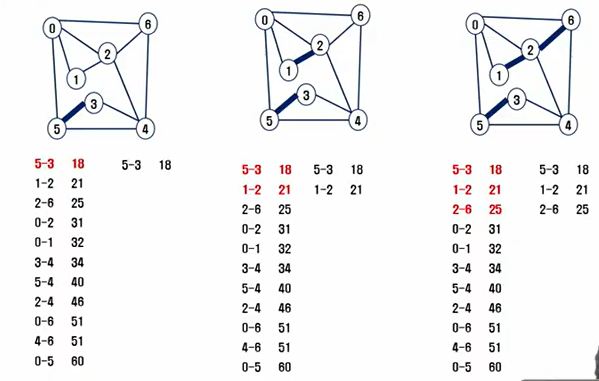
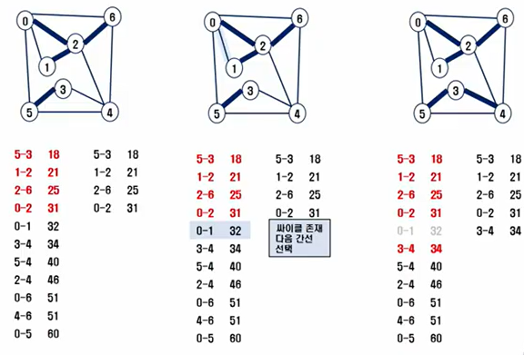

# 04.04

## Algorithm

<br>

[TOC]

<br>

---

### 1. 상태 공간 트리

#### 1. DFS & Backtracking

```python
"""
DFS 깊이 우선 탐색
"""

def DFS1(n):
    visited = [0]*(N+1)
    stack = []
    stack.append(n)
    visited[n] = 1
    # 1-2
    while stack:
        p = stack.pop()
        print(p, end=' ')
        for k in range(N+1):
            if visited[k] == 0 and arr[p][k] == 1:
                stack.append(k)
                visited[k] = 1

def DFS2(n):
    visited = [0]*(N+1)
    stack = []
    stack.append(n)
    visited[n] = 1
    # 1-3
    while stack:
        p = stack.pop()
        print(p, end=' ')
        for k in range(N, 0, -1):
            if visited[k] == 0 and arr[p][k] == 1:
                stack.append(k)
                visited[k] = 1


# main
lst = list(map(int, input().split(', ')))
# print(lst)
# 무뱡향 인접 행렬 만들기
N = 7
arr = [[0]*(N+1) for _ in range(N+1)]
# print(arr)
for i in range(0, len(lst), 2):
    arr[lst[i]][lst[i+1]] = 1
    arr[lst[i+1]][lst[i]] = 1
# print(arr)

DFS1(1)
print()
DFS2(1)
```

```python
"""
Backtracking 백트래킹
"""

# 해당 인덱스 값을 사용했는지 안했는지를 보고 값 설정

def f(n, k):  # 순열 p[n]을 채우는 함수, k 배열의 크기
    if n == k:
    	print(p)

	for i in range(k):  # used에서 사용하지 않은 숫자 검색
   		if used[i] == 0:  # 앞에서 사용하지 않은 숫자인 경우
        	used[i] = 1  # 사용함으로 표시
        	p[n] = a[i]  # p[n]결정
        	f(n+1, k)
            used[i] = 0  # a[i]를 다른 위치에서 사용할 수 있도록 함
	return

a = [1, 2, 3]
used = [0]*3
p = [0]*3
f(0, 3)

-----
[1, 2, 3]
[1, 3, 2]
[2, 1, 3]
[2, 3, 1]
[3, 1, 2]
[3, 2, 1]
```


#### 2. BFS

```python
"""
BFS 너비 우선 탐색
"""

def BFS(n):
    visited = [0]*(V+1)
    queue = []
    queue.append(n)
    visited[n] = 1
    while queue:
        q = queue.pop(0)
        print(q, end=' ')
        for k in range(1, 8):
            if arr[q][k] == 1 and visited[k] == 0:
                visited[k] = 1
                queue.append(k)

lst = list(map(int, input().split(', ')))
V = 7
arr = [[0]*(V+1) for _ in range(V+1)]
# print(arr)
for i in range(0, len(lst), 2):
    arr[lst[i]][lst[i+1]] = 1
    arr[lst[i+1]][lst[i]] = 1
# print(arr)

BFS(1)
```


<br>

---

### 2. 부분집합 

#### 1. 순열

```python
# 해당 인덱스 값을 사용했는지 안했는지를 보고 값 설정

def f(n, k):  # 순열 p[n]을 채우는 함수, k 배열의 크기
    if n == k:
    	print(p)

	for i in range(k):  # used에서 사용하지 않은 숫자 검색
   		if used[i] == 0:  # 앞에서 사용하지 않은 숫자인 경우
        	used[i] = 1  # 사용함으로 표시
        	p[n] = a[i]  # p[n]결정
        	f(n+1, k)
            used[i] = 0  # a[i]를 다른 위치에서 사용할 수 있도록 함
	return

a = [1, 2, 3]
used = [0]*3
p = [0]*3
f(0, 3)

-----
[1, 2, 3]
[1, 3, 2]
[2, 1, 3]
[2, 3, 1]
[3, 1, 2]
[3, 2, 1]
```

```python
# 5개 중에 3개를 선택
# baby-gin 풀 수 있음!!!

def f(n, k, m):  # 순열 p[n]을 채우는 함수, k 고를 개수, m 주어진 숫자 개수
    if n == k:
    	print(p)

	for i in range(m):  # used에서 사용하지 않은 숫자 검색
   		if user[i] == 0:  # 앞에서 사용하지 않은 숫자인 경우
        	used[i] = 1  # 사용함으로 표시
        	p[n] = a[i]  # p[n]결정
        	f(n+1, k, m)
            used[i] = 0  # a[i]를 다른 위치에서 사용할 수 있도록 함
	return

a = [1, 2, 3, 4, 5]
used = [0]*5
p = [0]*3
f(0, 3, 5)

-----
[1, 2, 3]
[1, 2, 4]
[1, 2, 5]
[1, 3, 2]
[1, 3, 4]
[1, 3, 5]
.....
```


#### 2. 바이너리 카운팅

```python
# 바이너리 카운팅을 통한 부분집합 생성 코드 예

arr = [3, 6, 7, 1, 5, 4]
n = len(arr)

for i in range(1<<n):  # 1 << n : 부분집합의 개수
    for j in range(0, n):  # 원소의 수만큼 비트를 비교함
        if i&(1<<j):  # i의 j번째 비트가 1이면 j번째 원소 출력
            print('%d'%arr[j], end='')
    print()
```

#### 3. 조합

```python
# 재귀 호출을 이용한 조합 생성 알고리즘

# 1. 10개의 원소 중 3개를 고르는 조합
i < j < k

a = [0, 0, 0, 0, 0, 0, 0, 0, 0, 0]
for i in range(7):
    for j in range(i+1, 8):
        for k in range(j+1, 9):
            f(a[i], a[j], a[k])
----
N = 10
R = 3
for i in range(N-2):
    for j in range(i+1, N-1):
        for k in range(j+1, N):
            f(i, j, k)
```

<br>

---

### 3. 분할 정복

#### 1. 병합정렬

```python
"""
arr = [6, 5, 3, 1, 8, 7, 2, 4]
loww_arr = []
high_arr = []
merge_sort(arr)

[6, 5, 3, 1] [8, 7, 2, 4]
[6, 5] [3, 1] [8, 7] [2, 4]
[6] [5] [3] [1] [8] [7] [2] [4]
[5, 6] [1, 3] [7, 8] [2, 4]
[1, 3, 5, 6] [2, 4, 7, 8]
[1, 2, 3, 4, 5, 6, 7, 8]
"""

def merge_sort(arr):  # arr은 배열
    if len(arr) < 2:
        return arr

    mid = len(arr) // 2
    low_arr = merge_sort(arr[:mid])
    high_arr = merge_sort(arr[mid:])

    merged_arr = []
    l = h = 0
    while l < len(low_arr) and h < len(high_arr):
        if low_arr[l] < high_arr[h]:
            merged_arr.append(low_arr[l])
            l += 1
        else:
            merged_arr.append(high_arr[h])
            h += 1
    merged_arr += low_arr[l:]
    merged_arr += high_arr[h:]
    return merged_arr
```


#### 2. 퀵 정렬

```python
arr = [6, 5, 1, 4, 7, 2, 3]
quick_sort(arr)

def quick_sort(arr):
    if len(arr) <= 1:
        return arr
    pivot = arr[len(arr) // 2]
    # lesser_arr은 왼편의 작은 값
    # greater_arr은 오른편의 큰 값
    # equal_arr은 pivot의 값과 같은 값
    lesser_arr, equal_arr, greater_arr = [], [], []
    for num in arr:
        if num < pivot:  # pivot보다 작으면 왼쪽
            lesser_arr.append(num)
        elif num > pivot:  # pivot보다 크면 오른쪽
            greater_arr.append(num)
        else:  # pivor와 같으면
            equal_arr.append(num)
    return quick_sort(lesser_arr) + equal_arr + quick_sort(greater_arr)
```

```python
def quick_sort(arr, start,end):
    def partition(start, end):
        pivot = arr[end]
        left = start
        for right in range(start, end):
            if arr[right] < pivot:
                arr[left], arr[right] = arr[right], arr[left]
                left += 1
        arr[left], arr[end] = arr[end], arr[left]
        return left
    if start < end:
        pivot = partition(start, end)
        quick_sort(arr, start, pivot - 1)
        quick_sort(arr, pivot+1, end)

T = int(input())
for tc in range(1, T + 1):
    N = int(input())
    arr = list(map(int, input().split()))
    quick_sort(arr, 0, N - 1)  # 배열, left, right
    print(f'#{tc} {arr[N // 2]}')  # N//2 원소 출력
```


#### 3. 이진탐색

```python
# 반복 구조

def binarySerch(n, s[], k):
    low = 0
    high = n-1
    
    while low <= high and location = 0:
        mid = low + (high-low)/2
        
        if s[mid] == key:
            return mid
        elif s[mid] > key:
            high = mid - 1
        else:
            low = mid + 1
   
	return -1  # 찾는 값이 없다면!!
```

```python
# 재귀 구조

def binarySerch(s[], low, high, key):
    if low > high:
        return -1
    
    else:
        mid = (low + high)/2
        if key == s[mid]:
            return mid
        elif key< s[mid]:
            return binarySerch(s[], low, mid-1, key)
        else:
            return binarySerch(s[], mid + 1, high, key):
```


<br>

---

### 4. 그래프

#### 1. 그래프 탐색

#### 2. 최소비용 신장 트리(MST)

prim 알고리즘과 Kruskal 알고리즘이 있다. 

```python
# Prim 알고리즘

"""
1. 임의 정점을 하나 선택해서 시작
2. 선택한 정점과 인접하는 정점들 중의 최소 비용의 간선이 존재하는 정점을 선택
3. 모든 정점이 선택될 때 까지 1과 2를 반복

<서로소인 2개의 집합(2 disjoint-sets) 정보를 유지>
트리 정점들 - MST를 만들기 위해 선택된 정점들 (포함)
비트리 정점들 - 선택 되지 않은 정점들 (미포함)
"""

def prim1(r, V):  # r은 시작 정점, V는 간선의 갯수?
    MST = [0] *(V+1)
    key = [10000]*(v+1)
    key[n] = 0  # 시작정점의 key
    for _ in rnage(V):
        # MST에 포함되지 않은 정점 중, key가 최소인 u 찾기
        u = 0
        minV = 10000
        for i in range(V+1):
            if MST[i] == 0 and key[i]<minV:
                u = i
                minV = key[i]
                
        MST[u] = 1  # 최소로 찾은 정점 u를 방문 표시
        for v in range(V+1):
            if MST[V] == 0 and adjM[u][v]>0:
                key[v] = min(key[v], adjM[u][v])
    return sum(key)


def prim2(r, V):  # r은 출발지점, V는 정점의 개수
    MST = [0] *(V+1)  # MST는 포함, 사용 여부를 확인하기 위해 만든다. 
    MST[r] = 1
    s = 0  # 최소 가중치의 합(우리가 구할 값)
    for _ in range(V):
        u = 0
        minV = 10000
        for i in range(V+1):
            if MST[i] == 1:  # 포함되어 있다면? -> 이 부분에서 0, 2, 1...의 순서로 움직인다. 
                for j in range(V+1):
                    # 인접이면서, 아직 사용되지(포함되지) 않은 정점이면?
                    if 0 < adjM[i][j]<minV and MST[j] == 0:
                        u = j
                        minV = adjV[i][j]  # 해당 행에서 가장 작은 값을 찾기 위해 minV를 계속 초기화
                        
        s += minV
        MST[u] = 1


v, E = map(int, input().split())
adjM = [[0]*(V+1) for _ in range(V+1)]

for _ in range(E):
    u, v, w = map(int, input().split())
    adjM[u][v] = w
    adjM[v][u] = w
        
prim1(0, v)
```

```python
# Kruskal 알고리즘

def find_set(x):
    while x != p[x]:  
        # 부모노드의 값을 x에 저장 -> 만약 x의 부모 노드가 본인이면 종료!
        x = p[x]
   	return x

def union (x, y):
    rep[find_set(y)] = find_set(x)
    
    
    
V, E = map(int, input().split())
edge = []
for _ in range(E):
    u, v, w = map(int, input().split())
    edge.append([w, v, u])
    
edge.sort()
rep = [i for i in range(V+1)]  # 대표원소 배열
# MST의 간선수 N = 정점수 - 1
N = V + 1
cnt = 0  # 선택한 edge의 수
total = 0  # MST 가중치의 합
for w, v, u in range(edge):
    if find_set(v) ! = find_set(u):
        cnt += 1
        union(u, v)
        total += w
        if cnt == N-1:  # MST 구성이 끝나면
            break
            
print(total)
```





#### 3. 최단 경로

다익스트라 알고리즘은 여러가지 코드가 존재하지만 다음의 코드는 반드시 들어가야 한다. 

1. `visited = [0] * (V+1)` : 방문표시 해줄 배열
2. `distance = float('inf') * (V+1)` : 해당 노드에 도착하는 최솟값을 찾기 위해 기본으로 가장 큰 값을 사용해준다.
3. 첫번째 `0`에서 시작한다면 0과 인접해 있는 모든 노드의 가중치를 `distance`에 작성해 준 후, 가중치 중 가장 작은 노드를 다음 시작 노드로 설정해준다.  

```python
# 다익스트라 알고리즘

"""
1. 거리 벡터
2. 최소 경로를 넣어줄 2차원 배열 distance 필요(기본 arr와 동일한 크기!)
3. deque 사용
"""

import sys
from collections import deque
sys.stdin = open('input.txt')


def BFS(queue):

    while queue:
        q = queue.popleft()
        for k in range(4):
            nx = q[1] + dx[k]
            ny = q[0] + dy[k]
            if 0 <= nx < N and 0 <= ny < N:
                if distance[ny][nx] > distance[q[0]][q[1]] + arr[ny][nx]:
                    distance[ny][nx] = distance[q[0]][q[1]] + arr[ny][nx]
                    queue.append([ny, nx])


TC = int(input())
for tc in range(1, TC+1):
    N = int(input())
    arr = [list(map(int, input())) for _ in range(N)]

    dx = [1, 0, -1, 0]  # 우하좌상
    dy = [0, 1, 0, -1]

    INF = float('inf')  # 무한대로 가정!
    distance = [[INF for _ in range(N)] for _ in range(N)]
    distance[0][0] = 0

    queue = deque()
    queue.append([0, 0])

    BFS(queue)
    print(f'#{tc} {distance[N-1][N-1]}')
```

```python
TC = int(input())
for tc in range(1, TC+1):
    V, E = map(int, input().split())
    adj = {i: [] for i in range(V + 1)}

    for i in range(E):
        s, e, c = map(int, input().split())
        adj[s].append([e, c])
    print(adj)
    
    INF = float('inf')
    dist = [INF] * (V + 1)
    selected = [False] * (V + 1)  # 방문표시

    dist[0] = 0
    cnt = 0
    while cnt < V:
        min = INF
        u = -1
        for i in range(V + 1):
            if not selected[i] and dist[i] < min:
                min = dist[i]
                u = i
        # 결정
        selected[u] = True
        cnt += 1
        # 간선완화
        for w, cost in adj[u]:  # 도착정점, 가중치
            if dist[w] > dist[u] + cost:
                dist[w] = dist[u] + cost
    print(f'#{tc} {dist[V]}')
```


<br>

