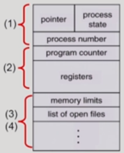

# 3. Process1

[참고] 반효경 [운영체제]

> 프로세스의 개념, 프로세스의 상태(Process State), 프로세스의 개념, 프로세스 상태도, Process Cintrol Block(PCB), 문맥 교환(Context Switch), 프로세스를 스케줄링하기 위한 큐, Ready Queue와 다양한 Device Queue, 스케줄러(Scheduler)

[TOC]

## 1. 프로세스의 개념 

* **프로세스**?
  * Process is a program in execution : **실행 중인 프로그램**

* 프로세스의 문맥(context)
  * CPU 수행 상태를 나타내는 하드웨어 문맥
    * Program Counter
    * 각종 register
  * 프로세스의 주소 공간
    * code, data, stack
  * 프로세스 관련 커널 자료 구조
    * PCB(Process Control Block)
    * Kernel stack

## 2. 프로세스의 상태 (Process State)

* 프로세스는 상태**(state)**가 변경되며 수행된다. 

  CPU는 하나 밖에 없기 때문에 CPU를 잡고 실행하고 있는 프로세스는 하나이다. 

  1. `Running` : CPU를 잡고 instruction을 수행중인 상태

  2. `Ready` : 다른 조건은 만족 되지만 당장 프로그램이 CPU에서 실행이 되려면 물리적인 메모리에 올라와 CPU를 얻어야 하는 상태

  3. `Blocked (wait, sleep)` : CPU를 주어도 당장 instruction을 수행할 수 없는 상태

     * Process 자신이 요청한 event(예: I/O)가 즉시 맍ㄱ되지 않아 이를기다리는 상태

     * (예) 디스크에서 file을 읽어와야 하는 경우

  4. `Suspended (stopped)`

     * 외부적인 이유로 프로세스의 수행이 정지된 상태, 
     * 프로세스는 통째로 디스크에 swap out(메모리를 완전히 잃어버리는)된다.
     * (예) 사용자가 프로그램을 일시 정지시킨 경우 (break key), 시스템이 여러 이유로 프로세스를 잠시 중단시킴(메모리에 너무 많은 프로세스가 올라와 있을 때)

     > Blocked : 자신이 요청한 event가 만족되면 Ready
     >
     > Suspended : 외부에서 resume해 주어야 Active

  5. `New` : 프로세스가 생성중인 상태 (프로세스가 생성 되었다면 위에 3개 중에 하나)

  6. `Terminated` : 수행(execution)이 끝난 상태 (약간 정리할 것이 남아있는 상태)

 ### 프로세스 상태도 

1. **Ready+Running+Blocked** 

* **new**  프로세스가 생성중인 상태 :arrow_right: **ready** CPU만 얻으면 됨, 최소한의 메모리가 올라와 있는 상태 :arrow_right:  **Running** 본인 상태에 CPU를 얻게 되어 수행중인 상태

  1. 자진해서 종료(I/O or event wait)

  2. Timer interrupt : 나에게 할당된 시간이 끝나서 끝남. 다시 줄서서 CPU를 할당 받아야 함 

  3. exit(terminated) : 프로세스가 종료 되었다면 

2. **Ready+Running+Blocked+Suspended**

* :exclamation: User mode에서 Running을 하고 있다가 System call, Interrupt, trap 등의 작업이 필요할 때 운영체제의 커널에 의해 monitor mode(커널 모드)에서 Running이 실행된다. 이때, 운영체제가 Running을 하는 것이라고 말하면 안된다. 

 :heavy_check_mark: 프로세스 상태도 2 

1. CPU에서 러닝 되다가 Timer interrupt되면 queue의 뒤에 다시 줄 서게 된다.
2. CPU에 있다가 Disk에서 서비스를 읽어와야 하는 경우 작업 중인 프로세스는 `running` 에서 `blocked` 로 바뀌게 되고, `Disk I/O queue` 뒤에 들어가게 된다.  Disk에서 작업을 완료한 경우 Disk controller가 CPU에 interrupt 걸게 된다. 
3. CPU는 현재 프로세스를 실행하고 있었지만, interrupt가 들어왔기 때문에 하던 작업을 멈추고 CPU 제어권이 운영체제 커널에게 넘어 간다. 
   * 운영체제 커널 : I/O 작업이 끝난 프로세스의 메모리 영역에 해당하는 영역을 넘겨주거나, 프로세스의 상태를 Blocked에서 Ready로 바꾸는 역할을 한다.

4.  공유데이터 같은 소프트웨어 자원도 Resource queue가 존재한다. 

## 3. Process Control Block (PCB)

* PCB 

  * 운영체제가 각 프로세스를 관리하기 위해 프로세스당 유지하는 정보

  * 다음의 구성 요소를 가진다. 

    (1) OS가 관리상 사용하는 정보 

    - Process state, Process ID
    - scheduling information, priority

    (2) CPU 수행 관련 하드웨어 값

    * Program counter, registers

    (3) 메모리 관련

    * Code, data, stack의 위치 정보

    (4) 파일 관련

    * Open file descriptors...

    

​					

## 4. 문맥 교환(Context Switch)

CPU는 굉장히 빠른 자원 -> 프로세스가 짧은 시간에 CPU를 얻었다가 뺏겼다가 하는 과정 반복 -> 이때 프로세스의 문맥을 기억했다가 그 지점 부터 시작하는 것을 의미

* CPU를 한 프로세스에서 다른 프로세스로 넘겨주는 과정

* CPU가 다른 프로세스에게 넘어갈 때 운영체제는 다음을 수행

  * CPU를 내어주는 프로세스의 상태를 그 프로세스의 PCB에 저장

  * CPU를 새롭게 얻는 프로세스의 상태를 PCB에서 읽어옴

    

* **System call**(프로세스가 본인이 필요해서 운영체제에게 요청할 때)이나 **interrupt**(컨트롤러 같은 장치나 CPU에게 정보를 전달하려는 목적) 발생시 CPU 제어권이 `사용자 프로세스` 에서 `운영체제 커널`로 넘어간다. 이 때 반드시 context switch가 일어나는 것은 아님

  

  (1) **문맥 교환 x** : 사용자 프로세스 A에서 `Interrupt`나 `system call`이 발생시 운영체제 커널에게 제어권 넘어감 :arrow_forward: 운영체제 커널은 작업 후에 CPU를 *프로세스 A* 에게 넘겨 준다. 

  (커널 모드로 잠깐 들어 온 것)

  (2) **문맥 교환 o**  : 사용자 프로세스 A에서 `time interrupt`나 `I/O 요청 System call`이 발생 시 운영체제 커널에게 제어권 넘어감 :arrow_forward: CPU를 다른 *프로세스 B*에게 넘겨 준다. 

  :grey_exclamation: (1) 의 경우에도 CPU 수행 정보 등 context의 일부를 PCB에 save해야 하지만 문맥 교환을 하는 (2)의 경우 그 부담이 훨씬 크다. (cache memory flush)

## 5. 프로세스를 스케줄링하기 위한 큐

1. **Job queue**
   * 현재 시스템 내에 있는 모든 프로세스의 집합

2. **Ready queue**
   * 현재 메모리 내에 있으면서 CPU를 잡아서 실행되기를 기다리는 프로세스의 집합

3. **Device queue**
   * I/O device의 처리를 기다리는 프로세스의 집합

:grey_exclamation: 프로세스들은 각 큐들을 오가며 수행된다.

## 6. Ready Queue와 다양한 Device Queue

* Ready queue와 다양한 Device queue

* 프로세스 스케줄링 큐의 모습 (정확하진 않음!)

  

  

## 7. 스케줄러(Scheduler)

1. **Long-term scheduler** 장기 스케줄러 or jdb scheduler

   * 시작 프로세스 중 어떤 것들을 ready queue로 보낼지 결정
   * 프로세스에 memory(및 각종 자원)을 주는 문제
   * degree of Multiprogramming을 제어 (memory에 올라가있는 프로세스의 수를 제어)
   * time sharing system에는 보통 장기 스케줄러가 없음(무조건 ready)

2. **Short-term scheduler** 단기 스케줄려 or CPU scheduler

   * 어떤 프로세스를 다음번에 running 시킬지 결정
   * 프로세스에 CPU를 주는 문제
   * 충분히 빨라야 함 (millisecond 단위)

3. **Medium-term scheduler** 중기 스케줄러 or Swapper

   * 여유 공간 마련을 위해 프로세스를 통째로 메모리에서 디스크로 쫓아냄

   * 프로세스에게서 momory를 뺏는 문제

   * degree of Multiprogramming을 제어

     :exclamation: 중기 스케줄러에 의해 프로세스 상태에 한가지가 더 추가 된다. `Suspended (stopped)` 라고 하는 것

