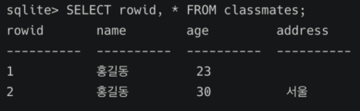

# SQL & ORM

**역할마다 명령어가 조금씩 다르기 때문에 헷갈리지 않게 공부하는 것이 중요!**

[TOC]

<br>

---

## 1. Database

* DB는 체계화된 데이터들의 모임이다. 효율적으로 자료  정리가 가능하다. 
* 데이터 중복 최소화, 무결성, 일관성, 독립성, 표준화, 보안 유지 등의 장점이 있다.
* RDB(Relational Database) : 키와 값들의 간단한 관계를 표 형태로 정리한 데이터베이스
  1. 스키마(schema) : 자료의 구조, 표현방법, 관계 등 전반적인 명세를 기술한 것.
  2. 테이블(table) : 열(컬럼/필드)과 행(레코드/값)의 모델을사용해 조직된 데이터 요소들의 집합.
  3. 열(column) : 각 열에는 고유한 데이터 형식이 지정된다.
  4. 행(row): 실제 데이터가 저장되는 형태이다.
  5. 기본키(Primary Key) : 각 행(레코드)의 고유값이다. 반드시 설정해야 하는 값이다.

<br>

<br>

---

## 2. SQL(Structured Query Language) & ORM

* RDBMS의 데이터 관리를 위해 설계된 특수 목적의 프로그래밍 언어이다. 
* **DDL**(CREATE, DROP, ALTER), **DML**(INSERT, SELECT, UPDATE, DELETE) , **DCL**(GRANT, REVOKE, COMMIT, ROLLBACK) 등을 배우게 된다.

<br>

### 1. DDL (테이블 생성 및 삭제)

* `Run select`로 실행하기

* CREATE : 데이터 베이스 생성하기 

  ```bash
  # shell을 이용한 데이터 베이스 생성. 추후에는 사용하지 않음.
  # shell의 기본적인 사용법을 알고 있어야함!
  $ sqlite3 tutorial.sqlite3  # shell을 생성
  sqlite> .database
  sqlite> .mode CSV
  sqlite> .import hellodb.CSV examples
  sqlite> .tables 
  # examples
  
  # tutorial.sqlite3 파일 우클릭 -> open Database
  ```

  ```bash
  # 깔끔하게 출력하기
  sqlite> SELECT * FROM classmates;
  sqlite> .headers on
  sqlite> .mode column
  sqlite> SELECT * FROM classmates;
  ```

* **CREATE** : 테이블 생성하기

  ```sqlite
  -- 새로운 파일을 .sql 생성하기
  
  CREATE TABLE classmate (
  	id INTEGER PRIMARY KEY,
      name TEXT,
      age INT,
      address TEXT
  );
  ```

* **DROP** : 테이블 삭제하기

  ```sqlite
  DROP TABLE classmates;
  ```

<br>

### 2. DML (CRUD)

|       DML       |                            명령어                            |
| :-------------: | :----------------------------------------------------------: |
| INSERT (CREATE) | INSERT INTO 테이블이름(컬럼1, 컬럼2, ...) FROM (값1, 값2, ...) ; |
|  SELECT (READ)  |            SELECT * FROM 테이블 이름 WHERE 조건;             |
|     UPDATE      |    UPDATE 테이블이름 SET 컬럼1=값1, 컬럼2=값2 WHERE 조건;    |
|     DELETE      |              DELETE FROM 테이블이름 WHERE 조건;              |

<br>

1. **INSERT(삽입)** : 텡블에 단일 행 삽입

   ```sqlite
   INSERT INTO classmates (name, age) VALUES ('홍길동', 23);
   ```

   ```sqlite
   INSERT INTO classmates VALUES ('홍길동', 30, '서울');
   
   -- 모든 열에 데이터가 있는 경우 column을 명시하지 않아도 됨!
   ```

   

   

   :seedling: rowid = 1인 데이터의 주소가 공백이다. SQLite는 공백을 허용하기 때문에 공백으로 데이터를 입력해도 작성된다. 만약 꼭 필요한 정보라면 공백으로 비워두면 안된다. 이는 **테이블생성(CREATE)**할 때 `NOT NULL` 작성을 통해 방지할 수 있다. 

   :small_red_triangle_down:`id` 값 넣어 테이블 생성

   ```sql
   CREATE TABLE classmate (    
       id INTEGER PRIMARY KEY,    
       name TEXT NOT NULL,    
       age INT NOT NULL,    
       address TEXT NOT NULL
   );
   ```

   위의 테이블을 생성하고 데이터를 집어넣어보면 

   ```sqlite
   INSERT INTO classmates VALUES ('홍길동', 30, '서울');
   ```

   `ERROR: table classmates has 4 columns bur 3 values were supplied`라는 에러가 발생한다. `CREATE`할 때 `id`를 직접 작성해주어야 했기 때문에 4개의 값을 넣어주어야 하는데 3개의 값만 주었기 때문이다.

   ```sqlite
   1. INSERT INTO classmates VALUES (1, '홍길동', 30, '서울');
   -- id를 포함하여 작성
   ```

   ```sqlite
   2. INSERT INTO classmates (name, age, adress) VALUES ('홍길동', 30, '서울');
   -- cloumn들을 명시하여 작성
   ```

   혹은 `rowid`를 사용할 수 있다. 

   ```sqlite
   CREATE TABLE classmate (     
       name TEXT NOT NULL,    
       age INT NOT NULL,    
       address TEXT NOT NULL
   );
   -- id값을 작성하지 않았지만 rowid가 자동으로 작성된다.
   ```

   <br>

2. **SELECT(조회)** : 테이블에서 데이터를 조회. SELECT 문은 SQLite에서 가장 복잡하며 다양한 절(clause)와 함께 사용한다. 

   * ORDER BY, DISTINCT, WHERE, LIMIT, GROUP BY ... 

   ```sqlite
   SELECT rowid, name From classmates;
   
   -- SQLite는 따로 pk 속성의 컬럼을 작성하지 않으면 값이 자동으로 증가하는 PK 옵션을 가진 rowid 컬럼을 정의한다. 
   ```

   * **LIMIT** : 쿼리에서 반환되는 행 수를 제한한다. 특정행 부터 시작해서 조회하기 위해 **OFFSET**과 함께 사용된다.

     ```sqlite
     SELECT rowid, name FROM classmates LIMIT 1;
     -- 첫 번째만 조회
     SELECT rowid, name FROM classmates LIMIT 1 OFFSET 2;
     -- 세 번째만 조회
     ```

   * **WHERE** : 쿼리에서 반환된 행에 대한 특정 검색 조건을 지정

     ```sqlite
     SELECT rowid, name FROM classmates WHERE address='서울';
     ```

   * **SELECT DISTINCT** : 조회 결과에서 중복 행을 제거. DISTINCT 절은 SELECT 키워드 바로 뒤에 작성해야 한다.

     ```sqlite
     SELECT DISTINCT age FROM classmates;
     ```

     <br>

3. **UPDATE** : 기존 행의 데이터를 수정. **SET** clause에서 테이블의 각 열에 대해 새로운 값을 설정한다.

   ```sqlite
   UPDATE classmates SET name='홍길동', address='제주도' WHERE rowid=5;
   ```

   <br>

4. **DELETE** : 테이블에서 행을 제거. 중복 불가능한 값인 `rowid`를 기준으로 삭제하는 것이 좋다!

   ```sqlite
   DELETE FROM classmates WHERE rowid=5;
   ```

   :small_red_triangle: `rowid`=5를 지운다음 새로운 데이터를 삽입하면 새로운 데이터의 `rowid`=5이다. 즉, SQLite는 기본적으로 `id`를 재사용한다! 재사용방지를 위해 `AUTOINCREMENT`를 사용한다.

   ```sqlite
   CREATE TABLE classmate (    
       id INTEGER PRIMARY KEY AUTOINCREMENT,
       ...
   );
   ```

<br>

### 3. WHERE

* 조건을 사용하기 위해 `WHERE`를 사용한다.  

  ```sqlite
  -- 단일 조건
  SELECT age, last_name FROM users WHERE age>=30;
  
  -- 다중 조건
  SELECT age, last_name FROM users WHERE age>=30 AND last_name='김';
  ```

<br>

### 4. SQLite Aggregate functions

* 집계 함수 : 값 집합에 대한 계산을 수행하고 단일 값을 반환하는 함수. SELECT 구문에서만 사용된다.

  1. COUNT

     ```sqlite
     SELECT COUNT(*) FROM users;
     ```

  2. AVG

     ```sqlite
     SELECT AVG(balance) FROM users WHERE age>=30;
     ```

  3. MAX

     ```sqlite
     SELECT first_name, MAX(balance) FROM users;
     ```

  4. MIN

     ```sqlite
     SELECT MIN(age) FROM users;
     ```

  5. SUM

     ```sqlite
     SELECT SUM(age) FROM users;
     ```

<br>

### 5. Like

* 패턴 일치를 기반으로 데이터를 조회하는 방법

  1. **%** (percent sign) : 0개 이상의 문자. 단어가 있을 수도 없을 수도 있음
  2. **_** (underscore) : 임의이 단일 문자. 단어가 무조건 있어야 함

  ```sqlite
  SELECT * FROM users WHERE age LIKE '2_';
  SELECT * FROM users WHERE phone LIKE '02-%';
  SELECT * FROM users WHERE first_name LIKE '%준';
  SELECT * FROM users WHERE phone LIKE '%-5114-%';
  ```

<br>

### 6. ORDER BY

* 조회 결과 집합을 정렬

  1. 오름차순 정렬(ASC) : default 값이므로 생략 가능하다.
  2. 내림차순 정렬(DESC)

  ```sqlite
  SELECT * FROM users ORDER BY age ASC LIMIT 10;
  -- users 에서 나이 순으로 오름차순 정렬하여 상위 10개만 조회
  SELECT * FROM users ORDER BY age, last_name ASC LIMIT 10;
  -- users 에서 나이 순, 성 순으로 오름차순 정렬하여 상위 10개만 조회
  SELECT last_name, first_name FROM users ORDER BY balance DESC LIMIT 10;
  -- 계좌 잔액 순으로 내림차순 정렬하여 해당 유저의 성과 이름을 10개만 조회
  ```

<br>

### 7. GROUP BY

* 행 집합에서 요약 행 집합을 만듦. 새로운 요약 행을 출력. 

* 문장에  WHERE 절이 포함된 경우 반드시 WHERE 절 뒤에 작성해야 함

  ```sqlite
  SELECT last_name, COUNT(*) FROM users GROUP BY last_name;
  -- users에서 각 성씨가 몇 명씩 있는지 조회
  SELECT last_name, COUNT(*) as name_count FROM users GROUP BY last_name;
  -- AS를 통해 COUNT에 해당하는 컬럼 명을 바꿔서 조회할 수 있음.
  ```

<br>

### 8. ALTER TABLE

1. table 이름 변경

   ```sql
   ALTER TABLE articles RENAME TO news;
   ```

2. 테이블에 새로운 column 추가

   ```sql
   ALTER TABLE news ADD COLUMN created_at TEXT NOT NULL;   -- 오류!!!!
   ```

   라고 작성하면 오류가 난다. `NOT NULL` 값으로 추가 했는데 새로 추가할 필드에 대한 정보가 없기 때문이다. 

   :small_red_triangle_down: NOT NULL 설정 없이 추가하기

   :small_red_triangle_down: 기본 값(DEFAULT) 설정하기

   ```sql
   ALTER TABLE news ADD COLUMN created_at TEXT;
   INSERT INTO news VALUES ('제목', '내용', datetion('now'))
   ```

   ```sql
   ALTER TABLE news ADD COLUMN subtitle TEXT NOT NULL DEFAULT '소제목';
   SELECT * FROM news;
   ```

   새로 추가된 `subtitle` column에는 빈 값이 아닌 '소제목' 값이 모든 행에 들어간다. 

3. column 이름 수정 

   ```sql
   ALTER TABLE title RENAME COLUMN main_title TO new_name;
   ```

   

