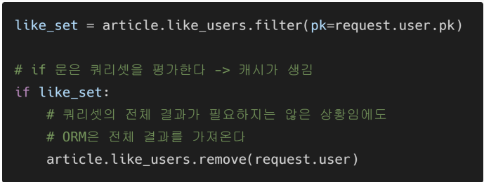
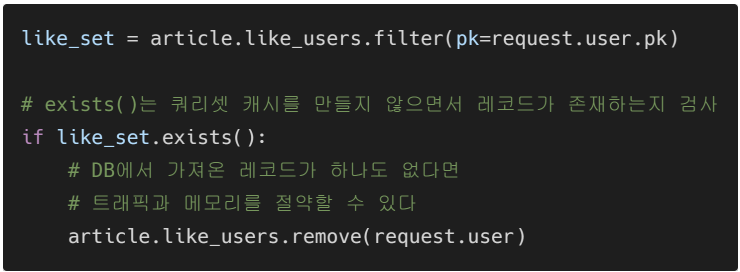
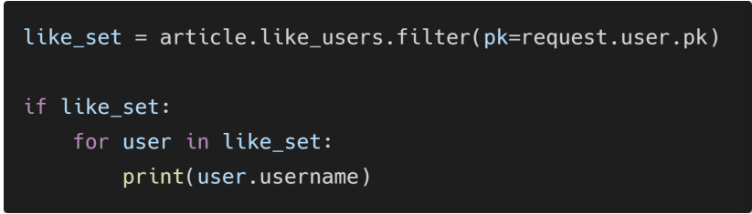
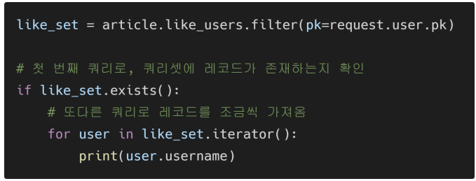

# 04.22

## DB_PJT08

[TOC]

<br>

### 1. REST API - M:N

#### 1. REST API 문서화

* DRF-yasg 라이브러리

  "Yet another Swager generator"

  API를 설계하고 문서화 하는데 도움을 주는 라이브러리이다. 

  Swagger & OpendAPI 2.0 문서를 제공한다. 

  ```bash
  $ pip install der-yasg
  ```

  ```python
  # settings.py
  
  INSTALLED_APPS = [
      ...
      'drf_yasg',
      ...
  ]
  ```

  ```python
  # urls.py
  from drf_yasg.views import get_schema_view
  from drf_yasg import openapi
  
  
  
  
  schema_view = get_schema_view(
     openapi.Info(
        title="Snippets API",
        default_version='v1',
        # 여기까지는 필수, 아래부터는 선택
        description="Test description",
        terms_of_service="https://www.google.com/policies/terms/",
        contact=openapi.Contact(email="contact@snippets.local"),
        license=openapi.License(name="BSD License"),
     ),
     public=True,
  )
  
  
  urlpattenrs = [
      ...
      path('swagger/', schema_view.with_ui('swagger')),
  ]
  ```

<br>

### 2. Fixtures

* How to provide initial data for models

  앱을 처음 설정 할 때 미리 준비된 데이터로 데이터로 데이터베이스를 미리 채우는 것이 필요한 상황이 있음. 마이그레이션 또는 fixtures와 함께 초기 데이터를 제공한다. 

* **Fixtures**

  데이터베이스의 serialized(직렬화, json으로 변한)된 내용을 포함하는 파일 모음

  `app/fixtures/`

* dumpdata

  응용 프로그램과 관련된 데이터베이스의 모든 데이터를 표준 출력으로 출력

* fixtures 실습

  `99_fixtures` : 1:N 관계 실습한 users, articles, comments 작성되어 있는 파일

  초기환경 설정

  ```bash
  $ python manage.py seed articles --number=10
  ```

  모델 별로 dumpdata 실행

  ```bash
  $ python manage.py dumpdata --indent 4 articles.articles > articles.json
  $ python manage.py dumpdata --indent 4 articles.comments > comments.json
  $ python manage.py dumpdata --indent 4 articles.users > users.json
  ```

  클론 받은 B가 해야하는 일 - load

  ```bash
  $ python manage.py migrate
  # fixture 폴더 안에 appname과 동일한 폴더를 만들고 안에 .json 넘길 때 
  $ python manage.py loaddata articles/articles.json comments/comments.json users/users.json
  ```

<br>

### 3. Improve query

#### 1. 쿼리셋 이해하기

> 쿼리셋은 게으르다.
>
> 쿼리셋을 만드는 작업에는 데이터베이스 작업이 포함되지 않는다.
>
> django는 쿼리셋이 '평가(evaluated)' 될 때까지 실제로 쿼리를 실행하지 않는다. 
>
> DB에 쿼리를 전달하는 일이 웹 애플리케이션을 느려지게 하는 주범 중에 하나기 때문이다. 

* 평가 : 쿼리셋에 해당하는 DB의 레코드들을 실제로 가져오는 것

  평가된 모델들은 쿼리셋의 내장 캐시(cache)에 저장되며, 덕분에 우리가 쿼리셋을 다시 순회하더라도 똑같은 쿼리를 DB에 다시 전달하지 않음

  * 캐시 : 데이터나 값을 미리 복사해 놓는 임시 장소이다. 캐시의 접근 시간에 비해 "원래 데이터를 접근하는 시간이 오래 걸리는 경우" 또는 "값을 다시 계산하는 시간을 절약하고 싶은 경우"에 사용한다. 

    더 빠른 속도로 데이터에 접근할 수 있다. 

    시스템의 효율성을 위해 여러 분야에서 두루 사용된다. 

* 쿼리 셋이 평가되는 시점

  1. **Iteration** : QuerySet은 반복 가능하며 처음 반복 할 때 데이터베이스 쿼리를 실행
  2. **boll()** : boll() 또는 if 문 사용과 같은 bool 컨텍스트에서 QuerySet을 테스트하면 쿼리가 실행한다. 

* 캐시와 쿼리셋

  각 쿼리셋에는 데이터베이스 액세스를 최소화하는 '캐시'가 포함 되어 있다. 

  1. 새로운 쿼리셋이 만들어지면 캐시는 비어 있다. 
  2. 쿼리셋이 처음으로 평가되면 데이터베이스 쿼리가 발생한다. 

* 쿼리셋 캐시 관련

  1. with 템플릿 태그
  2. iterator()

#### 2. 필요하지 않은 것을 검색하지 않기

* .count() : len(queryset) 대신 queryset.count() 사용

* .exists() : if quertset 대신 queryset()사용하기

  

  

  

  

  

  :small_red_triangle: exists()와 iterator() 메서드를 사용하면 메모리 사용을 최적화할 수 있지만, 쿼리셋 캐시는 생성되지 않기 때문에, DB 쿼리가 중복될 수 있다. 

#### 3. 한번에 모든 것을 검색하기

> 99_improve_query 프로젝트 준비
>
> 가상환경 생성 및 활성화
>
> 피키지 설치
>
> migrate 및 fixture 데이터 load

1. select_ralated() : 1:1 1:N

```python
# 게시글의 작성자 출력

articles = Article.objects.select_related('user').order_bt('-pk')
```

2. prefetch_related() : 1:N의 역참조, M:N

```python
# 댓글 목록을 모두 출력을 해오기

articles = Article.objects.perfetch_related('comment_set')
```

3. 두개 합치기

```python
from django.db.models import Prefetch

articles = Article.objects.perfetch_related(
	Prefetch('comment_set', queryset=Comment.objects.select_related('user'))
).order_by('-pk')

```

---

* M:N을 위한 중개 테이블 생성

```python
# models.py

class Card(models.Models):
    articles = models.ManyToManyField(Article, related_name='cards')
    name = models.charField(max_length=100)
```

```bash
$ python manage.py makemigrations
$ python manage.py migraie
```

```bash
$ python manage.py seed articles -- number=10
```

* 유지 보수를 의해 나눔

```python 
# serializers/article.py
from rest_framework import Serializers
from .comment import CommentSerializer
from ..model import Article


class ArticleListSerializer(serializers.Modelserializer):
    
```

```python
# serializers/comment.py
from rest_framework import Serializers
from ..model import Comment


class CommentSerializer(serializers.Modelserializer):
```

```python
# serializers/card.py
from rest_framework import Serializers
from ..model import Card


class CardSerializer(serializers.ModelSerializer):
    
    class Meta:
        model = Card
        fields = '__all__'
```

* card 데이터 조회

```python
# urls.py

urlpatterns = [
    ...
	path('cards/', views.card_list),  # 카드전체 조회
]
```

```python
# views.py
from .Serializers.article import ArticleListSerializer,ArticleSerializer
from .Serializers.comment import CommentSerializer
from .Serializers.card import CardSerializer
from .models import Article, Comment, Card


@api_view(['GET'])
def card_list(request):
    cards = get_list_or_404(Card)  # 전체 카드에 대한 조회
    serializer = CardSerializer(cards, many=True)
    return Response(serializer.data)
```

```python
# serializers/article.py
from rest_framework import Serializers
from .comment import CommentSerializer
from ..model import Article
from .cards import CardSerializer


class ArticleListSerializer(serializers.Modelserializer):
    
    
    
    
class ArticleSerializer(serializers.Modelserializer):
    ...
    cards = CardSerializer(many=True, read_only=True)
    
```

```python
# urls.py

urlpatterns = [
    ...
	path('cards/', views.card_list),
    path('cards/<int:card_pk>', views.card_detail),  # 단일 카드 조회
    path('<int:card_pk>/register/<int:article_pk>/', views.register),  # 등록
]
```

```python
# views.py
from .Serializers.article import ArticleListSerializer,ArticleSerializer
from .Serializers.comment import CommentSerializer
from .Serializers.card import CardSerializer
from .models import Article, Comment, Card


@api_view(['GET'])
def card_list(request):
    cards = get_list_or_404(Card)  # 전체 카드에 대한 조회
    serializer = CardSerializer(cards, many=True)
    return Response(serializer.data)


@api_view(['GET', 'PUT', "DELETE"])
def card_detail(request, card_pk):
    card = CardSerializer(Card, pk=card_pk)
    if request.method=='GET':  # 조회
        serializer = CardSerializer(card)
        return Response(serializer.data)
    
    elif request.method == 'DELETE':  # 삭제
        pass
    elif request.method == 'PUT':
        pass
    

@api_view(['POST'])
def register(request, card_pk, article_pk):
    card = get_object_or_404(Card, pk=card_pk)
    articld = get_object_or_404(Article, pk=articld_pk)
    
    if card.article.filter(pk=article.pk).exists():
        card.article.remove(article)
    else:
        card.article.add(article)
        
    serializer = CardSerializer(card)
    return Response(serializer.data)
```

