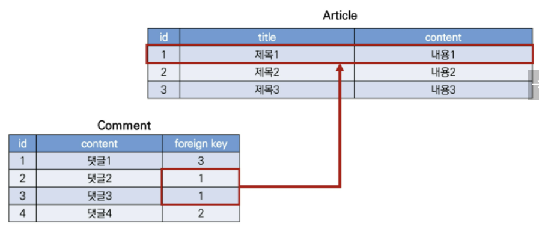
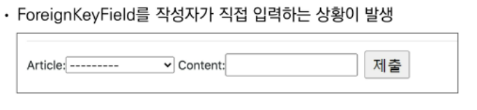

# 04.13

## DB 02_Model Relationship1_(1:N관계)

[TOC]

<br>

### 1. Foreign key

#### 0. Forign Key

* **Foreign Key** : 외래 키(외부 키). 관계형 데이터베이스에서 한 테이블의 필드 중 다른 테이블의 행을 식별할 수 있는 키이다.

  참조하는 테이블의 속성(필드)에 해당하고, 이는 참조되는 테이블의 기본 키(Pirmary Key)를 가리킨다.

  참조하는 테이블의 외래 키는 참조 되는 테이블 행 1개에 대응 된다. 이 때문에 참조하는 테이블에서 참조되는 테이블의 존재하지 않는 행을 참조할 수 없다. 

  참조하는 테이블의 행 여러 개가 참조되는 테이블의 동일한 행을 참조할 수 있다. 

  

* Foreign Key 특징

  1. 키를 사용하여 부모 테이블의 유일한 값을 참조한다. (**참조 무결성**)
     * 참조 무결성 : 데이터베이스 관계 모델에서 관련된 2개의 테이블 간의 일관성을 말한다. 외래 키가 선언된 테이블의 외래키 속성(열)의 값은 그 테이블의 부모가 되는 테이블의 기본 키 값으로 존재해야 한다. 
  2. 외래 키의 값이 반드시 부모 테이블의 기본 키일 필요는 없지만 유일한 값이어야 한다. 

* ForiginKey field

  1. A many-to-one relationship (1:N관계)

  2. 2개의 위치 인자가 반드시 필요하다. 

     * 참조하는 model class
     * on_delete 옵션

  3. migrate 작업 시 필드 이름에 `_id`를 추가하여 데이터베이스 열 이름을 만듦

  4. comment 모델 정의하기

     ```python
     # articles/models.py
     
     class Comment(models.Model):
         # CASCADE : 부모 객체(참조된 객체)가 삭제 되었을 때 이를 참조하는 객체도 삭제	
         # article을 단수형, 소문자로 썼을 경우 : 1:N 관계를 나타내는 것을 구별할 수 있다. 명시적인 모델 관계 파악을 위해 참조하는 클래스 이름의 소문자(단수형)로 작성하는 것이 바람직하다. 
         article = models.ForeignKey(Article, on_delete=models.CASCADE)
         content = models.CharField(max_length=200)
         created_at = models.DateTimeField(auto_now_add=True)
         updated_at = models.DateTimeField(auto_now=True)
         
         def __str__(self):  # content가 보일 수 있도록
             return self.content
         
     ```

  5. `admin.py`

     ```python
     from .models import Article, Comment
     
     admin.site.register(Comment)
     ```

     

  5. **on_delete** 

     * 외래 키가 참조하는 객체가 사라졌을 때 외래 키를 가진 객체를 어떻게 처리할 지를 정의 
     * Database Integrity(데이터 무결성)을 위해서 매우 중요한 설정
       * on_delete 옵션에 사용 가능한 값들 : CASCADE(부모 객체(참조 된 객체)가 삭제 되었을 때 이를 참조하는 객체도 삭제), PROTECT, SET_NULL, SET_DEFAULT, SET(), DO_NOTHING, RESTRICT
       * 데이터 무결성 : 데이터의 정확한 일관성을 유지하고 보증하는 것이다. 데이터베이스나 RDBMS 시스템의 중요한 기능이다. 

  6.  migrate

     ```bash
     $ python manage.py makemigrations
     $ python manage.py migrate
     ```

* 댓글 생성 연습하기(shell에서)

  ```bash
  $ python manage.py shell_plus
  ```

  ```bash
  in [1]: comment = Comment()
  
  in [2]: comment.content = 'first comment'
  
  in [3]: comment.save()
  ```

  :small_red_triangle: 위처럼 작성하게 되면 `IntegrityError`를 만나게 된다. 테이블의 ForeignKeyField, article_id 값이 누락 되었기 때문이다. 게시글을 생성 후 댓글을 생성해야한다. 

  ```bash
  in [4]: article = Article.objects.create(title='title', content='content')
  in [5]: article = Article.objects.get(pk=1)
  
  in [6]: article
  out[6]: <Article: title>
  
  in [7]: comment.article = article
  
  in [8]: comment.save()
  
  in [9]: comment
  out[9]: <Comment : first comment>
  
  in [10]: comment.pk
  out[10]: 1
  
  in [11]: comment.content
  our[11]: 'first comment'
  
  in [12]: comment.article.content
  our[12]: 'content'
  
  in [13]: comment = Comment(content='second comment', article=article)
  
  in [14]: comment.save()
  ```

* admin 등록

  ```python
  admin.site.register(Article, ArtieldAdmin)
  admin.site.register(Comment)
  ```

* **역참조(comment_set)**

  * Article(1) -> Comment(N)

  * article.comment 형태로는 사용할 수 없고, `article.comment_set` manaer가 생성된다.

  * 게시글에 몇 개의 댓글이 작성 되었는지 Django ORM은 보장 할 수 없기 때문이다. 

    article은 comment가 있을 수도 없을 수도 있다. 

    실제로 Article 클래스에는 Comment와의 어떠한 관계도 작성되어 있지 않다. 

  ```bash
  in [1]: article.comment_set.all()
  out[1]: <QuerySet [<Comment: first comment>, <Comment: second comment>]>
  
  in [2]: comments = article.comment_set.all()
  in [3]: for comment in comments:
  print(comment.content)
  ```

  * `related_name='comments'`를 세번째 인자로 주면 comment_set 대신 사용할 수 있다. 

* **참조('article')**

  * Comment(N) -> Article(1)
  * 댓글의 경우 어떠한 댓글이든 반드시 자신이 참고 하는 게시글이 있으므로, `comment.article`과 같이 접근할 수 있다. 
  * 실제 ForignKeyField 또한 Comment 클래스에 작성된다.

  ```bash
  in [1]: comment = Comment.objects.get(pk=1)
  
  in [2]: comment
  out[2]: <Comment: first comment>
  
  in [3]: comment.article
  out[3]: <Article: title>
  
  in [4]: comment.article.content
  out[4]:'content'
  ```

#### 1. Comment CREATE

* 댓글 작성 로직

```python
# articles/forms.py

from .models import Article, Comment

class CommentForm(forms.ModelForm):
    
    class Meta:
        model = Comment
        fields = '__all__'
```

```python
# articles/views.py

from .forms import ArticleForm, CommentForm

def detail(request, pk):
    article = get_object_or_404(Article, pk=pk)
    comment_form = CommentForm()
    context= {
        'article':article,
        'comment_form': comment_form,  # 모든 필드 출력
    }
    return render(request, 'articles/detail.html', context)
```

```django
<!-- detail.html -->

	...
	<a href=''>back</a>
	<hr>
	<form action=" method="POST>
        
        {{ comment_form }}
        <input type="submit">
	</form>	
```



:small_red_triangle: CommentForm에서 외래키 필드 출력 제외

```python
# articles/forms.py

from .models import Article, Comment

class CommentForm(forms.ModelForm):
    
    class Meta:
        model = Comment
        exclude = ('article',)  # article 제외하고 출력
```

```python
# articles/urls.py

app_name='articles'
urlpatterns = [
    path('<int:pk>/comments/', views.comments_create, name='comments_create'),
]
```

```django
<!-- detail.html -->

	...
	<a href=''>back</a>
	<hr>
	<form action="" method="POST>
        
        {{ comment_form }}
        <input type="submit">
	</form>	
```

```python
# articles/views.py
from .forms import ArticleForm, CommentForm

@require_POST
def comments_create(request, pk):
    if request.user.is_authenticated:  # 인증된 사용자만
        article = get_object_or_404(Article, pk=pk)  # article 조회
        comment_form = CommentForm(request.POST)
        if comment_form.is_valid():
            comment = comment_form.save(commit=False)  # db에 저장하지 않고, 인스턴스를 반환한다. 
            comment.article = article  # article 조회한 거 넣어줌
            comment.save()
        return redirect('articles:detail', article.pk)
    return redirect('accounts:login')
```

:small_red_triangle: `save(commit=False)` : 아직 데이터베이스에 저장되지 않은 인스턴스를 반환한다. 저장하기 전에 객체에 대한 사용자 지정 처리를 수행할 때 유용하게 사용한다. 

#### 2. Comment READ

* 댓글 출력

```python
# articles/views.py

from .forms import ArticleForm, CommentForm

def detail(request, pk):
    article = get_object_or_404(Article, pk=pk)
    comment_form = CommentForm()  # 모든 댓글 필드 : 새로운 댓글을 작성하기 위해
    comments = article.comment_set.all()  # 역참조 : 이미 작성한 댓글을 보기 위해
    context= {
        'article':article,
        'comment_form': comment_form,
        'comments': comments, 
    }
    return render(request, 'articles/detail.html', context)
```

```django
<!-- detail.html -->

	...
	<a href=''>back</a>
	<hr>
	<h4>댓글 목록</h4>
	
		<p><b>{{ comments|length }}개의 댓글이 있습니다.</b></p>
	
	<ul>
        
        	<li>{{ comment.content }}</li>
        
	</ul>
	<hr>
	<form action=" method="POST>
        
        {{ comment_form }}
        <input type="submit">
	</form>	
```

#### 3. Comment DELETE

```python
# articles/urls.py

app_name='articles'
urlpatterns = [
    path('<int:pk>/comments/', views.comments_create, name='comments_create'),
   	path('<int:article_pk>/comments/<int:comment_pk>/delete/', views.comments_delete, name='comments_delete'),
]
```

```django
<!-- detail.html -->

	...
	<a href=''>back</a>
	<hr>
	<h4>댓글 목록</h4>
	<ul>
        
        	<li>{{ comment.content }}
        		<form action="" method="POST" class="d-inline">
                	
                    <input type="submit" value="DELETE">
            	</form>
        	</li>
        
        	<p>댓글이 없어요...</p>
        
	</ul>
	<hr>
	<form action=" method="POST>
        
        {{ comment_form }}
        <input type="submit">
	</form>	
```

```python
# articles/views.py
from .models import Article, Comment

@require_POST
def comments_delete(request, article_pk, comment_pk):
    if request.user.is_authenticated:  # 인증된 사용자만
        comment = get_object_or_404(Comment, pk=comment_pk)  # 현재 댓글을 불러옴
        comment.delete()
    return redirect('articles:detail', article_pk)
```

<br>

<br>

### 2. Customizing authentication in Django

#### 1. Substituting a custom User model

* 일부 프로젝트에서는 Django의 내장 user 모델이 제공하는 인증 요구사항이 적절하지 않을 수 있다. (ex. username 대신 email을 식별 토큰으로 사용하는 것이 더 적합한 사이트)

  Django는 user를 참조하는데 사용하는 `AUTH_USER_MODEL`값을 제공하여, default user model을 재정의(override)할 수 있도록 한다. 

  * **AUTH_USER_MODEL** : user를 나타내는 모델이다. 프로젝트가 진행되는 동안 변경할 수 없으며 첫번째 마이그레이션 하기 전에 사용할 수 있어야 한다. 

  Django는 새 프로젝트를 시작하는 경우 기본 사용자 모델이 충분하더라도 커스텀 유저 모델을 설정하는 것을 강력하게 권장한다. 

  단, 프로젝트의 모든 migrations 혹은 첫 migrate를 실행하기 전에 이 작업을 마쳐야 한다. 

1. Custom User 모델 정의하기

   * 관리자 권한과 함께 완전한 기능을 갖춘 User 모델을 구현하는 기본 클래스인 AbstractUser를 상속 받아 새로운 User모델 작성

     ```python
     # accounts/models.py
     from django.contrib.auth.models import AbstractUser
     
     class User(AbstratUser):
         pass
     ```
     
     ```python
     # settings.py
     
     AUTH_USER_MODEL = 'accounts.User'
     ```
     
   * 마이그래이션 초기화!
   
     1. db.sqlite3 파일 삭제
     2. migrations 파일 모두 삭제(파일명에 숫자가 붙은 파일만 삭제)
   
     ```bash
     $ python manage.py makemigrations
     $ python manage.py migrate
     ```
   
   * `admin.site`에 Custom User 모델 등록
   
     ```python
     # accounts/admin.py
     
     from django.contrib import admin
     from django.contrib.auth.admin import UserAdmin
     from .models import User
     
     
     admin.site.register(User, UserAdmin)
     ```
   
     ```bash
     $ python manage.py makemigrations
     $ python manage.py migrate
     ```

#### 2. Custom user & Built - in forms

* Custom User model 후 회원 가입을 시도하면 다음과 같은 오류를 볼 수 있다. 


UserCreationForm과 UserChangeForm은 기존 내장 User 모델을 사용한 ModelForm이기 때문에 커스텀 User 모델로 대체해야 한다. 

* **Custom Built-in Auth Forms**

  기존의 User모델을 사용하기 때문에 커스텀 User 모델로 다시 작성하거나 확장해야 하는 forms는 `UserCreationForm`, `UserChangeForm`이다. 

  ```python
  # accounts/forms.py
  
  from  import UserCreationForm
  
  
  class CustomUserCreationForm(UserCreationForm):  # customusercreationform은 usercreationform을 상속
      
      class Meta(UserCreationForm.Meta):
          # get_user_model 
          # 현재 프로젝트에서 활성화 된 유저를 반환한다. 현재는 accounts의 유저를 반환
          model = get_user_model()  
          fields = UserCreationForm.Meta.fields + ('email',)
  ```

  ```python
  # accounts/views.py
  
  from .forms import CustomUserCreationForm
  
  @require_http_methods(['GET', 'POST'])
  def signup(request):
      if request.user.is_authenticated:  # 로그인 되어 있다면 회원가입 불가능
          return redirect('articles:index')
  
      if request.method == 'POST':  # 회원가입하는 유저
          form = CustomUserCreationForm(request.POST)
          if form.is_valid():
              user = form.save()
              auth_login(request, user)
              return redirect('articles:index')
      else:  # GET으로 요청 받았다면
          form = CustomUserCreationForm()
      context = {
          'form': form,
      }
      return render(request, 'accounts/signup.html', context)
  ```

  

