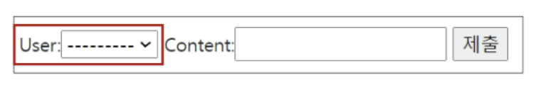

# 04.13

## DB 02_Model Relationship2_(1:N관계)

[TOC]

<br>

### 1. 1:N 관계 설정

#### 1. User - Article

```python
# articles/models.py
from django.conf import settings


class Article(models.Model):
    user = models.ForeignKey(settings.AUTH_USER_MODEL, on_delete=models.CASCADE)
    title = models.CharField(max_length=10)
    content = models.TextField()
    image = models.ImageField(upload_to='images/', blank=True)
    created_at = models.DateTimeField(auto_now_add=True)
    updated_at = models.DateTimeField(auto_now=True)
```

```bash
$ python manage.py makemigrations
$ python manage.py migrate
```

* null 값이 허용되지 않는 user_id 필드가 별도의 값 없이 article에 추가되려 하기 때문에 
  1. 1을 입력 후 enter : 현재 화면에서 기본 값을 설정하겠다.
  2. 1을 입력 후 enter : 기존 테이블에 추가되는 user_id 필드의 값을 1로 설정하겠다

* 유저 모델을 참조하는 두가지 방법

  1. `settings.AUTH_USER_MODEL`

     return이 문자열이다. User 모델에 대한 외래 키 또는 다대다 관계를 정의할 때 사용한다. 

     :star: `models.py`에서만 사용한다. 

  2. `get_uset_model()`

     return이 object이다.  현재 활성화된 User 모델을 반환한다. 

     :star: `models.py 가 아닌 모든 곳`에서 유저 모델을 참조할 때 사용한다. 

* `create`에서 불필요한 필드가 출력됨

  ```python
  # articles/forms.py
  
  class ArticleForm(forms.ModelForm):
      
      class Meta:
          model = Article
          fields = ('title', 'content',)
  ```

  ```python
  # articles/views.py
  
  @login_required
  @require_http_methods(['GET', 'POST'])
  def create(request):
      if request.method == 'POST':
          form = ArticleForm(request.POST)
          if form.is_valid():
              article = form.save(commit=False)
              article.user = request.user
              article.save()  # 누가 작성한 글인지?
              return redirect('articles:detail', article.pk)
      else:
          form = ArticleForm()
      context = {
          'form': form,
      }
      return render(request, 'articles/create.html', context)
  
  ```

  ```python
  # articles/views.py
  
  @require_POST
  def delete(request, pk):
      
      if request.user.is_authticated:
          if request.user == article.user:  # 자신이 작성한 게시글만 삭제 가능하도록
  	        article = get_object_or_404(Article, pk=pk)
      	    article.delete()
      return redirect('articles:index')
  ```

  ```python
  # articles/views.py
  
  @login_required
  @require_http_methods(['GET', 'POST'])
  def update(request, pk):
      article = get_object_or_404(Article, pk=pk)
      if request.user == article.user:  # 자신이 작성한 게시글만 수정 가능하도록
          if request.method == 'POST':
              form = ArticleForm(request.POST, instance=article)
              if form.is_valid():
                  article = form.save()
                  return redirect('articles:detail', article.pk)
          else:
              form = ArticleForm(instance=article)
      else:
          return redirect('articles:index')
      context = {
          'article': article,
          'form': form,
      }
      return render(request, 'articles/update.html', context)
  ```

  ```django
  <!-- articles/index.html -->
  
  ...
  
    <p><b>작성자 : {{ article.user }}</b></p>
  ...
  ```

  ```django
  <!-- articles/detail.html -->
  <!-- 해당 게시글의 작성자가 아니라면, 수정/삭제 버튼을 출력하지 않도록 처리 -->
  
  
    <a href="">[update]</a>
    <form action="" method="POST">
      
      <input type="submit" value="DELETE">
    </form>
  
  ```

<br>

<br>

#### 2. User - Comment

* 사용자와 댓글 간의 관계(1:N)

```python
# articles/models.py

class Comment(models.Model):
    article = models.ForeignKey(Article, on_delete=models.CASCADE)
    user = models.ForeignKey(settings.AUTH_USER_NODEL, on_delete=models.CASCADE)
```

```bash
$ python manage.py makemigrations
$ python manage.py migrate
```

* null 값이 허용되지 않는 user_id 필드가 별도의 값 없이 article에 추가되려 하기 때문에 
  1. 1을 입력 후 enter : 현재 화면에서 기본 값을 설정하겠다.
  2. 1을 입력 후 enter : 기존 테이블에 추가되는 user_id 필드의 값을 1로 설정하겠다

* 댓글 출력 필드에서 불필요한 필드가 출력 됨.

  

```python
# articles/forms.py

class CommentForm(forms.ModelForm):
    
    class Meta:
        model = Comment
        fields = ('article', 'user',)
```

```python
# articles/views.py

def comments_create(request, pk):
    if request.user.is_authenticated:
        article = get_object_or_404(Article, pk=pk)  # article 조회
        comment_form = CommentForm(request.POST)
        if comment_form.is_valid():  # 유효성 검사 통과?
            comment = comment_form.save(commit=False)
            comment.article = article  # article 조회한 거 넣어줌
            comment.user =request.user
            comment.save()
        return redirect('articles:detail', article.pk)
    return redirect('accounts:login')
```

```django
<!-- articles/detail.html -->
<!-- 비로그인 유저에게는 댓글 form 출력 숨기기 -->


  <form action="" method='POST'>
    
    <input type="submit">
  </form>

  <a href="">댓글을 작성하려면 로그인 하세요. </a>



<!-- 댓글 작성자 출력하기 -->
<!-- 자신이 작성한 댓글만 삭제 버튼을 볼 수 있도록 수정 -->

      <li>{{ comment.user }} {{ comment.content }}
          
          <form action="" method="POST" class="d-lind">
        
        <input type="submit" value='delete'>
          </form>
        
      </li>
    
```

```python
# articles/views.py


@require_POST
def comments_delete(request, article_pk, comment_pk):
    if request.user.is_authenticated:
        comment = get_object_or_404(Comment, pk=comment_pk)
        if request.user == comment.user:  # 자신이 작성한 댓글만 삭제할 수 있도록 수정
	        comment.delete()
    return redirect('articles:detail', article_pk)
```

