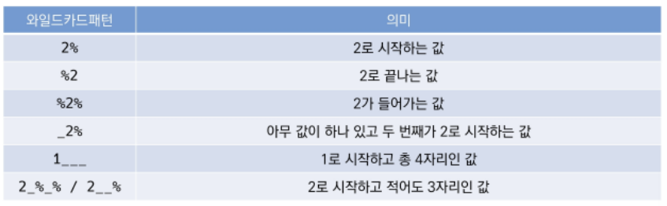
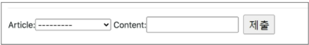
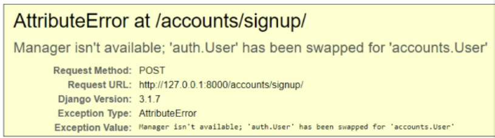

# 04.15

## DB_01, DB_02

[TOC]

<br>

### DB_01

#### 1. Database

**DB(database)**라고 불리는 데이터베이스는 체계화된 데이터의 모임이다. 여러 사람이 공유하고 사용할 목적으로 통합 관리되는 정보의 집합이다. 몇 개의 자료 파일을 조직적으로 통합하여 자료 항목의 중복을 없애고 자료를 구조화하여 기억시켜 놓은 자료의 집합체라고 할 수 있다. 

데이터베이스로부터 얻는 장점으로는 '데이터 중복 최소화', '데이터 무결성(정확한 정보를 보장한다.)', '데이터 일관성', '데이터 독립성(물리적/논리적)', '데이터 표준화', '데이터 보안 유지' 등이 있다. 

**RDB(Relational Database)**는 관계형 데이터베이스로 키와 값들의 간단한 관계를 표 형태로 정리한 것이다. 관계형 모델에 기반한다. 

관계형 데이터베이스의 용어는 다음과 같다. 

1. 스키마(schema) : 데이터 베이스에서 자료의 구조, 표현방법, 관계 등 전반적인 명세를 기술한 것이다. 
2. 테이블(table) : 열(컬럼/필드)과 행(레코드/값)의 모델을 사용해 조직된 데이터 요소들의 집합이다. 
3. 열(column) : 각 열에는 고유한 데이터 형식이 지정된다. 
3. 행(row) : 실제 데이터가 저장되는 형태이다.
3. 기본키(primary Key): 각 행의 고유값으로 반드시 설정해야 하며, 데이터베이스 관리 및 관계 설정 시주요하게 활용 된다. 

**RDBMS(Relational Database Management System**은 관계형 모델을 기반으로 하는 데이터베이스 관리 시스템이다. MySQL, SQLite 등이 있다. 

* Sqlite Data Type : NULL, INTEGER, REAL, TEXT, BLOB
* Sqlite Type Affinity : INTEGER, TEXT, BLOB, REAL, NUMERIC

#### 2. SQL

* SQL(Structured Query Language) : 관계형 데이터 베이스 관리 시스템의 데이터 관리를 위해 설계된 특수 목적 프로그래밍 언어이다. 데이터베이스 스키마 생성 및 수정이 가능하고, 자료의 검색 및 관리가 용이 하다. 또한 데이터베이스 객체 접근 조정 관리가 가능하다. 

1. **테이블 생성 및 삭제**

   ```sql
   # 데이터베이스 생성하기
   $ sqlite3 tutorial.sqlite3
   sqlite> .database  # '.'은 sqlite 프로그램의 기능을 실행하는 것이다. 
   
   # csv 파일을 table로 만들기
   # 여기선 hellodb.csv 파일의 example을 table로 만든다. 
   sqlite> .mode csv
   sqlite> .import hellodb.csv example
   sqlite> .tables
   examples
   ```

   ```sql
   # SELECT 문은 특정 테이블의 레코드(행) 정보를 반환한다. 
   sqlite> SELECT * FROM examples;
   1. "길동", "홍", 600, "충청도", 010-0000-0000
   
   # 깔끔하게 출력하기
   sqlite> .headers on
   sqlite> .mode column
   ```

   ```sql
   # CREATE TABLE : 데이터베이스에서 테이블 생성 
   CREATE TABLE classmates (id INTEGER PRIMARY KEY, name TEXT)
   sqlite> CREATE TABLE classmates (
   sqlite> id INTEGER PRIMARY KEY,
   sqlite> name TEXT
   sqlite> );
   sqlite> .tables
   classmates examples
   
   # 스키마 조회
   sqlite> .schema classmates
   CREATE TABLE classmates (
   id INTEGER PRIMARY KEY,
   name TEXT
   );
   
   # DROP TABLE : 데이터베이스에서 테이블 제거
   sqlite> DROP TABLE classmates;
   sqlite> .tables
   examples
   ```

2. **CRUD**

   > INSERT 
   >
   > "insert a single row into a table"
   >
   > 테이블에 단일 행 삽입

   ```sql
   INSERT INTO classmates (name, age) VALUES ('홍길동', 23)
   
   # 모든 열에 데이터가 있는 경우 column을 명시하지 않아도 됨!
   INSERT INTO classmates VALUES ('홍길동', 30, '서울')
   ```
   
   `id`는 SQLite는 따로 PRIMARY KEY 속성의 컬럼을 작성하지 않으면 값이 자동으로 증가하는 PK 옵션을 가진 `rowid` 컬럼을 정의한다. 
   
   주소가 꼭 필요한 정보라면 공백으로 비워두면 안된다. (NOT NULL 설정 필요)
   
   ```sql
   sqlite> CREATE TABLE classmates (
   sqlite> id INTEGER PRIMARY KEY,
   sqlite> name TEXT NOT NULL
   sqlite> age INT NOT NULL
   sqlite> address TEXT NOT NULL
   sqlite> );
   ```
   
   위 처럼 id 컬럼을 명시 해주었을 경우에는 id 값을 입력 하지 않을 경우 오류가 발생한다. 
   
   ```sql
   INSERT INTO classmates VALUES ('홍길동', 30, '서울');  # 오류 발생
   INSERT INTO classmates Values (4, '홍길동', 30, '서울');
   INSERT INTO classmates (name, age, address) Values (4, '홍길동', 30, '서울');
   ```
   
   `rowid`를 자동으로 생성해주므로 id 없이 테이블을 생성할 수 있다. 

   ```sql
   sqlite> CREATE TABLE classmates (
   sqlite> name TEXT NOT NULL
   sqlite> age INT NOT NULL
   sqlite> address TEXT NOT NULL
   sqlite> );
   ```
   
   ```sql
   INSERT INTO classmates Values 
   ('홍길동', 30, '서울'),
   ('김철수', 30, '대전'),
   ('이싸피', 26, '광주'),
   ('박삼성', 29, '구미'),
   ('최전자', 28, '부산');
   ```
   
3. **READ**

   > SELECT
   >
   > "query data from a table"
   >
   > 테이블에서 데이터를 조회
   >
   > SELECT 문은 SQLite에서 가장 복잡한 문이며 다양한 절(clause)와 함께 사용한다. 
   >
   > * ORDER BY, DISTINCT, WHERE., LIMIT, GROUP BY ...

   * LIMIT : 쿼리에서 반환되는 행 수를 제한한다. 특정 행부터 조회하기 위해 OFFSET 키워드와 함께 사용하기도 한다. 
   * WHERE : 쿼리에서 반환된 행에 대한 특정 검색 조건을 지정한다. 
   * SELECT DISTINT : 조회 결과에서 **중복 행을제거**한다. DISTINCT 절은 SELECT 키워드 바로 뒤에 작성해야 한다. 

   ```sql
   SELECT rowid, name FROM classmates;
   # id, name 컬럼 값을 하나만 조회
   SELECT rowid, name FROM classmates LIMIT 1;  
   # 3 이싸피
   SELECT rowid, name FROM classmates LIMIT 1 OFFSET; 
   
   SELECT rowid, name FROM classmates WHERE address='서울'
   
   SELECT DISTINCT age FROM classmates;
   ```

4. **DELETE**

   > DELETE
   >
   > "remove rows from a table"
   >
   > 테이블에서 행을 제거 
   >
   > **중복 불가능한(UNIQUE) 값인 rowid를 기준으로 삭제!**

   ```sql
   DELETE FROM classmates WHERE rowid=5;
   ```

   SQLite는 **기본적으로 id를 재사용**하기 때문에 새롭게 추가하면 그 행의 id는 5가 된다. 

   ```sql
   INSERT INTO classmates VALUES ('최전자', 28, '부산')  # rowid = 5
   ```

   이때 SQLite가 사용되지 않은 값이나 이전에 삭제된 행의 값을 재사용하는 것을 방지하기 위해 

   `AUTOINCRMENT`를 사용해 정의할 수 있다. (django에서는 기본 적으로 설정되어 있다. )

   ```sql
   CREATE TABLE classmates (
   id INTEGER PRIMARY KEY AUTOINCREMENT,
   name TEXT
   );
   ```

5. **UPDATE**

   > UPDATE
   >
   > "update data of existing rows in the table"
   >
   > 기존의 행의 데이터를 수정한다. 
   >
   > **SET** clause에서 테이블의 각 열에 대해 새로운 값을 설정한다.

   ```sql
   UPDATE classmates SET name='홍길동', address='제주도' WHERE rowid=5;
   ```

**CRUD 정리**

|      | 구문   | 예시                                                         |
| ---- | ------ | ------------------------------------------------------------ |
| C    | INSERT | INSERT INTO classmates (컬럼1, 컬럼2, ...) VALUES (값1, 값2, ...) ; |
| R    | SELECT | SELECT * FROM classmates WHERE 조건;                         |
| U    | UPDATE | UPDATE classmates SET name='홍길동', address='부산' WHERE rowid=5; |
| D    | DELETE | DELETE FROM classmates WHERE 조건;                           |

6. **WHERE** 

   > 특정 조건으로 데이터 조회하기

   ```sql
   # users 테이블에서 age가 30이상인 유저의 모든 컬럼 정보를 조회하려면?
   SELECT * FROM users WHERE age > =30;
   
   # users 테이블에서 age가 30 이상인 유저이 이름만 조회하려면?
   SELECT first_name FROM users WHERE age >= 30;
   
   # users 테이블에서 age가 30 이상이고 성이 '김'인 사람의 나이와 성만 조회하려면?
   SELECT age, last_name FROM users WHERE age >= 30 AND last_name='김';
   ```

7. **SQLite Aggregate Functions** 

   > 집계 함수 
   >
   > 값 집합에 대한 계산을 수행하고 단일 값을 반환한다. 여러 행으로 부터 하나의 결과값을 반환하는 함수이다. 
   >
   > SELECT 구문에서만 사용된다. 
   >
   > 예 : 
   >
   > * 테이블 전체 행 수를 구하는 COUNT(*)
   > * age 컬럼 전체 평균 값을 구하는 AVG(age)
   > * 그룹에 있는 모든 값의 최대값을 가져오는 MAX
   > * 그룹에 있는 모든 값의 최소값을 가져오는 MIN
   > * 모든 값의 합을 계산 하는 SUM

   ```sql
   # COUNT
   
   # users 테이블의 레코드 총 개수를 조회한다면?
   SELECT COUNT(*) FROM users;
   
   # 30살 이상인 사람들의 평균 나이는?
   SELECT AVG(age) FROM users WHERE age >= 30;
   
   # 계좌 잔액(balance)이 가장 높은 사람과 그 액수를 조회하려면?
   SELECT first_name, MAX(balance) FROM users;
   
   # 나이가 30 이상인 사람의 계좌 평균 잔액을 조회하려면?
   SELECT AVG(balance) FROM users WHERE age >= 30;
   ```

8. **LIKE**

   > "query data based on pattern matching"
   >
   > 패턴 일치를 기반으로 데이터를 조회하는 방법
   >
   > SQLite는 패턴 구성을 위한 2개의 wildcards를 제공한다. 
   >
   > 1. %(percent sign) : 0개 이상의 문자, 자리에 값이 없을 수도 있을 수도 있다. 
   > 2. _(underscore) : 임의의 단일 문자, 반
   > 3. 드시 이 자리에 한 개의 문자가 존재해야 한다. 

   

   ```sql
   # users 테이블에서 나이가 20대인 사람만 조회한다면?
   SELECT * FROM users WHERE age LIKE '2_';
   
   # users 테이블에서 지역 번호가 02인 사람만 조회한다면?
   SELECT * FROM users WHERE phone LIKE '02-%';
   
   # users 테이블에서 이름이 '준'으로 끝나는 사람만 조회한다면?
   SELECT * FROM users WHERE first_name LIKE '%준';
   
   # users 테이블에서 중간 번호가 5114인 사람만 조회한다면?
   SELECT * FROM users WHERE phone LIKE '%-5114-%';
   
   ```

9. **ORDER BY**

   > "sort a result set of a query"
   >
   > 조회 결과 집합을 정렬
   >
   > SELECT 문에 추가하여 사용한다. 
   >
   > 정렬 순서를 위한 2개의 keyword 제공
   >
   > 1. ASC : 오름차순 (default)
   > 2. DESC : 내림차순

   ```sql
   # users 에서 나이 순으로 오름차순 정렬하여 상위 10개만 조회한다면?
   SELECT * FROM users ORDER BY age ASC LIMIT 10;
   
   # 나이 순, 성 순으로 오름차순 정렬하여 상위 10개만 조회한다면?
   SELECT * FROM users ORDER BY age, lsat_name ASC LIMIT 10;
   
   # 계좌 잔액 순으로 내림차순 정렬하여 해당 유저의 성과 이름을 10개만 조회한다면?
   SELECT last_name, first_name FROM users ORDER BY balance DESC LIMIT 10; 
   ```

10. **GROUP BY**

    > "make a set of summary rows from a set of rows"
    >
    > 행 집합에서 요약 행 집합을 만듦
    >
    > SELECT 문의 optional 절
    >
    > 선택된 행 그룹을 하나 이상의 열 값으로 요약 행으로 만듦
    >
    > 문장에 WHERE 절이 포함된 경우 반드시 WHERE 절 뒤에 작성해야 함
    >
    > 데이터를 요약하는 상황에 주로 사용한다. 

    ```sql
    # users에서 각 성(last_name)씨가 몇 명씩 있는지 조회한다면?
    SELECT last_name, COUNT(*) FROM users GROUP BY last_name;
    SELECT last_name, COUNT(*) AS name_count FROM users GROUP BY last_name;
    ```

11. **ALTER TABLE**

    > ALTER TABLE의 기능은 3가지가 있다. 
    >
    > 1. table 이름 변경 : RENAME TO
    > 2. 테이블에 새로운 column 추가 : ADD COLUMN

    ```sql
    # 새로운 테이블 생성
    CREATE TABLE articles (
    title TEXT NOT NULL,
    content TEXT NOT NULL);
    
    # 내용 추가
    INSERT INTO articles VALUES ('1번제목', '1번내용');
    ```

    ```sql
    # 테이블 이름 변경
    ALTER TABLE articles RENAME TO news;
    
    # 새로운 컬럼 추가
    ALTER TABLE news ADD COLUMN created_at TEXT NOT NULL;  
    # 오류 발생! 테이블에 있던 기존 레코드 들에는 새로 추가할 필드에 대한 정보가 없다. 그렇기 때문에 NOT NULL 형태의 컬럼은 추가가 불가능하다. 
    # NOT NULL 설정 없이 추가하거나 기본 값(default)를 추가해주자. 
    ALTER TABLE news ADD COLUMN created_at TEXT;
    ALTER TABLE news ADD COLUMN subtitle TEXT NOT NULL DEFAULT '소제목';
    ```

<br>

---

### DB_02_Model Relationship_1

#### 1. Foreign Key

> 외래 키(외부 키)
>
> 관계형 데이터 베이스에서 한 테이블의 필드 중 다른 테이블의 행을 식별할 수 있는 키
>
> 참조하는 테이블에서 속성(필드)에 해당하고, 이는 참조되는 테이블의 기본 키(Primary Key)를 가리킨다. 
>
> 참조하는 테이블의 외래 키는 참조되는 테이블 행 1개에 대응된다. 이 때문에 참조하는 테이블에서 참조되는 테이블의 존재하지 않는 행을 참조할 수 없다. 
>
> 참조하는 테이블의 행 여러 개가 참조되는 테이블의 동일한 행을 참조할 수 있다.
>
> * 키를 사용하여 부모 테이블의 유일한 값을 참조한다.(참조 무결성)
>
> * 외래 키의 값이 반드시 부모 테이블의 기본 키일 필요는 없지만 유일한 값이어야 한다. 
>
> * 2개의 위치 인자가 반드시 필요하다. 
>   1. 참조하는 model class
>   2. on_delete 옵션
> * migrate 작업 시 필드 이름에 `-id`를 추가하여 데이터 베이스 열을 만든다. 

0. **shell에서  댓글 생성 연습하기**

   ```python
   # articles/models.py
   
   class Comment(models.Model):
       article = models.ForiegnKey(Article, on_delete=models.CASCADE)
       content = models.CharField(max_length=200)
       created_at = models.DateTimeField(auto_now_add=True)
       updated_at = models.DateTimeField(auto_now=True)
       
       def __str__(self):
           return self.content
   ```

   :small_red_triangle: `on_delete`는 참조하는 객체가 사라졌을 때 외래 키를 가진 객체를 어떻게 처리할 지를 정의한다. 여기서 사용된 `CASCADE`는 부모 객체(참조 된 객체)가 삭제 됐을 때 이를 참조하는 객체도 삭제 한다는 의미이다. 데이터 무결성을 위해서 매우 중요한 설정이다. 

   :seedling: 데이터 무결성

   |   무결성 제한의 유형   |                                                              |
   | :--------------------: | ------------------------------------------------------------ |
   |     1. 개체 무결성     | 1. PK의 개념과 관련있다.                                     |
   |                        | 2. 모든 테이블이 PK를 가져야 하며 PK로 선택된 열은 고유한 값이어야 하고, 빈 값을 허용치 않는다. |
   |     2. 참조 무결성     | 1. FK(외래 키) 개념과 관련있다.                              |
   |                        | 2. FK 값이 데이터베이스의 특정 테이블의 PK 값을 참조하는 것이다. |
   | 3. 범위(도메인) 무결성 | 1. 정의된 형식(범위)에서 관계형 데이터베이스의 모든 컬럼이 선언되도록 규정한다. |

   ```shell
   # 모델을 생성 한 후 마이그레이트 하기
   $ python manage.py makemigrations
   $ python manage.py migrate
   ```

   ```shell
   $ python manage.py shell_plus
   ```

   ```shell
   comment = Comment()  # 인스턴스 생성
   comment.content = 'first comment'  # 댓글 작성
   comment.save()  # 오류 발생
   # Comment 테이블의 FKF, article_id 값이 누락되었기 때문이다.
   
   article = Article.objects.create(title='title', content='content')
   article = Article.objects.get(pk=1)
   article
   # <Article: title>
   comment.article = article
   comment.save()
   comment
   # <Comment: first comment>
   comment.pk
   # 1
   
   comment = Comment(content='second comment', article=article)
   ```

   ```python
   # articles/admin.py
   
   from .models import Article, Comment
   
   admin.site.register(Comment)
   ```

   ```bash
   $ python manage.py createsuperuser
   ```

   > :red_circle: **1:N 관계 related manager**
   > 역참조('comment_set')
   >
   > comment에서는 article에 접근할 수 있지만 article에서는 article.comment로 comment에 접근할 수 없다. `article.comment_set`의 형태로 접근할 수 있다. 게시글에 몇개의 댓글이 작성되었는지 django ORM이 보장할 수 없기 때문이다. 실제로 article에는 댓글이 있을 수도 있고, 없을 수도 있다. 또한 Article 클래스에는 Comment와의 어떤 관계도 작성되어 있지 않다. 
   >
   > 참조('article')
   >
   > 댓글의 경우 어떠한 댓글이든 반드시 자신이 참조하고 있는 게시글이 있으므로, comment.article과 같이 접근할 수 있다. 실제 ForeignKeyField 또한 Comment 클래스에서 작성된다. 

   * related_name : 역참조 할 때 사용할 이름을 변경할 수 있는 옵션

     `related_name='comments'`라고 작성하면 `article.comment_set은 더이상 사용할 수 없고, article.comments로 대체된다. 역참조 시 사용할 이름을 수정 했다면 migration 과정 필요하다. 

1. **Comment CREATE**

   ```python
   # articles/forms.py
   
   from .models import Article, Comment
   
   class CommentForm(forms.ModelsForm):
       
       class Meta:
           model = Comment
           fields = '__all__'
   ```

   ```python
   # articles/views.py
   
   from .forms import ArticleForm, CommentForm
   
   
   def detail(request, pk):
       article = get_objects_or_404(Article, pk=pk)
       comment_form = CommentForm()
       context = {
           'article':article,
           'comment_form':comment_form,
       }
       return render(request, 'articles/detail.html', context)
   ```

   ```django
   <!-- articles/detail.html -->
   
   
   
   
   	...
     <a href="">back</a>
     <hr>
     <form action="" method="POST">
   	
         <input type='submit'>
     </form>
   
   ```

   :small_red_triangle: 위 처럼 작성했을 경우 ForeignKeyField를 작성자가 직접 입력하는 상황이 발생한다. 

   

   다음과 같이 `forms.py`를 수정한다. 

   ```python
   # articles/forms.py
   
   from .models import Article, Comment
   
   class CommentForm(forms.ModelsForm):
       
       class Meta:
           model = Comment
           exclude = ('article',)
   ```

   ```python
   # articles/urls.py
   
   app_name = 'articles'
   urlpatterns = [
    	path('<int:pk>/comments/', views.comments_create, name='comments_create'),   
       
   ]
   ```

   ```django
   <!-- articles/detail.html -->
   
   
   <form action="" method="POST">
     
     {{ comment_form }}
     <input type='submit'>
   </form>
   ```

   ```python
   # articles/views.py
   
   @require_POST
   def comments_create(request, pk):
       article = get_object_or_404(Article, pk=pk)
       comment_form = CommentForm(request.POST)
       if comment_form.is_valid():
           comment = comment_form.save(commit=False)
           comment.article = article
           comment.save()
       return redirect('articles:detail', article.pk)
   ```

   :small_red_triangle: save(commit=False) : 아직 데이터베이스에 저장되지 않은 인스턴스를 반환한다. 저장하기 전에 객체에 대한 사용자 지정 처리를 수행할 때 유용하게 사용한다. (그럼 article과 순서를 바꾸면?)

2. **Comment READ**

   특정 article에 있는 모든 댓글을 가져온 후 context에 추가

   ```python
   # articles/views.py
   
   from .forms import ArticleForm, CommentForm
   from .models import Article, Comment
   
   def detail(request, pk):
       article = get_objects_or_404(Article, pk=pk)
       comment_form = CommentForm()
       comments = article.comment_set.all()
       context = {
           'article':article,
           'comment_form':comment_form,
           'comments':comments,
       }
       return render(request, 'articles/detail.html', context)
   ```

   ```django
   <!-- articles/detail.html -->
   
     ...
     <h4>댓글 목록</h4>
     <ul>
       
         <li>{{comment.content }}</li>
       
     </ul>
     <hr>
     ...
   ```

3. **Comment DELETE**

   ```python
   # articles/urls.py
   
   app_name = 'articles'
   urlpatterns = [
    	path('<int:pk>/comments/', views.comments_create, name='comments_create'),   
       path('<int:article_pk>/comments/<int:comment_pk>/delete/', views.comments_delete, name='comments_delete')
   ]
   ```

   ```python
   # articles/views.py
   
   @require_POST
   def comments_delete(request, article_pk, comment_pk):
       comment = get_object_or_404(Comment, pk=comment_pk)
       comment.delete()
       return redirect('articles:detail', article_pk)
   ```

   ```django
   <!-- articles/detail.html -->
   
     ...
     <h4>댓글 목록</h4>
     <ul>
       
         <li>{{comment.content }}<form action="" method="POST" class="d-line">
             
             <input type="submit" value="DELETE">
           </form>
         </li>
       
         <p>댓글이 없어요..</p>
       
     </ul>
     <hr>
     ...
   ```

   ```python
   # articles/views.py
   
   
   @require_POST
   def comments_create(request, pk):
       if request.user.is_authenticated:    
       	article = get_object_or_404(Article, pk=pk)
       	comment_form = CommentForm(request.POST)
       	if comment_form.is_valid():
           	comment = comment_form.save(commit=False)
           	comment.article = article
           	comment.save()
       	return redirect('articles:detail', article.pk)
       return redirect('accounts:login')
   
   
   @require_POST
   def comments_delete(request, article_pk, comment_pk):
       if request.user.is_authenticated:
       	comment = get_object_or_404(Comment, pk=comment_pk)
       	comment.delete()
       return redirect('articles:detail', article_pk)
   ```

   ```django
   <!-- artucles/detail.html -->
   
   <h4>댓글목록</h4>
   
     <p><b>{{ comments|length }}개의 댓글이 있습니다.</b></p>
   
   ```

<br>

#### 2. Customizing authentication in Django

1. **Substituting a custom User model**

   > User 모델 대체하기
   >
   > * 일부 프로젝트에서는 Django의 내장 User 모델이 제공하는 인증 요구 사항이 적절하지 않을 수 있다. 
   > * username 대신 email을 식별 토큰으로 사용하는 것이 더 적합한 사이트
   > * Django는 User를 참조하는데 사용하는 **AUTH_USER_MODEL** 값을 제공하여, default user model을 재정의(override) 할 수 있도록 한다. 
   > * Django는 새 프로젝트를 시작하는 경우 기본 사용자 모델이 충분하더라도, 커스텀 유저 모델을 설정하는 것을 강력하게 권장한다. 단, 프로젝트의 모든 migrations 혹은 첫 migrate를 실행하기 전에 이 작업을 마쳐야 한다. 

   * **AUTH_USER_MODEL**

     User를 나타내는데 사용하는 모델로 프로젝트가 진행되는 동안 변경할 수 없다. 프로젝트 시작 시 설정하기 위한 것이며, 참조하는 모델은 첫번째 마이그레이션에서 사용할 수 있어야 한다. 

   ```python
   # accounts/models.py
   
   from django.dontrib.auth.models import AbstractUser
   
   
   class User(AbstractUser):
       pass
   ```

   ```python
   # settings.py
   
   AUTH_USER_MODEL = 'accounts.User'
   ```

   ```python
   # accounts/admin.py
   
   from django.contrib import admin
   from django.contrib.auth.admin import UserAdmin
   from .models import User
   
   
   admin.site.register(User, UserAdmin)
   ```

   위의 과정을 중간에 진행했다면 데이터 베이스 초기화 한 후 마이그레이션을 진행한다. 

   1. db.sqlite3 파일 삭제
   2. migrations 파일 모두 삭제 (파일명에 숫자가 붙은 파일만 삭제한다.)

   ```bash
   $ python manage.py makemigrations
   $ python manage.py migrate
   ```

   2. **Custom user & Built-in auth forms**

      위에서 User 모델을 새로 작성했기 때문에 다음과 같은 오류를 만날 수 있다. 

      

      `UserCreationForm`과 `UserChangeForm`은 기존 내장 User 모델을 사용한 ModelForm이기 때문에 커스텀 User 모델로 대체해야 한다. 

   ```python
   # accounts/forms.py
   
   from django.contrib.auth.forms import UserCreationForm, UserChangeForm
   from django.contrib.auth import get_user_model
   
   
   class CustomUserCreationForm(UserCreationForm):
   
       class Meta:
           model = get_user_model()
           fields = ('username',)
   
   
   class CustomUserChangeForm(UserChangeForm):
   
       class Meta:
           model = get_user_model()
           fields = fields = ('first_name', 'last_name',)
   
   ```

   ```python
   # accounts/views.py
   
   from .forms import CustomUserChangeForm, CustomUserCreation
   
   def signup(request):
       if request.method == 'POST':
           form = CustomUserCreationForm(request.POST)
           if form.is_valid():
               user = form.save()
               auth_login(request, user)
               return redirect('movies:index')
       else:
           form = CustomUserCreationForm()
       context = {
           'form': form,
       }
       return render(request, 'accounts/signup.html', context)
   ```

   :small_red_triangle: get_user_model() : 현재 프로젝트에서 활성화된 사용자 모델(active user model)을 반환한다. 이 때문에 Django는 User 클래스를 직접 참조하느는 대신 `django.contrib.auth.get_user_model()`을 사용하여 참조해야 한다고 강한다. 

<br>

### DB_02_Model Relationship_2

1. **User-Article(1:N)**


<br>

2. **User-Comment(1:N)**


<br>
