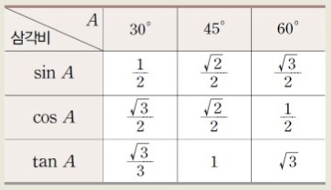

# 03.05

## Django + 삼각함수 공부


:mortar_board: **요청과 응답 복습**

```python
import random
import requests

# 1. url 주소를 따로 지정한다. 길이가 길기 대문에 반복하여 사용하면 코드 사용성이 낮아지기 때문이다.
url = 'https://...'

# 2. 요청, 응답
response = requests.get(url)
movie = response.json()

# 3. url 주소의 내용을 사용 목적에 맞게 가공하기
# url의 주소를 movie에 넣어서 사용함. movie는 dictionary 형태 이므로 그중에 key 값이 'bonus'이 value를 win에 할당 한다는 뜻이다. 
win = movie['bonus']

```

_

:mortar_board:**삼각함수**

 삼각함수의 일반각을 정의하는 방법에는 도(')를 단위로 하는 **육십분법**과 라디안(rad)을 단위로 하는 **호도법**이 있다. 

1. 육십분법 : 1회전을 360'로 정의하는 각이다. 
2. 호도법 : 부채꼴에서 중심각의 크기와 호의 길이가 반지름에 비례한다는 특징과, 원주가 지름의 pi(3.14)배 라는 성질을 이용하여  정의되는 각이다. 

```python
C : x^2 + y^2 = r^2

cos(a) 
sin(a)
tan(a)
sec(a) = r/x
csc(a) = r/y
cot(a) = x/y
```



_

:mortar_board:**math.()**

  python에서 사용 가능한 math 함수는 내장 함수가 아니기 때문에 import math를 사용해야 한다. 

```python
import math

math.log2(2)와 같이 math.를 꼭 붙여주어야 한다.
```

1. 절대값 (결과값은 실수)

* fabs(-2) = 2.0

2. 올림 (절댓값이 아님)

* ceil(2.1) = 3

* ceil(-2.1) = -2

3. 버림 (절댓값이 아님)

* floor(2.1) = 2

* floor(-2.1) = -3

4. 지수함수(e^x) : y = a^x 로 주어지는 모든 함수

* exp(1) = 2.71828 

5. 로그 : log를 그냥 사용하면 밑이 e인 _자연 로그_가 된다.

* log(2.71828) = 0.99999... 

  (자연로그 밑 e에 해당하는 수를 소숫점 아래 14자리를 써도 1.0이 안나오고 소숫점 아래 15자리를 써야 1.0이 나오기 때문에 정확한 계산을 위해선 math.e를 쓰는 것이 좋다. )

  math.log(math.e) = 1

* math.log(25, 5) = 2 

  (밑이 5인 로그함수를 표현)

* log10(10) = 1

6. 루트

* sqrt(4.0) = 2

7. 사인/사인역함수

* sin(3.14159/2) = 1

* asin(1.0) = 1.57

8.  코사인/코사인역함수

* cos(3.14159/2) = 0

* acos(1.0) = 0

9. 탄젠트

* tan(3.14159/4) = 1

10. 라디안 > 도

* degrees(1.57) = 90

11. 도 > 라디안

* radians(90) = 1.57
