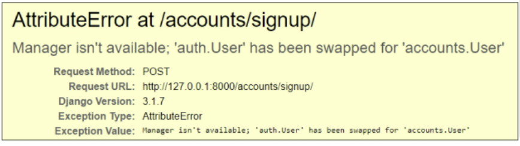

# 04.11

## PJT 대비_2 (Auth + Comment)

[TOC]

<br>

### 1. Authenticated  system(회원정보)

:small_red_triangle_down: 커스텀 유저 모델로 작성하기!!

#### 1. Substituting a custom User model

https://docs.djangoproject.com/en/4.0/topics/auth/customizing/

1. Custom User 모델 정의하기

   * 관리자 권한과 함께 완전한 기능을 갖춘 User 모델을 구현하는 기본 클래스인 AbstractUser를 상속 받아 새로운 User모델 작성

     ```python
     # accounts/models.py
     
     from django.contrib.auth.models import AbstractUser
     
     class User(AbstractUser):
         pass
     ```

     ```python
     # settings.py
     
     AUTH_USER_MODEL = 'accounts.User'
     ```

   * 마이그래이션 초기화!

     1. db.sqlite3 파일 삭제
     2. migrations 파일 모두 삭제(파일명에 숫자가 붙은 파일만 삭제)

     ```bash
     $ python manage.py makemigrations
     $ python manage.py migrate
     ```

   * `admin.site`에 Custom User 모델 등록

     ```python
     # accounts/admin.py
     
     from django.contrib import admin
     from django.contrib.auth.admin import UserAdmin
     from .models import User
     
     admin.site.register(User, UserAdmin)  # custom user 모델 사용위해 정의
     ```
     
     ```bash
     $ python manage.py makemigrations
     $ python manage.py migrate
     ```

#### 2. Custom user & Built - in forms

* Custom User model 후 회원 가입을 시도하면 다음과 같은 오류를 볼 수 있다. 



UserCreationForm과 UserChangeForm은 기존 내장 User 모델을 사용한 ModelForm이기 때문에 커스텀 User 모델로 대체해야 한다. 

* **Custom Built-in Auth Forms**

  기존의 User모델을 사용하기 때문에 커스텀 User 모델로 다시 작성하거나 확장해야 하는 forms는 `UserCreationForm`, `UserChangeForm`이다. 

  ```python
  # accounts/forms.py
  
  from django.contrib.auth.forms import UserChangeForm, UserCreationForm
  from django.contrib.auth import get_user_model
  
  
  # 회원정보 폼
  class CustomUserChangeForm(UserChangeForm):
      
  
      class Meta:
          model = get_user_model()  # User
          fields = ('email', 'first_name', 'last_name',)
  
  
  # 회원가입 폼
  class CustomUserCreationForm(UserCreationForm):
      
  
      class Meta(UserCreationForm.Meta):
          # get_user_model 
          # 현재 프로젝트에서 활성화 된 유저를 반환한다. 현재는 accounts의 유저를 반환
          model = get_user_model()  
          fields = UserCreationForm.Meta.fields + ('email',)
  ```
  
  ```python
  # accounts/views.py
  
  from .forms import CustomUserCreationForm
  
  @require_http_methods(['GET', 'POST'])
  def signup(request):
      if request.user.is_authenticated:
          return redirect('articles:index')
  
      if request.method == 'POST':
          form = CustomUserCreationForm(request.POST)
          if form.is_valid():
              user = form.save()
              auth_login(request, user)
              return redirect('articles:index')
      else:
          form = CustomUserCreationForm()
      context = {
          'form': form,
      }
      return render(request, 'accounts/signup.html', context)
  ```


---

* 사용자의 `로그인`, `로그아웃`, `회원가입`, `회원정보수정`, `회원탈퇴`, `비밀번호 변경`을 할 수 있다. 

1. `urls.py` , `froms.py`

```python
# accounts/urls.py
# 프로젝트 url에도 include 해주기

from django.urls import path
from . import views


app_name = 'accounts'
urlpatterns = [
    path('login/', views.login, name='login'),
    path('logout/', views.logout, name='logout'),
    path('signup/', views.signup, name='signup'),
    path('delete/', views.delete, name='delete'),
    path('update/', views.update, name='update'),
    path('password/', views.change_password, name='change_password'),
]
```

2. `views.py`

* `articles/views.py`에 `@login_required` 달아주기

```python
# accounts/views.py

from django.contrib.auth import login as auth_login
from django.contrib.auth import logout as auth_logout
from django.contrib.auth import update_session_auth_hash
from django.contrib.auth.decorators import login_required
from django.contrib.auth.forms import (
    AuthenticationForm, 
    # UserCreationForm, 
    PasswordChangeForm,
)
from django.views.decorators.http import require_http_methods, require_POST
from django.shortcuts import render, redirect
from .forms import CustomUserChangeForm, CustomUserCreationForm


# Create your views here.
@require_http_methods(['GET', 'POST'])
def login(request):
    if request.user.is_authenticated:
        return redirect('articles:index')

    if request.method == 'POST':
        form = AuthenticationForm(request, request.POST)
        if form.is_valid():
            # 로그인
            auth_login(request, form.get_user())
            return redirect(request.GET.get('next') or 'articles:index')
    else:
        form = AuthenticationForm()
    context = {
        'form': form,
    }
    return render(request, 'accounts/login.html', context)


@require_POST
def logout(request):
    if request.user.is_authenticated:
        auth_logout(request)
    return redirect('articles:index')


"""
@require_http_methods(['GET', 'POST'])
def signup(request):
    if request.user.is_authenticated:
        return redirect('articles:index')

    if request.method == 'POST':
        form = UserCreationForm(request.POST)
        if form.is_valid():
            user = form.save()
            auth_login(request, user)
            return redirect('articles:index')
    else:
        form = UserCreationForm()
    context = {
        'form': form,
    }
    return render(request, 'accounts/signup.html', context)
"""


@require_http_methods(['GET', 'POST'])
def signup(request):
    if request.user.is_authenticated:
        return redirect('articles:index')

    if request.method == 'POST':
        form = CustomUserCreationForm(request.POST)
        if form.is_valid():
            user = form.save()
            auth_login(request, user)
            return redirect('articles:index')
    else:
        form = CustomUserCreationForm()
    context = {
        'form': form,
    }
    return render(request, 'accounts/signup.html', context)


@require_POST
def delete(request):
    if request.user.is_authenticated:
        request.user.delete()
        auth_logout(request)  # 반드시 회원탈퇴 후 로그아웃 함수 호출
    return redirect('articles:index')


@login_required
@require_http_methods(['GET', 'POST'])
def update(request):
    if request.method == 'POST':
        form = CustomUserChangeForm(request.POST, instance=request.user)
        if form.is_valid():
            form.save()
            return redirect('articles:index')
    else:
        form = CustomUserChangeForm(instance=request.user)
    context = {
        'form': form,
    }
    return render(request, 'accounts/update.html', context)


@login_required
@require_http_methods(['GET', 'POST'])
def change_password(request):
    if request.method == 'POST':
        form = PasswordChangeForm(request.user, request.POST)
        if form.is_valid():
            # 1
            user = form.save()
            update_session_auth_hash(request, user)
            # 2
            # update_session_auth_hash(request, form.user)
            return redirect('articles:index')
    else:
        form = PasswordChangeForm(request.user)
    context = {
        'form': form,
    }
    return render(request, 'accounts/change_password.html', context)
```

```python
# accounts/forms.py
from django.contrib.auth.forms import UserChangeForm
from django.contrib.auth import get_user_model


class CustomUserChangeForm(UserChangeForm):

    # password = None

    class Meta:
        model = get_user_model() # User
        fields = ('email', 'first_name', 'last_name',)

```

3. `base.html`

```django
<!-- base.html -->
<!DOCTYPE html>
<html lang="en">
<head>
  <meta charset="UTF-8">
  <meta http-equiv="X-UA-Compatible" content="IE=edge">
  <meta name="viewport" content="width=device-width, initial-scale=1.0">
  <link href="https://cdn.jsdelivr.net/npm/bootstrap@5.1.3/dist/css/bootstrap.min.css" rel="stylesheet" integrity="sha384-1BmE4kWBq78iYhFldvKuhfTAU6auU8tT94WrHftjDbrCEXSU1oBoqyl2QvZ6jIW3" crossorigin="anonymous">
  <title>Document</title>
</head>
<body>
  <div class="container">
      
      <!-- 로그인이 되어 있다면? -->
      <h3>Hello, {{ user }}</h3>
      <form action="" method="POST">
        
        <input type="submit" value="Logout">
      </form>
      <a href="">회원정보수정</a>
      <form action="" method="POST">
        
        <input type="submit" value="회원탈퇴">
      </form>
      
      <!-- 로그인이 되어 있지 않다면? -->
      <a href="">Login</a>
      <a href="">Signup</a>
      
    


    
    
  </div>
  <script src="https://cdn.jsdelivr.net/npm/bootstrap@5.1.3/dist/js/bootstrap.bundle.min.js" integrity="sha384-ka7Sk0Gln4gmtz2MlQnikT1wXgYsOg+OMhuP+IlRH9sENBO0LRn5q+8nbTov4+1p" crossorigin="anonymous"></script>
</body>
</html>
```

4. `accounts/__.html`

```django
<!-- login.html -->



  <h1>로그인</h1>
  <hr>
  <form action="" method="POST">
    
    {{ form.as_p }}
    <input type="submit">
  </form>
  <a href="">back</a>

```

```django
<!-- signup.html -->



  <h1>회원가입</h1>
  <hr>
  <form action="" method="POST">
    
    {{ form.as_p }}
    <input type="submit">
  </form>
  <a href="">back</a>

```

```django
<!-- update.html -->



  <h1>회원정보수정</h1>
  <hr>
  <form action="" method="POST">
    
    {{ form.as_p }}
    <input type="submit">
  </form>
  <a href="">back</a>

```

```django
<!-- change_password.html -->



  <h1>비밀번호변경</h1>
  <hr>
  <form action="" method="POST">
    
    {{ form.as_p }}
    <input type="submit">
  </form>
  <a href="">back</a>

```

<br>

<br>

---

### 2. Comment (댓글 기능 구현) + :star: (1:N)관계 설정하기

```python
# articles/models.py

from django.db import models


# 기존의 Article 모델
class Article(models.Model):
    user = models.ForeignKey(settings.AUTH_USER_MODEL, on_delete=models.CASCADE)  # user-article 간의 1:N 구조 
    # like_users = models.ManyToManyField(settings.AUTH_USER_MODEL, related_name='like_articles')
    title = models.CharField(max_length=10)
    content = models.TextField()
    created_at = models.DateTimeField(auto_now_add=True)
    updated_at = models.DateTimeField(auto_now=True)

    def __str__(self):
        return self.title

# 댓글기능을 위한 model을 작성한다.
class Comment(models.Model):
    article = models.ForeignKey(Article, on_delete=models.CASCADE)
    # user = models.ForeignKey(settings.AUTH_USER_MODEL, on_delete=models.CASCADE)  # user-comment 간의 1:N 구조
    content = models.CharField(max_length=200)
    created_at = models.DateTimeField(auto_now_add=True)
    updated_at = models.DateTimeField(auto_now=True)

    def __str__(self):
        return self.content

    
    
"""
만약, 참조되는 모델이 현재 앱이 아닌 다른 앱에 있다면 다음과 같이 settings.AUTH_USER_MODEL 라고 작성해 주어야 한다. 

from django.db import models
from django.conf import settings


class Comment(models.Model):
    content = models.CharField(max_length=100)
    movie = models.ForeignKey(Movie, on_delete=models.CASCADE)
    user = models.ForeignKey(settings.AUTH_USER_MODEL, on_delete=models.CASCADE)

    def __str__(self):
        return self.content

"""
```

```python
# articles/forms.py

from django import forms
from .models import Article, Comment


class ArticleForm(forms.ModelForm):

    class Meta:
        model = Article
        fields =('title', 'content',)
		# exclude = ('user','like_users')
        
class CommentForm(forms.ModelForm):
    
    class Meta:
        model = Comment
        exclude = ('article','user',)
```

```python
# articles/admin.py

from django.contrib import admin
from .models import Article, Comment


# Register your models here.
class ArticleAdmin(admin.ModelAdmin):
    list_display = ('pk', 'title','content', 'created_at', 'updated_at',)


admin.site.register(Article, ArticleAdmin)
admin.site.register(Comment)  # 댓글을 위해 admin 등록해주기
```

```python
# articles/urls.py
from django.urls import path
from . import views


app_name = 'articles'
urlpatterns = [
    path('', views.index, name='index'),
    path('create/', views.create, name='create'), # GET / POST
    path('<int:pk>/', views.detail, name='detail'),
    path('<int:pk>/delete/', views.delete, name='delete'),
    path('<int:pk>/update/', views.update, name='update'), # GET / POST
    path('<int:pk>/comments/', views.comments_create, name='comments_create'),
    path('<int:article_pk>/comments/<int:comment_pk>/delete/', views.comments_delete, name='comments_delete'), 
]
```

```django
<!-- detail.html -->




  <h1>DETAIL</h1>
  <h3>{{ article.pk }}번째 글</h3>
  <hr>
  <p>제목 : {{ article.title }}</p>
  <p>내용 : {{ article.content }}</p>
  <p>작성 시각 : {{ article.created_at }}</p>
  <p>수정 시각 : {{ article.updated_at }}</p>
  <hr>
  
    <a href="">수정</a>
    <form action="" method="POST">
      
      <input type="submit" value="삭제">
    </form>
  
  <a href="">back</a>
  <hr>
  <h4>댓글 목록</h4>
  <ul>
    
      <li>
        {{ comment.user }} - {{ comment.content }}
        
          <form action="" method="POST">
            
            <input type="submit" value="삭제">
          </form>
        
      </li>
    
  </ul>
  <hr>
  
    <form action="" method="POST">
      
      {{ comment_form }}
      <input type="submit">
    </form>
  
    <a href="">[댓글을 작성하려면 로그인하세요.]</a>
  


```

```python
# 전체 수정코드
# articles/views.py

from .forms import ArticleForm, CommentForm
from django.views.decorators.http import require_http_methods, require_POST
from django.contrib.auth.decorators import login_required


from django.contrib.auth.decorators import login_required
from django.shortcuts import render, redirect, get_object_or_404
from django.views.decorators.http import require_http_methods, require_POST, require_safe
from .models import Article, Comment
from .forms import ArticleForm, CommentForm


# Create your views here.
@require_safe
def index(request):
    articles = Article.objects.order_by('-pk')
    context = {
        'articles': articles,
    }
    return render(request, 'articles/index.html', context)


@login_required
@require_http_methods(['GET', 'POST'])
def create(request):
    if request.method == 'POST':
        form = ArticleForm(request.POST)
        if form.is_valid():
            article = form.save(commit=False)
            article.user = request.user
            article.save()
            return redirect('articles:detail', article.pk)
    else:
        form = ArticleForm()
    context = {
        'form': form,
    }
    return render(request, 'articles/create.html', context)


@require_safe
def detail(request, pk):
    article = get_object_or_404(Article, pk=pk)
    comment_form = CommentForm()
    # 조회한 article의 모든 댓글을 조회(역참조)
    comments = article.comment_set.all()
    context = {
        'article': article,
        'comment_form': comment_form,
        'comments': comments,
    }
    return render(request, 'articles/detail.html', context)


@require_POST
def delete(request, pk):
    article = get_object_or_404(Article, pk=pk)
    if request.user.is_authenticated:
        if request.user == article.user:
            article.delete()
    return redirect('articles:index')


@login_required
@require_http_methods(['GET', 'POST'])
def update(request, pk):
    article = get_object_or_404(Article, pk=pk)
    if request.user == article.user:
        if request.method == 'POST':
            form = ArticleForm(request.POST, instance=article)
            if form.is_valid():
                article = form.save()
                return redirect('articles:detail', article.pk)
        else:
            form = ArticleForm(instance=article)
    else:
        return redirect('articles:index')
    context = {
        'article': article,
        'form': form,
    }
    return render(request, 'articles/update.html', context)


@require_POST
def comment_create(request, pk):
    if request.user.is_authenticated:
        article = get_object_or_404(Article, pk=pk)
        comment_form = CommentForm(request.POST)
        if comment_form.is_valid():
            comment = comment_form.save(commit=False)
            comment.article = article
            comment.user = request.user
            comment.save()
        return redirect('articles:detail', article.pk)
    return redirect('accounts:login')


@require_POST
def comment_delete(request, article_pk ,comment_pk):
    if request.user.is_authenticated:
        comment = get_object_or_404(Comment, pk=comment_pk)
        if request.user == comment.user:
            comment.delete()
    return redirect('articles:detail', article_pk)


# 좋아요 기능 구현
@require_POST
def likes(request, article_pk):
    if request.user.is_authenticated:  # 로그인 된 사용자라면?
        article = get_object_or_404(Article, pk=article_pk)
        
        # 좋아요 취소(좋아요 목록에 있는데, 좋아요를 한번 더 눌렀다면 좋아요 취소)
        if article.like_users.filter(pk=request.user.pk).exists():
            article.like_users.remove(request.user)
        # 좋아요 
        else:
            article.like_users.add(request.user)
        return redirect('articles:index')
    return redirect('accounts:login')

# 수정하기
def detail(request, pk):
    article = get_object_or_404(Article, pk=pk)
    comment_form = CommentForm()
    comments = article.comment_set.all()  # 역참조
    context= {
        'article':article,
        'comment_form': comment_form,
        'comments': comments, 
    }
    return render(request, 'articles/detail.html', context)

# 추가하기
@require_POST
def comments_create(request, pk):
    if request.user.is_authenticated:  # 인증된 사용자만
        article = get_object_or_404(Article, pk=pk)  # article 조회
        comment_form = CommentForm(request.POST)
        if comment_form.is_valid():
            comment = comment_form.save(commit=False)
            comment.article = article  # article 조회한 거 넣어줌
            comment.user = rquest.user
            comment.save()
        return redirect('articles:detail', article.pk)
    return redirect('accounts:login')


@require_POST
def comments_delete(request, article_pk, comment_pk):
    if request.user.is_authenticated:  # 인증된 사용자만
        comment = get_object_or_404(Comment, pk=comment_pk)
        comment.delete()
    return redirect('articles:detail', article_pk)
```

---

### 3. Navbar 포함하기

`navbar`는 `base.html`에 작성할 수 있다. 

```django
<!DOCTYPE html>
<html lang="en">
<head>
  <meta charset="UTF-8">
  <meta http-equiv="X-UA-Compatible" content="IE=edge">
  <meta name="viewport" content="width=device-width, initial-scale=1.0">
  <link href="https://cdn.jsdelivr.net/npm/bootstrap@5.1.3/dist/css/bootstrap.min.css" rel="stylesheet" integrity="sha384-1BmE4kWBq78iYhFldvKuhfTAU6auU8tT94WrHftjDbrCEXSU1oBoqyl2QvZ6jIW3" crossorigin="anonymous">
  <title>Document</title>
</head>
    
<body>
  <div class="container">
    <!-- 로그인 되어 있을 경우 -->
    
      <nav class="navbar navbar-expand-lg navbar-light bg-light ">
        <div class="container-fluid">

          <h3>Hello, {{ user }}</h3>

          <button class="navbar-toggler" type="button" data-bs-toggle="collapse" data-bs-target="#navbarNavAltMarkup" aria-controls="navbarNavAltMarkup" aria-expanded="false" aria-label="Toggle navigation">
            <span class="navbar-toggler-icon"></span>
          </button>  

          <div class="collapse navbar-collapse" id="navbarNavAltMarkup">
            <div class="navbar-nav">
              <form action="">
                
                <input type="submit" value=" 회원정보 수정 ">
              </form>
              <form action="" method="POST">
                
                <input type="submit" value=" Logout ">
              </form>
              <form action="" method='POST'>
                
                <input type="submit" value=' 회원탈퇴 '>
              </form>
            </div>
          </div>
        </div>
      </nav>
    <!-- 로그 아웃 되어 있을 경우 -->
    
      <nav class="navbar navbar-expand-lg navbar-light bg-light">
        <div class="container-fluid">
          <div class="navbar-nav">
            <form action="" method='POST'>
              
              <input type="submit" value='Login'>
            </form>
            <form action="" method='POST'>
              
              <input type="submit" value='signup'>
            </form>
          </div>
        </div>
      </nav>

    

    
    
  </div>
  <script src="https://cdn.jsdelivr.net/npm/bootstrap@5.1.3/dist/js/bootstrap.bundle.min.js" integrity="sha384-ka7Sk0Gln4gmtz2MlQnikT1wXgYsOg+OMhuP+IlRH9sENBO0LRn5q+8nbTov4+1p" crossorigin="anonymous"></script>
</body>
    
</html>
```

```django
<!DOCTYPE html>
<html lang="en">
<head>
  <meta charset="UTF-8">
  <meta http-equiv="X-UA-Compatible" content="IE=edge">
  <meta name="viewport" content="width=device-width, initial-scale=1.0">
  <link href="https://cdn.jsdelivr.net/npm/bootstrap@5.1.3/dist/css/bootstrap.min.css" rel="stylesheet" integrity="sha384-1BmE4kWBq78iYhFldvKuhfTAU6auU8tT94WrHftjDbrCEXSU1oBoqyl2QvZ6jIW3" crossorigin="anonymous">
  <script src="https://kit.fontawesome.com/aa1284d2fd.js" crossorigin="anonymous"></script>
  <title>Document</title>
</head>
<body>
  <div class="container">
    
    
      <h3>Hello, {{ user }}<i class="fa-solid fa-heart"></i></h3>
      <form action="" method="POST">
        
        <input type="submit" value="Logout">
      </form>
      <a href="">회원정보수정</a>
      <form action="" method="POST">
        
        <input type="submit" value="회원탈퇴">
      </form>
    
      <a href="">Login</a>
      <a href="">Signup</a>
    

    <hr>

    
    
  </div>
  <script src="https://cdn.jsdelivr.net/npm/bootstrap@5.1.3/dist/js/bootstrap.bundle.min.js" integrity="sha384-ka7Sk0Gln4gmtz2MlQnikT1wXgYsOg+OMhuP+IlRH9sENBO0LRn5q+8nbTov4+1p" crossorigin="anonymous"></script>
</body>
</html>
```

