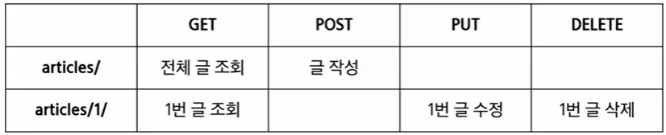

# 04.15

## Django02

<br>

[TOC]

<br>

### 1. HTTP

> HyperText Transfer Protocol
>
> 웹 상에서 컨텐츠를 전송하기 위한 약속
>
> HTML 문서와 같은 리소스들을 가져올 수 있도록 하는 프로토콜(규칙, 약속)
>
> 웹에서 이루어지는 모든 데이터 교환의 기초
>
> * 요청(request) : 클라이언트에 의해 전송되는 메시지
> * 응답(response) : 서버에서 응답으로 전송되는 메시지
>
> [기본 특성]
>
> 1. Stateless
> 2. Connenctionless
>
> 쿠키와 세션을 통해 서버 상태를 요청과 연결하도록 한다. 


* HTTP request methods (요청)

  자원에 대한 행위(수행하고자 하는 동작)를 정의

  주어진 리소스(자원)에 수행하길 원하는 행동을 나타냄

  HTTP Method 예시 : **GET, POST, PUT(수정), DELETE(삭제)**

* HTTP response status codes (응답)

  특정 HTTP 요청이 성공적으로 완료되었는지 여부를 나타낸다. 

  1. Informational response (1XX)
  2. Successful responses (2XX)
  3. Redirection message (3XX)
  4. Client error responses (4XX)
  5. Server error responses (5XX)

* 웹에서의 리소스 식별

  HTTP 요청의 대상을 리소스(resource, 자원)라고 한다.

  리소스는 문서, 사진 도는 기타 어떤 것이든 될 수 있다.

  각 리소스는 리소스 식별을 위해 HTTP 전체에 사용되는 URL(Uniform Resource Identifier)로 식별 된다. 

* **URL, URN**

  * URL(Uniform Resource ocator)

    통합 자원 위치

    네트워크 상에 자원이 어디 있는지 알려주기 위한 약속

    과거에는 실제 자원의 위치를 나타냈지만 현재는 추상화된 의미론적인 구성

    '웹 주소', '링크'라고 불린다.

  * URN(Uniform Resource Name)

    통합 자원 이름

    URL과 달리 자원의 위치에 영향을 받지 않는 유일한 이름 역할을 한다. 

    예 : ISBN(국제표준도서번호)

* **URI**

  Uniform Resource Identifier

  **인터넷의 자원을 식별하는 유일한 주소(정보의 자원을 표현)**

  인터넷에서 자원을 식별하거나 이름을 지정하는데 사용되는 간단한 문자열이다. 

  하위 개념으로 URL, URN 이 있다. 

  URI는 크게 URL과 URN으로 나눌 수 있지만, URN을 사용하는 비중이 매우 적기 때문에 일반적으로 URL은 URI와 같은 의미처럼 사용하기도 한다. 

  [URI의 구조]

  * **Scheme(protocool)** : 브라우저가 사용해야 하는 프로토콜 

    http(s), data, file, ftp, mailto

  * **Host** (Domail name) : 요청 받는 웹 서버의 이름 이다. IP address를 직접 사용할 수 있지만 실 사용시 불편하므로 웹에서 그리 자주 사용되지는 않는다. 

  * **Port** : 웹 서버 상의 리소스에 접근하는데 사용되는 기술적인 '문(gate)', 로컬 서버에서 접근할 때 나타난다. 

    HTTP 80

    HTTPS 443

  * **Path** : 웹 서버상의 리소스 경로로 초기에는 실제 파일이 위치한 물리적 위치를 나타냈지만, 오늘 날은 물리적인 실제 취이가 아닌 추상화 형태의 구조로 표현한다.

  * **Query** : 웹 서버에 제공되는 추가적인 매개 변수이다. &로 구분되는 Key-Value 목록

  * **Fragment**(Anchor) : 자원 안에서의 북마크의 한 종류를 나타낸다. 브라우저에게 해당 문서(HTML)의 특정 부분을 보여주기 위한 방법이다. 브라우저에게 알려주는 요소이기 때문에 fragment identifier(부분 식별자)라고 부르며 '#' 뒤의 부분은 요청이 서버에 보내지지 않는다. 

<br>

### 2. RESTful API

#### 1. API(Application Programming Interface)

* 프로그래밍 언어가 제공하는 기능을 수행할 수 있게 만든 인터페이스

  애플리케이션과 프로그래밍으로 소통하는 방법

  CLI는 명령줄, GUI는 그래픽(아이콘), API는 프로그래밍을 통해 특정한 기능 수행

* Web API

  웹 애플리케이션 개발에서 다른 서비스에 요청을 보내고 응답 받기 위해 정의된 명세

  현재 웹 개발은 모든 것을 직접 개발하기보다 여러 Open API를 활용하는 추세
  
* 응답 데이터 타입

  HTML, XML, JSON 파일 등이 있다. 

#### 2. REST

* REpresentational State Transfer

* API Server를 개발하기 위한 일종의 소프트웨어 설계 방법론이다. 

* 네트워크 구조 원리의 모음

* REST 원리를 따르는 시스템을 RESTful 이란 용어로 지칭한다. 

  * RESTful API 

    REST 원리를 따라 설계한 API이다. RESTful services, 혹은 simply REST services라고도 부른다. 

    프로그래밍을 통해 클라이언트의 요청에 JSON을 응답하는 서버를 구성한다. 

* **REST의 자원과 주소의 지정 방법**

  1. 자원 : URI
  2. 행위 : HTTP Method
  3. 표현 : 자원과 행위를 통해 궁극적으로 표현되는(추상화된) 결과물, json으로 표현된 데이터를 제공한다. 

* REST의 핵심 규칙 

  1. '정보'는 URI로 표현한다.
  2. 자원에 대한 '행위'는 HTTP Method로 표현한다.

* 설계 방법론은 지키지 않았을 때 잃는 것보다 지켰을 때 얻는 것이 훨씬 많다. 하지만 설계 방법을 지키지 않더라도 동작 여부에는 큰 영향을 미치지는 않는다. 

#### 3. JSON 

* JavaScript Object Notation (js의 표기법을 따른 단순 문자열)
* 사람이 읽거나 쓰기 쉽고 기계가 파싱(해석, 분석)하고 만들어내기 쉽다. 
* 파이선의 dictionary, 자바스크립트의 object처럼 C계열의 언어가 갖고 있는 자료구조로 쉽게 변화할 수 있는 key-value 형태의 구조를 갖고 있다. 

#### 3. RESTful API

* REST 원리를 따라 설계한 API이다. 
* RESTful services, 혹은 simply REST services라고도 부른다. 
* 프로그래밍을 통해 클라이언트의 요청에 JSON을 응답하는 서버를 구성한다. 


<br>

### 3. Response

#### 1. 제공된 00_json_response 프로젝트 진행

```bash
$ python -m venv venv
$ source venv/Scripts/activate
$ pip install -r requirements.txt
```

```python
# articles/models.py

from django.db import models

# Create your models here.
class Article(models.Model):
    title = models.CharField(max_length=100)
    content = models.TextField()
    created_at = models.DateTimeField(auto_now_add=True)
    updated_at = models.DateTimeField(auto_now=True)
```

```python
# settings.py

INSTALLED_APPS = [
    'artices',
    'django_seed',
]
```

```python
# my_api/urls.py


urlpatterns = [
    path('admin/', admin.site.urls),
    path('api/v1/',include('articles.url')),
]
```

* 모델 구조에 맞는 데이터 생성하기

```bash
$ python manage.py migrate
$ python manage.py seed articles --number=20
```

```python
# articles/url.py

urlpatterns = [
    path('html/', views.article_html),
    path('json-1/', views.article_json-1),
    path('json-2/', views.article_json-2),
    path('json-3/', views.article_json-3),
]
```

```python
# articles/views.py

def article_html(request):
    articles = Article.objects.all()
    context = {
        'articles': articles,
    }
    return render(request, 'articles/article.html', context)
```

```django
<!-- articles/article.html -->

<body>
  
    <h2>{{ article.pk }}번 글. {{ article.title }}</h2>
    <p>{{ article.content }}</p>
    <hr>
  
</body>
```

:small_red_triangle_down:  1. JsonResponse 객체를 활용한 JSON데이터 응답

```python
# articles/views.py
from django.http.response import JsonResponse

def article_json_1(request):
    articles = Article.objects.all()
    articles_json = []

    for article in articles:
        articles_json.append(
            {
                'id': article.pk,
                'title': article.title,
                'content': article.content,
                'created_at': article.created_at,
                'updated_at': article.updated_at,
            }
        )
    return JsonResponse(articles_json, safe=False)
```

* content-type entity header

  데이터의 media typed을 나타내기 위해 사용된다. 

  응답 내에 있는 컨텐츠의 컨텐츠 유형이 실제로 무엇인지 클라이언트에게 알려준다. 

* **JsonResponse** objects

    JSON-encoded response를 만드는 HttpResponse의 서브 클래스이다. 

    'safe' 파라미터 : True가 기본 값, dict이외의 객체를 _직렬화_하려면 False로 설정해야 한다.

  ```python
  # JsonResponse 예시
  
  response = JsonResponse({'foo': 'bar'})
  response = JsonResponse([1, 2,3], safe= False)
  ```

#### 2. **직렬화** 

데이터 구조나 객체 상태를 동일하거나 다른 컴퓨터 환경에 저장하고, 나 중에 재구성할 수 있는 포맷으로 변환하는 과정

  > modelform
  >
  > 1. 모델에 정의한 필드와 대응하는 HTML(FORM양식)을 만들어주고
  > 2. 유효성 검사를 통한 데이터저장
  >
  > serializer
  >
  > 1. 모델에 정의한 필드와 일치하는 json을 만들어 주고
  > 2. 유효성 검사를 통한 데이터저장

  :small_red_triangle_down: 2. Response - django Serializer(직렬화)

  ```python
  # 주어진 모델 정보를 활용하기 때문에 이전과 달리 필드를 개별적으로 직접 만들어줄 필요가 없다. 
  from django.http.response import JsonResponse, HttpResponse
  from django.core import serializers
  from django.http.response import JsonResponse
  from .models import Article
  
  
  def article_json_2(request):
      articles = Article.objects.all()
      # data : 직렬화된 객채
      data = serializers.serialize('json', articles)
      return HttpResponse(data, content_type='application/json')
  ```

#### 3. **DRF** 

  :small_red_triangle_down:3. Response - :star2: **Django REST Framework (DRF)**

  ```bash
  $ pip install djangorestframework
  ```

  ```python
  # settings.py
  
  ISNTALLED_APPS = [
      ...,
      'rest_framework',
  ]
  ```

  ```python
  # articles/serializers.py
  
  from rest_framework import serializers
  from .models import Article
  
  
  class ArticleSerializer(serializers.ModelSerializer):
  
      class Meta:
          model = Article
          fields = '__all__'
  ```

  ```python
  # articles/views.py
  from rest_framework.decorators import api_view
  from rest_framework.response import Response
  from .serializers import ArticleSerializer
  from .models import Article
  
  
  # @api_view(['GET'])
  @api_view()
  def article_json_3(request):
      articles = Article.objects.all()
      serializer = ArticleSerializer(articles, many=True)
      return Response(serializer.data)
  
  ```

  * Web API의 구축을 위한 강력한 Toolkit을 제공하는 라이브러리

  * DRF의 Serializer는 Django의 Form 및 ModelForm 클래스와 매우 유사하게구성되고 작동한다. 

    

  * 응답을 보낼 파일 만들기

    ```python
    # aaa.py
    
    import requests
    from pprint import pprint
    
    response = request.get('http://127.0.0.1:8000/api/v1/json-3/')
    pprint(response)
    pprint(dir(response))  # response에서 사용할 수 있는 메서드
    pprint(response.json())  # python에서 사용할 수 있는 list로 변환
    
    articles_list = response.json()
    
    for article in article_list:
        print(type(article))
        print(article.get('title'))
    ```

<br>

### 4. Single Model

`서버 -> json()으로 넘김 -> 브라우저가 열심히 그림을 그림(Vue.js)`

> 단일 모델의 data를 직렬화하여 JSON으로 변환하는 방법에 대한 학습
>
> 단일 모델을 두고 CRUD 로직을 수행 가능하도록 설계
>
> DRF 빌트인 폼, Postman 사용

```python
# settings.py

INSTALLED_APPS = [
    'articles',
    'django_seed',
    'django_extensions',
    'rest_framework',
    ...
]
```

```python
# my_api/urls.py

urlpatterns = [
    path('admin/', admin.site.urls),
    path('api/v1/',include('articles.url')),
]
```

```python
# articles.url.py

urlpatterns = [
    path('html/', views.article_html),
    path('json-1/', views.article_json-1),
    path('json-2/', views.article_json-2),
    path('json-3/', views.article_json-3),
]
```

```python
# articles/models.py

from django.db import models

# Create your models here.
class Article(models.Model):
    title = models.CharField(max_length=100)
    content = models.TextField()
    created_at = models.DateTimeField(auto_now_add=True)
    updated_at = models.DateTimeField(auto_now=True)
```

```bash
$ python manage.py migrate
$ python manage.py seed articles --number=20
```

:small_red_triangle_down: ModelSerializer : 모델 필드에 해당하는 필드가 있는 Serializer 클래스를 자동으로 만들 수 있는 shortcut 

다음과 같은 기능을 제공한다. 

1. 모델 정보에 맞춰 자동으로 필드 생성
2. serializer에 대한 유효성 검사기를 자동으로 생성
3. .create() & .update()의 간단한 기본 구현이 포함됨

```python
# articles/serializers.py

from rest_framework import serializers
from .models import Article


class ArticleListSerializer(serializers.ModelSerializer):  # id, title만

    class Meta:
        model = Article
        fields = ('id', 'title',)
        
        
class ArticleSerializer(serializers.ModelSerializer):  # 전체 필드 조회

    class Meta:
        model = Article
        fields = '__all__'
```

```bash
$ pip install ipython
$ python manage.py shell_plus
```

```shell
# 작성한 Serializer import 
>>> from articles.serializers import ArticleListSerializer

# 기본 인스턴스 구조 확인
>>> serializer = ArticleListSerializer
>>> serializer
ArticleListSerializer():
	id = IntegerField(label='ID', read_only=True)
	title = CharField(max_length=100)
	
# 1. 단일 게시글 조회
>>> article = Article.objects.get(pk=1)

>>> article
>>> serializer = ArticleListSerializer(article)  #가공
>>> serializer
ArticleListSerializer(<Article: Article.object(1)>):
	id = IntegerField(label='ID', read_only=True)
	title = CharField(max_length=100)
	
>>> serializer.data
	# 데이터 나옴
	{...}
	
# 2. 다중 게시글 조회
>>> articles = Article.objects.all()

>>> articles
>>> serializers = ArticleListSerializer(articles, many=True)  #가공
>>> serializers
ArticleListSerializer(<Article: Article.object(1)>):
	id = IntegerField(label='ID', read_only=True)
	title = CharField(max_length=100)
	
>>> serializers.data
	# 데이터 나옴
	{...}
```

* `many` : 단일 인스턴스 대신 QuerySet 등을 직렬화하기 위해서 `many=True`를 사용

---

**[Build RESTful API]**



1. **조회 GET**

```python
# articles/urls.py
# 전체 주소는 'apr/v1/article/...'

urlpatterns = [
    path('articles/', views.article_list),
    path('articles/<int:article_pk>', views.article_detail),
]
```

```python
# articles/views.py
from rest_framework import status  # 정의된 상수 집합
from .models import Article
from rest_framework.decoratiors import api_view
from .serializers import ArticleListSerializer, ArticleSerializer
from rest_framework.response import Response
from django.shortcut import get_object_or_404


@api_view(['GET', 'POST'])
def article_list(request):  # 전체 게시글 조회
   	if request.method == 'GET':
    	articles = Article.objects.all()
    	# articles = get_object_or_404(Article)
    	serializer = ArticleListSerializer(articles, many=True)
    	return Response(serializer.data)
    
    elif request.method = 'POST':  # 게시글 생성
		serializer = ArticleSerializer(data=request.data)
        if serializer.is_valid(raise_exception=True):
            serializer.save()
            return Response(serializer.data, status=status.HTTP_201_CREATED)
        # return Response(serializer.errors, status=stauts.HTTP_400_BAD_REQUEST)

    
@api_view(['GET', 'DELETE', 'PUT'])
def article_detail(request, article_pk): 
    article = get_object_or_404(Article, pk=article_pk)
    if request.method == 'GET':  # 디테일
    	# id, title, content, created_at, updated_at 모두 출력
    	serializer = ArticleSerializer(article)
    	return Response(serializer.data)
    
    elif request.method == 'DELETE': # 삭제
    	article.delete()
        data = {
            'delete':f'데이터 {article.pk}번이 삭제되었습니다.',
        }
        return Response(data, status=status.204_NO_COUNTENT)
    
    elif request.method == 'PUT':  # 수정
        serializer = ArticleSerializer(article, request.data)  # 기존 값, 새롭게 넣을 값
        if serializer.is_valid(raise_exception=True):
            serializer.save()
            return Response(serializer.data)
    
```

:seedling: 브라우저 말고 포스트맨드로 보내기! -> 주소만 복붙 하면 됨.

`@api_view()` : 기본적으로 GET 메서드만 허용되며 다른 메서드 요청에 대해서는 405 Method Allowed로 응답한다. DRF에서는 선택이 아니라 필수적으로 작성해야 한다. 

2. **작성(POST)**

201 Created 상태 코드 및 메시지 응답 

(위 코드(article_list)에서 분리하여 작성)

포스트맨에서 POST로 주소 보내고, Body -> form-data

`raise_exception=True` : 같은 400 에러를 발생 시킴. DRF에서 제공하는 기본 예외 처리기에 의해 자동으로 처리되며, 기본적으로 HTTP status code 400을 응답으로 반환한다. 

3. **삭제(DELETE)**

204 No Content 상태 코드 및 메시지 응답 

(위 코드(article_detail)에서 분리하여 작성)

4. **수정(PUT)**

(위 코드(article_detail)에서 분리하여 작성)

<br>

### 5. 1:N Relation (댓글 기능 구현) - 전체 코드 있음

* 1:N 관계에서의 모델 data를 직렬화하여 JSON으로 변환하는 방법에 대한 학습

1. 데이터베이스 초기화 한 후 모델 작성

2. 전체 댓글 조회, 단일 댓글 조회

3. 댓글 작성, 수정, 삭제

   ```python
   # articles/models.py
    
   class Article(models.Model):  # 게시글
       title = models.CharField(max_length=100)
       content = models.TextField()
       created_at = models.DateTimeField(auto_now_add=True)
       updated_at = models.DateTimeField(auto_now=True)
       
   
   class Comment(models.Model):  # 댓글
       article = models.ForeignKey(Article, on_delete=models.CASCADE)
       content = models.TextField()
       created_at = models.DateTimeField(auto_now_add=True)
       updated_at = models.DateTimeField(auto_now=True)
   ```

   ```bash
   $ python manage.py makemigrations
   $ python manage.py migrate
   ```

   ```bash
   $ python manage.py seed articles --number=20
   ```

   ```python 
   # articles/serializers.py
   
   from rest_framework import serializers
   from .models import Article, Comment
   
   
   class ArticleListSerializer(serializers.ModelSerializer):  # id, title만
   
       class Meta:
           model = Article
           fields = ('id', 'title',)
           
           
   class ArticleSerializer(serializers.ModelSerializer):  # 전체 필드 조회
   
       class Meta:
           model = Article
           fields = '__all__'
           
           
   class CommentSerializer(serializers.ModelSerializer):  # 댓글 폼
       
       class Meta:
           model = Comment
           fields = '__all__'
           read_only_fields = ('article',)
          
   ```

   ```python
   # articles/urls.py
   # 전체 주소는 'apr/v1/article/...'
   
   urlpatterns = [
       path('articles/', views.article_list),
       path('articles/<int:article_pk>', views.article_detail),
       path('articles/<int:article_pk>/comments/', views.comment_create),
       path('comments/', views.comment_list),
       path('comments/<int:comment_pk>', views.comment_detail),
   ]
   ```

   ```python
   # articles/views.py
   from django.shortcuts import get_object_or_404, get_list_or_404
   from .models import Artist, Music
   from .serializers import ArtistListSerializer, ArtistSerializer, MusicListSerializer, MusicSerializer
   from rest_framework.response import Response
   from rest_framework.decorators import api_view
   from rest_framework import status
   
   
   # Create your views here.
   @api_view(['GET', 'POST'])
   def artist_list(request):
       if request.method=='GET':
           artists = Artist.objects.all()
           serializer = ArtistListSerializer(artists, many=True)
           return Response(serializer.data)
       elif request.method == 'POST':
           serializer = ArtistSerializer(data=request.data)
           if serializer.is_valid(raise_exception=True):
               serializer.save()
               return Response(serializer.data, status=status.HTTP_201_CREATED)
   
   
   @api_view(['GET', 'DELETE', 'PUT'])
   def artist_detail(request, artist_pk):
       artist = get_object_or_404(Artist, pk=artist_pk)
       if request.method == 'GET':  # 단일객체 조회
           serializer = ArtistSerializer(artist)
           return Response(serializer.data)
   
       elif request.method == "DELETE":  # 삭제
           artist.delete()
           data = {
               'delete': f'데이터 { artist.pk }번이 삭제되었습니다.',
           }
           return Response(data, status=status.HTTP_204_NO_CONTENT)
   
       elif request.method == 'PUT':  # 수정
           serializer = ArtistSerializer(artist, request.data)
           if serializer.is_valid(raise_exception=True):
               serializer.save()
               return Response(serializer.data)
   
   
   @api_view(['POST'])
   def music_create(request, artist_pk):
       artist = get_object_or_404(Artist, pk=artist_pk)
       serializer = MusicSerializer(data=request.data)
       if serializer.is_valid(raise_exception=True):
           serializer.save(artist=artist)  # 새롭게 생성하기 위해서는 참조되는 값인 artist 값이 있어야 하므로 
           return Response(serializer.data, status=status.HTTP_201_CREATED)
   
   
   @api_view(['GET'])
   def music_list(request):
       musics = Music.objects.all()
       serializer = MusicListSerializer(musics, many=True)
       return Response(serializer.data)
   
   
   @api_view(['GET', 'PUT', 'DELETE'])
   def music_detail(request, music_pk):
       music = get_object_or_404(Music, pk=music_pk)
   
       if request.method == 'GET':  # 단일객체 조회
           serializer = MusicSerializer(music)
           return Response(serializer.data)
   
       elif request.method == "DELETE":  # 삭제
           music.delete()
           data = {
               'delete': f'데이터 {music_pk}번이 삭제되었습니다.',
           }
           return Response(data, status=status.HTTP_204_NO_CONTENT)
   
       elif request.method == 'PUT':  # 수정
           serializer = MusicSerializer(music, request.data)
           if serializer.is_valid(raise_exception=True):
               serializer.save()
               return Response(serializer.data)
   ```
   
   :seedling: Read Only Field : 읽기 전용 필드
   

어떤 게시글에 작성하는 댓글인지에 대한 정보를 form-data로 넘겨주지 않았기 때문에 직렬화 하는 과정에서 article 필드가 유효성 검사(is_valid)를 통과하지 못함

`valid`에서는 빠지지만 반환 값에는 해당 필드가 작성되도록 함

`read_only_field = ('article',)`

* 1:N Serializer

  1. 특정 게시글에 작성된 댓글 목록 출력

     `PrimartKeyRelatedField` : article의 pk를 참조하고 있는 관계된 대상을 불러 온다.

  ```python
  # articles/serializers.py
  
  from rest_framework import serializers
  from .models import Article, Comment
  
  
  class ArticleListSerializer(serializers.ModelSerializer):  # id, title만
  
      class Meta:
          model = Article
          fields = ('id', 'title',)
          
          
  class ArticleSerializer(serializers.ModelSerializer):  # 전체 필드 조회
  	comment_set = serializers.PrimaryKeyRelatedField(many=True, read_only=True)  # 역참조 
      
      class Meta:
          model = Article
          fields = '__all__'
          
          
  class CommentSerializer(serializers.ModelSerializer):  # 댓글 폼
      
      class Meta:
          model = Comment
          fields = '__all__'
          read_only_fields = ('article',)
         
  ```

  * 2. `Nested relatedships` : 모델 관계상으로 참조된 대상은 참조하는 대상의 표현에 포함되거나 중첩될 수 있다. 

    ```python
    # articles/serializers.py
    
    from rest_framework import serializers
    from .models import Article, Comment
    
    
    
    class ArticleListSerializer(serializers.ModelSerializer):  # id, title만
    
        class Meta:
            model = Article
            fields = ('id', 'title',)
            
            
    class CommentSerializer(serializers.ModelSerializer):  # 댓글 폼
        
        class Meta:
            model = Comment
            fields = '__all__'
            read_only_field = ('article',)  
            # Comment 모델은 Article 모델을 참조하기 때문에 article 필드는 읽기 전용 필드여야 한다. 
            
            
    class ArticleSerializer(serializers.ModelSerializer):  # 전체 필드 조회
        # comment_set = serializers.PrimaryKeyRelatedField(many=True, read_only=True)
    	comment_set = CommentSerializer(many=True, read_only=True)
        # 댓글의 내용을 다 출력
        
        class Meta:
            model = Article
            fields = '__all__'
    ```

  2. 특정 게시글에 작성된 댓글의 개수 추가 :red_circle: (완성 serializers.py)
  
     ```python
     # articles/serializers.py
     
     from rest_framework import serializers
     from .models import Article, Comment
     
     
     
     class ArticleListSerializer(serializers.ModelSerializer):  # id, title만
     
         class Meta:
             model = Article
             fields = ('id', 'title',)
             
             
     class CommentSerializer(serializers.ModelSerializer):  # 댓글 폼
         
         class Meta:
             model = Comment
             fields = '__all__'
             read_only_fields = ('article',)
             
             
     class ArticleSerializer(serializers.ModelSerializer):  # 전체 필드 조회
         # 댓글의 내용을 다 출력, 역참조
     	comment_set = CommentSerializer(many=True, read_only=True)
     	# 갯수
         comment_count = serializers.IntegerField(source="comment_set.count", read_only=True)
     
         
         class Meta:
             model = Article
             fields = '__all__'
     ```
     
     
