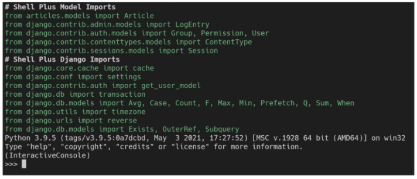

# 03.19

## Django 02

Model

<br>

[TOC]

<br>

### Model

1. **Model**	

   `"웹 애플리케이션의 데이터를 구조화하고 조작하기 위한 도구"`

   model은 여러가지로 정의할 수 있다. 데이터들의 집합(사용자가 저장하는 데이터들의 필수 필드와 동작들을 포함), 저장된 데이터베이스의구조(layout), 각각의 model은 하나의 데이터베이스 테이블에 매핑 되므로 태이블이라고 생각하면 쉽다. django는 model을 통해 데이터에 쉽게 접근하고 관리한다.

2. **Database**

   * **데이터베이스(DB)** : 체계화된 데이터의 모임

   * **쿼리(Query)** : 데이터를 조회하기 위한 **명령어**. 조건에 맞는 데어터를 추출하거나 조작하는 명령어이다. 

     "Query를 날린다." == DB를 조작한다.

   * **스키마(Schema)** : 데이터베이스에서 자료의 구조, 표현방법, 관계 등에 관련된 전반적인 명세를 기술한 것

     | column | datatype |
     | :----: | :------: |
     |   id   |   INT    |
     |  age   |   INT    |
     | phone  |   TEXT   |

   * **테이블(Table)** : 열(column, 필드, 속성)과 행(row, 레코드, 튜플)으로 구성되어 있다. SQL 데이터 베이스에서는 테이블을 관계 라고도 한다. 

   * **기본키(PK)** : 각 행(레코드)의 고유값으로 Primary Key로 불린다. 반드시 설정하여야 하며, 데이터베이스 관리 및 관계 설정시 주요하게 활용된다.

<br>

### ORM

1. **ORM(Object-Relational_Mapping)** : 객체 지향 프로그래밍 언어를 사용하여 호환되지 않는 유형의 시스템 간에 데이터를 변환하는 프로그래밍 기술이다. 

   `Django <---(ORM)---> SQL`

   OOP 프로그래밍에서 RDBMS를 연동할 때, 데이터베이스와 객체 지향 프로그래밍 언어 간의 호환되지 않는 데이터를 변환하는 프로그래밍 기법

   Django는 내장되어 있는 Django ORM을 사용한다. 

2. ORM의 장점과 단점

   * 장점 : SQL을 잘 알지 못해도 DB 조작이 가능하다. SQL의 절차적 접근이 아닌 객체 지향적 접근으로 인하나 높은 생산성을 보인다. 
   * 단점 : ORM 만으로 완전한 서비스를 구현하기 어려운 경우가 있다. 

   :red_circle:현대 웹 프레임워크의 요점은 웹 개발의 속도를 높이는 것이다.(생산성을 높이는 것)

3. ORM을 사용하는 이유?

   * DM는 절차 지향적이기 때문에 객체(object)로 조작하기 위해 ORM을 사용한다. 

4. `models.py` 작성

   ```python
   class people(models.Model):
   	name = models.CharField(max_length=10)
       order = models.TextField()
   ```

   각 모델은 `django.models.Model` 클래스의 서브 클래스로 표현된다. `django.db.models` 모듈의 `Model` 클래스를 상속 받는다. 'name'과 'order'은 모델의 필드를 나타낸다. 

   * `CharField(max_length=10)`은 길이 제한이 있는 문자열을 넣을 때 사용한다. 이때 max_length는 필수 인자로 들어가야 한다. 데이터베이스 레벨과 Django의 유효성 검사(값을 검증하는 것)에서 활용한다.

   * `TextField()` 는 글자수가 많을 때 사용한다. 

   

<br>

### Migrations

* Django가 **model에 생긴 변화를 반영하는 방법**이다. 네가지의 명령어가 있다. 

  1. **makemigrations** : model을 변경한 것에 기반한 새로운 _마이그레이션(= 설계도)_ 을 만들때 사용

     ```bash
     $ python manage.py makemigrations
     ```

     'migrations/0001_initial.py'이 생성된다. 

  2. **migrate** : 마이그레이션을 DB에 반영하기 위해 사용한다. 설계도를 실제 DB에 반영하는 과정. 

     ```bash
     $ python manage.py migrate
     ```

     '0001_initial.py'설계도를 실제 DB에 반영한다.

  3. **sqlmigrate** : 마이그레이션에 대한 SQL 구문을 보기 위해서 사용한다. 마이그레이션이 SQL 문으로 어떻게 해석되어 동작할지 미리 확인 할 수 있다. 

     ```bash
     $ python manage.py sqlmigrate app_name 0001
     ```

     해당 migrations 설계도가 SQL 문으로 어떻게 해석되어 동작할지 미리 확인할 수 있다. 

  4. **showmigrations** : 프로젝트 전체의 마이그레이션 상태를 확인하기 위해서 사용한다. 마이그레이션 파일들이 migrate 됐는지 안됐는지 여부를 확인 할 수 있다. 

     ```bash
     $ python manage.py showmigrations
     ```

     migrations 설계도들이 migrate 됐는지 안됐는지 여부를 확인 할 수 있다. 

  :small_red_triangle_down: 추가 모델을 필드에 작성하고 나면 반드시 `migrations`와 `migrate`를 진행해야 한다!

  ```python
  class people(models.Model):
  	name = models.CharField(max_length=10)
      order = models.TextField()
      created_at = models.DateTimeField(auto_now_add=True)    ---(1)
      updated_at = models.DateTimeField(auto_now=True)        ---(2)
  ```

  (1), (2) 작성후 `makemigrations`진행하기!!

  ```tex
  created_at 필드에 대한 default 값 설정 -> 1 입력 후 enter
  timezone.now 함수 값 자동 설정 -> 빈 값 상태에서 enter -> migrate를 통해 models.py 수정사항 반영
  ```

  * **auto_now_add** : 최초 생성 일자. 테이블에 어떤 값을 최초로 넣을 때의 날짜와 시간으로 갱신한다. 
  * **auto_now** : 최종 수정일자. Djagno ORM이 save를 할 때마다 현재 날짜와 시간으로 갱신한다. 
  * DateTimeField는 DataField의 서브 클래스이다. 

* 반드시 기억해야 할 단계

  1. `models.py` -> model 변경사항 기록하기
  2. `$ python manage.py makemigrations` -> migrations 파일 생성
  3. `$ python manage.py migrate` -> DB에 반영(모델과 DB의 동화)

<br>

<br>

### Database API

* **DB API**는 DB를 조작하기 위한 도구이다. Django가 기본적인 ORM을 제공함에 따른 것으로 DB를 편하게 조작할 수 있도록 돕는다. 

  Model을 만들면 Django는 객체들을 만들고 읽고 수정하고 지울 수 있는 database-abstract API를 자동으로 만든다. database-abstract API 혹은 database-access API 라고도 한다. 

  <Making Queries>

  ```shell
  Article.objects.all()
  ```

  * Article : Class Name
  * objects : manager
  * all() : QuerySet API

  1. **Manager** : Django 모델에 데이터베이스 query 작업이 제공되는 인터페이스이다. 기본적으로 모든 Django 모델 클래스에 objects라는 Manager를 추가
  2. **QuerySet** : 데이터베이스로부터 전달받은 객체 목록이다. queryset 안의 객체는 0개, 1개 혹은 여러 개 일 수 있다. 데이터베이스로부터 조회, 필터, 정렬 등을 수행할 수 있다. 

* **Django shell** : 일반 python shell을 통해서는 장고 프로젝트 환경에 접근할 수 없다. 그래서 장고 프로젝트 설정이 load된 python shell을 활용해 DB API 구문 테스트를 진행한다. 

  ```bash
  $ pip install ipython
  $ pip install django-extenstions
  ```

  설치 후 입을 등록하여야 사용할 수 있다. 

  ```python
  # settings.py
  
  INSTALLED_APPS = [
      ...,
      'django-extionesion',
      ...,
  ]
  ```

  ```bash
  $ python manage.py shell_plus
  
  # 밑에 앱 실행 화면 이 곳에서 읽고, 쓰고, 지우고, 변경하고가 가능하다. 
  ```

  

<br>

### :red_circle:CRUD  

* 대부분의 컴퓨터 소프트웨어가 가지는 기본적인 데이터 처리 기능인 Create(생성), Read(읽기), Update(갱신), Delete(삭제)를 묶어서 일컫는 말이다. 

#### 1. READ

DB를 조작하기 위해(DB에 인스턴스 객체를 얻기 위해) 쿼리문을 날린다. 이때, 레코드가 하나만 있으면 인스턴스 객체로, 두 개 이상이면 쿼리 셋으로 리턴한다.

* **all()**	

  현재 QuerySet의 복사본을 반환한다. 

  ```python
  >>> Article.objects.all()
  <QuerySet []>
  <QuerySet [<Article: Article object (1)>, <Article: Article object (2)>]>
  ```

* **get()**

  괄호에 주어진 lookup 매개변수와 일치하는 객체를 반환한다. 객체를 찾을 수 없다면 'DoesNotExist' 예외를 발생시키고, 둘 이상의 객체를 찾으면 'MultipleObjectsReturned' 예외를 발생시킨다. **고유성을 보장하는 조회에서만 사용해야한다!!!**

  ```python
  >>> article = Article.objects.get(pk=100)
  DoesNotExist = ...
  
  >> article = Article.objects.get(content = 'django!')
  MultipleObjectsReturned = ...
  ```

* **filter**

  주어진 Lookup 매개변수와 일치하는 객체를 포함하는 새 QuerySet을 반환한다. 

  ```python
  >>> Article.objects.filter(content='django!')
  <QuerySet [<Article: first>, <Article: third>]>
  
  >>> Article.objects.filter(title='first')
  <QuerySet [<Article: first>]>
  ```

#### 2. CREAT

:red_circle: **CREAT**에는 세 가지 방법이 있다. 

1. 인스턴스 생성 후 인스턴스 변수 설정하기

   ```python
   (1) 인스턴스 생성하기
   
   >>> article = Article()      
   >>> article
   <Article: Article object (None)>
   
   (2) 변수 설정하고 값을 할당
   
   >>> article.title = 'first'  # 인스턴스 변수(title)에 값을 할당
   >>> article.content = 'django'  # 인스턴스 변수(content)에 값을 할당
   >>> article.save()
   >>> article 
   <Article: Article object (1)>
   >>> Article.objects.all()
   <QuerySet [Article: Article object (1)]>
   ```

2. 인스턴스와 변수를 함께 설정하기

   ```python
   article = Article(title='title', content='content')
   
   >>> article
   <Article: Article object (None)> 
   # 아직 저장이 안되어 있음!! save를 하지 않았기 때문에
   
   >>> article.save()
   >>> article
   <Article: Article object (2)>
   >>> Article.objects.all()
   <QuerySet [<Article: Article object (1)>, <Article: Article object (2)>]>
   
   >>> article.pk
   2
   ```

3. QuerySet API - create() 사용하기 ---- all()이 아님에 주의!!

   ```python
   # 위의 방식과는 다르게 바로 쿼리 표현식을 리턴. save하지 않아도 됨
   
   >>> Article.objects.create(title='title', content='content')
   <Article: Article object (3)>
   ```

* **save()**는 객체를 데이터베이스를 저장한다. 데이터 생성 시 save()를 호출하기 전에는 객체의 ID값이 무엇인지 알 수 없다. ID 값은 Django가 아니라 DB에서 계산되기 때문이다. 단순히 모델을 인스턴스화 하는 것은 DB에 영향을 미치지 않기 때문에 반드시 save()가 필요하다. 

* **str method**

  ```python
  def __str__(self):
      return self.title
  ```

  표준 파이썬 클래스의 메소드인 str()을 정의하여 각각의 object가 사람이 읽을 수 있는 문자열을 반환(return)하도록 할 수 있다. 작성 후 반드시 shell_plus를 재 시작해야 반영 된다. 

#### 3. UPDATE

* article 인스턴스 객체의 인스턴스 변수의 값을 변경 후 저장

  ```python
  >>> article = Article.objects.get(pk=1)
  >>> article.title
  'first'
  
  # 값을 변경하고 저장
  >>> article.title = 'byebye'
  >>> article.save()
  
  # 변경된 것을 확인
  >>> artielc.title
  'byebye'
  ```

#### 4. DELETE

* **delete()**

  QuerySet의 모든 행에 대해 SQL 삭제 쿼리를 수행하고, 삭제된 객체 수와 객체 유형당 삭제 수가 포함된 딕셔너리를 반환한다. 

  ```python
  >>> article = Article.objects.get(pk=1)
  
  # 삭제
  >>> article.delete()
  (1, {'articles.Article': 1})
  
  # 1번은 이제 찾을 수 없음
  >>> Article.objects.get(pk=1)
  DoesNotExist = ...
  ```

<br>

- Field lookup : 조회 시 특정 검색 조건을 지정한다. QuerySet 메서드 filter(), get(), exclude()에 대한 키워드 인수로 지정된다. 

<br>

### Admin Site

1. **Automatic admin interface**

   사용자가 아닌 서버의 관리자가 활용하기 위한 페이지이다. model class를 admin.py에 등록하고 관리한다. 레코드 생성 여부 확인에 매우 유용하며, 직접 레코드를 삽입할 수도 있다. 

2. **admin 생성**

   ```bash
   $ python manage.py createsuperuser
   ```

   관리자 계성 생성 후 서버를 실행한 다음 '/admin'으로 가서 관리자 페이지 로그인한다.

3. **admin 등록**

   admin.py는 관리자 사이트에 Article 객체가 관리가 인터페이스를 가지고 있다는 것을 알려준다. 

   ```python
   from django.contrib import admin
   from .models import Article
   
   class ArticleAdmin(admin.ModelAdmin):
       list_display = ('pk', 'title', 'content', 'created_at', 'updated_at')
   
   # admin site에 register 하겠다. 
   admin.site.register(Article, ArticleAdmin)
   ```

   'list_display'는 models.py에서 정의한 각각의 속성(컬럼)들의 값(레코드)을 admin 페이지에 출력하도록 설정

<br>

<br>
