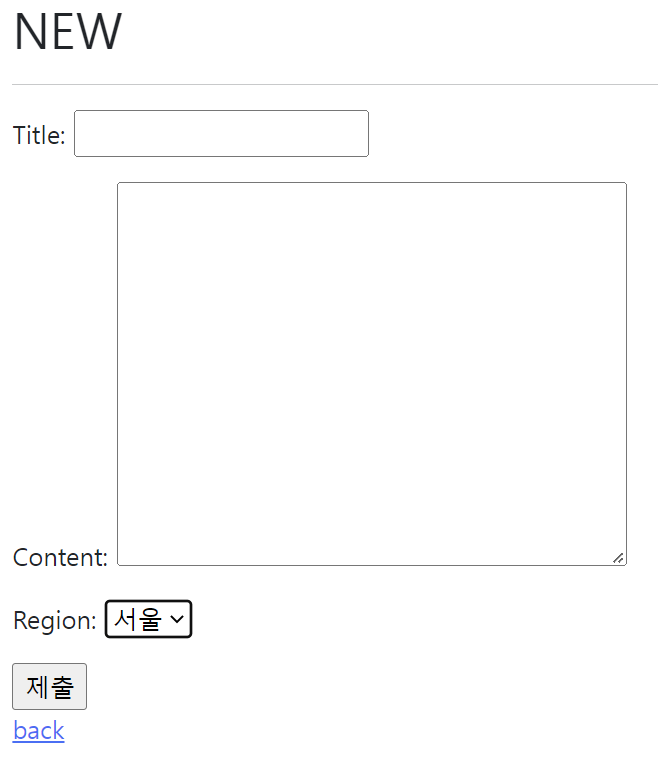

# 04.06

## Django 03_Form/Model Form

<br>

[TOC]

<br>

---

### 0. Model Review

* Model
* Database(데이터베이스) : 체계화된 데이터의 모임
* Query(쿼리) : 데이터를 조회하기 위한 명령어

* Migrations

  1. makemigration
  2. migrate
  3. sqlmigrate
  4. showmigrations

* Database API 

  1. `Article.objects.all()`

* CRUD

  1. Read 

     `Article.objects.all()` : 모두 반환

     `Article.objects.get()` : 주어진 lookup 매개변수와 일치하는 객체를 반환

  2. Create

     ```sql
     >>> article = Article(title='first', content='django')
     >>> article.save()
     
     >>> Article.objects.create(title='second', content='django2')
     
     >>> Article.objects.all()
     <QuerySet [<Article: Article object(1)>,<Article: Article object(2)>]>
     ```

     ```tex
     Field lookups
     
     1. filter(pk__gt=2)
     2. filter(content__contains='ja')
     ```

  3. update

     ```sqlite
     >>> article = Article.objects.get(pk = 1)  # 조회 먼저하기!
     >>> article.title = 'title_2'
     ```

  4. Delete

     ```sqlite
     >>> article = Article.objects.get(pk = 1)
     >>> article.delete()
     ```

* Redirect

  ```python
  return redirect('articles:detail', article.pk)
  
  # redirect는 서버로 재요청을 보내주는 역할을 한다.
  ```

---

<br>

### 1. Form Class

* 우리는 지금까지 HTML form, input을 통해서 사용자로부터 데이터를 받았다. 사용자가 입력한 데이터를 검증하는 '유효성 검증'을 해야한다.(사용자가 입력한 데이터는 개발자가 요구한 형식이 아닐 수도 있음을 항상 생각해야 한다.) Django는 `django form`을 통해 이런 과중한 작업과 반복 코드를 줄여줌으로서 이 작업을 훨씬 쉽게 만들어 준다.

* **Django's forms** 

  form은 django의 유효성 검사 도구 중 하나로 외부의 악의적 공격 및 데이터 손상에 대한 중요한 방어 수단이다. form과 관련한 유효성 검사를 단순화 하고 자동화 할 수 있는 기능을 제공하여 개발자로 하여금 직접 작성하는 코드보다 더 안전하고 빠르게 수행하는 코드를 작성할 수 있게 한다. 

  1. 렌더링을 위한 데이터 준비 및 재구성
  2. 데이터에 대한 HTML forms 생성
  3. 클라이언트로부터 받은 데이터 수신 및 처리

* **The Django 'form class'**

  form내 field, field 배치, 디스플레이 widget 등 유효하지 않는 field에 관련된 에러메시지를 결정한다. Django는 사용자의 데이터를 받을 때 해야 할 과중한 작업과 반복 코드를 줄여 준다.

  <br>

#### 1. Form 선언하기

Model을 선언하는 것과 유사하며 같은 필드타입을 사용한다. forms 라이브러리에서 파생된 Form 클래스를 상속받는다. `forms.py`를 새로 생성하여 작성한다. 

`forms.py` 파일의 위치는 어느 위치에 있어도 상관 없지만 되도록 `app폴더/forms.py`에 작성하는 것이 일반적인 구조이다. 

```python
# articles/forms.py

from django import forms

class ArticleForm(forms.Form):
    title = forms.CharField(max_length=10)
    content = forms.CharField(widget=forms.Textarea)
```

#### 2. Form 사용하기

```python
# articles/views.py

from .forms import ArticleForm

def new(request):
    form = ArticleForm()
    context = {
        'form': form,
    }
    return render(request, 'articles/new.html', context)
```

```django
<!-- news.html -->

{{ form.as_p }}
```

1. `as_p()` : 각 필드가 단락(<p> 태그)으로 감싸져서 렌더링 됨. 줄바꿈 됨
2. `as_ul()` : 각 필드가 목록 항목 (<li> 태그)으로 감싸져서 렌더링 됨. <ul> 태그는 직접 작성해야 함.
3. `as_table()` : 각 필드가 테이블(<tr> 태그) 행으로 감싸져서 렌더링 됨. <table> 태그는 직접 작성해야 함.

<br>

* Django의 HTML input 요소 표현 방법 2가지

  ```tex
  1. form fields
  input에 대한 유효성 검사 로직을 처리하며 템플릿에서 직접 사용 됨
  
  2. Widgets
  웹 페이지의 HTML input 요소 렌더링
  GET/POST 딕셔너리에서 데이터 추출
  widgets은 반드시 Forms fields에 할당 됨
  * Form Fields와 혼동되어서는 안됨
  * Form Fields는 input 유효성 검사를 처리
  * Widgets은 웹페이지에서 input element의 단순 raw한 렌더링 처리 
  * Widgets은 유효성 검사와는 관련 없다. 
  ```

  ```python
  # articles/forms.py
  # Form field 및 widget 응용
  
  from django import forms
  
  class ArticleForm(forms.Form):
      REGION_A = 'sl'
      REGION_B = 'dj'
      REGION_C = 'gj'
      REGION_D = 'gm'
      REGION_E = 'bu'
      REGION_CHOICES = [
          (REGION_A, '서울'),
          (REGION_B, '대전'),
          (REGION_C, '광주'),
          (REGION_D, '구미'),
          (REGION_E, '부산'),
  
      ]
      
      title = forms.CharField(max_length=10, widget=forms.Textinput)
      content = forms.CharField(widget=forms.Textarea)
  	region = forms.ChoiceField(choices=REGION_CHOICES, widget=forms.Select())
  ```

  

---

<br>

### 2. :star:Model Form

* django form을 사용하다보면 model에 정의한 필드를 유저로 부터 입력 받기 위해 form에서 model 필드를 재정의하는 행위가 중복 될 수 있다. 

* 그래서 django는 model을 통해 form class를 만들 수 있는 `ModelForm`이라는 Helper를 제공한다. 

* **ModelForm Class**

  model을 통해 Form Class를 만들 수 있는 Helper이다. 일반 Form Class와 완전히 같은 방식(객체 생성)으로 view에서 사용 가능하다. 

  <br>

#### 1. ModelForm 선언하기

```python
# articles/forms.py
from django import forms
from .models import Article

class ArticleForm(forms.ModelForm):

    class Meta:
        model = Article
        fields = '__all__'
        # exclude = ('title',)
        # 클래스 변수인 fields와 exclude는 동시에 사용할 수 없다. 
```

:small_red_triangle_down: Meta class : Model의 정보를 작성하는 곳이다. ModelForm을 사용할 경우 사용할 모델이 있어야 하는데 Meta class가 이를 구성한다. 해당 Model에 정의한 field 정보를 Form에 적용하기 위함이다. Meta 데이터는 `데이터에 대한 데이터`이다. (ex. 사진 촬영 - 사진데이터 - 사진의 메타 데이터(촬영 시각, 렌즈, 조리개 값 등))

#### 2. Create view 수정하기

* new 함수 삭제
* new path 삭제
* `new.html`을 `create.html`로 변경 

```python
# articles/views.py

def create(request):
    form = ArticleForm(request.POST)
    if form.is_valid():  # 유효성 검사를 통과했을 경우 detail
        article = form.save()
        return redirect('articles:detail', article.pk)
    return redirect('articles:new')  
	# ex) 제목이 10자 이상이어서 유효성 검사를 통과하지 못했다면 new로 다시돌아감!! 유효성 검사에 맞도록 다시 작성하기
```

:small_red_triangle_down: `is_valid()` method : 유효성 검사를 실행하고, 데이터가 유효한지 여부를 boolean으로 반환한다. 데이터 유효성 검사를 보장하기 위한 많은 테스트에 대해 Django는 is_Valid()를 제공한다. 

유효성 검사 : 요청한 데이터가 특정 조건에 충족하는지 확인하는 작업이다. 데이터베이스 각 필드 조건에 올바르지 않은 데이터가 서버로 전송되거나 저장되지 않도록 한다. 

:small_red_triangle_down: The `save()` method : form에 바인딩 된 데이터에서 데이터베이스 객체를 반들고 저장한다. ModelForm의 하위 클래스는 기존 모델 인스턴스를 키워드 인자 instance로 받아 들일 수 있다. Form의 유효성이 확인되지 않은 경우(유효성 검사를 통과하지 못하면 `form.errors`를 확인하여 에러 확인 가능하다. )

```bash
form = ArticleForm(request.POST, instance=article)
form.save()
# instance 있으면 update/ instance 없으면 create
```

현재는 create를 위해서 `new`와 `create` 함수 두가지를 사용하고 있다. 하지만 하나로 만들기 위해 `views.py`를 대폭 수정한다. 

```python
# articles/views.py

def create(request):
    if request.method == 'POST':
    	form = ArticleForm(request.POST)
    	if form.is_valid():  # 유효성 검사
        	article = form.save()
        return redirect('articles:detail', article.pk)
    
    else: 
        form = ArticleForm()
    context = {
        'form': form,
    }  # if문 안의 if문을 통과하지 못한경우 context로 넘어옴
    return render(request, 'articles/create.html', context)
    
```

#### 3. Update view 수정하기

`edit`와 `update`를 하나의 함수로 사용해 주기 위해 수정한다. 

* edit path와 edit view 함수를 삭제한다. 
* edit.html을 update.html로 변경!!

```python
# articles/views.py

def update(request, pk):
    # 기존의 글을 수정하는 것 이므로 article을 사용한다. 
    article = Articls.objects.get(pk=pk)  # 조회
    if request.method == 'POST':
        form = ArticleForm(request.POST, instance=article)
        if form.is_valid():
            form.save()
            return redirect('articles:detail', article.pk)
    else:
        form = ArticleForm(instance=article)
    context = {
        'form': form,
        'article': article,
    }
    return render(request, 'articles/update.html', context)
```

#### 4. Delete view 수정하기

```python
def delete(request, pk):
    # 기존의 글을 삭제하는 것 이므로 form 대신 article을 사용한다. 
    article = Article.objects.get(pk=pk)
    if request.method == 'POST':
        article.delete()
        return redirect('articles:index')

    return redirect('articles:detail', article.pk)
```

#### 5. Widgets 활용하기(권장x)

```python
# articles/forms.py
from .models import Article

(1)
class ArticleForm(forms.ModelForm):

    class Meta:
        model = Article
        fieldds = '__all__'
        widgets = {
            'title': forms.TextInput(attrs={
                'class':'my-title', 
                'placeholder' : 'Enter the title', 
                'maxlength': 10,
            	}
            )
        }
        
(2)
class ArticleForm(forms.ModelForm):
	"""
	title = forms.CharField(
        widgets = {
                'title': forms.TextInput(attrs={
                    'class':'my-title', 
                    'placeholder' : 'Enter the title', 
                    'maxlength': 10,
                    }
                )
            }
    )
	"""
    # widget을 쓰기 위해선 modelform이어도 써주어야 한다. 
    
    class Meta:
        model = Article
        fieldds = '__all__'

```

#### 6. Form & ModelForm 비교

| From                                                         | ModelForm                                                    |
| ------------------------------------------------------------ | ------------------------------------------------------------ |
| 어떤 Model에 저장해야 하는지 알 수 없으므로 유효성 검사 이후 cleaned_data 딕셔너리를 생성 | Django가 해당 model에서 양식에 필요한 대부분의 정보를 이미 정의 |
| cleande_data 딕셔너리에서 데이터를 가져온 후 .save() 호출해야 함 | 어떤 레코드를 만들어야 할 지 알고 있으므로 바로 .save()하면 된다. |
| model에 연관되지 않은 데이터를 받을 때 사용                  |                                                              |


<br>

### 3. Rendering field manually

1. 수동으로 From 작성하기

   * Rendering fields manually

     ```django
     <!-- articles/create.html -->
     
     ...
     
     <div>
       {{ form.title.errors }}
       {{ form.title.label_tag }}
       {{ form.title }}
     </div>
     <div>
       {{ form.content.errors }}
       {{ form.content.label_tag }}
       {{ form.content }}
     </div>
     ...
     ```

   * Looping over the form's fields

     ```django
     ...
     
     
         {{ form.title.errors }}
         {{ form.title.label_tag }}
         {{ form.title }}
     
     ...
     ```

2. Bootstrap과 함께 사용하기

   * widget에 작성

     Bootstrap Form의 핵심 class를 widget에 작성 - `form-control`

     ```python
     ...
     title = forms.CharField(
     	label = '제목', 
         widget = forms.TextInput(
         	attrs={  
                 'class': 'my-title form-control',
                 'placeholder' : 'Enter the title',
             }
         ),
     )
     ...
     ```
   
     에러 메시지 with bootstrap alert 컴포넌트
   
     ```django
     
       
         <div class='alert alert-warning'>{{ error|escape }}</div>
       
     
     ```
   
   * 외부 라이브러리 사용하기
   
     ```bash
     $ pip install django-bootstrap-v5
     ```
     
     ```python
     # settings.py
     
     INSTALLED_APPS = [
         ...
         'bootstrap5',
     	...    
     ]
     ```
     
     ```bash
     $ pip freeze > requirements.txt
     # 패키지 목록 업데이트
     ```
     
     ```django
     <!-- base.html -->
     
     
     <head>
       ...
           
       ...
     </head>
     <body>
       ...
       
       ...
     </body>
     ```
     
     ```django
     <!-- article/update.html -->
     
     
     
     
     
         ...
     	
     	
     	...
     
     ```
     
     


