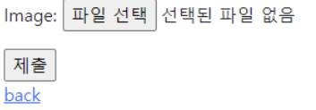

# 04.08

## PJT06

[TOC]

<br>

---

### 1. Handling HTTP requests

* django에서 HTTP 요청을 처리하는 방법

  <br>

#### 1. Django shortcut functions

django.shortcut 패키지는 개발에 도움 될 수 있는 여러 함수와 클래스를 제공한다. 1과 2의 경우 `views.py`에서 항상 사용하고 있었다. 

```tex
1. render()
2. redirect()
3. get_object_or_404()
4. get_list_or_404()
```

1. **get_object_or_404()**

   모델 manager인 objects에서 get()을 호출하여 해당 객체가 없거나 두개 이상이라면 예외를 호출하는데 `get_object_or_404()`는 `http 404`를 발생시킨다. 

   get()에 경우 조건에 맞는 데이터가 없을 경우에 예외를 발생시킨다. 코드 실행 단계에서 발생한 예외 및 에러에 대해서 브라우저는 500으로 인식한다. 

   상황에 따라 적절한 예외처리를 하고 클라이언트에게 올바른 에러 상황을 전달하는것 또한 개발의 중요한 요소 중 하나이다. 

   ```python
   # get_object_or_404() 사용 전
   500 에러 발생 
   
   # get_object_or_404() 사용 후 
   404 에러 발생
   ```

   ```python
   from django.shortsuts import render,redirect, get_object_or_404
   
   article = get_object_or_404(artielc, pk=pk)
   ```

   `detail`, `update`, `delete` 함수에서 필요하다. 

   만약 `get_object_or_404()`사용하지 않는다면 `try - except`구문으로 예외를 발생 시켜야 한다. 

2. **get_list_or_404()**

   전체 조회를 할 때 사용한다. 

   ```python
   from django.shortsuts import render,redirect, get_object_or_404, get_list_or_404
   
   article = get_list_or_404(Article)
   ```

#### 2. view decorators

어떤 함수에 기능을 추가하고 싶을 때, 해당 함수를 수정하지 않고 기능을 연장 해주는 함수이다. 즉, 원본 함수를 수정하지 않으면서 추가 기능만을 구현할 때 사용한다. 

```python
from django.views.decorators.http import require_http_methods, require_POST, require_safe
```

1. **Allowed HTTP methods**

   요청 메서드(GET, POST)에 따라 view 함수에 대한 엑세스를 제한 한다. 요청이 조건을 충족시키지 못하면 405(Method Not Allowed)를 return한다. 

   * require_http_methods() - 여러개 추가 가능

     view 함수가 특정한 mothod 요청에 대해서만 허용하도록 하는 데코레이터

     ```python
     @require_http_method(['GET', 'POST'])
     def create(request):
     	if request.method == 'POST':  # POST로 들어올 때만
             pass
         else:  # GET으로 들어올 때만 
             pass
         # POST와 GET이 아닐 때는 405 errer를 출력해줌
         
         
     @require_http_method(['GET', 'POST'])   
     def update()
     	if request.method == 'POST':  # POST로 들어올 때만
             pass
         else:  # GET으로 들어올 때만 
             pass
         # POST와 GET이 아닐 때는 405 errer를 출력해줌
     ```

   * require_post() - delete

     view 함수가 POST method 요청만 승인하도록 하는 데코레이터

     ```python
     @require_POST
     def delete(request, pk):
         article = get_object_or_404(Article, pk=pk)
         article.delete()
         return redirect('articles:index')
     ```

   * require_safe() - index, detail

     view 함수가 GET 및 HEAD method만 허용하도록 요구하는 데코레이터

     ```python
     @require_safe
     def index(request):
         pass
     
     @require_safe
     def detail(request, pk):
         pass
     ```

     

---

### 2. Media files

Media file은 사용자가 웹에서 업로드 하는 정적 파일(user-uploaded)이다. 유저가 업로드 한 모든 정적 파일이다.

1. **ImageField()**

   이미지 업로드에 사용하는 모델 필드

   filefield를 상속 받는 서브 클래스이다. 사용자에 의해 업로드 된 객체가 유효한 이미지인지 검사한다.

   ImageField 인스턴스는 *최대 길이가 100자*인 문자열로 DB에 생성되며, max_length 인자를 사용하여 최대 길이를 변경할 수 있다. 

2. **FileField()**

   파일 업로드에 사용하는 모델 필드

   2개의 선택인자를 가지고 있음 (upload_to, storage)

```python
# articles/models.py

class Article(models.Model):
    title = models.CharField(max_length=10)
    content = models.TextField()
    image = models.ImageField(upload_to='images/', blank=True)
    created_at = models.DateTimeField(auto_now_add=True)
    updated_at = models.DateTimeField(auto_now=True)
```

* `blank=True`

  이미지 필드에 빈 값도 허용하도록 한다. 유효성 검사에서 사용되는데, 빈 값을 입력할 수 있게 된다.(`is_valid`)

* `null`

  기본 값은 False이다. True인 경우 django는 빈 값에 대해 DB에 NULL로 저장한다.

  CharField, TextField와 같은 `문자열 기반 필드`에는 사용하는 것을 피해야 한다. 문자열 기반 필드에 True로 설정시 '데이터 없음'에 빈문자열과 NULL의 2가지 가능한 값이 있음을 의미하게 된다. 대부분의 경우 '데이터 없음'에 대해 두 개의 가능한 값을 갖는 것은 중복되는 것이며, Duango는 NULL이 아닌 빈 문자열을 사용하는 것이 규칙이다.

* `upload_to` : 업로드 디렉토리와 파일 이름을 상징하는 2가지 방법을 제공 

  	1. 문자열 값이나 경로 지정
  	
  	```python
  	upload = models.ImageField(upload_to='uploads/%y/%m/%d/', blank=True)
  	```
  
   2. 함수 호출

      이미지 파일을 체계적으로 관리하고 싶을 때 사용한다.

      ```python
      return f'image_{instance.pk}/{filename}'
      ```

      

:red_circle: ImageField (or FileField)를 사용하기 위한 몇 가지 단계

1. settings.py에 MEDIA_ROOT, MEDIA_URL 설정
2. upload_to 속성을 정의하여 업로드 된 파일에 사용할 MEDIA_ROOT의 하위 경로를 지정
3. 업로드 된 파일의 경로는 django가 제공한는 'url' 속성을 통해 얻을 수 있다. 

---

#### 0. 기본 셋팅

0. **Model.py**에 `image = models.ImageField(upload_to='images/', blank=True)`먼저 작성

1. **MEDIA_ROOT**

   사용자가 업로드 한 파일들을 보관할 디렉토리의 절대 경로 

   ```python
   # settings.py
   
   MEDIA_ROOT = BASE_DIR/'media'
   MEDIA_URL = '/media/'
   ```

2. **MEDIA_URL**

   실제로 존재하는 것이 아니라 url만 존재한다. 

3. 개발 단계에서 사용자가 업로드 한 파일 제공하기

   ```python
   # crud/urls.py
   
   from django.conf import settings
   from django.conf.urls.static import static
   
   urlpatterns = [
       
   ] + static(settings.MEDIA_URL, document_root=settings.MEDIA_ROOT)
   ```

4. 마이그레이션 하기

   ```bash
   $ pip install Pillow
   ```

   ```bash
   $ pip freeze > requirements.txt
   ```

   ```bash
   $ python manage.py makemigrations
   ```

   ```bash
   $ python manage.py migrate
   ```

<br>

#### 1. image Upload

:seedling: **CREATE**

1. form 태그 

   * `multipart/form-data` : 파일/이미지 업로드 시에 반드시 사용해야 한다. 전송되는 데이터의 형식을 지정해준다. 

     ```django
     <!-- create.html -->
     
     <form ... enctype="multipart/form-data">
     </form>
     ```

     

2. input 요소

   * `accept` 속성 : 입력을 허용할 파일 유형을 나타내는 문자열이다. 쉼표로 구분된 "고유 파일 유형 지정자"
   * 파일을 검증하는 것이 아니기 때문에 accept 속성 값이 image라고 하더라고 비디오나 오디오 및 다른 형식 파일을 제출 할 수 있다. 

3. `views.py` 수정

   ```python
   # views.py
   
   def create(request):
       # 새로운 값을 작성 하므로 form 사용
       if request.method == 'POST':  # 기존 create 함수
           form = ArticleForm(request.POST, request.FILES)
           if form.is_valid():  # 유효성 검사
               article = form.save()
           return redirect('articles:detail', article.pk)
       else:  # 기존 new 함수
           form = ArticleForm()
       content = {
           'form':form,
       }
       return render(request, 'articles/create.html', content)
   ```

4. DB 및 파일 트리 확인

   실제 파일 위치는 `MEDIA_ROOT/images/`에 저장된다. DB에 저장되는 것은 이미지 파일 자체가 아닌 파일의 경로이다. 

:seedling: **READ**

1. 이미지 경로 불러오기

   ```django
   <!-- detail.html -->
   
   
   ```

:seedling: **UPDATE**

1. 이미지 수정하기

   이미지는 바이너리 데이터(하나의 덩어리)이기 때문에 텍스트처럼 일부만 수정하는 것은 물가능 하다. 때문에 새로운 사진으로 덮어 씌우는 방식을 사용한다.

   ```django
   <!-- update.html -->
   
   <form ... enctype="multipart/form-data">
   </form>
   ```

   ```python
   def update(request, pk):
       # 기존의 값을 수정하므로 article 사용
       article = Article.objects.get(pk=pk)
       if request.method == 'POST':  # 기본 update 함수
           form = ArticleForm(request.POST, request.Files, instance=article)
           if form.is_valid():
               form.save()
               return redirect('articles:detail', article.pk)
       else:  # 기존 edit 함수
           form = ArticleForm(instance=article)
       content = {
           'form': form,
           'article': article,
       }
       return render(request, 'articles/update.html', content)
   ```

   ```django
   <!-- detail.html -->
   <!-- 이미지가 있을 경우에만 이라는 의미로 if 사용 -->
   
     
     
   
   ```

#### 2. image Resizing

1. 이미지 크기 변경하기

   실제 원본 이미지를 서버에 그대로 업로드 하는 것은 서버의 부담이 큰 작업이다.  태그에서 직접 사이즈를 조정할 수 있지만(width와 heigh 속성 사용), 업로드 될 때 이미지 자체를 resizing 하는 것을 고려한다. 이미지 사이즈를 resizing 한 후 저장한다. 

   ```bash
   $ pip install django-imagekit
   $ pip freeze > requirements.txt
   ```

   ```python
   # settings.py
   
   INSTALLED_APP = [
       ...,
       'Imagekit',
       ...
       
   ]
   ```

   * 원본 이미지를 재가공하여 저장(원본x, 썸네일o)

   ```python
   # models.py
   from imagekit.processors import Thumbnail
   from imagekit.models import ProcessedImageField
   from django.db import models
   
   class Article(models.Model):
       title = models.CharField(max_length=10)
       content = models.TextField()
       image = ProcessedImageField(
       	blank = True,
           upload_to='thumbnail/',
           processors=[Thumbnail(200,300)],
           format='JPEG',
           options={'quality':90}, 
       )
       created_at = models.DateTimeField(auto_now_add=True)
       updated_at = models.DateTimeField(auto_now=True)
   ```

   ProcessedImageField()의 parameter로 작성된 값들은 변경하더라도 다시 makemigrations를 해줄 필요 없이 즉시 반영된다. 

   ```bash
   $ python manage.py makemigrations
   $ python manage.py migrate
   ```

   * 원본 이미지를 재가공하여 저장(원본o, 썸네일o)

   ```python
   # models.py
   from imagekit.processors import Thumbnail
   from imagekit.models import ProcessedImageField, ImageSpecField
   from django.db import models
   
   class Article(models.Model):
       title = models.CharField(max_length=10)
       content = models.TextField()
       image = models.ImageField(upload_to='images/', blank=True)
       image_thumbnail = ImageSpecField(
       	source='image',  # 원본 ImageField 명
           processors=[Thumbnail(200,300)],
           format='JPEG',
           options={'quality':90}, 
       )
       created_at = models.DateTimeField(auto_now_add=True)
       updated_at = models.DateTimeField(auto_now=True)
   ```

   ```bash
   $ python manage.py makemigrations
   $ python manage.py migrate
   ```

   ```django
   <!-- detail.html -->
   <!-- 이미지가 있을 경우에만 이라는 의미로 if 사용 -->
   
     
     
     
     
   
   ```

<br>

