# 04.25

## JS 기초

[TOC]

### 1. Intro

> :star: JavaScript의 필요성 
>
> * 브라우저 화면을 '동적'으로 만들기 위함
> * 브라우저를 조작할 수 있는 유일한 언어

<br>

#### 1. 브라우저(Browser)

> URL로 웹(WWW)을 탐색하며 서버와 통신하고, HTML 문서나 파일을 출력하는 GUI 기반의 소프트웨어이다. 
>
> 인터넷의 컨텐츠를 검색 및 열람하도록 한다.
>
> 웹 브라우저 라고도 함
>
> 주요 브라우저 : Google, Chrome, Mozilla, Firefox, Microsoft Edge, Opera, Safari 

[브라우저에서 할 수 있는 일]

1. **DOM(Document Object Model) 조작**

   * 문서(HTML) 조작, HTML, XML과 같은 문서를 프로그래밍 언어로 조작!

   * 문서가 객체(object)로 구조화되어 있으며 key로 접근이 가능하다.

   * **파씽** : 구문 분석, 해석(스트링형태의 input을 조작), *브라우저가 문자열을 해석하여 DOM Tree로 만드는 과정*이다.

     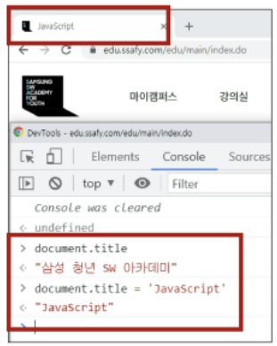

2. **BOM(Browser Object Model) 조작**

   * navigator, screen, location, frames, history, XHR
   * 자바스크립트가 브라우저와 소통하기 위한 모델이다.
   
   * 버튼, URL 입력창, 타이틀 바 등 브라우저 윈도우 및 웹 페이지 일부분을 제어 가능하다.
   
   * window는 브라우저 탭으로 접근이 가능하다. 
   
   ```javascript
   window.open()
   window.print()
   window.confirm()
   window.document()  // document도 브라우저 내에 종속되어 있기 때문에 window 전역 객체에 포함된다.
   ```
   
3.  **JavaScript Core (ECMAScript)**

   * 브라우저(BOM & DOM)을 조작하기 위한 명령어로 조작을 위해 ECMAScript(JS)를 학습한다.

   * Data Structure(object, Array), Conditional Expression, Iteration

   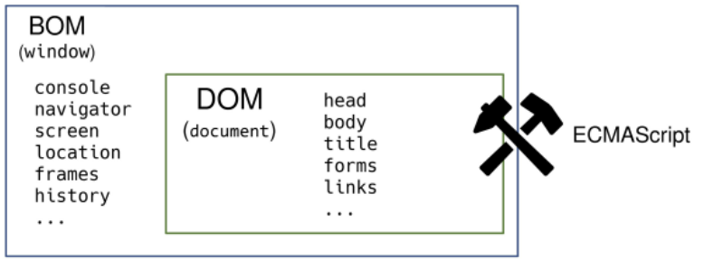


<br>

#### 2. ECMAScript

* ECMA(ECMA International) : 정보 통신에 대한 표준을 제정하는 비영리 표준화 기구이다.

* ECMAScript는 ECMA에서 ECMA-262 규격에 따라 정의한 언어이다.

#### 3. 세미콜론

* 자바스크립트는 세미콜론을 *선택적으로 사용*이 가능하다. 세미콜론이 없으면 ASI에 의해 자동으로 세미콜론이 삽입된다. 

#### 4. 코딩 스타일 가이드

* 절대적인 하나의 정답은 없으며, 상황에 맞게 원칙을 정하고 일관성 있게 사용하는 것이 중요하다.

<br>

### 2. 변수

#### 1. 식별자 정의와 특징

> * 식별자는 변수를 구분할 수 있는 변수명을 말한다.
> * 식별자는 반드시 문자, 달러($) 또는 밑줄(_)로 시작
> * 대소문자를 구분하며, 클래스명 외에는 모두 소문자로 시작
> * 예약어 사용 불가능 : for, if, function 등 불가능

```tex
1. 카멜 케이스(camelCase) : 언더바 대신 대문자로 구분, 두 번째 단어의 첫 글자부터 대문자/ 변수, 객체, 함수에 사용
2. 파스칼 케이스(PascalCase) : 모든 단어의 첫 번째 글자를 대문자로 작성/클래스, 생성자에 사용
3. 대문자 스네이크 케이스(SNAKE_CASE) : 모든 단어 대문자 작성&단어 사이에 언더스코어 삽입/ 상수에 사용
```

1. 변수 선언 키워드

   * **let** : 재할당 할 예정인 변수 선언시 사용. 재선언 불가능!

     블록 스코프

     ```javascript
     let foo  // 선언(Declaration)
     console.log(foo)  // undefined
     
     foo = 11  // 할당(Assignment)
     console.log(foo)  // 11
     
     let bar = 0  // 선언+할당
     console.log(bar)  // 0
     
     // 재할당 가능
     let number = 10 // 1. 선언 및 초기값 할당
     number = 5  // 2. 재할당 
     
     console.log(number)  // 5
     ```
   
   * **const** : 재할당 불가능! 재선언 불가능!
   
     :small_red_triangle: 값을 바꾸는 것은 되지만 재할당이 불가능하다. `=`이라는 기호 사용이 불가능 하다. 
     
     블록 스코프
     
     ```javascript
     const number = 10   // 1. 선언 및 초기값 할당
     number = 10  // 2. 재할당 불가능 ( = 이라는 할당 기호를 사용할 수 없다.)
     ```
     
     ```javascript
     let number = 10
     let number = 50  // 2. 재선언 불가능
     
     const number = 10
     const number = 50  // 2. 재선언 불가능
     ```
   
   * 블록 스코프(block scope) : if, for, 함수 등의 중괄호 내부를 가리킴.
   
     블록 스코프를 가지는 변수는 *블록 바깥에서 접근 불가능하다.*
   
     ```javascript
     let x = 1
     
     if (x === 1) {
       let x = 2
       console.log(x)  // 2
     }
     
     console.log(x)  // 1
     ```
   
   * var : var로 선언한 변수는 재선언 및 재할당 모두 가능하다. 호이스팅 문제로 지금은 사용하지 않는다. 
   
     ```javascript
     var number = 10  // 1. 선언 및 초기값 할당
     var number = 50  // 2. 재할당
     
     console.log(number)  // 50
     ```
   
     ```javascript
     console.log(username)  // undefined (가능)
     var username = '홍길동'
     
     console.log(email)  // Uncaught ReferenceError (불가능)
     let email = 'gildong@gmail.com'
     
     console.log(age)  // Uncaught ReferenceError (불가능)
     const age = 50
     ```
   
   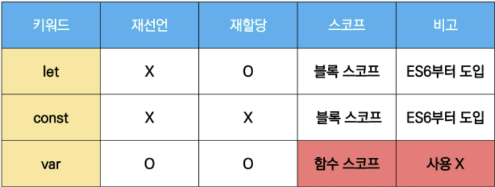

<br>

### 3. 데이터 타입

> #### 데이터 타입 종류
>
> * 자바 스크립트의 모든 값은 특정한 데이터 타입을 가진다.
>   1. 원시 타입(Ptimitive type) 
>      * 객체가 아닌 기본 타입. 
>      * 변수에 해당 타입의 값이 담긴다. 
>      * 다른 변수에 복사할 때 실제 값이 복사된다.
>   2. 참조 타입(Reference type) 
>      * 객체(object) 타입의 자료형. 
>      * 변수에 해당 객체의 참조 값이 담긴다.
>      * 다른 변수에 복사할 때 참조 값이 복사된다. 
>   
>   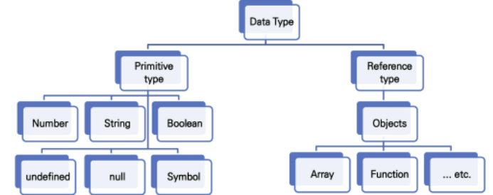
>


#### 1. 원시 타입

1. 숫자(Number) 타입

   * 정수, 실수 구분 없는 하나의 숫자 타입

   * 부동소수점 형식을 다른다. 

   * NaN(Not-A-Number) : 계산 불가능한 경우 반환되는 값

2. 문자열(String) 타입

   * 텍스트 데이터를 나타내는 타입

   * 16비트 유니코드 문자의 집합

   * 작은 따옴표 또는 큰따옴표 모두 가능

   * 템플릿 리터럴(Template Literal)

     *  ES6부터지원

     * 따옴표 대신 backtick으로 사용(``)
     * $ 표시를 사용한다. `${ expression }`

3. undefined

   * 변수의 값이 없음을 나타내는 데이터 타입 (개발자 의도가 없음!!)

   * 변수 선언 이후 직접 값을 할당하지 않으면, _자동_으로 undefined가 할당됨

     ```javascript
     let firstName
     console.log(firstName)  // undefined
     ```

4. null

   * 변수의 값이 없음을 의도적으로 표현할 때 사용하는 데이터 타입.

   * :grey_exclamation: null 타입은 원시 타입의 정의에 의해 '원시 타입'에 속하지만, typeof 연산자의 결과는 객체(object)로 표현된다. 

     ```javascript
     let firstName = null
     console.log(firstName) // null
     
     typeof null  // object
     ```

     ```javascript
     typeof undefined // undefined
     
     typeof null // object
     ```

5. Boolean

   * 논리적 참 또는 거짓을 나타내는 타입

   * true 또는 false로 표현한다.

   * 조건문 또는 반복문에서 유용하게 사용한다.

     ```javascript
     let isAdmin = true
     console.log(idAdmin)  // true
     
     idAdmin = false
     console.log(isAdmin)  // false
     ```

[정리]

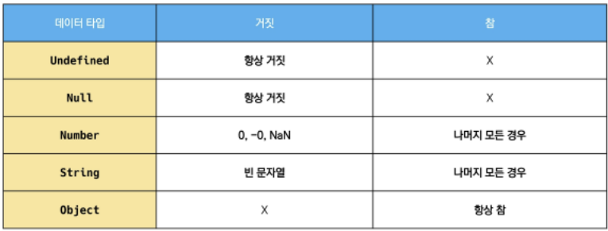

#### 2. 참조 타입

* 타입 별 챕터 링크 목록 
  * 함수
  * 배열
  * 객체

<br>

### 4. 연산자

#### 1. 할당 연산자

* `=` 오른쪽에 있는 피연산자의 평가 결과를 왼쪽 피연산자에 할당하는 연산자이다.
* 다양한 연산에 대한 단축 연산자를 지원한다.

#### 2. 비교 연산자

* 피연산자들(숫자, 문자,Boolean)을 비교하고 결과값을 boolean으로 반환하는 연산자이다.
* 문자열은 유니코드 값을 사용하며 표준 사전 순서를 기반으로 비교한다. 

#### 3. 동등 비교 연산자 

* `==` : 두 피연산자가 같은 값으로 평과되는지 비교 후 Boolean값을 반환하는 연산자이다.
* 비교할 때 암묵적 타입 변환을 통해 타입을 일치시킨 후 같은 값인지 비교한다.
* 두 피연산자가 모두 객체일 경우 메모리의 같은 객체를 바라보는지 판별
* 특별한 경우를 제외하고 쓰지 않는다.

#### 4. 일치 비교 연산자

* `===` : 두 피연산자가 같은 값으로 평가되는지 비교 후 boolean 값을 반환한다.
* 엄격한 비교가 이루어 지며 암묵적 타입 변환이 발생하지 않는다.
  * 엄격한 비교 : 두 비교 대상의 타입과 값 모두 같은지 비교하는 방식 
* 두 피연산자가 모두 객체일 경우 메모리의 같은 객체를 바라보는지 판별한다 

#### 5. 논리 연산자

* `&&` , `||`, `!` 의  세가지 연산자로 구성한다.
* 단축 평가를 지원한다.

#### 6. 삼항 연산자

```javascript
console.log(true ? 1 : 2)  // 1
console.log(false ? 1 : 2)  // 2
```

* 세 개의 피연산자를 사용하여 조건에 따라 값을 반환하는 연산자이다. 

* 가장 왼쪽의 조건식이 참이면 콜론(:) 앞의 값을 사용하고 그렇지 않으면 콜론(:) 뒤의 값을 사용한다. 

* 삼항 연산자의 결과 값이기 때문에 변수에 할당이 가능하다.

  [참고] 한 줄에 표기하는 것을 권장

<br>

### 5. 조건/반복

#### 1. 조건문

1. **if** 

   * 조건 표현식의 결과값을 Boolean 타입으로 변환 후 참/거짓을 판단

   * if, else if, else : 조건은 소괄호 안에 작성한다. 
   * 블록 스코프 생성

   ```javascript
   if (2>1) {
       console.log('2가 더 크다')
   } else {
       console.log('1이 더 크다')
   }
   
   // 2가 더 크다
   ```

   ```javascript
   const nation = 'Korea'
   
   if (nation === 'Korea') {
       console.log('안녕하세요!')
   } else if (nation === 'France') {
       console.log('Bonjour!')
   } else {
       console.log('Hello!')
   }
   ```

2. **switch**

   * 조건 표현식의 결과값이 어느 값(case)에 해당하는지 판별

     [참고] 주로 특정 변수의 값에 따라 조건을 분기할 때 활용한다. 조건이 많아질 경우 if문보다 가독성이 나을 수 있기 때문이다.

   * 표현식(expression)의 결과값을 이용한 조건문

   * 표현식의 결과값과 case문의 오른쪽 값을 비교

   * break 및 default문은 [선택적]으로 사용 가능
   
   * break문이 없는 경우 break문을 만나거나 default문을 실행할 때가지 다음 조건문 실행
   * 블록 스코프 생성
   
   ```javascript
   const nation = 'Korea'
   
   switch (nation) {
       case 'Korea' : {
         	console.log('안녕하세요!')
       	break
       }
       case 'France' : {
           console.log('Bonjour!')
           break
       }
       default : {
           console.log('Hello!')
       }
   }
   ```
   
   ```javascript
   const nation = 'Korea'
   
   switch (nation) {
       case 'Korea' : {
         	console.log('안녕하세요!')
       }
       case 'France' : {
           console.log('Bonjour!')
       }
       default : {
           console.log('Hello!')
       }
   }
   
   // break가 없는 경우 Fall-through 이 경우에는 모두 출력한다. 
   ```

#### 2. 반복문

1. **While**

   * 조건문이 참(true)인 동안 반복 시행
   * 조건은 소괄호 안에 작성한다.
   * 실행할 코드는 중괄호 안에 작성한다. 
   * 블록 스코프 생성

   ```javascript
   let i == 0
   
   while (i < 6) {
       console.log(i) // 0, 1, 2, 3, 4, 5
       i += 1
   }
   ```

2. **for**

   * 세미콜론(;)으로 구분되는 세 부분으로 구성된다. 
     1. initialization : 최초 반복문 진입 시 1회만 실행되는 부분
     2. condition : 매 반복 시행 전 평가되는 부분
     3. expression : 매 반복 시행 이후 평가되는 부분

   * 블록 스코프 생성

   ```javascript
   for (let i=0; i < 6; i++) {
       console.log(i) //  0, 1, 2, 3, 4, 5
   }
   ```

3. **for ... in** 

   * _객체(object)_ ~~여기서 객체는 dictionary라고 생각?~~ 의 _속성(key)_들을 **순회**할 때 사용

   * 배열도 순회 가능하지만 권장하지는 않는다. 
   * 실행할 코드는 중괄호 안에 작성

   * 블록 스코프 생성

   ```javascript
   // object(객체) => key-value로 이루어진 자료 구조(객체 챕터에서 학습 예정)
   
   const capitals = {
       korea: 'seoul',
       france: 'paris',
       USA: 'washington D.C',
   }
   
   for (let capital in capials) {
       console.log(capital)  // korea, france, USA
   }
   ```

4. **for ... of** 

   * 반복 가능한(iterable) 객체를 순회하며 값을 꺼낼 때 사용한다. (반복 가능한 객체의 종류 : Array, Map, Set, String 등)  ~~리스트로 구현한다고 생각~~
   * 실행할 코드는 중괄호 안에 작성
   
   * 블록 스코프 생성
   
   ```javascript
   const fruits = ['딸기', '사과', '수박', '메론']
   
   for (let fruit of fruits) {
       console.log(fruit)
   }  // 딸기, 사과, 수박, 메론
   
   
   // 배열에서 in을 쓰면 인덱스가 나옴
   for (let fruit in fruits) {
       console.log(fruit)
   }  // 0, 1, 2, 3
   ```
   
   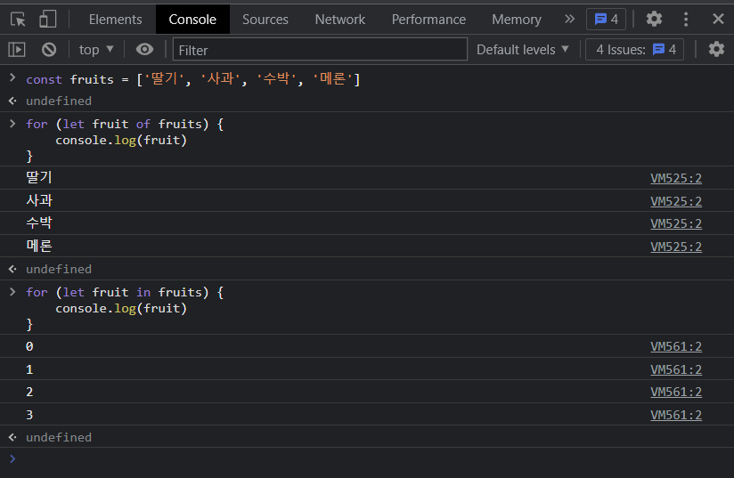

<br>

### 6. 함수

> 참조 타입 중 하나로써 function 타입에 속한다. (typeof로 출력하면 function타입이 뜬다.) 
>
> JavaScript에서 함수를 정의하는 방법은 주로 2가지로 구분한다.
>
> 1. **함수 선언식**
>
>    ``` javascript
>    function name(args) {
>        
>    }
>    
>    function add(num1, num2) {
>        return num1 +  num2
>    }
>    
>    add(1, 2)
>    ```
>
>    함수의 이름
>
>    매개변수(args)
>
>    몸통(중괄호 내부)
>
> 2. **함수 표현식**
>
>    ```javascript
>    const name = function (args) {
>        // do something
>    }
>             
>    const add = function (num1, num2) {
>        return num1 + num2
>    }
>             
>    add(1, 2)
>    ```
>
>    함수의 이름 생략 가능!!
>
>    매개변수(args)
>
>    몸통(중괄호 내부)
>
>    변수로써 사용되기 때문에 호이스팅이 되지 않는다. 
>
>    익명 함수로 선언이 가능하다
>
> JavaScript의 함수는 일급 객체(다음의 조건들을 만족하는 객체)
>
> * 변수에 할당 가능
> * 함수의 매개변수로 전달 가능
> * 함수의 반환 값으로 사용 가능

* 기본 인자(default arguments)

  ```javascript
  const greeting = function (name='Anonymous') {
      return 'Hi ${name}'
  }
  
  console.log(greeting())  // Hi Anonymous
  ```

* 매개변수와 인자 개수 불일치 허용

  ```javascript
  // 매개변수보다 인자의 개수가 많을 경우
  
  const noArgs = function() {
      return 0
  }
  
  noArgs(1, 2, 3)  // 0
  
  const twoArgs = function (arg1, arg2) {
      return [arg1, arg2]
  }
  
  twoArgs(1, 2, 3)  // [1, 2]
  ```

  ```javascript
  // 매개변수보다 인자의 개수가 적을 경우
  
  const threenoArgs = function(arg1, arg2, arg2) {
      return [arg1, arg2, arg3]
  }
  
  threenoArgs()  // [undefined, undefined, undefined]
  threenoArgs(1)  // [1, undefined, undefined]
  threenoArgs(1, 2)  // [1, 2, undefined]
  ```

* **Rest Parameter**

  rest parameter`(...)`를 사용하면 함수가 정해지지 않은 수의 매개변수를 배열로 받는다.(python의 *args와 유사)

  함수의 선언문의 파라미터에 spread`(...)`연산자를 이용해서 받으면 가변 인자를 받아 배열로 만들어 사용한다!!

  ```javascript
  const restArgs = function (arg1, arg2, ...restArgs) {
      return [arg1, arg2, restArgs]
  }
  
  restArgs(1, 2, 3, 4, 5)  // [1, 2, [3, 4, 5]]
  ```

* **Spread operator** : unpack과 비슷!!

  함수 호출문의 파라미터에 spreadOpr를 이용해서 호출하면 배열이 해당 매개변수로 각각 매핑 되는 것이다.

  ```javascript
  const spreadOpr = function (arg1, arg2, arg3) {
      return arg1 + arg2 + arg3
  }
  
  const numbers = [1, 2, 3]
  spreadOpr(...numbers)   // 6
  ```

* **선언식 vs 표현식**

  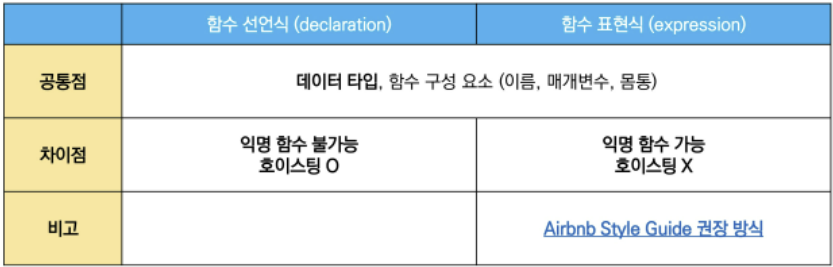

  :small_red_triangle: 호이스팅? : 선언 끌어올리기를 통해 다음 함수가 정상출력 됨

  ```javascript
  add(2, 7)  // 함수선언식
  
  function add (num1, num2) {
      return num1 + num2
  }  // 9 
  ```

  ```javascript
  add(2, 7)  // 함수표현식 Error 발생!!
  
  const add = function add (num1, num2) {
      return num1 + num2
  }   
  ```

  ```javascript
  console.log(add) // undefined
  add(2, 7)  // 함수표현식을 var로 작성한 경우 Error 발생!!
  // 변수가 선언 전 undefined로 초기화 되어 다른 에러가 발생한다.
  
  var add = function add (num1, num2) {
      return num1 + num2
  }   
  ```

* **Arrow Function**

  화살표 함수; 함수를 비교적 간결하게 정의할 수 있는 문법

  * function 키워드 생략 가능 : `=>`가 생김

  * 함수의 매개변수가 단 하나라면 '()' 생략 가능

  * return 값이 하나라면 return도 생략 가능

  ```javascript
  const arrow1 = function(name){
      return 'hello'
  }
  
  // 1. function 키워드 삭제
  const arrow1 = (name) => { return 'hello, ${name}'}
  
  // 2. 매개변수가 1개일 경우 () 생략 가능
  const arrow1 = name => { return 'hello, ${name}'}
  
  // 3. return문이 하나라면 {} & return 삭제 가능
  const arrow1 = name => 'hello, ${name}'
  ```

* **문자열(String)**

  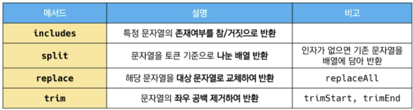

  1. include : 문자열에 value가 존재하는지 판별 후 참 또는 거짓 반환

     ```javascript
     const str = 'a santa at nasa'
     
     str.includes('santa')  // true
     str.includes('asan')  // false
     ```

  2. split

     ```javascript
     const str = 'a cup'
     // 1. value가 없을 경우, 기존 문자열을 배열에 담아 반환
     // 2. value가 빈 문자열일 경우 각 문자로 나눈 배열을 반환
     // 3. value가 기타 문자열일 경우, 해당 문자열로 나눈 배열을 반환
     
     str.split() // ['a cup']
     str.split('')  // ['a', ' ', 'c', 'u', 'p']
     str.split(' ') // ['a', 'cup']
     ```

  3. replace

     ```javascript
     const str = 'a b c d'
     
     str.replace(' ','-')  // 'a-b c d'  하나만 '-'로 교체
     str.replaceAll(' ', '-')  // 'a-b-c-d'  모두 '-'로 교체
     ```

  4. trim : 공백을 제거(스페이스, 탭, 엔터)

     ```javascript
     const str = '    hello    '
     
     str.trim()  // 'hello'
     str.trimStart()  // 'hello'
     str.trimEnd()  // '    hello'
     ```

<br>

### 7. 배열, 객체

#### 1. 배열

> [배열의 정의와 특징]
>
> * 키와 속성들을 담고 있는 참조 타입의 객체(object)
>
> * 순서를 보장하는 특징이 있다.
>
> * 주로 대괄호를 이용하여 생성하고, 0을 포함한 양의 정수 인덱스로 특정 값에 접근 가능하다.
>
> * 배열의 길이는 array.length 형태로 접근 가능하다. 
>
>   [참고] 음의 정수 인덱스가 접근이 안되기 때문에 배열의 마지막 원소는 array.length -1로 접근 가능하다.

:star: 기본편

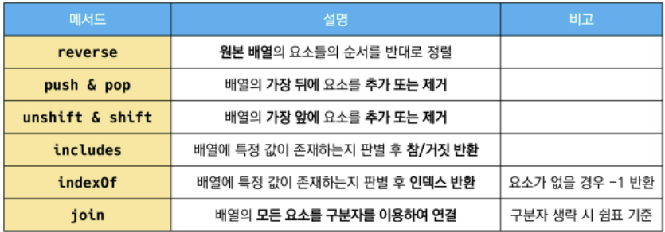

1. reverse : 원본 배열의 요소들의 순서를 반대로 정렬

   ```javascript
   const numbers = [1, 2, 3, 4, 5]
   numbers.reverse()
   console.log(numbers)  // [5, 4, 3, 2, 1]
   ```

2. push & pop : 배열의 가장 뒤에 요소 추가, 제거

   꺼낸 값을 반환한다는 특징이 있다. 

   ```javascript
   const numbers = [1, 2, 3, 4, 5]
   
   numbers.push(100)
   console.log(numbers) // [1, 2, 3, 4, 5, 100]
   
   numbers.pop()
   console.log(numbers) // [1, 2, 3, 4, 5]
   ```

3. unshift & shift : 배열의 가장 앞에 요소 추가, 제거

   ```javascript
   const numbers = [1, 2, 3, 4, 5]
   
   numbers.unshift(100)
   console.log(numbers)  // [100, 1, 2, 3, 4, 5]
   
   numbers.shift()
   console.log(numbers)  // [1, 2, 3, 4, 5]
   ```

4. includes : 배열에 특정 값이 존재하는지 판별 후 참 또는 거짓 반환

   ```javascript
   const numbers = [1, 2, 3, 4, 5]
   
   console.log(numbers.includes(1))  // True
   console.log(numbers.includes(100))  // false
   ```

5. indexof : 배열에 특정 값이 존재하는지 확인 후 가장 첫 번째로 찾은 요소의 인덱스반환

   해당 값이 없을 경우 -1 반환

   ```javascript
   const numbers = [1, 2, 3, 4, 5]
   let result
   
   result = numbers.indexof(3) // 2
   console.log(result)
   
   result = numbers.indexof(100) // -1
   console.log(result)
   ```

6. join : 배열의 모든 요소를 연결하여 반환

   ```javascript
   ```

7. Spread operator

   배열 내부에서 배열 전개 가능

   얕은 복사에 활용 가능


:star: 심화편

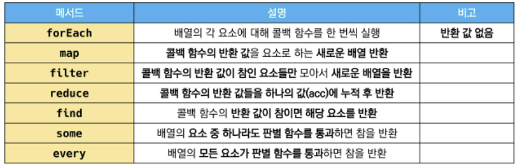

1. forEach 

   * 배열의 각 요소에 대해 콜백 함수를 한 번씩 실행
   * 콜백 함수는 3가지 매개변수로 구성
     * element : 배열의 요소
     * index : 배열 요소의 인덱스
     * array : 배열 자체
   * **반환 값(return)이 없는 메서드**

   ```javascript
   const fruits = ['딸기', '수박', '사과', '체리'] 
   
   fruits.forEach((fruit, index) => {
       console.log(fruit, index)
       // 딸기 0
       // 수박 1
       // 사과 2
       // 체리 3
   })
   ```

2. map

   * 배열의 각 요소에 대해 콜백 함수를 한 번씩 실행
   * 콜백 함수의 반환값을 요소로 하는 새로운 배열 반환
   * 기존 배열 전체를 다른 형태로 바꿀 때 유용

   ```javascript
   const numbers = [1, 2, 3, 4, 5]
   
   const doubleNums = numbers.map((num) => {
       return num*2
   })
   
   console.log(doubleNums)  // [2, 4, 6, 8, 10]
   ```

3. filter

   * 배열의 각 요소에 대해 콜백 함수를 한 번씩 실행
   * 콜백 함수의 반환 값이 **참인 요소들만 모아서** 새로운 배열을 반환
   * 기존 배열의 요소들을 **필터링 할 때 유용**

   ```javascript
   const numbers = [1, 2, 3, 4, 5]
   
   const oddNums = numbers.filter((num, index) => {
       return num%2
   })
   
   console.log(oddNums) // 1, 3, 5
   ```

4. reduce

   * 배열의 각 요소에 대해 콜백 함수를 한 번씩 실행
   * 콜백 함수의 반환 값들을 하나의 값(acc)에 누적 후 반환
   * reduce 메서드의 주요 매개변수
     * acc : 이전 callback 함수의 반환 값이 누적 되는 변수
     * initialValue(optional) : 최초 callback 함수 호출 시 acc에 할당되는 값, default 값은 배열의 첫 번째 값
   * [참고] 빈 배열의 경우 initialValue를 제공하지 않으면 에러 발생

   ```javascript
   const numbers = [1, 2, 3]
   
   const result = numbers.reduce((acc, num) => {
       return acc + num
   }, 0)
   
   // 0은 최초에만 사용된다.
   // 0 + 1
   // 1 + 2
   // 3 + 3
   
   console.log(result)  // 6
   ```

5. find

   * 배열의 각 요소에 대해 콜백 함수를 한 번씩 실행
   * 콜백 함수의 **반환 값이 참이면, 조건을 만족하는 첫번째 요소를 반환**
   * 찾는 값이 배열에 없으면 undefined 반환

   ```javascript
   const avengers = [
       {name: 'Tony Stark', age: 45},
       {name: 'Steve Rogers', age: 32},
       {name: 'Thor', age: 40},
   ]
   
   const result = avengers.find((avenger) => {
       return avenger.name == 'Tony Stark'
   })
   
   console.log(result) // {name: 'Tony Stark', age: 45}
   ```

6. some

   * 배열의 요소 중 하나라도 주어진 판별 함수를 통과하면 참을 반환
   * 모든 요소가 통과하지 못하면 거짓 반환
   * [참고] 빈 배열은 항상 거짓 반환

   ```javascript
   const numbers = [1, 3, 5, 7, 9]
   
   const hasEvenNumber = numbers.some((num) => {
       return num%2 === 0
   })
   console.log(hasEvenNumber) // false 모두 짝수인가에 대해 확인했기 때문.
   
   const hasEvenNumber = numbers.some((num) => {
       return num % 2 
   })
   console.log(hasEvenNumber) // true
   ```

7. every

   * 배열의 모든 요소가 주어진 판별 함수를 통과하면 참을 반환
   * 하나의 요소라도 통과하지 못하면 거짓 반환
   * [참고] 빈 배열은 항상 참 반환

   ```javascript
   const numbers = [2, 4, 6, 8, 10]
   
   const isEvenNumber = numbers.every((num) => {
       return num%2 === 0
   })
   console.log(isEvenNumber) // true
   
   const isEvenNumber = numbers.every((num) => {
       return num % 2 
   })
   console.log(isEvenNumber) // false
   ```


#### 2. 객체

> [객체(objects)의 정의와 특징]
>
> * 객체는 속성(property)의 집합이며, 중괄호 내부에 key와 value의 쌍으로 표현
>
> * key는문자열 타입만 가능
>
>   [참고] key 이름에 띄어쓰기 등의 구분자가 있으면 따옴표로 묶어서 표현
>
> * value는 모든 타입(함수 포함)가능
>
> * 객체 요소 접근은 점 또는 대괄호로 가능
>
>   [참고] key 이름에 띄어쓰기 같은 구분자가 있으면 대괄호 접근만 가능
>
> [객체와 메서드]
>
> * 메서드는 어떤 객체의 속성이 참조하는 함수.
> * 객체, 메서드명()으로 호출 가능.
> * 메서드 내부에서는 this 키워드가 객체를 의미함.
>   * fullName은 메서드가 아니기 때문에 정상 출력 되지 않음(NaN)
>   * getFullName은 메서드이기 대문에 해당 객체의 firstName과 lastName을 정상적으로 이어서 반환

* 객체 관련 ES6문법 익히기
  1. 속성명 축약
  2. 메서드명 축약
  3. 계산된 속성명 사용하기
  4. 구조 분해 할당 (구조 분해 할당은 배열도 가능함)
  5. 객체 전개 구문(Spread Operator)

1. 속성명 축약(shorthand)

   * 객체를 정의할 때 key와 할당하는 변수의 이름이 같으면 예시와 같이 축약 가능

   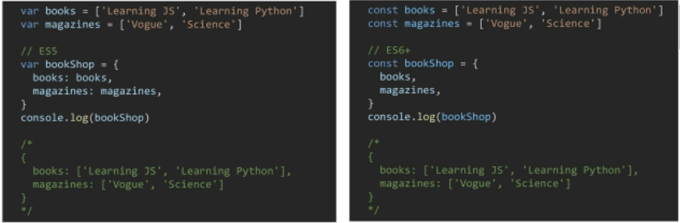

2. 메서드명 축약

   * 메서드 선언시 function 키워드 생략 가능

   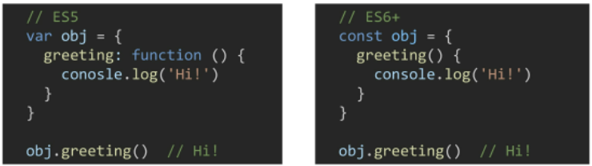

3. 계산된 속성

   * 객체를 정의할 때 key의 이름을 표현식을 이용하여 동적으로 생성 가능

   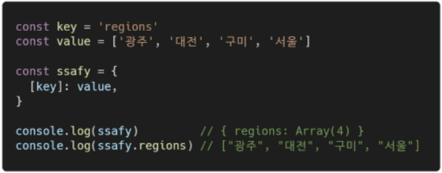

4. 구조 분해 할당(destructing assignment)

   * 배열 또는 객체 분해하여 속성을 변수에 쉽게 할당 할 수 있는 문법

   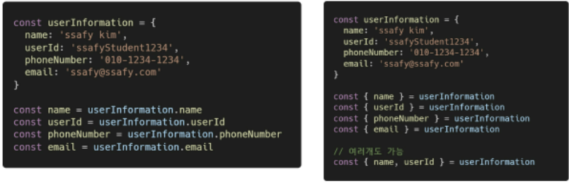

5. Spread operator

   * spread operator(...)를 사용하면 객체 내부에서 객체 전개 간
   * 얕은 복사에 활용 가능

   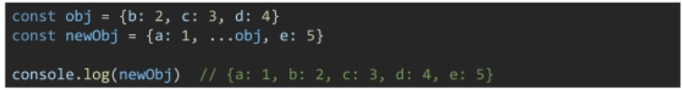

<br>

### 8. this

* 자바스크립트의 함수는 호출될 때 `this`를 암묵적으로 전달 받는다.
* java에서의 this와 python에서의 self는 인스턴스 자신을 가리킨다. 
* 함수를 선언할 때 this에 객체가 결정되는 것이 아니고, 함수를 호출할 때 함수가 어떻게 호출되었는지에 따라 동적으로 결정된다.

**다양한 함수 호출 방식**

1. 함수 호출

   ```javascript
   const app = function () {
       console.log(this)
   }
   
   app()  // window
   ```

   :small_red_triangle: 전역 객체 window

2. 메서드 호출

   ```javascript
   const myobj = {
       app:app,
   }
   
   myobj.app() // myobj
   ```

   :small_red_triangle: this는 호출하는 객체가 된다.

3. 생성자 함수 호출

   ```javascript
   const myapp = new app() // myapp istance
   ```

4. 화살표 함수

   함수를 어디서 호출하는지가 아니라 어디에 선언했는지에 따라 결정

   정적 스코프 (대부분 프로그래밍 언어에서 따르는 방식)

   ```javascript
   const arrowGreeting = () => {
       console.log(this)
   }
   
   const me = {
       name:'me',
       arrowGreeting,
   }
   
   arrowGreeting()  // window
   me.arrowGreeting()  // window
   // 메서드 선언은 function을 사용하자.
   ```

   :red_circle: 함수 내에서 함수 상황에서 화살표 함수를 쓰는 것이 좋다.

[function 키워드와 화살표 함수 차이]

> * JS의 this는 실행 문맥에 따라 다른 대상을 가리킨다.
>
> * class 내부의 생성자(constructor)함수 :  this는 생성되는객체를 가리킨다.
>
> * 메서드(객체,메서드명()으로 호출 가능한 함수) : this는 해당 메서드가 소속된 객체를 가리킨다.
> * 위의 두가지 경우를 제외하면 모두 최상위 객체(window)를 가리킨다.

<br>

### 9. lodash

`html`내에서 `javascripts`로 사용할 수 있도록 해준다.

여러 기능을 사용할 수 있게 해준다.

```html
<body>
  <!-- <script src="01.js"></script> -->
  <script src="https://cdn.jsdelivr.net/npm/lodash@4.17.21/lodash.min.js"></script>
  <script>
    // javascripts 로 바뀜
    const a = _.sample([1, 2, 3, 4])
    console.log(a)
  </script>
</body>
```

