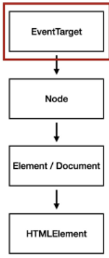
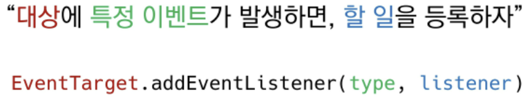

# 04.27

## JS 심화

[TOC]

<br>

### 1. DOM

* DOM 조작 - 개념

  * Document는 문서 한 장(HTML)에 해당하고 이를 조작
  * DOM조작 
    1. **선택(Select)**
    2. **변경(Manipulation)**

* DOM 관련 객체의 상속 구조

  *  EventTarget -> Node -> Element -> Document -> HTMLElement

* DOM 선택 관련 메서드

  > id, class 그리고 tag 선택자 등을 모두 가능하므로, 더 구체적이고 유연한 아래 두가지를 사용함

  1. document.**querySelector(selector)**

     * 제공한 선택자와 일치하는 element하나 선택

     * 제공한 CSS selector를 만족하는 첫 번째 element 객체를 반환 (없다면 null)

  2. document.**querySelectorAll(selector)**

     * 제공한 선택자와 일치하는 여러 element를 선택
     * 매칭 할 하나의 셀렉터를 포함하는 유효한 CSSselector를 인자(문자열)로 받음
     * 지정된 셀렉터에 일치하는 **NodeList를 반환**

* DOM 선택 메서드별 반환 타임

  1. 단일 element : **querySelector()**
  
  2. HTMLCollection
  
  3. NodeList : **querySelectorAll()** -> 인덱스로만 접근 가능 -> 배열에서 사용하는 forEach 등과 다양한 메서드를 사용할 수 있다.
  
     :small_red_triangle: querySelectorAll()에 의해 반환되는 NodeList는 static Collection(non-live)으로 실시간 반영이 되지 않는다!!

---

#### 1. DOM 조작하기:exclamation:

```html
<!DOCTYPE html>
<html lang="en">
<head>
  <meta charset="UTF-8">
  <meta http-equiv="X-UA-Compatible" content="IE=edge">
  <meta name="viewport" content="width=device-width, initial-scale=1.0">
  <title>Document</title>
  <style>
    .ssafy-location {
      color: blue;
    }
  </style>
</head>
<body>
  <h1>Hello SSAFY</h1>
  <h2 id="location-header">Location</h2>
  <div>
    <ul>
      <li class="ssafy-location">서울</li>
      <li class="ssafy-location">대전</li>
      <li class="ssafy-location">광주</li>
      <li class="ssafy-location">구미</li>
      <li class="ssafy-location">부울경</li>
    </ul>
  </div>
  <script>
```

1. **Selection**

   ```javascript
   // 1-1. window & document
   console.log(window)
   console.log(document)
   console.log(window.document)
   
   // 1-2. querySelector
   // const는 재할당은 안되지만 참조(메모리 주소값)만 동일한 dict나 배열이라면 내용물은 바뀔 수 있음!
   const h1 = document.querySelector('h1')  
   const h2 = document.querySelector('h2')
   const secondH2 = document.querySelector('#location-header')  // id 선택자
   const selectUlTag = document.querySelector('div > ul')
   
   // 1-3. querySelectorAll
   const liTags = document.querySelectorAll('li')
   const secondLiTags = document.querySelectorAll('.ssafy-location')
   ```

2. **Creation & Append**

   > **document.createElement()** : 작성한 태그 명의 HTML 요소를 생성하여 반환
   >
   > * **Element.append()**
   >   * 특정 부모 노드의 자식 NodeList 중 마지막 자식 다음에 Node 객체나 DOMString을 삽입한다.
   >   * 여러 개의 Node 객체, DOMString을 추가 할 수 있다.
   >   * **반환 값이 없다.** 
   >
   > * **Element.appendChild()**
   >   * 한 노드를 특정 부모 노드의 자식 NodeList 중 마지막 자식으로 삽입 (Node만 추가 가능)
   >   * 한번에 오직 하나의 Node만 추가할 수 있음
   >   * 만약 주어진 Node가 이미 문서에 존재하는 다른 Node를 참조한다면 새로운 위치로 이동

   [`innerText` vs `innerHTML`]

   * 차이점 

   ```javascript
   // 2-1. createElement
   const ulTag = document.querySelector('ul')
   const newLiTag = document.createElement('li')
   
   // 2-2. append
   const ulTag = document.querySelector('ul')
   const newLiTag = document.createElement('li')  // 새로운 요소 생성
   newLiTag.innerText = '새로운 리스트 태그'
   ulTag.append(newLiTag)
   ulTag.append('문자열도 추가 가능')  // li형식이 아님.
   
   const new1 = document.createElement('li')
   new1.innerText = '리스트 1'
   const new2 = document.createElement('li')
   new2.innerText = '리스트 2'
   const new3 = document.createElement('li')
   new3.innerText = '리스트 3'
   ulTag.append(new1, new2, new3)
   
   // 2-3. appendChild
   const ulTag = document.querySelector('ul')
   const newLiTag = document.createElement('li')
   newLiTag.innerText = '새로운 리스트 태그'
   ulTag.appendChild(newLiTag)
   ulTag.appendChild('문자열은 추가 불가')  // Node만 추가 가능!!
   
   const new1 = document.createElement('li')
   new1.innerText = '리스트 1'
   const new2 = document.createElement('li')
   new2.innerText = '리스트 2'
   ulTag.appendChild(new1, new2)  // child는 한개만 가능!
   
   // 2-2. innerText & innerHTML
   const ulTag = document.querySelector('ul')
   const liTag1 = document.createElement('li')
   liTag1.innerText = '<li>춘천</li>'  // 모두 string로 인식
   const liTag2 = document.createElement('li')
   liTag2.innerHTML = '<li>춘천</li>'  // HTML문서내 꺽쇠로 인식, XSS 공격에 취약하므로 사용 시 주의!!
   ulTag.append(liTag1, liTag2)
   
   const ulTag = document.querySelector('ul')
   ulTag.innerHTML = '<li><a href="javascript:alert(\'당신의 개인정보 유출\')">춘천</a></li>'
   ```

   | Node.innerText                                               | Element.innerHTML                            |
   | ------------------------------------------------------------ | -------------------------------------------- |
   | Node 객체와 그 자손의 텍스트 컨텐츠를 표현한다.              | 요소(element) 내에 포함되 HTML 마크업을 반환 |
   | 즉, 줄 바꿈을 인식하고 숨겨진 내용을 무시하는 등 최종적으로 스타일링이 적용된 모습으로 표현 | XSS 공격에 취약하므로 사용 시 주의           |

   :small_red_triangle: XSS(Cross-site Scripting)

   1. 공격자가 입력요소를 사용하여(<input>)웹 사이트 클라이언트 측 코드에 악성 스크립트를 삽입해 공격하는 방법
   1. 피해자(사용자)의 브라우저가 악성 스크립트를 실행하며 공격자가 엑세스 제어를 우회하고 사용자를 가장 할 수 있도록 한다. 

3. **Delete**/ 삭제 관련 메서드

   > 1. childNode.remove()
   >    * Node가 속한 트리에서 해당 Node를 제거
   > 2. Node.removeChile()
   >    * DOM에서 자식 Node를 제거하고 제거된 Node를 반환
   >    * Node는 인자로 들어가는 자식 Node의 부모 Node

   ```javascript
   // 3-1. remove
   const header = document.querySelector('#location-header')
   header.remove()
   
   // 3-2. removeChild
   const parent = document.querySelector('ul')
   const child = document.querySelector('ul > li')
   const removedChild = parent.removeChild(child)
   console.log(removedChild)
   parent.append(child)  // 순서바꾸기 가능
   ```

4. **속성**

   > 1. **Element.setAttrubute(name , value)**
   >    * 지정된 요소의 값을 설정
   >    * 속성이 이미 존재하면 값을 갱신, 존재하지 않으면 지정된 이름과 값으로 새 속성을 추가
   >
   > 2. **Element.getAttrubute(attributeName)**
   >    * 해당 요소의 지정된 값(문자열)을 반환
   >    * 인자(attributeName)는 값을 얻고자 하는 속성의 이름

   ```javascript
   // 4-1. setAttribute
   const header = document.querySelector('#location-header')
   header.setAttribute('class', 'ssafy-location')
   = header.classList.add('ssafy-location')
   = header.class = ssafy-location
   
   // 4-2. getAttribute
   const getAttr = document.querySelector('.ssafy-location')
   getAttr.getAttribute('class')
   getAttr.getAttribute('style')
   ```

5. 이외

   ```javascript
   // Element Styling
   li1.style.cursor = 'pointer'
   li2.style.color = 'blue'
   li3.style.background = 'red'
   
   // firstLi.setArrtibute.('class', 'focus')
   ```

|    1. 선택한다.    | 2. 변경(조작)한다.  |
| :----------------: | :-----------------: |
|   querySeletor()   |      innerText      |
| querySelectorAll() |      innerHTML      |
|                    | element.style.color |
|                    |   setAttribute()    |
|                    |   getAttribute()    |
|                    |   createElement()   |
|                    |    appendChild()    |
|                    |         ...         |

---

#### 2. 건강설문 조작하기:arrow_forward:

```html
<!DOCTYPE html>
<html lang="en">
<head>
  <meta charset="UTF-8">
  <meta http-equiv="X-UA-Compatible" content="IE=edge">
  <meta name="viewport" content="width=device-width, initial-scale=1.0">
  <title>Document</title>
  <style>
    /* body background color */
    #main {
      background-color: rgba(197, 255, 251)
    }

    /* 중앙 정렬 */
    .box-container {
      display: flex;
      justify-content: center;
      align-items: center;
    }

    /* 박스 별 테두리 */
    .box-item {
      margin: 20px;
      padding: 30px;
      border-radius: 10px;
      width: 600px;
      background-color: white;
    }

    /* 버튼 텍스트 변경 및 스타일링 */
    .button {
      background-color: rgba(45, 166, 153);
      border-radius: 4px;
      color: white;
      padding: 10px 20px;
      margin: 20px;
      cursor: pointer;
      font-size: 15px;
    }

    /* footer */
    .footer {
      margin-top: 3vh;
      margin-bottom: 3vh;
    }
  </style>
</head>
<body>
  <nav>
    <a href="https://www.ssafy.com">
      
    </a>
  </nav>

  <header>
    <h1>SSAFY 학생 건강설문</h1>
  </header>

  <section>
    <form action="#" method="GET">
      <div>
        <label for="name">이름을 기재해주세요.</label><br>
        <input type="text" id="name" placeholder="실명을 작성해주세요." autofocus>
      </div>
      
      <div>
        <label for="region">지역을 선택해주세요.</label>
        <select name="region" id="region" required>
          <option value="">선택</option>
          <option value="서울" disabled>서울</option>
          <option value="대전">대전</option>
          <option value="광주">광주</option>
          <option value="구미">구미</option>
        </select>
      </div>
      
      <div>
        <p>오늘의 체온을 선택해주세요.</p>
        <input type="radio" name="body-heat" id="normal" value="normal" checked>
        <label for="normal">37도 미만</label>
        <input type="radio" name="body-heat" id="warning" value="warning">
        <label for="warning">37도 이상</label>
      </div>

      <input type="submit" value="제출하기" id='submit버튼'>
    </form>
  </section>

  <script>
    // 배경색 설정
    const body = document.querySelector('body')
    body.setAttribute('id', 'main')


    // 요소 중앙 정렬
    // 1. 필요한 요소들을 선택하여
    const nav = document.querySelector('nav')
    const header = document.querySelector('header')
    const section = document.querySelector('section')
    // 2. 중앙 정렬(.box-container)
    nav.setAttribute('class', 'box-container')
    header.classList.add('box-container')
    section.classList.add('box-container')


    // 테두리 설정
    // 1. section 내부의 div들을 선택한다.
    const questionDivs = document.querySelectorAll('section div')
    // 2. 해당 div에게 .box-item 클래스를 지정한다.
    questionDivs.forEach(function (div) {
      div.setAttribute('class', 'box-item')
    })
      

    // 버튼 변경
    // 1. 버튼 선택
    const button = document.querySelector('#submit버튼')
    // .button 적용
    button.setAttribute('class', 'button')


    // 이미지 사이즈
    // 1. 이미지 선택
    const navImage = document.querySelector('nav img')
    navImage.width = '500'


    // footer
    // 1. footer 생성
    const footer = document.createElement('footer')
    footer.innerText = 'google 설문지를 통해 비밀번호를 제출하지 마시오.'
    // 2. body 맨 밑에 append 한다.
    body.appendchild(footer)
    footer.setAttribute('class', 'box-container')


    // input 요소 스타일링
    const nameinput = document.querySelector('#name')
    nameinput.style.marginTop = '50px'

  </script>
</body>
</html>
```

<br>

### 2. Event Listener

> [이벤트]
>
> * 네트워크 활동이나 사용자와의 상호작용 같은 사건의 발생을 알리기 위한 객체
> * 이벤트 발생
>   1.  마우스를 클릭하거나 키보드를 누르는 등 사용자 행동으로 발생할 수도 있음
>   2. 특정 메서드를 호출(Element.click())하여 프로그래밍적으로도 만들어 낼 수 있다. 

* 이벤트 기반 인터페이스
  1. AnimationEvent, ClipboardEvent, DragEvent 등
  2. UIEvent
     * 간단산 사용자 인터페이스를 받음
     * Event의 상속을 받음
     * MouseEvent, KeyboardEvent, InputEvent, FocusEvent 등의 부모 객체 역할을 함
* 이벤트의 역할 (`함수 === '일'`)
  1. `~하면 ~ 한다`
  2. 클릭**하면**, 경고창**을 뜨운다.**
  3. 특정 이벤트가 발생**하면**, 할 일을 **등록한다. **

* **이벤트 handler**

  1. EventTarget.**addEventListener(type, listener[, options])**

     * 지정한 이벤트가 대상에 전달될 때마다 호출할 함수를 설정한다. 

     * 이벤트를 지원하는 모든 객체(Element, Document, Window 등)를 대상으로 지정가능

     * type : 반응 할 이벤트 유형(대소문자 구분 문자열)

     * listener : 지정된 타입의 이벤트가 발생했을 때 알림을 받는 객체/ EventListener 인터페이스 혹은 JS function 객체(콜백 함수)여야 한다. 

       

  2. **대상**에 **특정 이벤트**가 발생하면, **할 일**을 등록하자.

     

---

#### 1. addEventListener 실습 :heavy_heart_exclamation:

```html
<!DOCTYPE html>
<html lang="en">
<head>
  <meta charset="UTF-8">
  <meta http-equiv="X-UA-Compatible" content="IE=edge">
  <meta name="viewport" content="width=device-width, initial-scale=1.0">
  <title>Document</title>
</head>
<body>
  <!-- 1. onclick -->
  <!-- inline 스크립트여서 잘 쓰지 않는다. 직관성은 좋지만 사용x-->
  <button onclick="alertMessage()">나를 눌러봐!</button>

  <!-- 2-1. addEventListener -->
  <button id="my-button">나를 눌러봐2!!</button>
  <hr>

	<!-- 2-2. addEventListener -->
  <p id="my-paragraph"></p>

  <form action="#">
    <label for="my-text-input">내용을 입력하세요.</label>
    <input id="my-text-input" type="text">
  </form>
  <hr>

  <!-- 2-3. addEventListener -->
  <h2>Change My Color</h2>
  <label for="change-color-input">원하는 색상을 영어로 입력하세요.</label>
  <input id="change-color-input" value="Hi"></input>
  <hr>


  <script>
    // 1
    const alertMessage = function () {
      alert('메롱!!!')
    }

    // 2-1 addEventListener
    const myButton = document.querySelector('#my-button')
    // 함수를 넘김
    myButton.addEventListener('click', alertMessage)
    // myButton.addEventListener('click', alertMessage()) x
    // myButton.addEventListener('click', undifined)


    // 2-2 addEventListener
    const myTextInput = document.querySelector('#my-text-input')

    const myP = document.querySelector('#my-paragraph')
    const ifIuputiscomming = function (event) {
      // console.log(event.target.value)
      myP.innerText = event.target.value
    }

    myTextInput.addEventListener('input', ifIuputiscomming)
    

    // 2-3 addEventListener
    const colorInput = document.querySelector('#change-color-input')
    
    const h2Tag = document.querySelector('h2')
    const colorchange = function (event) {
      const userinput = event.target.value
      h2Tag.style.color = userinput
    }
    
    colorInput.addEventListener('input', colorchange)


  </script>
</body>
</html>
```

---

#### 2. Event 취소 실습 :x:

* `event.preventDefault()`
* 현재 이벤트의 기본 동작을 중단
* HTML 요소의 기본 동작을 작동하지 않게 막는다. 
  * a 태그의 기본 동작은 클릭 시 링크로 이동 / form 태그의 기본 동작은 form 데이터 전송
* 이벤트를 취소할 수 있는 경우, 이벤트의 전파를 막지 않고 그 이벤트를 취소

```html
<!DOCTYPE html>
<html lang="en">
<head>
  <meta charset="UTF-8">
  <meta name="viewport" content="width=device-width, initial-scale=1.0">
  <title>preventDefault</title>
	<style>
    body {
      height: 10000px;
    }
  </style>
</head>
<body>
  <!-- 1. checkbox -->
  <input type="checkbox" id="my-checkbox">
  <hr>

  <!-- 2. submit -->
  <form action="/articles/" id="my-form">
    <input type="text">
    <input type="submit" value="제출!">
  </form>
  <hr>

  <!-- 3. link -->
  <a href="https://google.com/" target="_blank" id="my-link">GoToGoogle</a>
  <hr>
  
  <script>
    // 1
    const checkBox = document.querySelector('#my-checkbox')
    
    checkBox.addEventListener('click', function (event) {
      event.preventDefault()
      console.log(event)
    })

    // 2 form 태그
    // form 태그는 클릭 혹은 enter를 치면 넘어간다. 
    // preventDefault를하게 되면 
    const formTag = document.querySelector('#my-form')

    formTag.addEventListener('submit', function (event) {
      console.log(event)
      event.preventDefault()
      event.target.reset()  // form 태그의 내용을 다 지우면
    })

    // 3 a 태그
    // a 태그는 클릭 시 새로운 탭을 만들거나 화면 전환이 기본인데, 이를 우선 막아보는 것
    const aTag = document.querySelector('#my-link')

    aTag.addEventListener('click', function (event) {
      console.log(event)
      event.preventDefault()
    })

    // 4
    document.addEventListener('scroll', function (event) {
      console.log(event)
      event.preventDefault()
    })
  </script>
</body>
</html>
```

