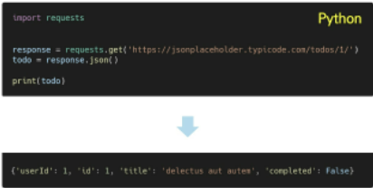
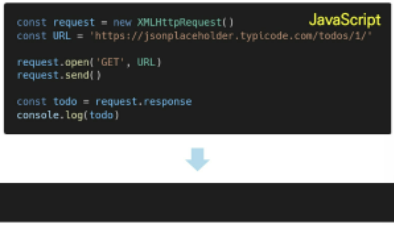
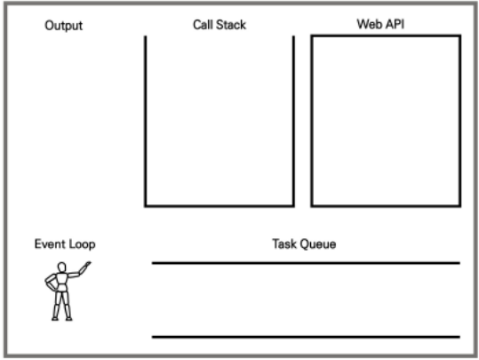
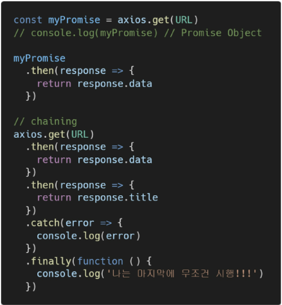
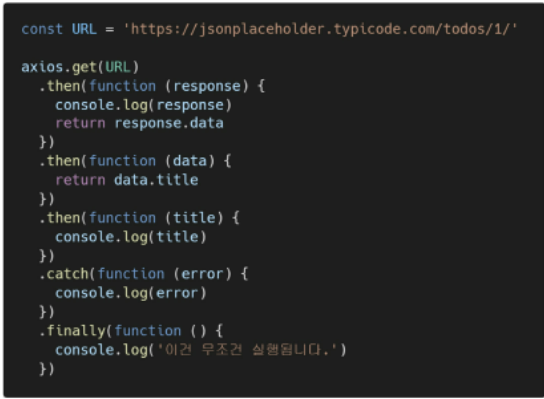

# 05.02

## axios를 이용한 비동기 통신 개념

[TOC]

<br>

### 1. AJAX

* Asynchronous JavaScript And XML (비동기식 JavaScript와 XML)

* 서버와 통신하기 위해 XMLHttpRequest 객체 활용

* JSON, XML, HTML 그리고 일반 텍스트 형식 등을 포함한 다양한 포맷을 주고 받을 수 있음

  [참고] AJAX의 X가 XML을 의미하긴 하지만, 요즘은 더 가벼운 용량과 JavaScript의 일부라는 장점 때문에 JSON을 더 많이 상요함

* AJAX 특징 

  1. 페이지 전체를 reload(새로고침)을 하지 않고서도 수행되는 "비동기성"
     * 서버의 응답에 따라 전체 페이지가 아닌 일부만을 업데이트 할 수 있다. 
  2. AJAX의 주요 두가지 특징은 아래 작업을 할 수 있게 해줌 (연관검색어, 주식, 좋아요 버튼 등)
     * 페이지 새로 고침 없이 서버에 요청
     * 서버로부터 데이터를 받고 작업을 수행

* XMLHttpRequest 객체

  1. 서버와 상호작용 하기 위해 사용되며 전체 페이지의 새로고침 없이 데이터를 받아올 수 있다. 

  2. 사용자의 작업을 방해하지 않으면서 페이지 일부를 업데이트 할 수 있다. 

  3. 주로 AJAX에서 사용된다.

  4. 이름과 달리 XML 뿐만 아니라 모든 종료의 데이터를 받아올 수 있다. 

  5. 생성자 : `XMLHttpRequest()`

     ```javascript
     const request = new XMLHttpRequest()
     const URL = 'http://'
     
     request.open('GET', URL)
     request.send()
     
     const todo = request.response
     console.log('data: ${todo}')  
     // console에 todo 데이터가 출력되지 않는다.
     // 데이터 응답을 기다리지 않고 console.log()를 먼저 실행했기 때문이다.
     Json.parse(todo) // 파싱 해주어야 사용 가능
     ```
     
     

<br>

### 2. Asynchronous JavaScript

> #### a. 동기식
>
> 1. 순차적, 직렬적 Task 수행
> 2. 요청을 보낸 후 응답을 받아야만 다음 동작이 이루어짐(blocking)
> 3. JavaScript는 single threaded (일꾼이 하나!)
>
> #### b. **비동기식**
>
> 1. 병렬적 Task 수행
> 2. 요청을 보낸 후 응답을 기다리지 않고 다음 동작이 이루어짐(non-blocking)
>
> ```javascript
> const request = new XMLHttpRequest()
> const URL = 'http://'
> 
> request.open('GET', URL)
> request.send()  // XMLHttpRequest 요청
> 
> const todo = request.response  // 빈 응답 값을 todo에 할당
> console.log('data: ${todo}')  // console.log 실행
> ```
>
> :small_red_triangle: JS는 기다려 주지 않는 방식으로 동작하게 되므로 위의 코드를 한번에 입력하면 오류가 난다. 
>
> #### c. 왜 비동기를 사용하는가?
>
> * **사용자 경험** : 매우 큰 데이터를 동반하는 앱이 있다고 가정하자. 동기식 코드라면 데이터를 모두 불러온 뒤 앱이 실행된다. 즉, 데이터를 모두 불러올 때 까지는 앱이 모두 멈춘 것처럼 보인다. 코드 실행을 차단하여 화면이 멈추고 응답하지 않는 것 같은 사용자 경험을 제공한다. 비동기식 코드라면 데이터를 요청하고 응답 받는 동안, 앱 실행을 함께 진행한다. 데이터를 불러오는 동안 지속적으로 응답하는 화면을 보여줌으로써 더욱 쾌적한 사용자 경험을 제공한다. 때문에 많은 웹 API 기능은 현재 비동기 코드를 사용하여 실행된다. 
> * Threads 
>   * 프로그램이 작업을 완료하기 위해 사용할 수 있는 단일 프로세스
>   * 각 thread(스레드)는 한 번에 하나의 작업만 수행할 수 있다.
>   * 다음 작업을 시작하기 위해서는 반드시 앞의 작업이 완료되어야 한다.
>
> * `Blocking` vs `Non-Blocking`
>
>   
>
>   
>
> * **JS는 single threaded이다.**
>
>   * 컴퓨터가 여러 개의 CPU를 가지고 있어도 main  thread라 불리는 단일 스레드에서만 작업 수행
>
>   * 즉, 이벤트를 처리하는 Call Stack이 하나인 언어라는 의미
>   * 이 문제를 해결하기 위한 JS의 처리 과정
>     1. 즉시 처리하지 못하는 이벤트들(ex: 시간관련)을 **다른 곳(Web API)**으로 보내서 처리하도록
>     2. 처리된 이벤트들은 처리된 순서대로 **대기실(Task queue)**에 줄을 세워 놓고
>     3. Call Stack이 비면 **담당자(Event Loop)**가 대기 줄에서 가장 오래된(제일 앞의) 이벤트를 Call Stack으로 보냄
>
> #### d. Concurrency model(동기성 모델)
>
> 1. Call Stack
>    * 요청이 들어올 때마다 해당 요청을 순차적으로 처리하는 **Stack(LIFO) 형태**의 자료 구조
> 2. Web API(Browser API)
>    * JS 엔진이 아닌 **브라우저 영역**에서 제공하는 API
>    * setTimeout(), DOM events 그리고 AJAX로 데이터를 가져오는 시간이 소요되는 일들을 처리한다. (시간 관련 일들 => 비동기 동작의 원인)
> 3. Task Queue(Event Queue, Message Queue)
>    * 비동기 처리 된 callback 함수가 대기하는 **queue(FIFO) 형태**의 자료 구조
>    * main thread가 끝난 후 실행되어 후속 JavaScript 코드가 차단되는 것을 방지한다.
> 4. Event Loop
>    * Call Stack이 비어 있는지 확인
>    * 비어 있는 경우 Task Queue에서 실행 대기 중인 callback 함수가 있는지 확인
>    * Task Queue에 대기 중인 callback 함수가 있다면 가장 앞에 있는 callback 함수를 Call Stack으로 push
>
> 
>
> :small_red_triangle_down: Zero delays : 함수의 시간이 0 초 임에도 바로 출력되지 않음!! 여기서 0초는 0초 뒤에 출력하겠다가 아니라 0초 뒤에 `Task Queue`에 넣겠다 라는 의미이다. 기본적으로 setTimeout 함수에 특정 시간제한을 설정했더라도 대기 중인 메시지의 모든 코드가 완료될 때까지 대기해야 한다.
>
> #### e. 순차적인 비동기 처리하기
>
> * web API로 들어오는 순서는 중요하지 않고, 어떤 이벤트가 먼저 처리되느냐가 중요하다.(즉, **실행 순서가 불명확**하다.)
> * 이를 해결하기 위해 순차적인 비동기 처리를 위한 2가지 작성방식이 있다.
>   1. Async callbacks
>      * 백그라운드에서 실행을 시작할 함수를 호출할 때 인자로 지정된 함수
>      * addEventListener()의 두번째 인자
>   2. promise-style
>      * Modern Web APIs에서의 새로운 코드 스타일
>      * XMLHttpRequest 객체를 사용하는 구조보다 조금 더 현대적인 버전

---

#### 1. callback Function

> * 다른 함수에 인자로 전달된 함수
> * 외부 함수 내에서 호출되어 일종의 루틴 또는 작업을 완료함
> * 동기식, 비동기식 모두 사용됨 : 그러나 비동기 작업이 완료된 후 코드 실행을 계속하는 데 주로 사용됨
> * 비동기 작업이 완료된 후 코드 실행을 계속하는 데 사용되는 경우를 비동기 콜백(asynchronous callback)이라고 함

* **JavaScript의 함수는 "일급 객체(First Class Object)"다.**

  1. 일급 객체(일급 함수) : 다른 객체들에 적용할 수 잇는 연산을 모두 지원하는 객체(함수)

  2. 일급 객체의 조건
     * 인자로 넘길 수 있어야 함
     * 함수의 반환 값으로 사용할 수 있어야 함
     * 변수에 할당할 수 있어야 함
* **Async callbacks**
  1. 백그라운드에서 코드 실행을 시작할 함수를 호출할 때 인자로 지정된 함수
  2. 백그라운드 코드 실행이 끝나면 callback함수를 호출하여 작업이 완료되었음을 알리거나, 다음 작업을 실행하게 할 수 있음
  3. callback 함수를 다른 함수의 인수로 전달할 때, 함수의 참조를 인수로 전달할 뿐이지 즉시 실행되지 않고, 함수의 body에서 'called back'된다. 정의된 함수는 때가 되면 callback 함수를 실행하는 역할
  4. 특정 조건이 만족되거나 발생되었을 경우 실행된다.
* Why use callback?
  1. callback 함수는 명시적인 호출이 아닌 특정 루틴 혹은 action에 의해 호출되는 함수
  2. Django의 경우 '요청이 들어오면', event의 경우 '특정 이벤트가 발생하면'이라는 조건으로 함수를 호출할 수 있었던 건 'callback function' 개념 때문에 가능
  3. 비동기 로직을 수행할 때 callback 함수는 필수이다. 명시적 호출이 아니라 다른 함수의 매개변수로 전달하여 해당 함수 내에서 특정 시점에 호출한다.
* **callback Hell**
  1. 여러 개의 연쇄 비동기 작업을 할 때 마주할 수 있는 상황인데 이를 callback Hell(콜백 지옥) 혹은 pyramid of doon(파멸의 피라미드)이라 함
  2. 위와 같은 상황이 벌어질 경우 `디버깅`, `코드 가독성`의 사항들을 통제하기 어렵다.
  3. callback Hell 해결하기
     1. keep your code shallow(코드의 깊이를 얕게 유지)
     2. Modularize(모듈화)
     3. Handle every single error(모든 단일 오류 처리)
     4. :red_circle: Promise callbacks(Promise 콜백 방식 사용)

<br>

#### 2. Promise

> 1. `.then()`
>    * 성공(이행)에 대한 약속
>    * 이전 작업(promise)이 성공했을 때(이행했을 때) 수행할 작업을 나타내는 callback 함수
>    * 각 callback 함수는 이전 작업의 성공 결과를 인자로 전달 받음
>    * 따라서 성공했을 때의 코드를 callback 함수 안에 작성
> 2. `.catch()`
>    * 실패(거절)에 대한 약속.
>    * `.then`이 하나라도 실패하면(거부) 동작 (동기식의 'try - except' 구문과 유사)
>    * 이전 작업의 실패로 인해 생성된 error 객체는 블록 안에서 사용할 수 있다. 
>
> * 각각의 `.then()` 블록은 서로 다른 promise를 반환한다. 즉, `then()`을 여러 개 사용(chaining)하여 연쇄적인 작업을 수행할 수 있다. 결국 여러 비동기 작업을 차례대로 수행할 수 있다는 뜻
> * `.then()`과 `.catch()` 메서드는 모두 promise를 반환하기 때문에 chaining 가능
>
> * 반환 값이 있어야 한다. 없다면 callback 함수가 이전의 promise 결과를 받을 수 없다. 
>
> 3. `.finally()`
>    * promise 객체를 반환한다.
>    * 결과와 상관없이 무조건 지정된 callback 함수가 실행된다.
>    * **어떠한 인자도 전달받지 않는다.** promise가 성공되었는지 거절되었는지 판단할 수 없기 때문이다. 
>    * 무조건 실행되어야 하는 절에서 활용한다.(`.then()`과 `.catch()` 블록에서의 코드 중복을 방지한다. )

<br>



```javascript
const myPromise = axios.get(URL)

myPromise
    .then(response => {
    return response.data
})

// chainning
axios.get(URL)
    .then(response => {
    	return response.data
	})
    .then(response => {
    	return reaponse.title
	}).catch(eor => {
    	console.log(error)
	}).finally(function () {
    	console.log('나는 마지막에 무조건 시행!!!')
	})
```

* 비동기 작업의 최종 완료 또는 실패를 나타내는 객체
  1. 미래의 완료 또는 실패와 그 결과 값을 나타냄
  2. 미래의 어떤 상황에 대한 약속

.assets/image-20220502144627422.png)

* **Promise가 보장하는 것**
  1. JS의 Event Loop가 현재 실행 중인 call Stack을 완료하기 전에는 절대 호출되지 않음
  2. 비동기 작업이 성공하거나 실패한 뒤에 .then() 메서드를 이용하여 추가한 경우에도 1번과 똑같이 동작 
  3. `.then()`을 여러번 사용하여 여러개의 callback 함수를 추가할 수 있다.(chaining)
     * 각각의 callback은 주어진 순서대로 하나하나 실행하게 된다.
     * chaining은 Promise의 가장 뛰어난 장점

<br>

#### 3. Axios

> Promise based HTTP client for the browser and Node.js
>
> * 브라우저를 위한 Promise 기반의 클라이언트
> * 원래는 'XHR'이라는 브라우저 내장 객체를 활용해 AJAX 요청을 처리하는데, 이보다 편리한 AJAX 요청이 가능하도록 도움을 준다. 
> * 실행하는 동안 새로고침이 일어나지 않는다!



```html
<script src="https://unpkg.com/axios/dist/axios.min.js"></script>
<script>
  // 1
  axios.get('https://jsonplaceholder.typicode.com/todos/1')
    
  axios.get('https://jsonplaceholder.typicode.com/todos/1')
      .then(function(res){ 
      console.log('res')
  })
    
   
  // 2  
  const URL = 'https://jsonplaceholder.typicode.com/todos/1'
  
  const responsePromise = axiox.get(URL)  // 프로미스 리턴
  
  responsePromise
      .then(function (res){ console.log(res.data) })
  //   responsePromise
  //      .then(res =>  console.log(res.data) )
    
  responsePromise
      .then(function (res){ return res.data })
      .then(function(resdata { console.log(resdata) }))
  	  .catch(err => {
          if(err.response.status === 404) {
              alert('그런건 없다')
          }
      }
      .finakky(() => console.log('끝!'))
      
</script>
```

:small_red_triangle_down: 추천코드

```html
<script>
    
axios({
    method:'get',
    url: API_URL,
})
  .then()
    
</script>
```


<br>


