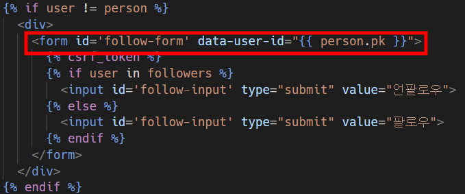
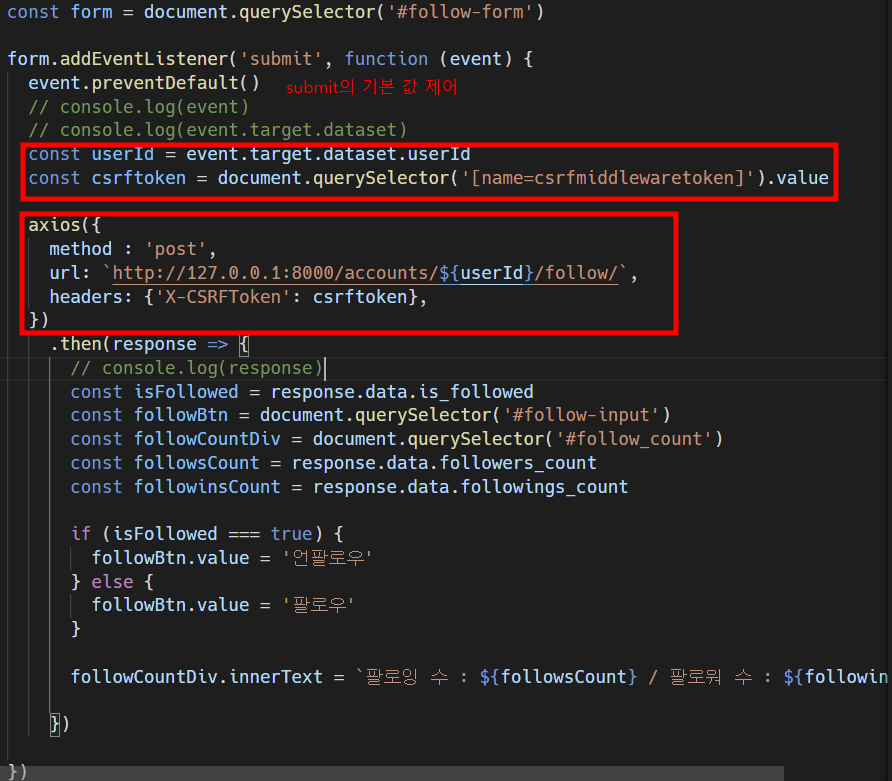
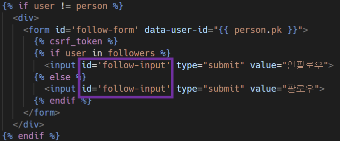
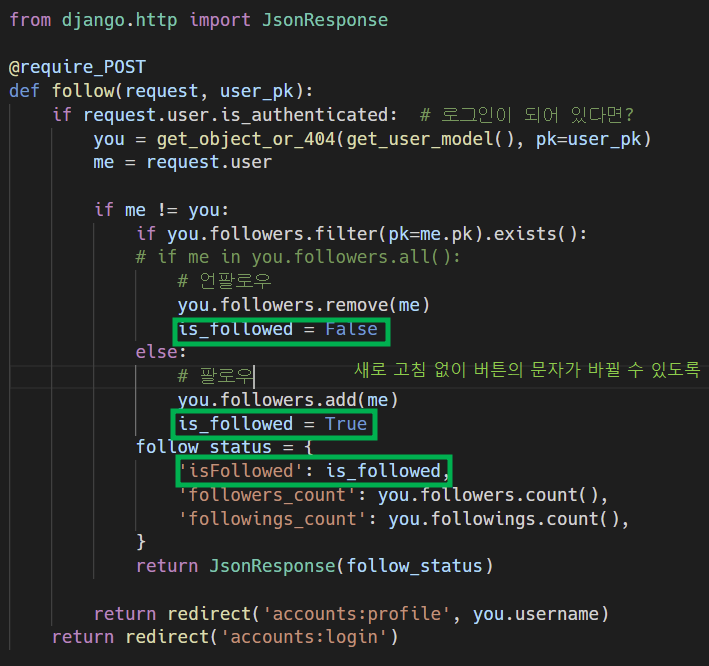
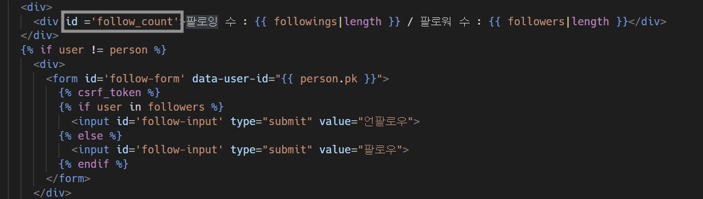
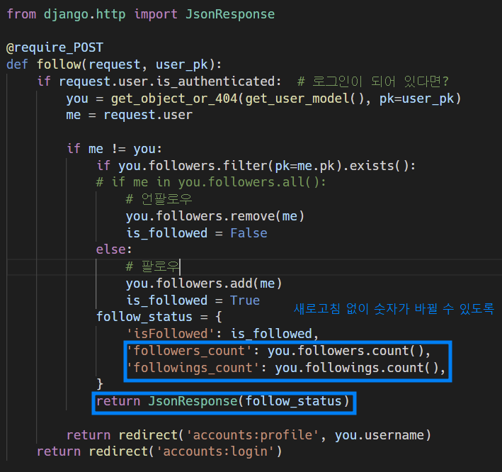
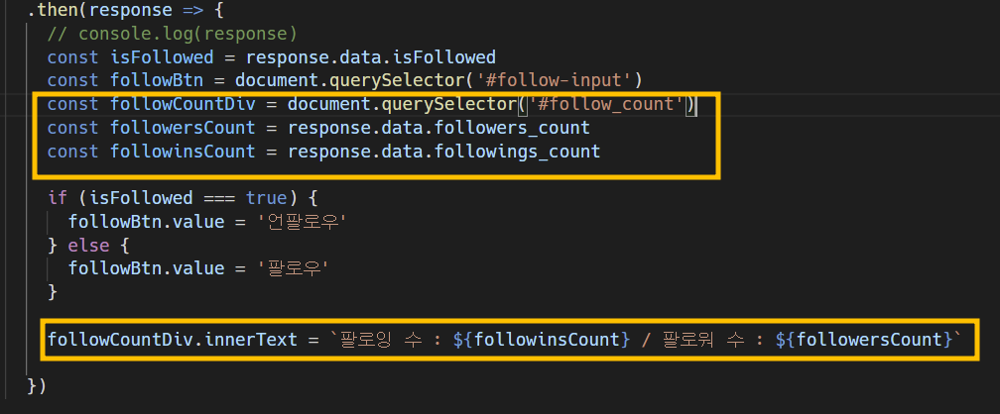

# 0503

## Django -> Js

[TOC]

### 1. 순서

1. form action / method 삭제 (axios로 대체)

   * `id` : form 선택을 위해
   * `data-user-id` : HTML의 person_pk 값을 받기 위해 (데이터 속성 사용 법)

   

2. user id를 HTML의 data 속성으로 받아옴 (URL 작성)

3. axios로 CSRF 토큰을 함께 보냄 (403 에러 해결, db 반영 문제 없음)

   

4. 아직 새로고침을 해야 결과가 반영됨.(여전히 장고는 문서를 응답하기 때문이다.)

   * 새로 고침 없이 버튼의 문자가 바뀔 수 있도록 

     

   

   * 새로고침 없이 숫자가 바뀔 수 있도록

     

   

   

5. 장고에서 문서가 아닌 json을 응답

6. 자바 스크립트가 json 데이터를 받아서 dom을 조작

```django
...
  <h1>{{ person.username }}의 프로필 페이지</h1>
  
    <div>
      <div id ='follow-count'>팔로잉 수 : {{ followings|length }} / 팔로워 수 : {{ followers|length }}</div>
    </div>
    
      <div>
        <form id='follow-form' data-user-id="{{ person.pk }}">
          
          
            <input id='follow-input' type="submit" value="언팔로우">
          
            <input id='follow-input' type="submit" value="팔로우">
          
        </form>
      </div>
    
  
...
```

```django
<script>
  // 1. 전체 form 데이터 선택!
  const form = document.querySelector('#follow-form')

  // 2. form 데이터에 submit이 들어왔을 경우 이벤트 만들기
  form.addEventListener('submit', function (event) {
      
    event.preventDefault()
    // console.log(event)
    // console.log(event.target.dataset)
    // 2-1. axios 주소를 사용하기 위해 userId 가져오기
    const userId = event.target.dataset.userId
    const csrftoken = document.querySelector('[name=csrfmiddlewaretoken]').value
	
    // 2-2. axios 사용하기!!
    axios({
      method : 'post',
      url: `http://127.0.0.1:8000/accounts/${userId}/follow/`,
      headers: {'X-CSRFToken': csrftoken},
    })
      .then(response => {
        // console.log(response)
        
        // 2-2-1. 팔로우누르면 버튼은 '언팔로우', 언팔로우 누르면 버튼은 '팔로우'
        const isFollowed = response.data.isFollowed
        const followBtn = document.querySelector('#follow-input')
        // 2-2-2. 팔로잉 수, 팔로워 수 비동기로 바꾸기
        const followCountDiv = document.querySelector('#follow-count')
        const followersCount = response.data.followers_count
        const followinsCount = response.data.followings_count

        if (isFollowed === true) {
          followBtn.value = '언팔로우'
        } else {
          followBtn.value = '팔로우'
        }

        followCountDiv.innerText = `팔로잉 수 : ${followinsCount} / 팔로워 수 : ${followersCount}`
      
      })

  })

</script>
```

```python
from django.http import JsonResponse

@require_POST
def follow(request, user_pk):
    if request.user.is_authenticated:
        you = get_object_or_404(get_user_model(), pk=user_pk)
        me = request.user

        if me != you:
            if you.followers.filter(pk=me.pk).exists():
                # 언팔로우
                you.followers.remove(me)
                is_followed = False
            else:
                # 팔로우
                you.followers.add(me)
                is_followed = True
            follower_status= {
                'is_followed' : is_followed,
                'followers_count' : you.followers.count(),
                'followings_count' : you.followings.count(),
            }
            return JsonResponse(follower_status)

        return redirect('accounts:profile', you.username)
    return redirect('accounts:login')

```


---

### 2. Java에서 csrf token 사용

```django

<script>
const csrftoken = document.querySelector('[name=csrfmiddlewaretoken]').value;

axios({
  method: 'POST',
  url : ``,
  headers: {'X-CSRFToken': csrftoken},
})

</script>
```

### 3. HTML의 데이터를 Java에서 사용하기 : 데이터 속성 사용하기

* form의 속성으로 `user-*`에 작성해주는 것이 일반적이다.