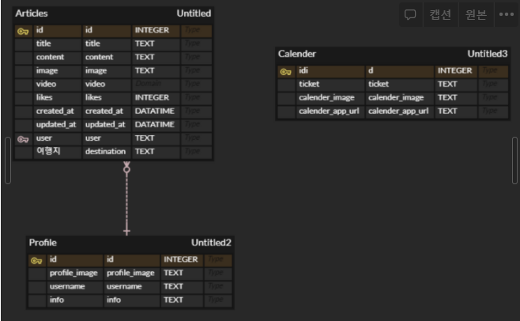

# 1. Database 설계 및 SQL 작성

오채명_서울7반


## 0. 프로젝트 이름

"여행메이트"

 여행하는 내내 함께 하며 일정을 알려주고, 정보를 빠르게 제공할 수 있는 어플, 웹 서비스가 되고자 여행 메이트라는 이름을 지었습니다. 


## 1. ERD 및 INDEX



### 1. Articles

articles는 여행을 기록할 수 있는 게시글입니다. 제목과 내용, 사진, 동영상등을 통해 여행을 기록할 수 있습니다. 이때 다양한 이모지와 템플릿을 제공하여 나만의 여행 기록을 만들 수 있도록 합니다. 

### 2. Profile

profile은 유저의 정보를 담는 공간입니다. 이름과 소개, 그동안 작성했던 게시글(첫번째 사진 혹은 사용자가 원하는 이미지)을 모아 볼 수 있습니다. 

### 3. Calendar

calendar는 여행일정을 기록해주는 달력입니다.

다양한 디자인이 있지만 위의 사진을 예로 들자면 여행의 출발일부터 도착일까지 원하는 색으로 표시할 수 있고, 해당일을 클릭하면 사용해야할 티켓, 어플 연동, 일정을 확인할 수 있습니다. 


### 4. INDEX

1. destination 

   :mag_right:  검색 창을 통해 여행지를 검색하면 title과 content에 해당 검색어가 들어간 게시글을 모두 보여줄 수 있어야 한다. 

2. 영상정보 확인 

   영상정보만 확인하기 위해 검색어를 입력하면 검색어가 들어간 영상게시글을 확인할 수 있어야 한다. 


## 2. SQL

[참고] https://cofs.tistory.com/68

```sql
EXPLAIN
SELECT image,video From Articles WHERE username=chaemyeong
```

1. 게시글별 이미지와 영상을 모아 볼 수 있음(사진첩 기능)
2. A 게시글에서 출발일에 따른 여행일정을 확인할 수 있음

3. A 게시글에서 숨긴 게시글을 모아볼 수 있음
4. 캘린더에서 티켓의 이미지를 모아서 확인할 수 있음
5. 여행지에서 가야할 곳의 list를 모아 볼 수 있음.

...

