# PROSN🧊 - 공통프로젝트(A-705)


[TOC]

## 1. 서비스 개요

> ### PROSN

#### IT 공부를 위한 SNS, '프로즌'은 IT 관련 학습 또는 취업을 원하는 사용자들을 위해 개발되었습니다.

- ##### 메인기능

1. 프로즌을 통해 유저들은 **'서로 자유롭게 객관식 문제를 출제하거나 풀이'**할 수 있습니다.
2. 프로즌을 통해 유저들은 **'정보를 게시하거나 열람'**할 수 있습니다.
3. 프로즌은 유저들에게 **'오답노트'** 기능을 제공합니다.
4. 프로즌의 유저들은 **'관심사에 적합한 스터디를 개설하여 구인'**, 혹은 **'기존 스터디에 참여'** 할 수 있습니다.
5. 프로즌의 유저들은 마음에 드는 **'게시글을 본인의 스크랩 폴더에 저장'**해두었다가 추후 **'문제들을 묶어 문제집으로 출제'**할 수 있습니다.
6. 프로즌의서 유저들은 서로를 **'팔로우'**하고 서로의 **'프로필에서 게시글을 확인'**할 수 있습니다.


- ##### 부가기능

1. 조회수, 좋아요, 제출 수 등을 기반으로 인기문제들을 확인하여 사용자들에게 **추천**합니다.

2. 문제 정답을 많이 맞추고 게시글을 많이 작성할수록 유저 랭킹이 상승합니다. (**Point 제도**)
3. 유저들은 본인의 게시글을 제외하고 모든 게시글에 좋아요 혹은 싫어요 버튼으로 **평가**를 할 수 있습니다.
4. 유저들은 제목 혹은 주제별 태그를 통해 원하는 게시글을 **검색**할 수 있습니다.


> ### 서비스 명 / 로고 / 아이덴티티 컬러

#### 서비스명

- **PROSN** : **'Problem 과 SNS 의 합성어'**로, **'IT공부'**라는 공동의 목표를 지닌 이용자들이 함께 성장하며 커뮤니티를 형성해나가는 서비스임을 나타냅니다.


#### 로고

- **메인로고**
  - 서비스명인 PROSN과 비슷한 발음인 FROSEN 에서 착안하여, 따뜻하면서도 세련된 로고로 서비스의 정체성을 나타내고자 하였습니다.
  - 'O'는 눈꽃 모양으로 대체하였으며 특히 여섯방향으로 뻗어나가는 화살표를 통해 다방면으로 성장하는 사용자의 목표를 나타냈습니다.


- **아이콘로고**


#### 아이덴티티 컬러

- 🟣**Purple To Blue**🔵
  - 부드러운 보라색과 세련된 파란색을 그라데이션으로 사용하여 서비스 전체에 통일감을 주었습니다.


---

## 2. 팀원 소개 및 역할

### 팀장 : 남성은 (Frontend)

- **디자인 팀장**
- **전체 git 관리**
- **README 작성**

### 팀원 : 고유라 (Backend)

- #### JIRA Sprint 관리

- **서버 배포**

- **문서화 (포팅메뉴얼)**

- **발표자료 제작 (PPT)**

### 팀원 : 박성민 (Backend)

- **PM (Project Manager)**
- **DB 설계와 구현, 관리**
- **Backend git 형상관리**

### 팀원 : 오채명 (Frontend)

- **Frontend git 형상관리**
- **영상제작 (UCC / 시연)**

### 팀원 : 임지민 (Frontend)

- **JIRA Sprint 관리**
- **개발 스케줄 관리**
- **중간 / 최종 발표** 

### 팀원 : 정여명 (Backend)

- **팀 노션 관리**
- **서버 배포**
- **문서화 (포팅메뉴얼)**


---

## 3. 기획과 구상

### ERD

#### - [ERDCloud](https://www.erdcloud.com/d/JDYeioffYij3HPwh4)

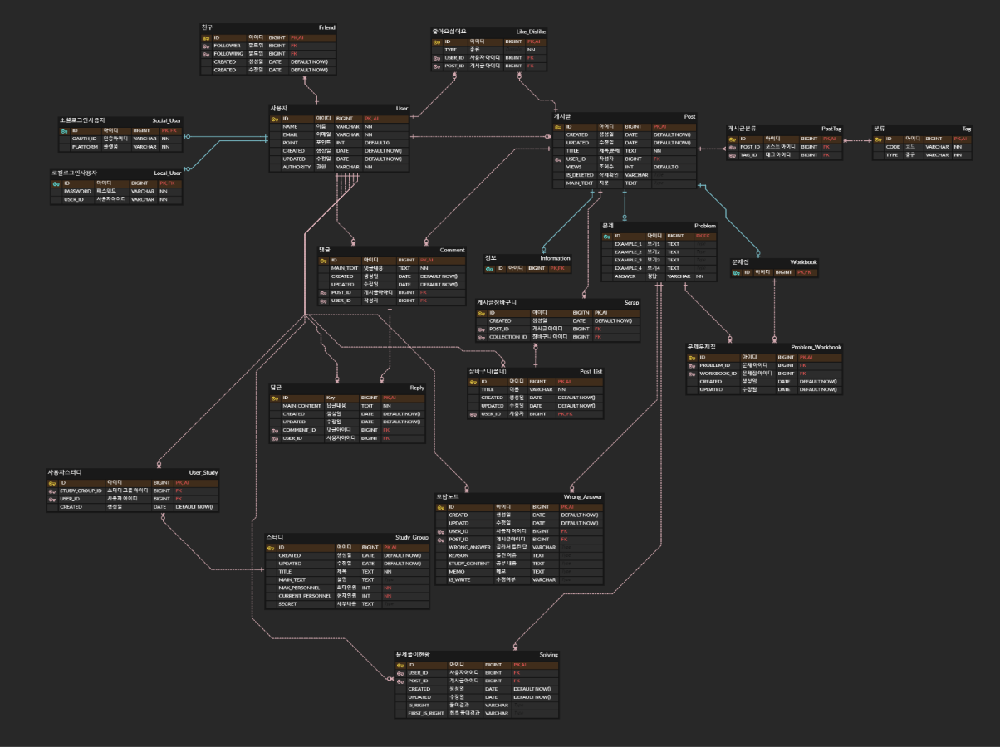


### 와이어프레임 

#### - [Figma](https://www.figma.com/file/lR9MXVBItK2SBzrhLzt5VP/PROSN)

- **디자인 명세**

  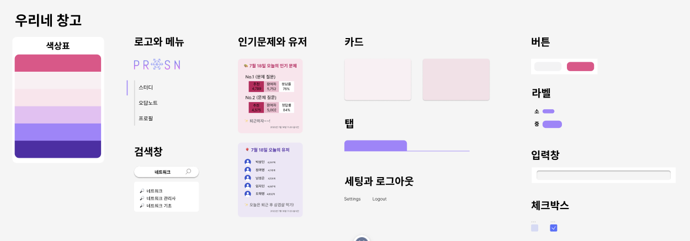

- **메인화면과 문제풀이**

  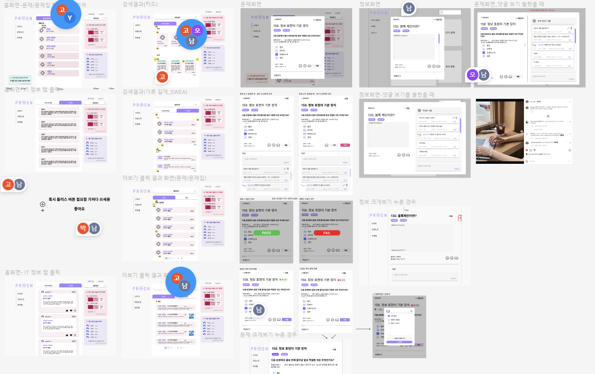

- **프로필**

  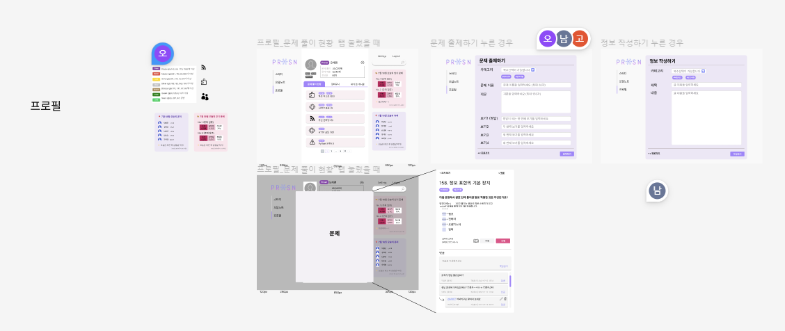

- **스터디**

  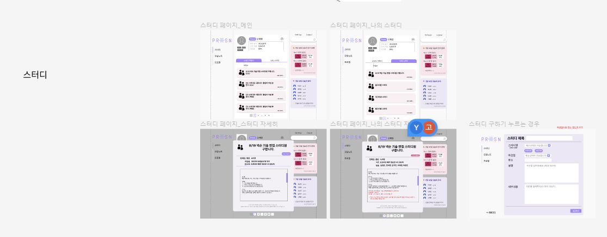

- **오답노트**

  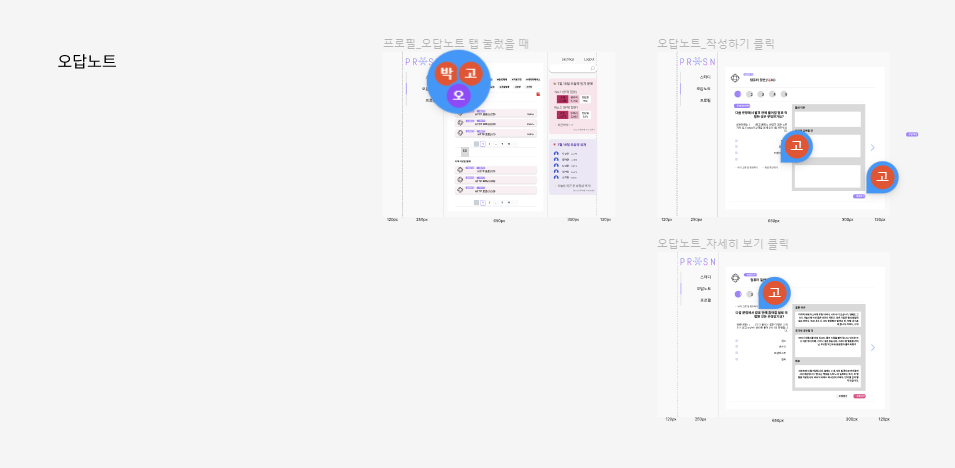


### 파일구조 💾

#### - 백엔드

```
prosn
  ├── controller
  ├── config
  ├── converter
  ├── domain
  ├── dto
  ├── exception
  ├── repository
  ├── security
  └── service
```

#### - 프론트엔드

```
frontend/src
  ├── api
  ├── assets
  ├── components
  ├── plugins
  ├── router
  ├── store
  ├── views
  ├── App.vue
  └── main.js
```


---

## 4. 기술 스택 및 협업 툴

### 기술 스택 ⚙

- #### Backend - Springboot

  - **Intellj IDE**
  - **java 11**
  - **SpringBoot 2.7.1**
  - **JPA**
  - **querydsl**
  - **Spring security** / **Srping validation** / **Spring Web**
  - **redis**
  - **mysql 8.0.30**
  - **Oauth 2.0**
  - **JWT 0.11.5**


- #### Frontend - Vue2

  - **vscode**
  - **vue 2.6.14** / **vuetify 2.6.0** / **vue router 3.5.1** / **vuex 3.6.2**

  - **Html / CSS**

  - **ECMAScript**
  - **Axios**
  - **sweetalert2 5.0.5**


- #### CI / CD

  - **AWS EC2**
  - **Jenkins 2.346.3**
  - **Nginx**
  - **Docker 20.10.17**


### 협업 툴 🛠

- #### Git, Gitlab

  - ##### 컨벤션

    - Git Flow

      **메인 브렌치 - 항상 유지**

      - main(master) : 제출할 수 있는 브렌치
      - develop : 개발 브렌치

      **보조 브렌치**

      - frontend : 프론트엔드 기능을 merge하는 브렌치
      - backend : 백엔드 기능을 merge하는 브렌치
      - feature : 기능을 개발하는 브렌치 - 각각 frontend, backend 브렌치에 머지
        - 브렌치 이름은 feature-back-login 이런식?
      - release : develop 브렌치에 모두 merge 후 테스트하는 브렌치
      - hotfix : release에서 발생한 버그를 수정하는 브렌치

      **Git Commit Convention**

      기본적으로 커밋 메시지는 제목/본문/꼬리말로 구성한다

      ```bash
      type: subject
      
      body
      
      footer
      ```

      - type
        - feat : 새로운 기능 추가
        - fix : 버그 수정
        - docs : 문서 수정
        - style : 코드 포맷팅, 세미콜론 누락, 코드 변경이 없는 경우
        - refactor : 코드 리팩토링
        - test : 테스트 코드, 리팩토링 테스트 코드 추가
        - chore : 빌드 업무 수정, 패키지 매니저 수정
        - design : UI 디자인 변경 (css 등)
        - comment : 주석 추가 및 변경
        - rename : 파일명, 폴더명 수정 또는 이동
        - remove : 파일 삭제
        - setting : 프로젝트 세팅
      - Subject
        - 제목은 50자 이하로. 첫글자는 대문자로 작성. 특수문자(마침표) 붙이지 않기
        - 동사 원형으로 시작
        - 과거시제 사용x
        - 명령어로 작성
        - ex) Added —> Add
      - Body
        - 선택사항. 모든 커밋에 작성할 필요 없음
        - 부연설명이 필요하거나 커밋의 이유를 설명할 경우 작성
        - 72자 이하. 제목과 구분되기 위해 한칸을 띄워 작성
      - footer
        - 선택사항. 모든 커밋에 꼬리말 작성할 필요 없음
        - issue tracker id를 작성할 때 사용

      ex)

      ```bash
      feat: 관심지역 알림 ON/OFF 기능 추가(#123)
      
      시군구의 알림을 각각 ON/OFF 할 수 있도록 기능을 추가함
       - opnion0055: 구분 코드
      
      해결: close #123
      ```

      - body와 footer는 선택사항이기 때문에 우리는 제목(type: subject)를 잘 작성하자
        - type: subject 에서 : 앞뒤로 띄어쓰기 주의


---

- [**Notion**](https://www.notion.so/PROSN-bc0a642949c94a299be953af914a15ed)

  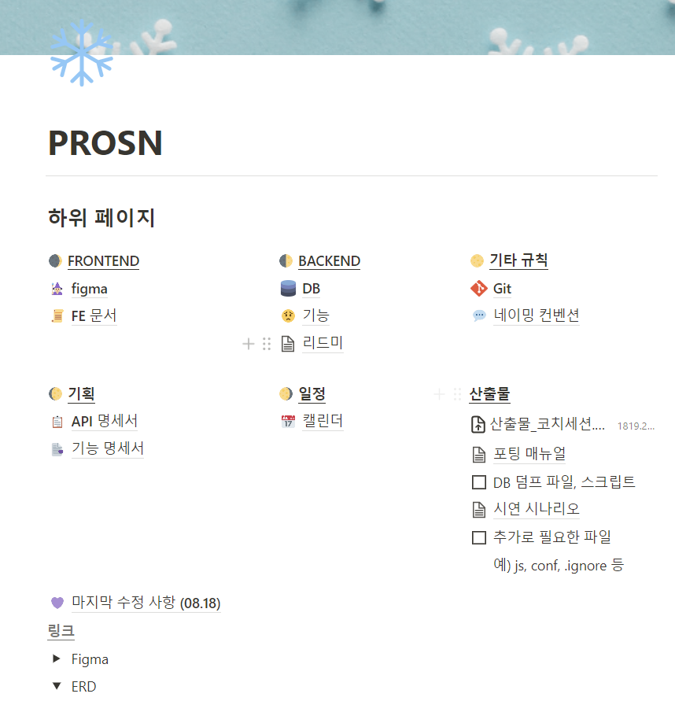


---

- [**Jira**](https://jira.ssafy.com/projects/S07P12A705?selectedItem=com.atlassian.jira.jira-projects-plugin:report-page)

  - **Brundown Chart** (우하향 그래프)

    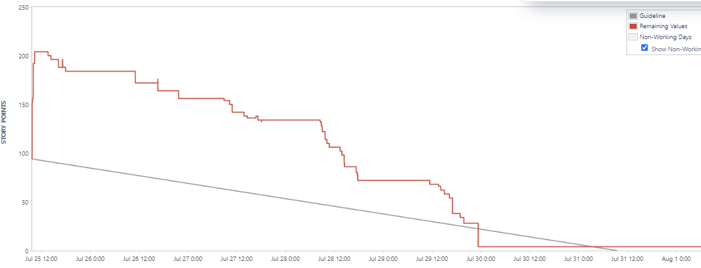

    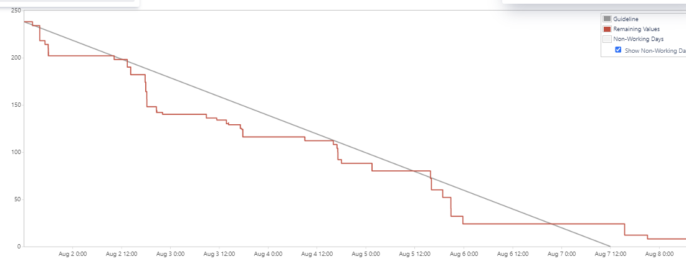

    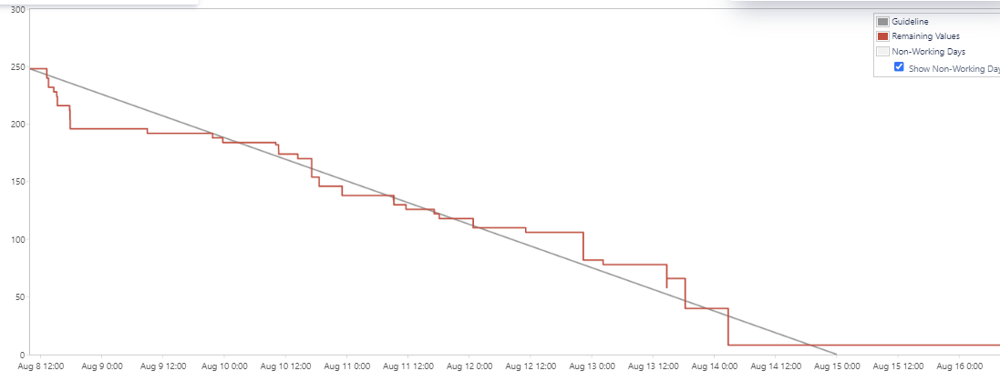

    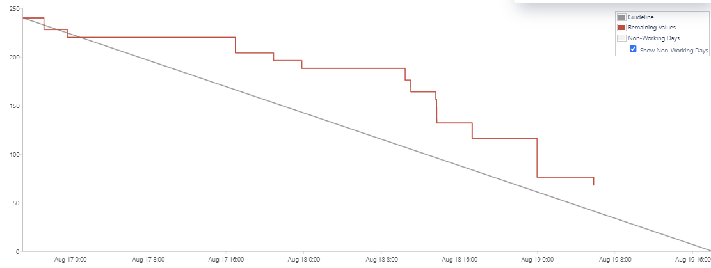


---

- **Webex**
  - 팀회의, 팀미팅
  - 원격조정
- **MatterMost**
  - 팀 메시지
  - 개인 DM
- **Discord**
  - 화면 공유 및 회의


---

## 5. 서비스 구성

### Sign Up (회원가입)

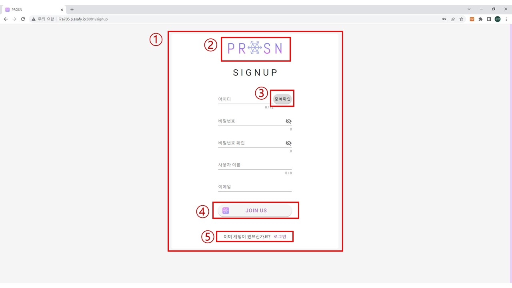

1. 회원가입 페이지에서는 '아이디', '비밀번호', '비밀번호 확인', '사용자 이름', '이메일'란을 모두 입력하여 제출해야 합니다.
2. 상단의 프로즌 로고를 클릭시 프로즌 서비스의 메인화면으로 이동합니다.
3. 아이디를 입력할 경우 ID가 겹치는 사용자가 있는지 확인하기 위해 반드시 중복확인을 거쳐야 합니다.
4. 모든 입력란을 채우고 **'JOIN US'** 버튼을 누르면 회원가입이 완료됩니다.
5. 만약 이미 계정을 가지고 있는 사용자라면 '로그인'을 눌러 로그인 페이지로 이동할 수 있습니다.


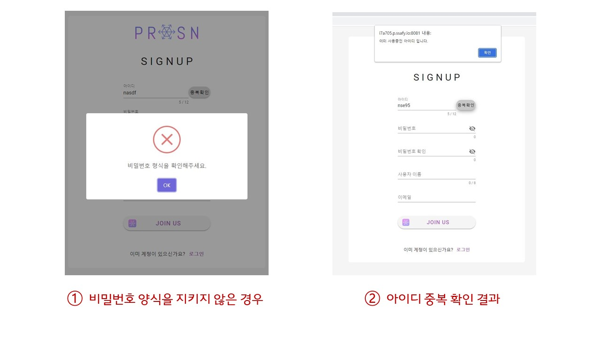

1. 비밀번호 양식(8글자 이상, 문자 + 숫자 + 특수문자)를 지키지 않은 경우에는 사용자에게 비밀번호 양식을 재확인할 것을 요청하고 회원가입은 이루어지지 않습니다.
2. 아이디 중복 확인을 하면 이미 사용중인 아이디임을 알리거나 사용 가능한 아이디임을 알려줍니다. 중복 확인 결과가 사용 가능하다고 나올 경우에만 회원가입이 이루어집니다.


---

### Login

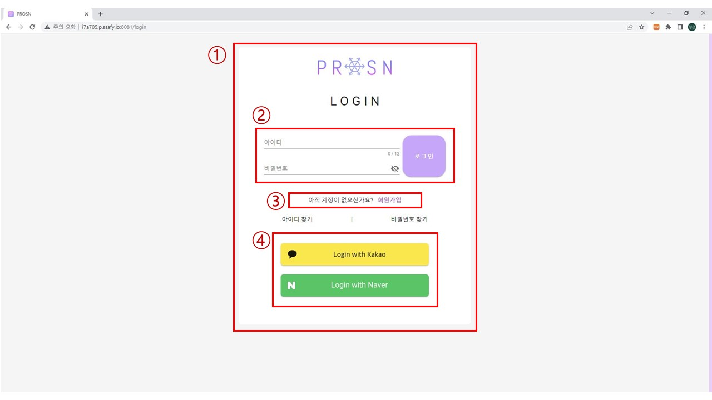

1. 로그인 페이지에서는 크게 **로컬로그인**과 **소셜로그인** 기능을 제공합니다.
2. 로컬로그인의 경우 아이디와 비밀번호를 입력하여 로그인합니다.
3. 만약 로컬계정이 없는 경우, 새로운 계정을 만들고 싶다면 '회원가입'을 눌러 회원가입 페이지로 이동할 수 있습니다.
4. 소셜 로그인은 카카오, 네이버 소셜로그인을 지원합니다.


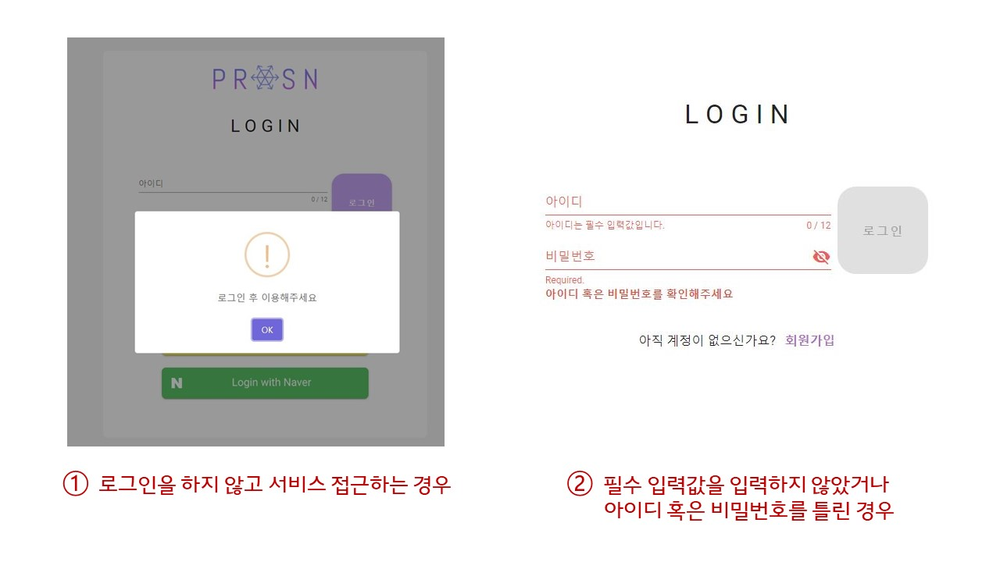

1. 만약 로그인을 하지 않고 프로즌의 서비스에 접근하는 경우 서비스 접근은 제한되며 로그인 페이지로 자동으로 이동됩니다.
2. 로컬로그인 시에 필수 입력값(아이디와 비밀번호)가 입력되지 않았거나 아이디 혹은 비밀번호를 틀린경우에는 경고메세지를 출력하며 로그인이 이루어지지 않습니다.


---

### MainPage

#### - 각 구성요소 살펴보기

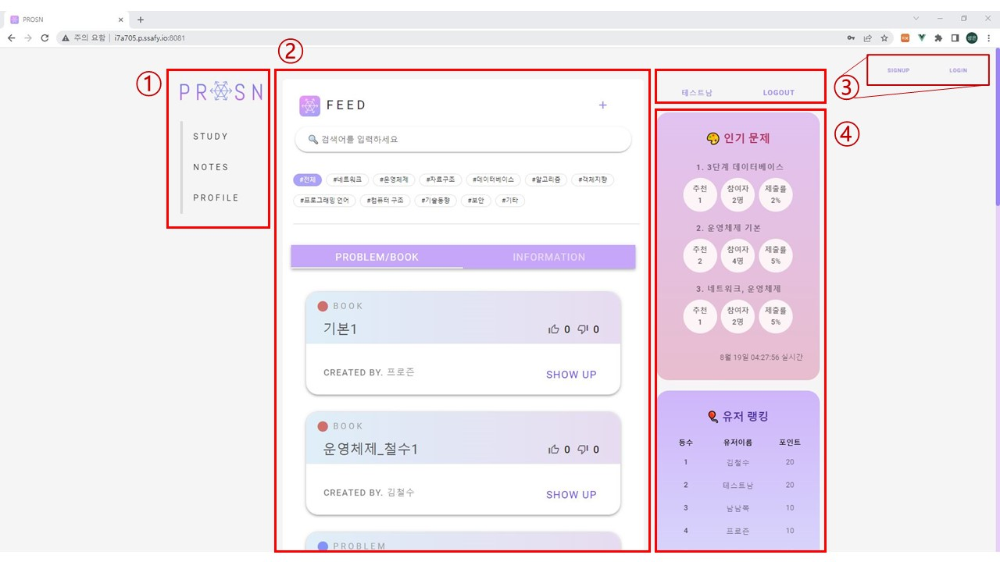

1. **내비게이션 바**
   - 내비게이션 바는 좌측 상단에 표시되며 총 4가지 경로의 버튼으로 이뤄져있습니다.
   - 가장 상단 로고부터 차례로 '메인피드', '스터디페이지', '오답노트페이지', '프로필페이지'로 이동이 가능합니다.
2. **메인 컨텐츠**
   - 메인컨텐츠는 각 페이지 별로 해당 컨텐츠를 띄워주는 부분입니다.


3. **계정**

- 로그인 전 : 회원가입과 로그인 버튼을 표시합니다.
- 로그인 후 : 프로필과 로그아웃 버튼을 표시합니다.

4. **사이드 바**

- 인기문제: 추천, 참여자, 제출율을 사용하여 상위 3개 문제를 추천합니다.

- 유저랭킹: 사이트 활동을 기준으로 주어지는 포인트로 상위 5명의 유저를 표시합니다.

  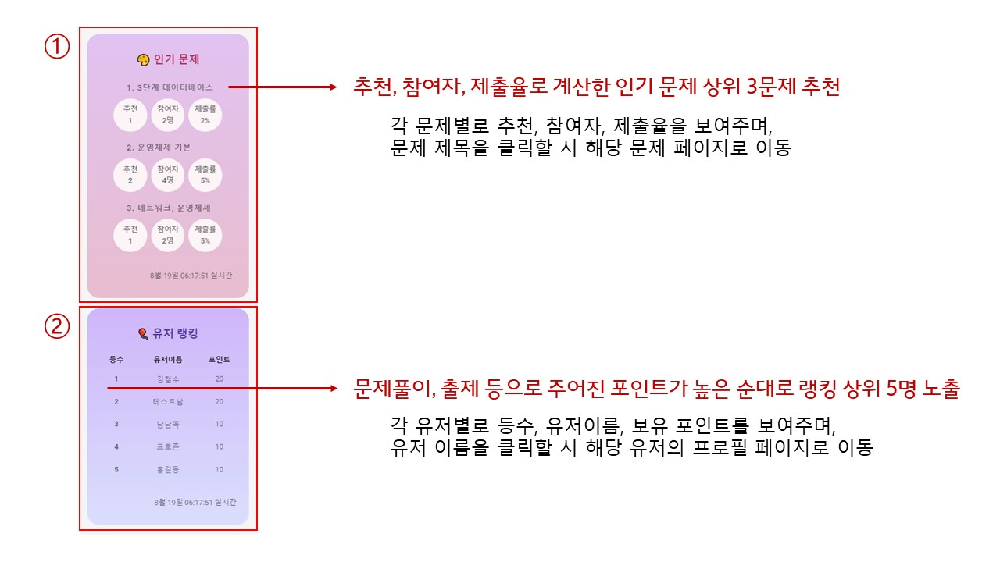


#### - 검색

게시글 검색 방법에는 총 두가지 방법이 있습니다.

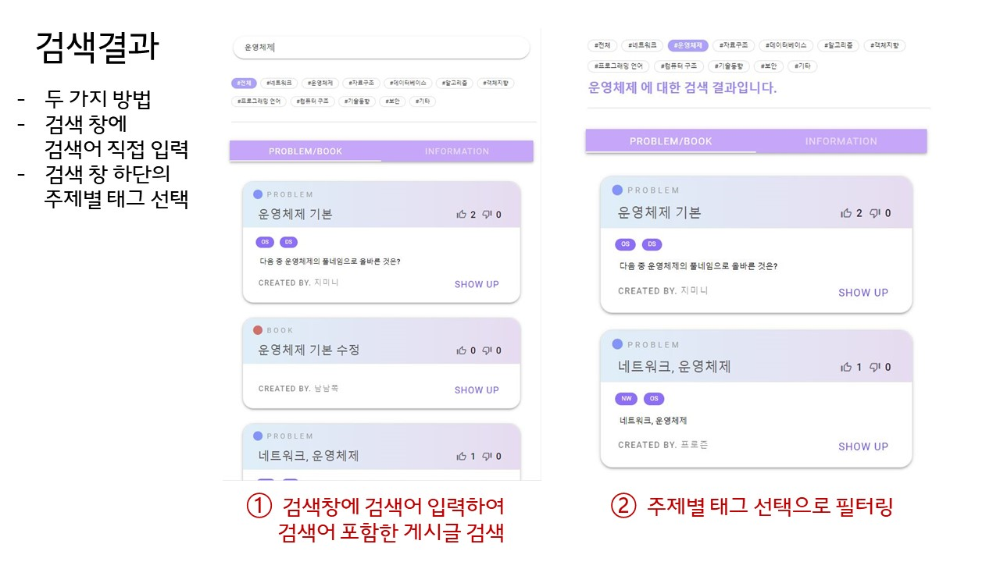

1. 메인피드 상단에 있는 검색창에 직접 검색어를 입력하면 검색어가 포함된 제목을 가진 게시글을 표시해줍니다.
2. 검색창 바로 하단에 있는 주제 태그를 클릭해서 해당되는 주제를 가진 게시글을 표시해줍니다.


#### - 문제 / 문제집 / 정보


1. 메인피드에서 좌측 **PROBLEM / BOOK** 태그를 클릭하면 문제와 문제집(개별 문제들의 묶음)을 최신순으로 볼 수 있습니다. 
2. 우측 **INFORMATION** 태그를 클릭하면 정보글을 최신순으로 볼 수 있습니다.


#### - 카드 컴포넌트

메인화면에서 보여주는 문제/ 문제집/ 정보 게시글들은 전부 처음엔 카드 형태로 보여집니다.

카드 컴포넌트의 구성은 다음과 같습니다.

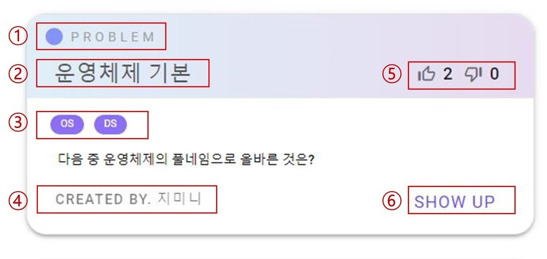

1. 문제/문제집 태그의 경우에는 해당 게시글이 어떤 게시글 타입에 속하는지를 라벨로 나타냅니다. 파란색의 문제, 붉은색의 문제집이 있습니다.
2. 카드의 상단에는 게시글의 제목이 들어갑니다.
3. 해당 게시글이 어떤 주제를 가지고 있는지 보여줍니다.
4. 게시글 작성자가 누구인지를 나타내며, 이 부분을 클릭하면 해당 유저의 프로필 페이지로 이동합니다.
5. 해당 게시글에 대한 좋아요 수와 싫어요 수가 얼마나 되는지를 나타냅니다.
6. **SHOW UP** 버튼을 누르면 문제와 정보의 경우는 모달을 띄워주고 문제집은 해당 페이지로 이동합니다.
   - 문제 정보 모달에서도 자세히 보기를 누르면 각 문제 또는 정보의 페이지로 이동합니다.


#### - 게시글 모달

위의 카드 컴포넌트에서 **SHOW UP** 버튼을 누르면 아래와 같은 모달이 뜹니다.

아래의 모달은 문제 게시글의 모달에 해당되는 부분이며, 정보 모달의 경우는 `1)`부분이 글로 이루어진 것을 제외하면 모두 같은 구성입니다.

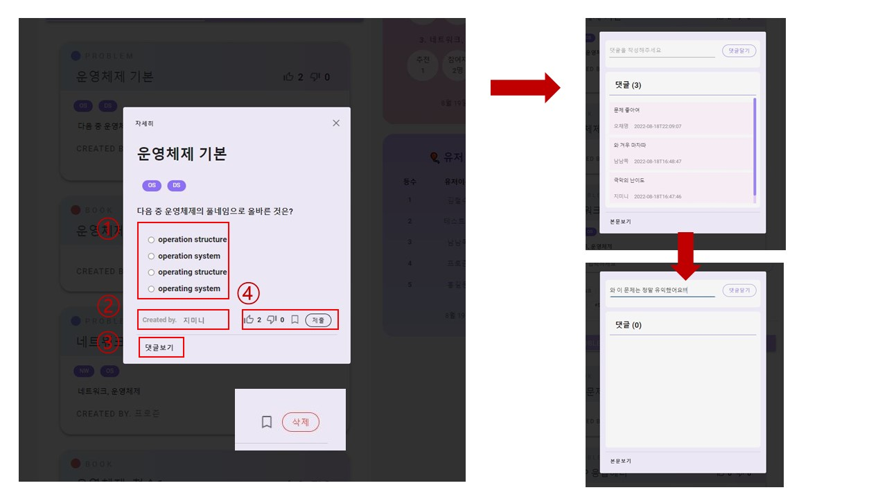

1. 카드에선 보이지 않던 게시글의 본문입니다. 문제의 경우에는 4지의 보기가 나옵니다.
2. 카드와 마찬가지로 게시자의 정보가 뜨며, 클릭시 해당 유저의 프로필 페이지로 이동합니다.
3. 댓글보기 버튼을 클릭시 우측 상단의 모습처럼 댓글 창이 뜨게 되며, 여기서는 댓글 작성과 조회가 가능합니다.
   - 본문보기 버튼을 클릭시 다시 좌측의 모습으로 돌아옵니다.
   - 댓글 작성란에 댓글을 작성한 후 댓글달기를 누르면 댓글이 등록됩니다.
4. 다른 유저의 게시글의 경우 좋아요 싫어요 버튼을 통해 평가가 가능하며 문제는 제출 버튼이 제공됩니다.
   - 내가 쓴 게시글의 경우 평가 버튼은 보여지지 않습니다.
   - 다만 새로운 스크랩 생성, 새로운 문제집 출제를 감안하여 스크랩 버튼은 둘 모두에게 제공합니다.
   - 내가 쓴 게시글의 경우에만 삭제 버튼이 보여집니다.


#### - 스크랩 모달

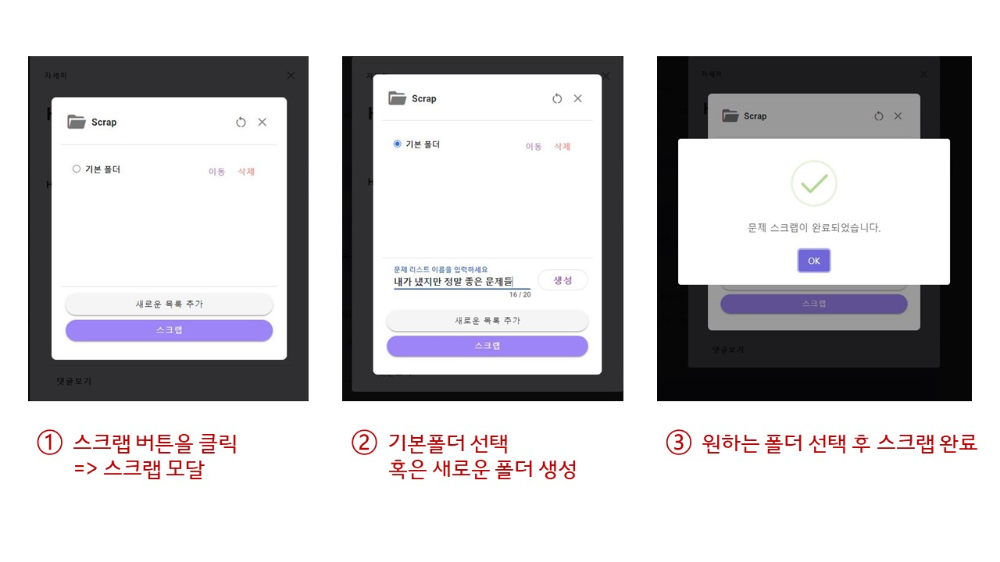

1. 모달 또는 게시글 페이지에서 스크랩 버튼을 클릭하면 스크랩 모달을 띄웁니다.
2. 스크랩 모달에는 기본폴더가 존재하지만 만약 새로운 폴더를 생성하고 싶다면 하단의 **새로운 목록 추가**버튼을 눌러 새로운 폴더를 생성할 수 있습니다.
3. 원하는 폴더를 선택 후에 하단의 **스크랩**버튼을 누르면 문제 스크랩이 완료 됩니다.


#### - 게시글 페이지

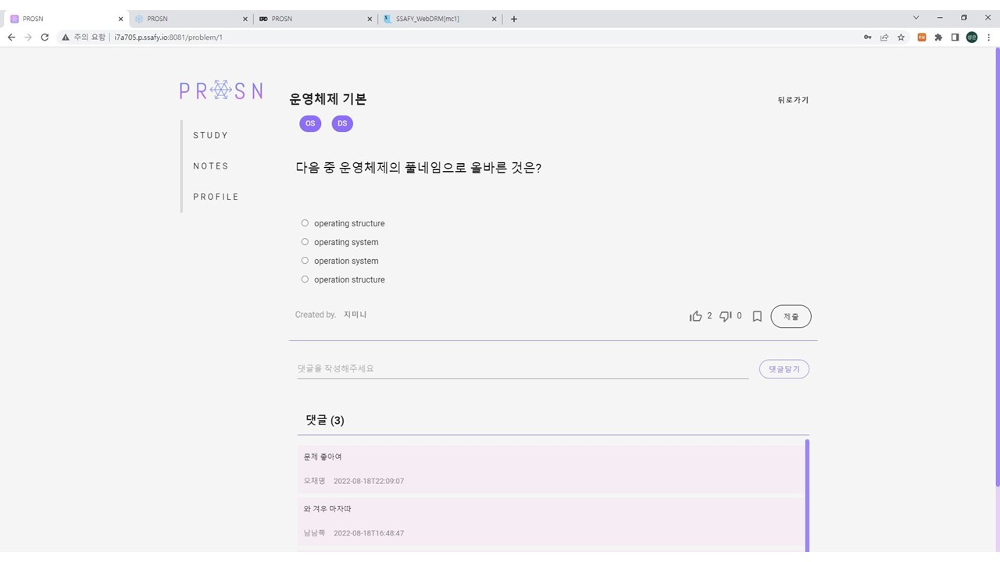

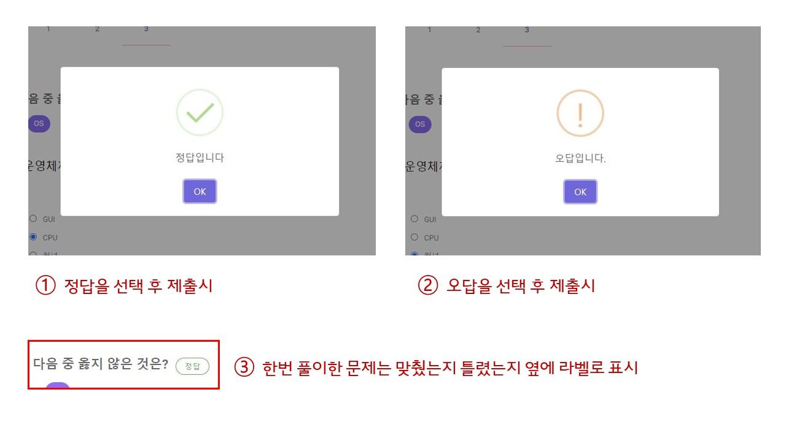

- 게시글 페이지에서는 모달에서 확인한 내용과 구성을 더 큰 화면으로 볼 수 있습니다.

- 문제의 경우 답을 고르고 제출 버튼을 눌렀을 경우 위와 같이 표시됩니다.


---

### Study

#### - 스터디 페이지

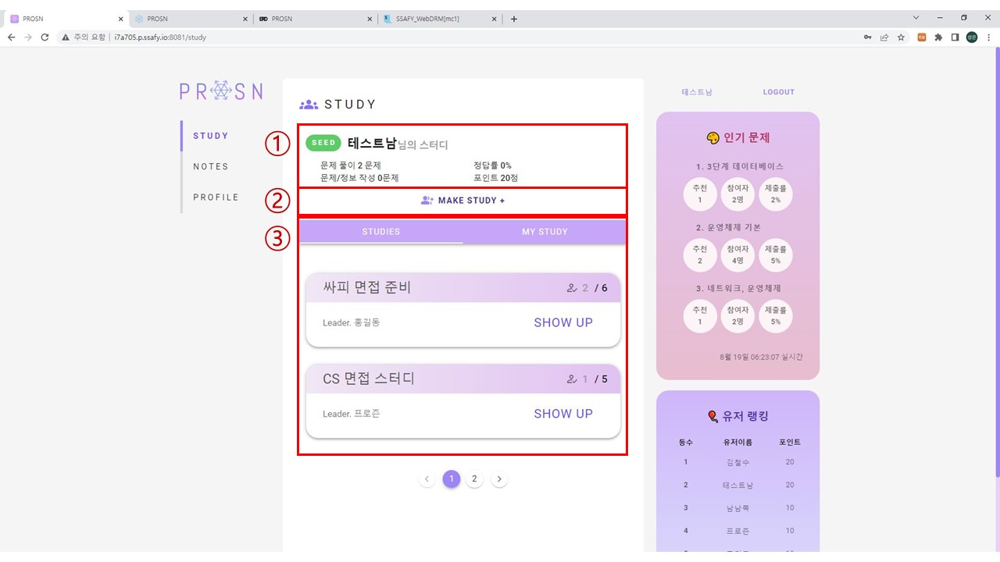

1. 현재 로그인한 사용자의 프로필 세부정보를 띄웁니다. 
2. 스터디 만들기 버튼입니다. 누르면 스터디 만들기 페이지로 이동합니다.
3. 전체 스터디와 나의 스터디를 확인할 수 있습니다.


#### - 스터디 만들기

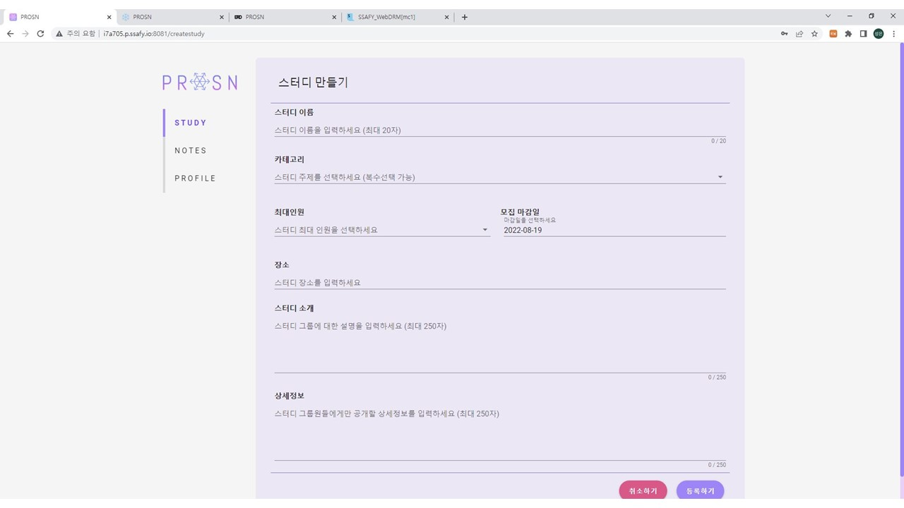


#### - 스터디 카드

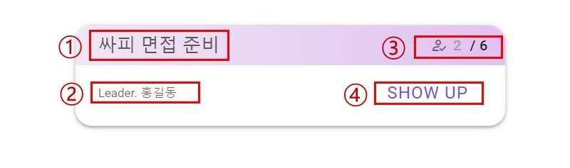

1. 스터디 제목이 표시됩니다.
2. 스터디 장 이름이 표시됩니다.
3. 스터디 총 모집인원과 현재까지의 모집인원 정보가 표시됩니다.
4. 스터디 모달을 띄웁니다.


#### - 스터디 모달과 신청

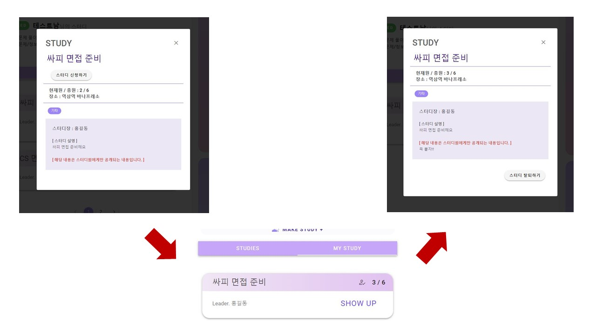

1. 스터디 모달에서 스터디 세부 정보를 확인합니다.
2. **스터디 신청하기** 버튼을 눌러 스터디를 신청합니다.
3. 나의 스터디에서 신청된 스터디를 확인하고 새로 스터디 모달을 띄우면 스터디원에게만 공개되는 내용을 열람할 수 있습니다.


---

### Notes

#### - 오답노트 페이지

- 사용자가 틀린 문제는 시스템 내에서 자동으로 오답노트로 이동됩니다. 
- 여기서 작성하지 않은 오답노트는 상단에 작성한 오답노트는 하단에 표시됩니다.

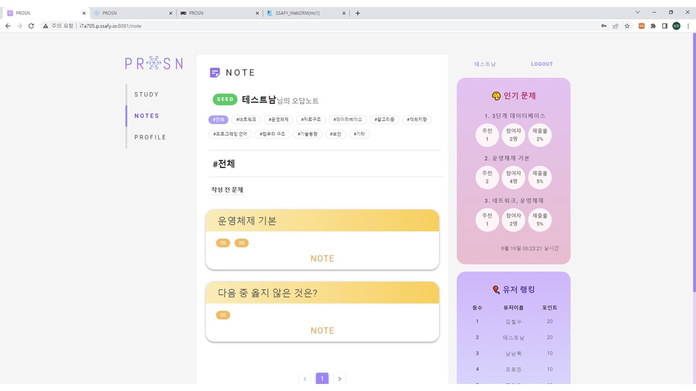


#### - 오답노트 작성 페이지

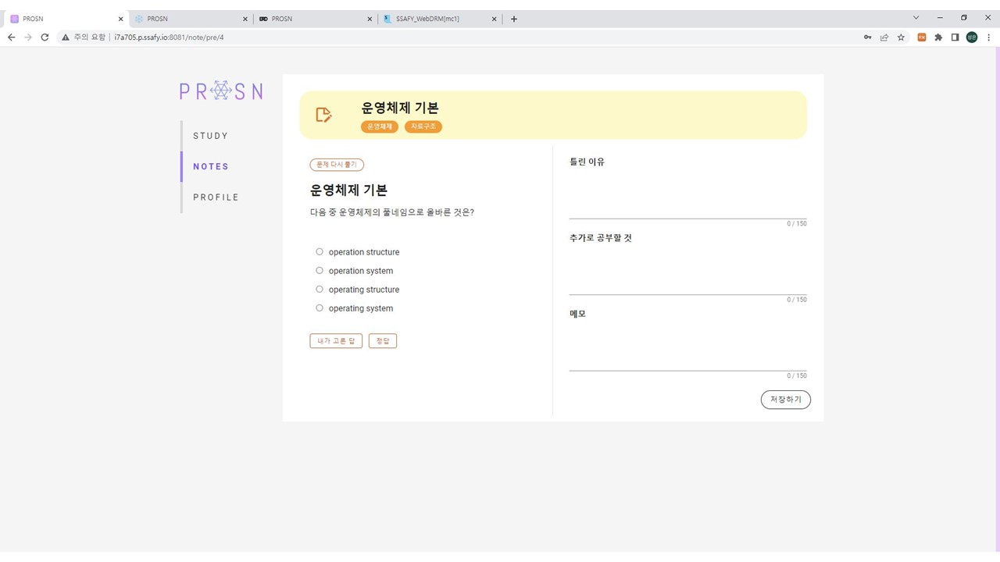

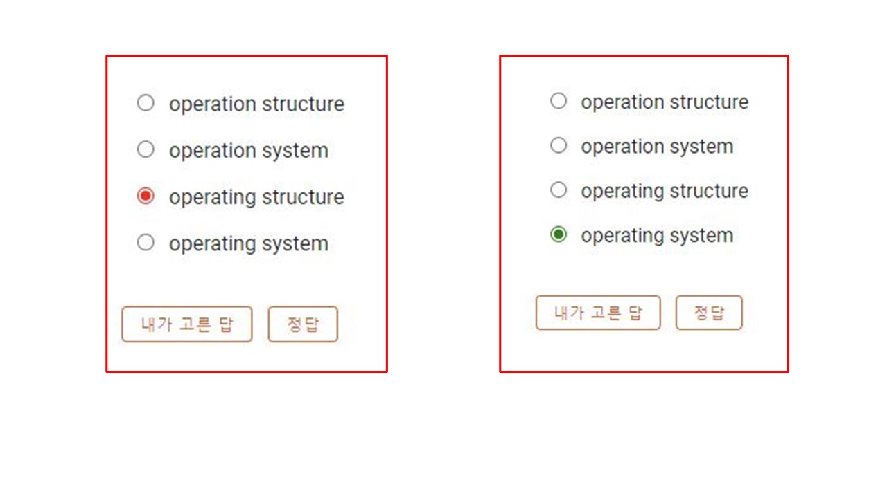

오답노트 카드를 누르면 문제를 볼 수 있습니다.

**문제 다시 풀기**를 누르면 문제페이지로 이동되고, 하단의 **내가 고른 답**과 **정답** 버튼을 눌러 각각 해당되는 답안을 확인할 수 있습니다.

우측에서는 틀린이유와 추가로 공부할 사항, 메모를 작성할 수 있으며 추후 수정과 삭제가 자유롭게 가능합니다.


---

### Profile

#### - 프로필 페이지

##### 나의 프로필 페이지

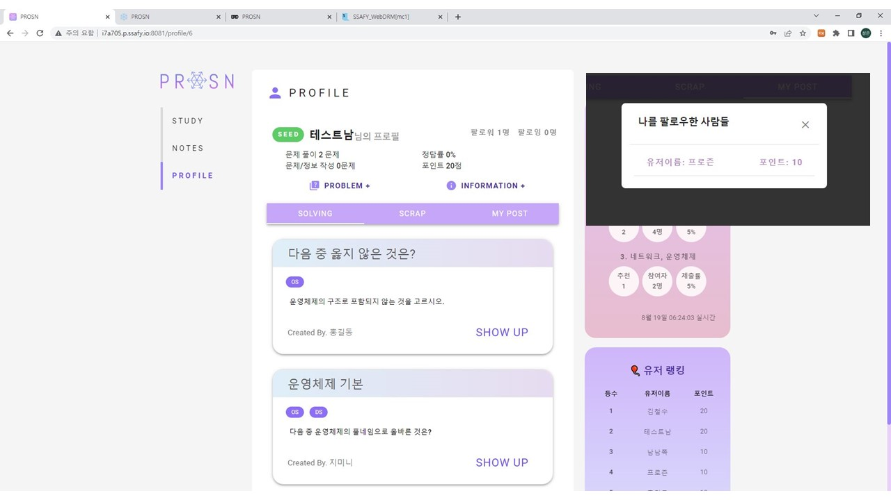

- 나의 프로필 페이지에서는 문제 출제과 정보글 게시가 가능합니다.
- 우측 상단의 팔로워 / 팔로잉 버튼을 클릭하면 나의 팔로워 또는 내가 팔로우한 사람들의 리스트를 모달로 확인 가능하며 이름을 클릭하면 해당 유저의 프로필로 이동합니다.
- 하단의 탭에서는 나의 문제풀이 현황, 나의 스크랩리스트, 나의 게시글을 확인할 수 있습니다.


##### 다른 유저의 프로필 페이지

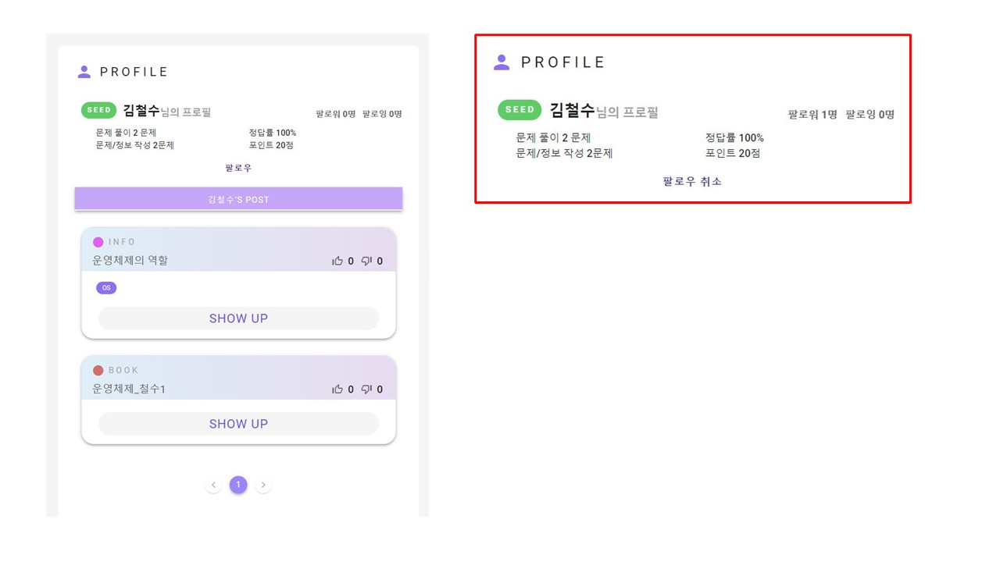

- 다른 사람의 프로필에서는 해당 유저의 세부 정보과 팔로우 팔로잉 수를 확인할 수 있습니다.
- **팔로우** 버튼으로 해당 유저를 팔로우 할 수 있으며 다시 누르면 언팔로우가 가능합니다.
- 하단에서는 해당 유저의 게시글을 한 번에 확인할 수 있습니다.


#### - 문제 혹은 정보 글 게시페이지

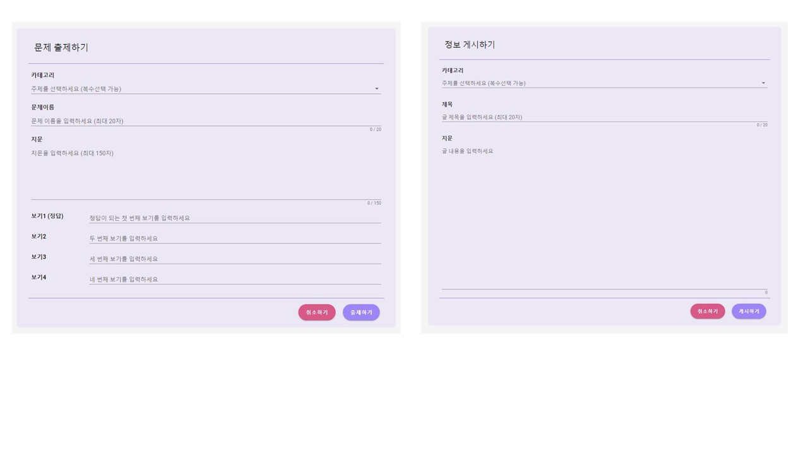

#### - 문제집 출제

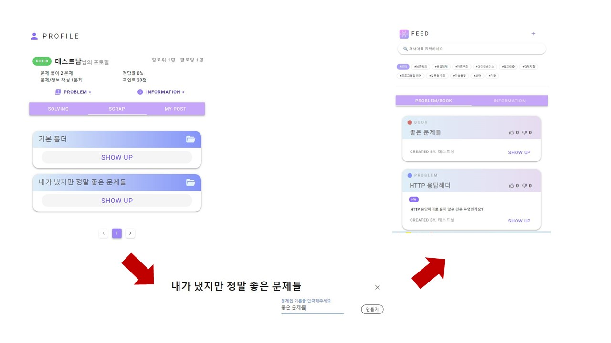

1. 스크랩 폴더를 확인합니다.
2. 스크랩 폴더를 열어 문제집 이름을 입력하고 만들기를 누릅니다.
3. 바로 새로운 문제집 게시글이 등록되고 메인 피드에서 최신순으로 등록되는 것을 확인할 수 있습니다.


#### -문제집 페이지

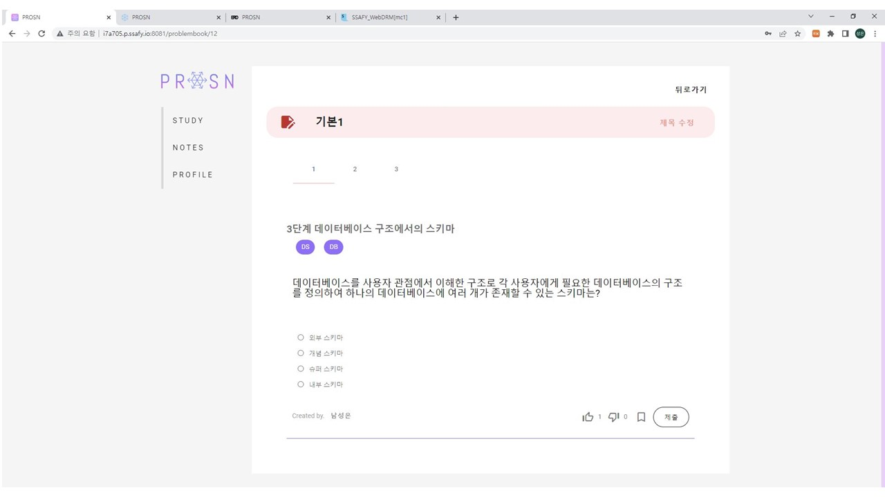

- 문제집 페이지에서는 문제집 내부의 개별 문제들을 하나씩 확인 가능하며 풀이 역시 개별 문제를 조회할 때처럼 가능합니다.