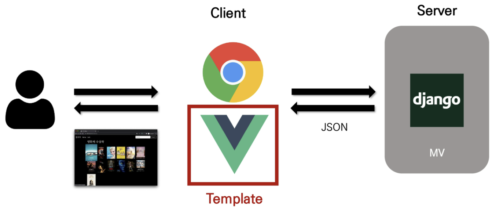
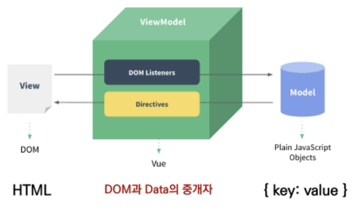
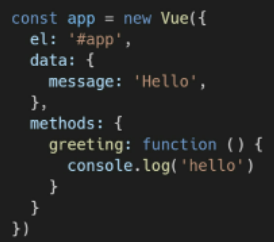

# 05.04

## Vue CDN을 활용한 기초 실습

[TOC]

### 1. Intro

#### 1. Front-End Development

* HTML, CSS 그리고 JS를 활용해서 데이터를 볼 수 있게 만들어 줌/ 이 작업을 통해 사용자(User)는 데이터와 상호작용(Interaction)할 수 있다.
* 대표적인 프론트엔드 프레임워크 : Vue.js, React, Angular

#### 2. Vue.js

* 사용자 인터페이스를 만들기 위한 진보적인 자바스크립트 프레임워크
* 현대적인 tool과 다양한 라이브러리를 통해 SPA(Single Page Application)를 완벽하게 지원

#### 3. SPA

* 단일 페이지 애플리케이션(Single Page Application)
* 현재 페이지를 동적으로 렌더링함으로써 사용자와 소통하는 웹 애플리케이션
* 단일 페이지로 구성되며 서버로부터 최초에만 페이지를 다운로드하고, 이후에는 동적으로 DOM을구성
  * 처음페이지를 받은 이후부터는 서버로부터 새로운 전체 페이지를 불러오는 것이 아닌, 현재 페이지 중 필요한 부분만 동적으로 다시 작성함
* 연속되는 페이지 간의 사용자 경험(UX)을 향상
  * 모바일 사용량이 증가하고 있는 현재 트래픽의 감소와 속도, 사용성, 반응성의 향상은 매우 중요하기 때문
* 동작 원리의 일부가 **CSR(Client side Rendering)의 구조를 따름**

#### 4. SPA 등장 배경

* 과거 웹 사이트들은 요청에 따라 매번 새로운 페이지를 응답하는 방식이었다. MPA(Multi Page Application)
* 스마트폰이 등장하면서 모바일 최적화의 필요성이 대두되었다. : 모바일 네이티브 앱과 같은 형태의 웹 페이지가 필요해짐
* 이러한 문제를 해결하기 위해 Vue.js와 같은 프론트엔드(Front-End) 프레임워크가 등장 : CSR(Client Side Rendering), SPA(Single Page Application)의 등장
* 1개의 웹 페이지에서 여러 동작이 이루어지며 모바일 앱과 비슷한 형태의 사용자 경험을 제공

#### 5. CSR 

* 서버에서 화면을 구성하는 SSR 방식과 달리 클라이언트에서 화면을 구성
* 최초 요청 시 HTML, CSS, JS 등 데이터를 제외한 각종 리소스를 응답받고 이후 클라이언트에서는 필요한 데이터만 요청해 JS로  DOM을 렌더링 하는 방식
* 즉, 처음엔 뼈대만 받고 브라우저에서 동적으로 DOM을 그림
* SPA가 사용하는 렌더링 방식
* [장점]
  1. 서버와 클라이언트 간 트래픽 감소 : 웹 애플리케이션에 필요한 모든 정적 리소스를 최초에 한 번 다운로드 후 필요한 데이터만 갱신
  2. 사용자 경험(UX)향상 : 전체 페이지를 다시 렌더링 하지 않고 변경되는 부분만을 갱신하기 때문
* [단점]
  1. SSR에 비해 전체 페이지 최종 렌더링 시점이 느림
  2. SEO(검색 엔진 최적화)에 어려움이 있음(최초 문서에 데이터 마크업이 없기 때문)

#### 6. SSR

* Server Side Rendering
* 서버에서 클라이언트에게 보여줄 페이지를 모두 구성하여 전달하는 방식
* JS 웹 프레임워크 이전에 사용되던 전통적인 렌더링 방식
* [장점]
  1. 초기구동 속도가 빠름 : 클라이언트가 빠르게 컨텐츠를 볼 수 있음
  2. SEO(검색 엔진 최적화)에 적합 : DOM에 이미 모든 데이터가 작성되어 있기 때문
* [단점]
  1. 모든 요청마다 새로운 페이지를 구성하여 전달 : 반복되는 전체 새로고침으로 인해 사용자 경험이 떨어짐. 상대적으로 트래픽이 많아 서버의 부담이 클 수 있음.

#### 7. SSR & CSR

* 두 방식의 차이는 렌더링의 주최가 누구인가에 다라 결정
* 즉, 실제 브라우저에 그려질(렌더링) HTML을 서버가 만들면 SSR/ 클라이언트가 만든다면 CSR
* SSR과 CSR을 단순 비교하여 '어떤 것이 더 좋다'가 아니라, 내 서비스 또는 프로젝트 구성에 맞는 방법을 적절하게 선택하는 것이 중요
* ex) Django에서 Axios를 활용한 좋아요/팔로우 로직의 경우 대부분은 Server에서 완성된 HTML을 제공하는 구조(SSR)
* 특정 요소(좋아요/팔로우)만 JS(AJAX & DOM 조작)를 활용(CSR) : AJAX를 활용해 비동기 요청으로 필요한 데이터를 클라이언트에서 서버로 직접 요청을 보내 받아오고 JS를 활용해 DOM을 조작



:small_red_triangle: 1차로 서버가 클라이언트에게 HTML 문서 전체를 보내 준 후 다음 요청부터는 Json 파일만 요청한다. 

<br>

### 2. Why Vue.js?

#### 1. 왜 Vue.js를 사용할까?

* 현대 웹 페이지는 페이지 규모가 계속해서 커지고 있으며, 그만큼 사용하는 데이터도 늘어나고 사용자와의 상호작용도 많이 이루어진다.
* 결국 Vanilla JS 만으로는 관리하기가 어려움 

[Vanilla JS와 Vue.JS의 비교]

| Vanilla JS                                                  | Vue.JS                                        |
| ----------------------------------------------------------- | --------------------------------------------- |
| '모든 요소'를 선택해서 '이벤트'를 등록하고 값을 변경해야 함 | DOM과 Data가 연결되어 있고                    |
|                                                             | Data를 변경하면 이에 연결된 DOM은 알아서 변경 |
|                                                             | 우리가 신경써야 할 것은 오직 Data에 대한 관리 |

<br>

### 3. Concepts of Vue.js

#### 1. MVVM Pattern 

1. Model : Key & Value
2. View : HTML
3. View Model



* **Model**
  1. 'Vue'에서 Model은 JavaScript의 object이다.
  2. Object === { key: value}
  3. model은 vue instance 내부에서 `data`라는 이름으로 존재
  2. 이 data가 바뀌면 View(DOM)가 반응한다. 
* **View**
  1. Vue에서 View는 DOM(HTML)이다.
  2. Data의 변화에 따라서 바뀌는 대상
* **ViewModel**
  1. Vue에서 ViewModel은 모든 Vue Instance이다.
  2. View와 Model 사이에서 Data와 DOM에 관련된 모든 일을 처리
  3. ViewModel을 활용해 Data를 얼마만큼 잘 처리해서 보여줄 것인지(DOM)를 고민하는 것

<br>

### 4. Quick Start

#### 1. Django & Vue.JS 코드 작성 순서

1. Django
   * 데이터의 흐름
   * url -> views -> template
2. Vue.js
   * Data가 변화하면 DOM이 변경
   * Data로직 작성 -> DOM 작성

[코드 작성]

```html
<!DOCTYPE html>
<html lang="ko">
<head>
  <meta charset="UTF-8">
  <meta http-equiv="X-UA-Compatible" content="IE=edge">
  <meta name="viewport" content="width=device-width, initial-scale=1.0">
  <title>Vue Quick Start</title>
</head>
<body>
  <!-- 2. 선언적 렌더링 -->
  <h2>선언적 렌더링</h2>
  <div id='app1'>
    {{ message }}
  </div>

  <!-- 3. 엘리멘트 속성 바인딩 -->
  <h2>Element 속성 바인딩</h2>
  <div id="app2">
    {{ message }}
  </div>

  <!-- 4. 조건 -->
  <h2>조건</h2>
  <div id="app3">
    <p v-if="seen">보인다</p>
  </div>

  <!-- 5. 반복 -->
  <h2>반복</h2>
  <div id="app4">
    <ol>
      <li v-for ="todo in todos">
        {{ todo.text }}
      </li>
    </ol>
  </div>

  <!-- 6. 사용자 입력 핸들링 -->
  <h2>사용자 입력 핸들링</h2>
  <div id="app5">
    <p>{{ message }}</p>
    <input v-model='message' type="text">
    <button v-on:click="reverseMessage">로꾸꺼</button>
  </div>

  <!-- 1. Vue CDN -->
  <script src="https://cdn.jsdelivr.net/npm/vue/dist/vue.js"></script>
  <script>
    // 2. 선언적 렌더링
    const app1 = new Vue({
      el:'#app1',
      data: {
        message:'안녕하세요 vue'
      }
    })

    // 3. 엘리먼트 속성 바인딩
    const app2 = new Vue ({
      el:'#app2',
      data:{
        message: '이 페이지는 ' + new Date() + ' 에 로드 되었습니다'
      }
    })

    // 4. 조건
    const app3 = new Vue ({
      el:'#app3',
      data:{
        seen: true
      }
    })

    // 5. 반복
    const app4 = new Vue ({
      el :'#app4',
      data : {
        todos : [
          { text: 'js 복습' },
          { text: 'vue 배우기' },
          { text: '멋진거 만들기' }
        ]
      }
    })

    // 6. 사용자 입력 핸들링
    const app5 = new Vue ({
      el:'#app5',
      data : {
        message:'안녕하세요'
      },
      methods : {
        reverseMessage: function(){
          this.message = this.message.split('').reverse().join('')
        }
      }
    })

  </script>
</body>
</html>

```

<br>

### 5. Basic Syntax 

#### 1. Vue instance

> 모든 vue 앱은 vue 함수로 새 인스턴스를 만드는 것부터 시작
>
> Vue 인스턴스를 생성할 때는 Options 객체를 전달해야함 
>
> 여러 Options들을 사용하여 원하는 동작을 구현
>
> Vue Instance == Vue Component
>
> ```javascript
> const app = new Vue ({
>     
> })
> ```

* Options/DOM - **el**
  1. Vue 인스턴스에 연결(마운트) 할 기존 DOM 요소가 필요하다. (js에서 querySelector 같은 느낌?)

  2. CSS 선택자 문자열 혹은 HTML Element로 작성
  3. new를 이용한 인스턴스 생성 때만 사용
* Options/Data - **data**
  1. Vue 인스턴스의 **데이터 객체**
  2. Vue 인스턴스의 상태 데이터를 정의하는 곳
  3. Vue template에서 interpolation을 통해 접근 가능
  4. v-bind, v-on과 같은 directive에서도 사용 가능
  5. Vue 객체 내 다른 함수에서 **this 키워드를 통해 접근 가능**
* Opeions/Data - **methods**

  1. Vue 인스턴스에 추가할 메서드(다양한 함수)
  2. Vue template에서 interpolation을 통해 접근 가능
  3. v-on과 같은 directive에서도 사용 가능
  4. Vue 객체 내 다른 함수에서 **this 키워드를 통해 접근 가능**
  5. [주의]
     * 화살표 함수를 메서드를 정의하는데 사용하면 안됨(mothod 안에서는 사용하지 말기!)
     * 화살표 함수가 부모 컨텍스트를 바인딩하기 대문에, 'this'는 Vue 인스턴스가 아님



* **this** 

  1. Vue 함수 객체 내에서 vue인스턴스를 가리킴 

  2. 화살표 함수를 사용하면 안되는 경우

     * data
     * method 정의 

     ```html
       <script src="https://cdn.jsdelivr.net/npm/vue/dist/vue.js"></script>
       <script>
         const app = new Vue ({
           el:'#app',
           data:{
             a:1,
           },
           methods : {
             myFunc:function(){
               console.log(this) // Vue instance
             },
             youFunc: () => {
               console.log(this)  // window
             }
           }
         })
       </script>
     ```

     

#### 2. :star:Template Syntax

* 렌더링 된 DOM을 기본 Vue 인스턴스의 데이터에 선언적으로 바인딩할 수 있는 HTML 기반 템플릿 구문을 사용

  1. Interpolation
  2. Directive

* **Interpolation (보간법)**

  1. Text
     * `<span> 메시지: {{ msg }}</span>`
  2. Raw HTML
     * `<span v-html:id='dynamicId'></span>`
  3. Attrivutes
     * `<div v-bind:id='dynamicId'></div>`
  4. JS표현식
     * {{ number + 1 }}
     * {{ message.split('').reverse().join('') }}

* **Directive(디렉티브)**

  1. **V-접두사**가 있는 특수 속성

  2. 속성 값은 단일 JS 표현식이 됨 (v-for는 예외)

  3. 표현식의 값이 변경될 때 반응적으로 DOM에 적용하는 역할을 함

  4. 전달인자(Arguments) : `:`을 통해 전달 인자를 받을 수도 있음

     .assets/image-20220504134955230.png)

  5. 수식어(Modifiers) : `.`으로 표시되는 특수 접미사, directive를 특별한 방법으로 바인딩 해야 함을 나타냄

     .assets/image-20220504135004098.png)

* **v-text**

  1. 엘리먼트의 textContent를 업데이트
  2. 내부적으로 interpolation 문법이 v-text로 컴파일 됨

  ```html
  <body>
      
    <div id="app">
      <!-- 보간법 -->
      <p>{{ message }}</p>
      <!-- v-text (동일함) --> 
      <p v-text="message"></p>
      <p></p>
    </div>
    
    <script src="https://cdn.jsdelivr.net/npm/vue/dist/vue.js"></script>
    <script>
      const app = new Vue ({
        el:'#app',
        data:{
          message: 'Hello'
        }
      })
    </script>
      
  </body>
  ```

* **v-html**

  1. 엘리먼트의 innerHTML을 업데이트 : XSS 공격에 취약할 수 있음
  2. 임의로 사용자로부터 입력받은 내용은 v-html '절대' 사용 금지

  ```html
  <body>
    <div id="app">
      <p>{{ message }}</p>
      <p v-text="message"></p>
      <p v-html="message"></p>
    </div>
    
    <script src="https://cdn.jsdelivr.net/npm/vue/dist/vue.js"></script>
    <script>
      const app = new Vue ({
        el:'#app',
        data:{
          message: '<stroing>강하닷</strong>'
        }
      })
    </script>
  </body>
  ```

* **v-show**

  1. _조건부 렌더링_ 중 하나
  2. 요소는 항상 렌더링 되고 DOM에 남아있음
  3. 단순히 엘리먼트에 display CSS 속성을 토글하는 것

  ```html
  <body>
    <div id="app">
      <p v-show="isTrue">True</p>
      <p v-show="isFalse">False</p>
    </div>
    
    <script src="https://cdn.jsdelivr.net/npm/vue/dist/vue.js"></script>
    <script>
      const app = new Vue ({
        el:'#app',
        data:{
          isTrue: true,
          isFalse: false,
        }
      })
    </script>
  </body>
  ```

* **v-if, v-else-if, v-else**

  1. _조건부 렌더링_ 중 하나
  2. 조건에 따라 요소를 렌더링
  3. directive의 표현식이 true일 때만 렌더링
  4. 엘리먼트 및 포함된 directive는 토글하는 동안 삭제되고 다시 작성됨

  ```html
  <body>
    <div id="app">
      <p v-if="seen">seen is TRUE</p>
  
      <p v-if="myType === 'A' ">A</p>
      <p v-else-if="myType === 'B' ">B</p>
      <p v-else-if="myType === 'C' ">C</p>
      <p v-else>NOT A/B/C</p>
    </div>
  
    <script src="https://cdn.jsdelivr.net/npm/vue/dist/vue.js"></script>
    <script>
      const app = new Vue ({
        el:'#app',
        data:{
          seen: false,
          myType:'A',
        }
      })
    </script>
  </body>
  ```

* **v-show와 v-if** 비교하기

| v-show(Expensive initial load, cheap toggle)                 | v-if (cheap initial load, expensive toggle)                  |
| ------------------------------------------------------------ | ------------------------------------------------------------ |
| CSS display 속성을 hidden으로 만들어 토글                    | 전달인자가 false인 경우 렌더링 되지 않음                     |
| 실제로 렌더링은 되지만 눈에서 보이지 않는 것이기 때문에 딱 한번만 렌더링되는 경우라면 v-if에 비해 상대적으로 렌더링 비용이 높음 | 화면에서 보이지 않을 뿐만 아니라 렌더링 자체가 되지 않기 때문에 렌더링 비요이 낮음 |
| 하지만, 자주 변경되는 요소라면 한 번 렌더링 된 이후부터는 보여주는지에 대한 여부만 판단하면 되기 때문에 토글 비용이 적음 | 하지만, 자주 변경되는 요소의 경우 다시 렌더링 해야 하므로 비용이 증가할 수 있음. |

* **v-for**

  1. 원본 데이터를 기반으로 엘리먼트 또는 템플릿 블록을 여러번 렌더링 
  2. `item in items` 구문 사용
  3. item 위치의 변수를 각 요소에서 사용할 수 있다.
     * 객체의 경우는 key로 접근
  4. v-for 사용 시 반드시 **key 속성**을 각 요소에 작성한다. 
  5. 가능하면 v-if와 v-for를 동시에 사용하지 말 것

  ```html
  <body>
    <div id="app">
  
      <h2>String</h2>
        <div v-for="char in myStr">
          {{ char }}
        </div>
  
      <h2>Array</h2>
        <div v-for="fruit in fruits">
          {{ fruit }}
        </div>
      
      <h2>Object</h2>
        <div v-for="(fruit, idx) in fruits" :key="idx">
          {{ idx }} => {{ fruit }}
        </div> 
        <div v-for="todo in todos" :key="`todo-${todo.id}`">
          <p>{{ todo.title }} => {{ todo.completed }}</p>
        </div>
  
    </div>
  
    <script src="https://cdn.jsdelivr.net/npm/vue/dist/vue.js"></script>
    <script>
      const app = new Vue ({
        el:'#app',
        data: {
          myStr:'Hello world',
          fruits: ['apple', 'banana', 'coconut'],
          todos: [
            {id:1, title:'todo1', completed:true},
            {id:2, title:'todo2', completed:false},
            {id:3, title:'todo3', completed:true},
          ]
        }
      })
    </script>
  </body>
  ```

* **v-on**

  1. 엘리먼트에 이벤트 리스너를 연결
  2. 이벤트 유형은 전달 인자로 표현함
  3. 특정 이벤트가 발생했을 때,주어진 코드가 실행 됨
  4. 약어(Shorthand)
     * @
     * v-on:click -> @click

  ```html
  <body>
    <div id="app">
      <!-- 메서드 핸들러 -->
      <!-- 이벤트 리스너와 동일 -->
      <button @click="alertHello">Button</button>
      <button @click="alertHello">Button</button>
  
      <!-- 기본 동작 방지 -->
      <p>{{ message }}</p>
      <form action="" @submit.prevent="alertHello">
        <button>gogo</button>
      </form>
  
      <!-- 키 별칭을 이용한 키 입력 수식어 --> 
      <!-- space or enter 를 눌렀을 때만 반응--> 
      <input type="text" @keyup.space="log">
      <input type="text" @keyup.enter="log('asdf')">
  
      <!-- 버튼을 누르면 메시지의 값이 바뀌도록 한다 -->
      <p>{{ message }}</p>
      <button @click="changeMessage">change message</button>
    </div>
    
    <script src="https://cdn.jsdelivr.net/npm/vue/dist/vue.js"></script>
    <script>
      const app = new Vue ({
        el:'#app',
        // 값
        data:{
          message:'HI~',
        },
        // 행동
        methods : {
          alertHello : function(){
            alert('hello')
          },
          log: function(event){
            console.log(event)
          },
          changeMessage(){
            this.message = '동시에 바꿀꺼야!!'
          }
        }
      })
  
    </script>
  </body>
  ```

* **v-bind**

  1. HTML 요소의 속성에 Vue의 상태 데이터를 값으로 할당
  2. Object 형태로 사용하면 value가 true인 key가 class 바인딩 값으로 할당
  3. 약어(Shorthand)
     * : (콜론)
     * v-bind:href -> :href

  ```html
    <style>
      .active {
        color: red;
      }
  
      .my-background-color {
        background-color: yellow;
      }
    </style>
  </head>
  <body>
    <div id="app">
      <!-- 속성 바인딩 -->
      
      
      <hr>
  
      <!-- 클래스 바인딩 -->
      <div :class="{ active: isRed }">
        클래스 바인딩
      </div>
      <h3 :class="[activeRed,myBackground]">
        클래스 바인딩
      </h3>
      <hr>
  
      <!-- 스타일 바인딩 -->
      <div :style="{fontSize: fontSize + 'px'}">
        스타일 바인딩
      </div>
    </div>
    
    <script src="https://cdn.jsdelivr.net/npm/vue/dist/vue.js"></script>
    <script>
      const app = new Vue({
        el:'#app',
        data:{
          fontSize : 50,
          imageSrc : 'https://picsum.photos/200/300/',
          isRed : true,
          activeRed: 'active',
          myBackground: 'my-background-color',
  
        }
      })
    </script>
  </body>
  ```

* **v-model**

  1. HTML form 요소 값과 data를 양방향 바인딩
  2. 수식어 
     * .lazy : input 대신 change 이벤트 이후에 동기화
     * .number : 문자열을 숫자로 변경
     * .trim : 입력에 대한 trim을 진행

  ```html
  <body>
    <div id="app">
      <h2>Inpit -> Data 단방향</h2>
      <p>{{ msg1 }}</p>
      <input type="text" @input="onInputChange">
      <hr>
      <h2>Inpit <-> Data 양방향</h2>
      <p>{{ msg2 }}</p>
      <input type="text" v-model="msg2">
      <hr>
      췍! <input type="checkbox" v-model="checked">
  
    </div>
  
    <script src="https://cdn.jsdelivr.net/npm/vue/dist/vue.js"></script>
    <script>
      const app = new Vue ({
        el:'#app',
        data:{
          msg1:'111',
          msg2:'222', 
          checked:'true'
        },
        methods:{
          onInputChange (event){
            this.msg1 = event.target.value
          }
        },
      })
    </script>
  </body>
  ```

* :red_circle: Options/Data - **computed**

  1. 데이터를 기반으로 하는 계산된 속성
  2. 함수의 형태로 정의하지만 함수가 아닌 함수의 반환 값이 바인딩 됨
  3. 종속된 데이터에 따라 저장(캐싱)됨
  4. 종속된 데이터가 변경될 때만 함수를 실행
  5. 즉, 어떤 데이터에도 의존하지 않는 computed 속성의 경우 절대로 업데이트되지 않음
  6. 반드시 반환 값이 있어야 한다. (return 값이 있어야 한다.)

  ```html
  <body>
    <div id="app">
      <input type="text" v-model="r">
      <p>{{ r }}</p>
      <p>{{ area }}</p>
      <p>{{ perim }}</p>
    </div>
    
    <script src="https://cdn.jsdelivr.net/npm/vue/dist/vue.js"></script>
    <script>
      const app = new Vue ({
        el : '#app',
        data:{
          r: 2,
        },
        computed: {
          // 데이터를 통한 값을 얻는게 핵심 (getter 함수)
          // (데이터에 의존하는) 계산된 값
          area(){
            return this.r **2 * 3.14
          },
          perim(){
            return this.r *2 * 3.14
          }
        }
      })
    </script>
  </body>
  ```

* **computed**와 **methods** 비교하기

  1. computed 속성 대신 methods에 함수를 정의할 수도 있다. (최종 결과에 대해 두 가지 접근 방식은 서로 동일하다.)

  2. 차이점은 computed는 종속된 대상이 변경되지 않는 한 cmputed에 작성된 함수를 여러 번 호출해도 계산을 다시 하지 않고 계산되어 있던 결과를 반환
  3. 이에 비해 mothods를 호출하면 렌더링을 다시 할 때마다 항상 함수를 실행

  ```html
  <body>
    <div id="app">
      <div>
        <input type="text" v-model="message">
      </div>
      <p>Original: {{ message }}</p>
      <p>Reverse by method: {{ reverseMessage() }}</p>
      <p>Reverse by computed: {{ reversedMessage }}</p>
    </div>
    
    <script src="https://cdn.jsdelivr.net/npm/vue/dist/vue.js"></script>
    <script>
      const app = new Vue ({
        el : '#app',
        data:{
          message:'Original'
        },
        methods: {
          // 데이터를 바꾸는 로직 (setter 함수)
          reverseMessage(){
            return this.message.split('').reverse().join('')
          }
        },
        computed: {
          // 데이터를 통한 값을 얻는게 핵심 (getter 함수)
          // (데이터에 의존하는) 계산된 값
          reversedMessage(){
            return this.message.split('').reverse().join('')
          }
        }
      })
    </script>
  </body>
  ```

* Options/Data - **watch** (x)

  1. 데이터를 감시
  2. 데이터에 변화가 일어났을 때 실행되는 함수

  ```html
  <body>
    <div id="app">
      <p>{{ num }}</p>
      <button @click="num += 1">add 1</button>
    </div>
    
    <script src="https://cdn.jsdelivr.net/npm/vue/dist/vue.js"></script>
    <script>
      const app = new Vue({
        el: '#app',
        data: {
          num: 2,
        },
        watch: {
          num: function () {
            console.log(`${this.num}이 변경되었습니다.`)
          }
        },
      })
    </script>
  </body>
  ```

* **computed**와 **watch** 비교하기

| computed(선언형 프로그래밍)                                  | watch(명령형 프로그래밍)                                     |
| ------------------------------------------------------------ | ------------------------------------------------------------ |
| 특정 데이터를 직접적으로 사용/가공하여 다른 값으로 만들 때 사용 | 특정 데이터의 변화 상황에 맞춰 다른 data 등이 바뀌어야 할 때 주로 사용 |
| 속성은 계산해야 하는 목표 데이터를 정의하는 방식으로 소프트웨어 공학에서 이야기하는 '선언형 프로그래밍 ' 방식 | 감시할 데이터를 지정하고 그 데이터가 바뀌면 특정 함수를 실행하는 방식 |
|                                                              | 소프트웨어 공학에서 이야기하는 '명령형 프로그래밍' 방식      |
| "특정 값이 변동하면 해당 값을 다시 계산해서 보여준다."       | "특정 값이 변동하면 다른 작업을 한다."                       |
|                                                              | "특정 대상이 변경되었을 때 콜백 함수를 실행시키기 위한 트리거" |
| "계산해야 하는 목표 데이터를 정의"                           | "데이터가 바뀌면 특정 함수를 실행해!"                        |

* Option/Assets - **filter**

  1. 텍스트 형식화를 적용할 수 있는 필터
  2. interpolation 혹은 v-bind를 이용할 때 사용 가능
  3. 필터는 자비스크립트 표현식 마지막에 "|"와 함께 추가되어야 한다.
  4. 이어서 사용(chaining) 가능하다.

  ```html
  <body>
    <div id="app">
      {{ numbers | getOddNumbers }}
      {{ numbers | getUnderTen }}
      {{ numbers | getOddNumbers | getUnderTen }}
      {{ getOddAndUnderTen }}
    </div>
  
    <script src="https://cdn.jsdelivr.net/npm/vue/dist/vue.js"></script>
    <script>
      const app = new Vue({
        el: '#app',
        data: {
          numbers: [1, 2, 3, 4, 5, 6, 7, 8, 9, 10, 11, 12, 13, 14, 15],
        },
        filters:{
          getOddNumbers(array){
            return array.filter(num => num%2)
          },
          getUnderTen(array){
            return array.filter(num => num<10)
          }
        },
        computed: {
          getOddAndUnderTen() {
            return this.numbers.filter(num => num%2 && num<10)
          }
        }
      })
    </script>
  </body>


#### 3. Lifecycle Hooks 

* 각 Vue 인스턴스는 생성 될 때 일련의 초기화 단계를 거침
  * 데이터 관찰 설정이 필요한 경우, 인스턴스를 DOM에 마운트하는 경우, 데이터가 변경되어 DOM를 업데이트 하는 경우 
* 이 과정에서 사용자 정의 로직을 실행할 수 있는 Lifecycle Hooks도 호출됨
* 공식 문서를 통해 각 라이프사이클 훅의 상세 동작을 참고

:small_red_triangle_down: created Hook은 vue 인스턴스가 생성된 후에 호출된다. created를 사용해서 애플리케이션의 초기 데이터를 API요청을 통해 불러올 수 있다. 

```html
<body>
  <div id="app">
    
    <button @click="getImg">GetDog</button>
  </div>
  
  <script src="https://cdn.jsdelivr.net/npm/axios/dist/axios.min.js"></script>
  <script src="https://cdn.jsdelivr.net/npm/vue/dist/vue.js"></script>
  <script>
    const API_URL = 'https://dog.ceo/api/breeds/image/random'
    const app = new Vue({
      el: '#app',
      data: {
        imgSrc: '',
      },
      methods: {
        getImg: function () {
          axios.get(API_URL)
            .then(response => {
              this.imgSrc = response.data.message
            })
        }
      },
      created: function() {
        this.getImg()
        // console.log('Created but not beforeMount ...')
      }
    })
  </script>
</body>
```

