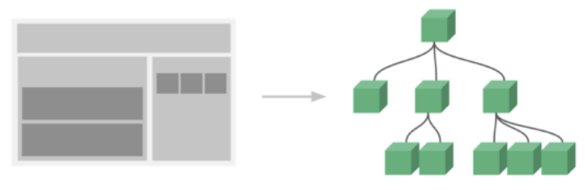
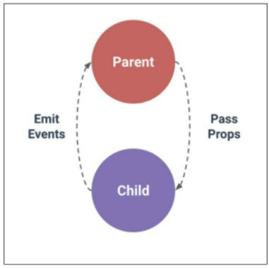
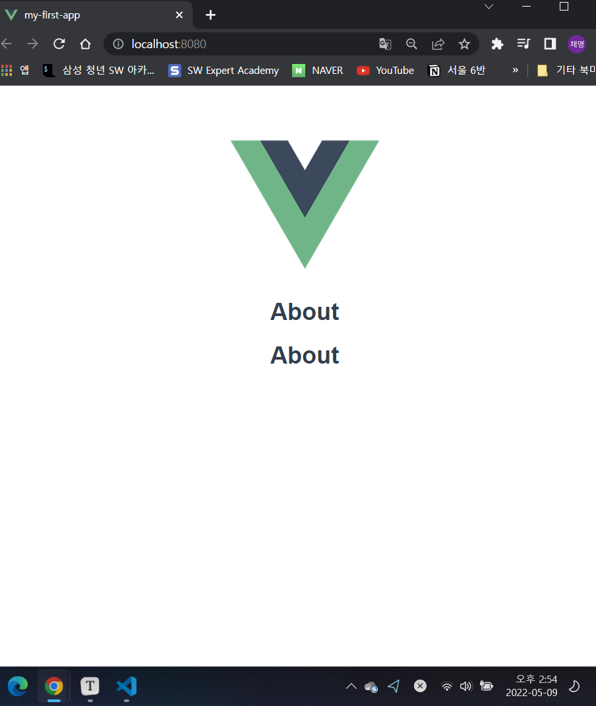
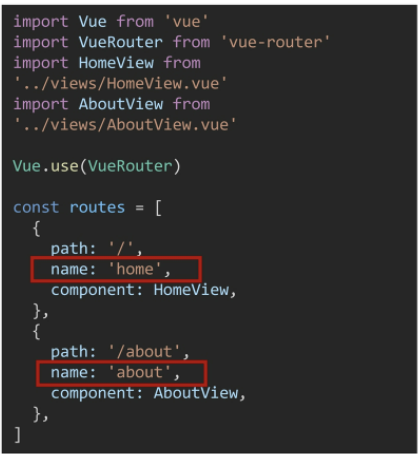
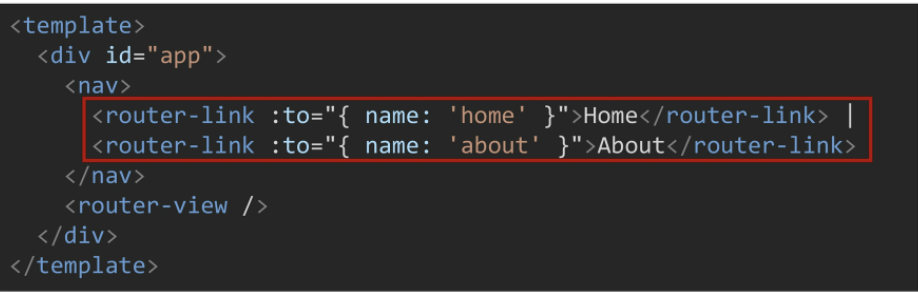

# 05.09

## Vue CDN을 활용한 심화

[TOC]

### 1. SFC(Single File Component)

#### 1. Component(컴포넌트)

* 기본 HTML 엘리먼트를 확장하여 재 사용 가능한 코드를 캡슐화 하는데 도움을 준다. 

* CS에서는 다시 사용할 수 있는 범용성을 위해 개발된 소프트웨어 구성 요소를 의미

* 즉, 컴포넌트는 유지보수를 쉽게 만들어 줄 뿐만 아니라, 재사용성의 측면에서도 매우 강력한 기능을 제공한다.

  `Vue 컴포넌트 === Vue 인스턴스`

#### 2. SFC

* Vue 컴포넌트 기반 개발의 핵심 특징

* 하나의 컴포넌트는 .vue 확장자를 가진 하나의 파일 안에서 작성되는 코드의 결과물

* 화면의 특정 영역에 대한 HTML, CSS, JavaScript 코드를 하나의 파일(.vue)에서 관리

* 즉, .vue 확장자를 가진 싱글 파일 컴포넌트를 통해 개발하는 방식

  `Vue 컴포넌트 === Vue 인스턴스 === .vue 파일`

#### 3. Component 예시

1. 단일 파일 관리
   * 처음 개발을 시작 할 때는 크게 신경 쓸 것이 없기 때문에 쉽게 개발 가능
   * 하지만 코드의 양이 많아지면 변수 관리가 힘들어지고 유지보수에 많은 비용 발생
2. 한 화면을 구성하는 여러 컴포넌트
   * 처음 개발을 준비하는 단계에서 시간 소요가 증가
   * 하지만 이후 변수 관리가 용이하며 기능 별로 유지 & 보수 비용 감소

#### 4. Component 구조 예시



1. 한 화면 안에서도 기능 별로 각기 다른 컴포넌트가 존재
   * 하나의 컴포넌트는 여러 개의 하위 컴포넌트를 가질 수 있다.
   * Vue는 컴포넌트 기반의 개발 환경을 제공한다.
2. Vue 컴포넌트는 `const app = new Vue({...})`의 app을 의미하며 이는 Vue 인스턴스이다.
   * 컴포넌트 기반의 개발이 반드시 파일 단위로 구분되어야 하는 것은 아니다.
   * 단일 .html 파일 안에서도 여러 개의 컴포넌트를 만들어 개발 가능하다. 

> [정리]
>
> 1. Vue 컴포넌트는 Vue 인스턴스(new Vue({})) 이기도 하다. 
> 2. Vue 인스턴스는 .vue 파일 안에 작성된 코드의 집합
> 3.  HTML, CSS, 그리고 JavaScript를 .vue라는 확장자를 가진 파일 안에서 관리하며 개발

<br>

<br>

### 2. Vue CLI

> * Vue.js 개발을 위한 표준 도구
> * 프로젝트의 구성을 도와주는 역할을 하며 Vue 개발 생태계에서 표준 tool 기준을 목표로 한다.
> * 확장 플러그인, GUI, Babel 등 다양한 tool 제공

#### 1. Node.js

* 자바 스크립트를 브라우저가 아닌 환경에서도 구동할 수 있도록 하는 자바스크립트 런타임 환경 (브라우저 밖을 벗어 날 수 없었던 자바스크립트 언어의 태생적 한계를 해결)
* Chrome V8 엔진을 제공하여 여러 OS 환경에서실행할 수 있는 환경르 제공 
* 즉, 단순히 브라우저 만 조작할 수 있던 자바스크립트를 SSR 아키텍처에서도 사용할 수 있도록 한다. 

#### 2. NPM (Node Package Manage)

* 자바스크립트 언어를 위한 패키지 관리자

  * python에 pip 가 있다면 Node.js에는 NPM
  * pip와 마찬가지로 다양한 의존성 패키지를 관리

* Node.js의 기본 패키지 관리자

* Node.js 설치 시 함께 설치된다.

* **Vue CLI Quick Start**

  * 설치

    ```bash
    $ npm install -g @vue/cli
    ```

  * 버전 확인

    ```bash
    $ vue --version
    ```

  * 프로젝트 생성

    ```bash
    $ vue create my-first-app
    ```

  * npm 레지스트리 변경(환경에 따라 나오지 않을 수 있음)

  * 프로젝트 생성 성공

  * 프로젝트 디렉토리 이동

    ```bash
    $ cd my-first-app
    ```

  * 서버 실행

    ```bash
    $ npm run serve
    ```

#### 3. Babel & Webpack

#### 1. Babel

* JavaScript compiler
* 자바스크립트의 ECMAScript 2015+ 코드를 이전 버전으로 번역/변환해 주는 도구
* 과거 자바스크립트의 파편화와 표준화의 영향으로 코드의 스펙트럼이 매우 다양하다. 
  * 이 때문에 최신 문법을 사용해도 이전 브라우저 혹은 환경에서 동작하지 않는 상황이 발생
* 원시 코드(최신 버전)를 목적 코드(구 버전)로 옮기는 번역기가 등장하면서 개발자는 더 이상 내 코드가 특정 브라우저에서 동작하지 않는 상황에 대해 크게 고민하지 않을 수 있게 됨
* 페어프로그래밍 시에 : package.json이 있는 곳에서 `npm install` 치면 됨

#### 2. Webpack

* static module bundler
* 모듈 간의 의존성 문제를 해결하기 위한 도구
* 프로젝트에 필요한 모든 모듈을 매핑하고 내부적으로 종속성 그래프를 빌드함

#### 3. Static Modle Bundler

* 모듈은 단지 파일 하나를 의미

* 배경 

  * 브라우저만 조작할 수 있었던 시기의 자바스크립트는 모듈 관련 문법 없이
  * 하지만 JS와 애플리케이션이 복잡해지고 크기가 커지자 전역 Scope를 공유하는 형태의 기존 개발 방식의 한계점이 드러남
  * 그래서 라이브러리를 만들어 필요한 모듈을 언제든지 불러오거나 코드를 모듈 단위로 작성하는 등의 다양한 시도가 이루어짐

* 여러 모듈 시스템

  1. **ESM(ECMA Script Module)**
  2. AMD(Asynchromous Module Definition)
  3. CommonJS
  4. UMD(Universal Module Definition)

* Module 의존성 문제

  * 모듈의 수가 많아지고 라이브러리 혹은 모듈 간의 의존성(연결성)이 깊어지면서 특정한 곳에서 발생한 문제가 어떤 모듈 간의 문제인지 파악하기 어려움
  * 즉, Webpack은 이 모듈 간의 의존성 문제를 해결하기 위해 등장

  * 모듈 의존성 문제를 해결해 주는 작업을 **Bundling**이라고 함

* 이러한 일을 해결해 주는 도구가 Bundler이고, Webpack은 ㄷ양한 Bundler 중 하나

* 여러 모듈을 하나로 묶어주고 묶인 파일은 하나(혹은 여러 개)로 합쳐짐

* Bundling된 결과물은 더 이상 순서에 영향을 받지 않고 동작하게 됨

* snowpack, parcel, rollup.js 등의 webpack 이외에도 다양한 모듈 번들러 존지

* Vue CLI는 이러한 Babel, Webpack에 대한 초기 설정이 자동으로 되어 있음

> [정리]
>
> 1. Node.js
>    * JavaScripts Runtime Environment
>    * JavaScript를 브라우저 밖에서 실행할 수 있는 새로운 환경
> 2. Babel
>    * Compiler
>    * EX2015+ JavaScript 코드를 구 버전의 JavaScript로 바꿔주는 도구
> 3. Bundler
>    * Module Bundler
>    * 모듈 간의 의존성 문제를 해결하기 위한 도구

<br>

<br>

### 3. Pass props & Emit event

> [컴포넌트 작성]
>
> 1. Vue app은 자연스럽게 중첩된 컴포넌트 트리로 구성된다.
> 2. 컴포넌트간 부모-자식 관계가 구성되며 이들 사이에 필연적으로 의사소통이 필요하다.
> 3. 부모는 자식에게 데이터를 전달(Pass props)하며, 자식은 자신에게 일어난 일을 부모에게 알림(Emit event)
>    * 부모와 자식이 명확하게 정의된 인터페이스를 통해 격리된 상태를 유지할 수 있음
> 4. props는 아래로, events는 위로
> 5. 부모는 props를 통해 자식에게 '데이터'를 전달하고, 자식은 events를 통해 부모에게 '메시지'를 보냄

#### 1. 컴포넌트 구조

1. 템플릿(HTML) 
   * HTML의 body 부분
   * 각 컴포넌트를 작성
   * `template`
2. 스크립트(JavaScript)  
   * 자바스크립트가 작성되는 곳
   * 컴포넌트 정보, 데이터, 메서드 등 vue 인스턴스를 구성하는 대부분이 작성된다.
   * `script`
3. 스타일(CSS)
   * CSS가 작성되며 컴포넌트의 스타일을 담당
   * `style`

#### 2. 컴포넌트 등록

1. 불러오기 (input)
2. 등록하기 (register)
3. 보여주기 (print)



```vue
<template>
  <div id="app">
    
    <!-- 3. 보여주기 (print) -->
    <!-- 카멜케이스 -->
    <TheAbout />
    <!-- 케밥 케이스 -->
    <the-About></the-About>

  </div>
</template>

<script>
// 1. 불러오기(import)
import TheAbout from './components/TheAbout.vue' 

export default {
  name: 'App',
  // 2. 등록하기 (register)
  components: {
    TheAbout,
  }
}
</script>
```



#### 3. pass props 

* props는 부모(상위) 컴포넌트의 정보를 전달하기 위한 사용자 지정 특성
* 자식(하위) 컴포넌트는 props 옵션을 사용하여 수신하는 props를 명시적으로 선언해야 함
* 데이터는 props 옵션을 사용하여 자식 컴포넌트로 전달 됨
* 자식 컴포넌트의 템플릿에서 상위 데이터를 직접 참조할 수 없다. 
* 모든 props는 하위 속성과 상위 속성 사이의 단방향 바인딩을 형성한다. 
  * 부모의 속성이 변경되면 자식 속성에게 전달되지만, 반대 방향으로

#### 4. Emit event

* Listening to Child Components Events
* `$emit(eventName)`
  * 현재 인스턴스에서 이벤트를 트리거
  * 추가 인자는 리스너의 콜백 함수로 전달
* 부모 컴포넌트는 자식 컴포넌트가 사용되는 템플릿에서 v-on을 사용하여 자식 컴포넌트가 보낸 이벤트를 청취(v-on을 이용한 사용자 지정 이벤트)


1. `App.vue` (부모)

   * `:my-message`에서 **v-bind direvtive**를 사용해 부모의 데이터의 props를 동적으로 바인딩하게 되면 부모에서 데이터가 업데이트 될 때마다 자식 데이터로 전달 된다.

     선언시: camelCase :arrow_right: HTML (kebab-case)

   * :red_circle: 컴포넌트의 `data`는 반드시 함수여야 한다.

     기본적으로 각 인스턴스는 모두 같은 data 객체를 공유하므로 새로운 data 객체를 반환(return)하여야 함

```vue
<template>
  <div id="app">
    
    <!-- 3. 보여주기 (print) -->
    <!-- 카멜케이스 -->
    <!-- <TheAbout :my-message='parentData'/> -->
    <!-- 케밥 케이스 -->
    <the-About :my-message='parentData' @child-input-change='parentGetChange'></the-About>

  </div>
</template>

<script>
// 1. 불러오기(import)
import TheAbout from './components/TheAbout.vue' 

export default {
  name: 'App',
  // 2. 등록하기 (register)
  components: {
    TheAbout,
  }, 
  data: function(){
    return {
      parentData: 'This in parent data to child component'
    }
  },
  methods :{
    parentGetChagne: function (inputData) {
      console.log('Boss: 들리는 군..', inputData)
    }
  }
}
</script>

<style>
#app {
  font-family: Avenir, Helvetica, Arial, sans-serif;
  -webkit-font-smoothing: antialiased;
  -moz-osx-font-smoothing: grayscale;
  text-align: center;
  color: #2c3e50;
  margin-top: 60px;
}
</style>
```

2. `TheAbout.vue` (자식)
   * 현재 인스턴스에서 `$emit` 인스턴스 메서드를 사용해 `child-input-change` 이벤트를 트리거
   * 부모에서 `child-input-change` 이벤트가 발생하면 `parentGetChagne` 함수가 실행된다.
   * 이벤트는 자동 대소문자 변환을 제공하지 않기 때문에 이벤트 이름에는 항상 **kebab-case**를 사용하는 것을 권장한다.

```vue
<template>
  <div>
    <h1>{{ myMessage }}</h1>
    <p>아하! div는 하나구나</p>
    <input 
      type="text"
      v-model='childInputData'
      @keyup.enter='childInputChange'
    >
  </div>
  

</template>

<script>
export default {
  name: 'TheAbout',
  // props는 부모에서 받은 데이터를 의미
  // template에서 my-message라고 쓰인 케밥케이스가 자동으로 myMessage인 카멜 케이스로 변경
  props: {
    myMessage: String,
  }, 
  data: function(){
    return {
      childInputData:''
    }
  }, 
  methods: {
    childInputChange: function () {
      console.log('Enter!!', this.childInputData)
      // 부모 컴포넌트에게 '???'라는 이벤트 발생시킨다.
      // 부모 컴포넌트에게 1번인자 라는 이름의 이벤트를 발생 + 2번인자 데이터를 보냄 
      this.$emit('child-input-change', this.childInputData)
    }
  }
}
</script>

<style>

</style>

```

<br>

<br>

### 4. Vue Router

> Vue.js 공식 라우터
>
> 페이지 전환이 아님!!!
>
> 라우트(route)에 컴포넌트를 매핑한 후, 어떤 주소에서 렌더링할 지 알려줌
>
> SAP 상에서 라우팅을 쉽게 개발할 수 있는 기능을 제공한다.
>
> [참고] router
>
> * 위치에 대한 최적의 경로를 지정하며, 이 경로를 따라 데이터를 다음 장치로 전향시키는 장치

#### 1. Vue Router 시작하기

1. 프로젝트 생성 및 이동

   ```bash
   $ vue create my-router-app
   $ cd my-router-app
   ```

2. Vue Router plugin 설치(Vue CLI 환경)

   ```bash
   $ vue add router
   ```

3. commit & History mode 사용 여부 (Yes)

#### 2. Vue Router로 인한 변화

1. App.vue 코드
2. router/index.js 생성
   * 라우트에 관련된 정보 및 설정이 작성 되는 곳
3. views 디렉토리 생성
   * `<router-link>`
     * 사용자 네비게이션을 가능하게 하는 컴포넌트
     * 목표 경로는 'to' prop으로 지정됨
     * HTML5 히스토리 모드에서 router-link는 클릭 이벤트를 차단하여 브라우저가 페이지를 다시 로드 하지 않도록함
     * a 태그지만 우리가 알고 있는 GET 요청을 보내는 a 태그와 조금 다르게, 기본 GET 요청을 보내는 이벤트를 제거한 형태로 구성됨
   * `<router-view>`
     * 주어진 라우트에 대해 일치하는 컴포넌트를 렌더링하는 컴포넌트
     * 실제 component가 DOM에 부착되어 보이는 자리를 의미
     * router-link를 클릭하면 해당 경로와 연결되어 있는 index.js에 정의한 컴포넌트가 위치

4. History mode
   * HTML History API를 사용해서 router를 구현한 것
   * 브라우저의 히스토리는 남기지만 실제 페이지는 이동하지 않는 기능을 지원
   * 즉, 페이지를 다시 로드하지 않고 URL을 탐색할 수 있음 (SPA의 단점 중 하나인 "URL이 변경되지 않는다"를 해결한다.)
   * history 객체는 사용자를 자신의 방문 기록 앞과 뒤로 보내거나, 기록의 특정 지점으로 이동하는 등 유용한 메서드와 속성을 가진다. 

#### 3. Named Routes

> 이름을 가지는 라우트
>
> 명명된 경로로 이동하려면 객체를 vue-router 컴포넌트 요소의 prop에 전달





#### 4. 프로그래밍 방식 네이베이션

* `<router-link>`를 사용하여 선언적 탐색을 위한 a 태그를 만드는 것 외에도, router의 인스턴스 메서드를 사용하여 프로그래밍 방식으로 같은 작업을 수행할 수 있음


#### 5. :game_die: Lotto 뽑아보기

1. 기본 셋팅

2. ```bash
   $ vue add router
   ```

3. `TheLotto.vue`

   ```vue
   <template>
     <div class="lotto">
       <h1>로또번호 추천</h1>
       <h2>{{ $route.params.lottoNum }}개의 번호를 추천합니다.</h2>
       <button @click="getLuckyNums">Pick My Lotto Numbers</button>
       <p>오늘의 추천 로또 번호</p>
       <p>{{ selectedLuckyNums }}</p>
     </div>
   </template>
   
   <script>
   import _ from 'lodash'
   
   export default {
     name: 'TheLotto',
     data: function () {
       return {
         selectedLuckyNums: [],
       }
     },
     methods: {
       getLuckyNums: function () {
         const numbers = _.range(1, 46)
         this.selectedLuckyNums = _.sampleSize(numbers, this.$route.params.lottoNum,)
       }
     },
   }
   </script>
   
   <style>
   
   </style>
   ```

4. `index.js`

   ```js
   import Vue from 'vue'
   import VueRouter from 'vue-router'
   import HomeView from '../views/HomeView.vue'
   import TheLotto from '../views/TheLotto.vue'
   import TheLunch from '../views/TheLunch.vue'
   
   Vue.use(VueRouter)
   
   const routes = [
     {
       path: '/',
       name: 'home',
       component: HomeView
     },
     {
       path: '/about',
       name: 'about',
       // route level code-splitting
       // this generates a separate chunk (about.[hash].js) for this route
       // which is lazy-loaded when the route is visited.
       component: () => import(/* webpackChunkName: "about" */ '../views/AboutView.vue')
     },
     {
       path: '/lotto/:lottoNum',
       name: 'lotto',
       component: TheLotto
     },
     {
       path: '/lunch',
       name: 'lunch',
       component: TheLunch
     }
   ]
   
   const router = new VueRouter({
     mode: 'history',
     base: process.env.BASE_URL,
     routes
   })
   
   export default router
   ```

5. `App.vue`

   ```vue
   <template>
     <div id="app">
       <nav>
         <router-link v-bind:to="{ name: 'home' }">Home</router-link> |
         <router-link v-bind:to="{ name: 'about' }">About</router-link> |  
         <router-link v-bind:to="{ name: 'lunch' }">Lunch</router-link> |
         <router-link v-bind:to="{ name: 'lotto', params: { lottoNum: 6 } }">Lotto</router-link>
       </nav>
       <router-view/>
     </div>
   </template>
   
   <style>
   #app {
     font-family: Avenir, Helvetica, Arial, sans-serif;
     -webkit-font-smoothing: antialiased;
     -moz-osx-font-smoothing: grayscale;
     text-align: center;
     color: #2c3e50;
   }
   
   nav {
     padding: 30px;
   }
   
   nav a {
     font-weight: bold;
     color: #2c3e50;
   }
   
   nav a.router-link-exact-active {
     color: #42b983;
   }
   </style>
   ```

#### 6. :chicken: 점심메뉴

1. `TheLunch.vue`

   * 나머지는 위와 동일

   ```vue
   <template>
     <div class="lunch">
       <h1>점심메뉴</h1>
       <button @click="pickLunchMenu">Pick Lunch</button>
       <p>오늘의 추천 메뉴</p>
       <p>{{ getLunch }}</p>
       <br>
       <h2>로또를 뽑아보자</h2>
       <input type="text" v-model="lottoNum">
       <button @click="movepickLottoNum">Pick Lotto</button>
     </div>
   </template>
   
   <script>
   import _ from 'lodash' 
   
   export default {
     name:'TheLunch',
     data:function (){
       return {
         getLunch: null,
         lottoNum: null,
       }
     }, 
     methods: {
       pickLunchMenu: function () {
         const menus = ['떡볶이', '치킨', '피자', '국밥', '덮밥', '초밥', '마라탕', '짜장면']
         this.getLunch = _.sample(menus)
       }, 
       movepickLottoNum: function () {
         this.$router.push({ name: 'lotto', params: { lottoNum: this.lottoNum }})
       }
     }
   }
   </script>
   ```

   

<br>

<br>

### 5. Youtube Project


<br>
