# 05.11

## 컴포넌트 간 데이터 통신과 뷰

[TOC]

### 1. Vue

#### 1. Vuex Intro

1. **Vuex**

   * "statsment management pattern + Library" for vue.js\

     * 상태 관리 패턴 + 라이브러리

     * 상태(state)를 전역 저장소로 관리할 수 있도록 지원하는 라이브러리
       * 상태가 예측 가능한 방식으로만 변경될 수 있도록 보장하는 규칙 설정
       * 애플리케이션의 모든 컴포넌트에 대한 **중앙 집중식 저장소** 역할

   * Vue의 공식 devtools와 통합되어 기타 고급 기능을 제공

2. **State**

   * state는 곧 data이며 해당 애플리케이션의 핵심이 되는 요소
   * 중앙에서 관리하는 모든 상태 정보

3. **상태 관리 패턴**

   * 컴포넌트의 공유된 상태를 추출하고 이를 전역에서 관리하도록 함
   * 컴포넌트는 커다란 view가 되며 모든 컴포넌트는 트리에 상관없이 상태에 액세스 하거나 동작을 트리거 할 수 있음
   * 상태 관리 및 특정 규칙 적용과 관련된 개념을 정의하고 분리함으로써 코드의 구조와 유지 관리 기능 향상
   * 트리거 : 특정한 동작에 반응해 자동으로 필요한 동작을 실행하는 것

4. **기존 pass props & Emit event**

   * 각 컴포넌트는 독립적으로 데이터를 관리
   * 데이터는 단방향 흐름으로 부모 -> 자식 간의 전달만 가능하며 반대의 경우 이벤트를 트리더
   * [장점]
     * 데이터의 흐름을 직관적으로 파악 가능
   * [단점]
     * 컴포넌트 중첩이 깊어지는 경우 동위 관계의 컴포넌트로의 데이터 전달이 불편해짐

   * 공통의 상태를 공유하는 여러 컴포넌트가 있는 경우 데이터 전달 구조가 매우 복잡해짐

   * 예를 들어, 지나치게 중첩된 컴포넌트를 통과하는 prop

   * 단방향 데이터 흐름

     * state는 앱을 작동하는 원본 소스(data)
     * view는 state의 선언적 매핑
     * action은 view에서 사용자 입력에 대해 반응적으로 state를 바구는 방법 (methods)

     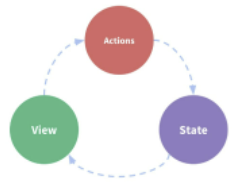

     * 부모 자식 간의 컴포넌트 관계가 단순하거나 depth가 깊지 않은 경우에는 문제가 없음
       * 몇 단계만 거치면 데이터를 쉽게 이동 시킬 수 있으며 훨씬 직관적으로 데이터 흐름을 파악할 수 있음
     * 규모가 커지면 상태 관리 어려워짐
       * 상태를 공유하는 컴포넌트의 상태 동기화 관리가 어려움
       * 상태를 전달할 때 상 -> 하로만 전달 가능
     * A 컴포넌트의 상태를 공유하는 다른 컴포넌트에 pass props & emit event 를 통해 동기화 해야 함

5.  **Vuex management pattern**

   * 중앙 저장소(store)에 state를 모아놓고 관리

   * 규모가 큰 (컴포넌트 중첩이 깊은) 프로젝트에서 매우 효율적

   * 각 컴포넌트에서는 중앙 집중 저장소의 state만 신경 쓰면 됨

     * 동일한 state를 공유하는 다른 컴포넌트들도 동기화 됨

       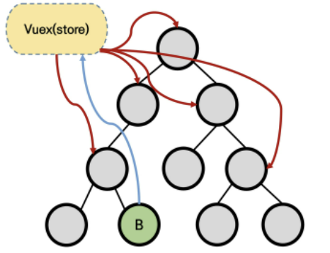

   * 상태의 변화에 따른 여러 흐름을 모두 관리해야 하는 불편함을 해소 할 필요가 있음

     * 상태는 데이터를 주고 받는 컴포넌트 사이의 관계도 충분히 고려해야 하기 때문에 상태 흐름 관리가 매우 중요해짐

   * 이러한 상태를 '올바르게 관리하는 저장소'의 필요성

     * 상태를 한 곳(store)에 모두 모아 놓고 관리하자
     * 상태의 변화는 모든 컴포넌트에서 공유
     * 상태의 변화는 오로지 vuex가 관리하여 해당 상태를 공유하고 있는 모든 컴포넌트는 변화에 '반응'

   * A 컴포넌트와 같은상태를 공유하는 다른 컴포넌트는 신경 쓰지 않고, 오로지 상태의 변화를 Vuex에 알림

<br>

### 2. Vuex Core Concepts

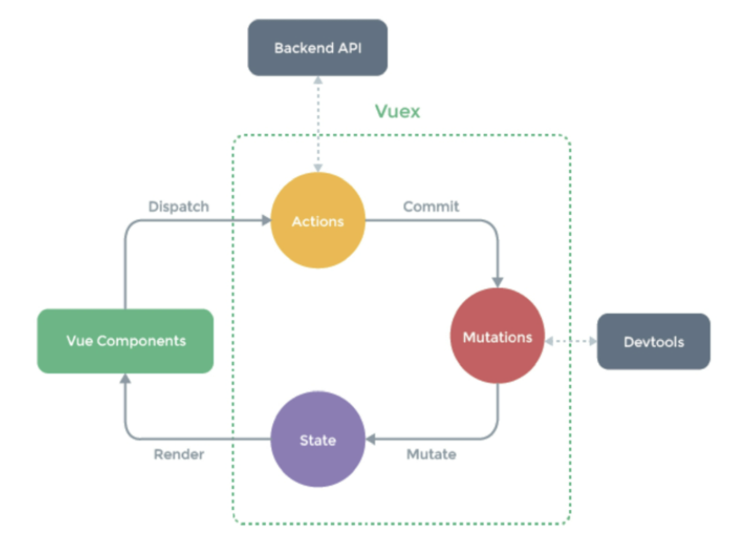

#### 1. State

* 중앙에서 관리하는 모든 상태 정보(data)
  * Vuex는 single state tree를 사용
* 즉, 이 단일 객체는 모든 애플리케이션 상태를 포함하는 "원본 소스(single source of truth)"의 역할을 함
* 각 애플리케이션 마다 하나의 저장소만 갖게 된다는 것을 의미함

* 여러 컴포넌트 내부에 있는 특정 state를 중앙에서 관리하게 됨
  * 이전의 방식은 state를 찾기 위해 각 컴포넌트를 직점 확인해야 했음
  * Vuex를 활용하는 방식은 Vuex Store에서 각 컴포넌트에서 사용하는 state를 한 눈에 파악 가능
* State가 변화하면 해당 state를 공유하는 여러 컴포넌트의 DOM은 (알아서) 렌더링
* 각 컴포넌트는 이제 Vuex Store 정보를 가져와 사용

#### 2. Mutations

* 실제로 state를 변경하는 유일한 방법

* mutation의 handler(핸들러 함수)는 반드시 동기적이어야 함

  * 비동기적 로직(ex. 콜백함수)은 state가 변화하는 시점이 의도한 것과 달라질 수 있으며, 콜백이 실제로 호출 될 시기를 알 수 있는 방법이 없음 (추적 할 수 없음)

* 첫 번째 인자로 항상 state를 받음

* Actions에서 commit() 메서드에 의해 호출됨

  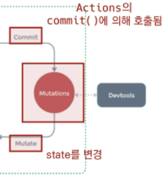

#### 3. Actions

* Mutations와 유사하지만 다음과 같은 차이점이 있음
  1. state를 변경하는 대신 **mutations를 commit()** 메서드로 호출해서 실행
  2. mutations와 달리 비동기 작업이 포함될 수 있음 (Backend API와 통신하여 Data Fetching 등의 작업 수행)
* **context** 객체 인자를 받음
  * context 객체를 통해 store/index.js 파일 내에 있는 모든 요소의 속성 접근 & 메서드 호출이 가능
  * 단, (가능하지만) **state를 직접 변경하지 않음**
* 컴포넌트에서 **dispatch()** 메서드에 의해 호출됨
* Actions를 통해 State를 조작할 수 있지만, state는 오로지 Mutations를 통해서만 조작 해야함
  * 명확한 역할 분담을 통해 서비스 규모가 커져도 state를 올바르게 관리하기 위함

#### 4. Getters

* state를 변경하지 않고 활용하여 계산을 수행(computed 속성과 유사)
  * compute를 사용하는 것 처럼 getters는 저장소의 상태(state)를 기준으로 계산
  * state에 todoList라는 해야 할 일의 목록의 경우 완료된 todo 목록만을 필터링 해서 출력해야 하는 경우가 있음
* computed 속성과 마찬가지로 getters의 결과는 state 종속성에 따라 캐시(cashed)되고, 종속성이 변경된 경우에만 다시 재계산 됨
* getters 자체가 state를 변경하지는 않음
  * state를 특정한 조건에 따라 구분(계산)만 함
  * 즉, 계산된 값을 가져옴

<br>

### 3. Todo app whit Vuex

#### 1. Set project & components

* 컴포넌트 구성

  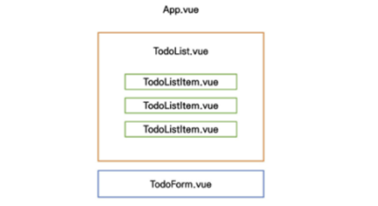


* actions에서 state 조작을 할 수 있지만 조작하지 말 것!

* Vuex 상태 관리 흐름

  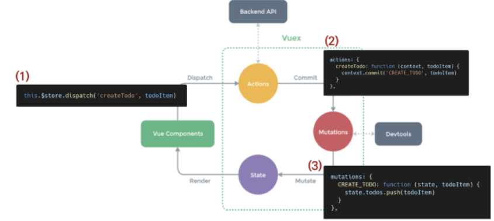

  1. dispatch가 actions를 부름
  2. actions에서 commit을 통해 mutations를 수행
  3. mutations를 통해 push 실행

#### 2. Create Todo

1. `state`에 todo 작성

   * 모든 상태를 넣어야 하는 것은 아님!

   ```javascript
   import Vue from 'vue'
   import Vuex from 'vuex'
   import createPersistedState from 'vuex-persistedstate'
   
   Vue.use(Vuex)
   
   export default new Vuex.Store({
     plugins: [
       createPersistedState(),
     ],
     state: {
       todos: [],
     },
     getters: {
     },
     mutations: {
       CREATE_TODO: function(state, todoItem){
         state.todos.push(todoItem)
       },
     },
     actions: {
       createTodo: function ({ commit }, todoItem) {
         commit('CREATE_TODO', todoItem)
       }, 
     },
     // actions: {
       // createTodo: function (context, todoItem) {
         // context.commit('CREATE_TODO', todoItem)
         // // const { commit } = context
        //  // commit('CREATE_TODO')
         // context.dispatch('saveTodos')
       // }, 
     // },
     modules: {
     },
   })
   ```

2. `TodoList.vue` 컴포넌트에서 Vuex Store의 state에 접근

   * computed : store에 저장된 todo 목록을 가져오는 것이기 때문에 매번 새로 호출하는 것은 비효율적이므로 todo가 추가 되는 등의 변경 사항이 있을 때만 새로 계산한 값을 반환하는 방향으로 변경한다.

   ```html
   <template>
     <div>
       <todo-list-item
         v-for="todo in todos"
         :key="todo.date"
         :todo="todo"
       ></todo-list-item>
     </div>
   </template>
   
   <script>
   import { mapState } from 'vuex'
   import { mapMutations } from 'vuex'
   import TodoListItem from './TodoListItem.vue'
   
   export default {
     name: 'TodoList',
     components: { TodoListItem },
     computed: {
       // todos: function () {
       //   return this.$store.state.todos
       // },
       ...mapState([
         'todos',
       ])
     },
     methods: {
       ...mapMutations(['LOAD_TODOS'])
     },
     create() {
       this.LOAD_TODOS()
     }
   
   }
   </script>
   
   <style>
   
   </style>
   ```

3. `TodoListItem.vue`

   TodoList.vue에서 받은 todo를 props로 내려 받음.

   ```html
   <template>
   
     <div>
       <span 
         @click="updateTodoStatus(todo)"
         :class="{ 'is-completed': todo.isCompleted }"
         >
         {{ todo.title }}
         </span>
       <!-- <button @click="deleteTodo">Delete</button> -->
       <!-- deleteTodo 실행할 때, mapActionst사용하려면 todo 넘겨줘야함! -->
       <button @click="deleteTodo(todo)">Delete</button>
     </div>
   
   </template>
   
   <script>
   import { mapActions } from 'vuex'
   
   export default {
     name: 'TodoListItem',
     props: {
       todo: Object,
     }, 
     methods: {
       // deleteTodo: function () {
       //   this.$store.dispatch('deleteTodo', this.todo)
       // }, 
       // updateTodoStatus: function(){
       //   this.$store.dispatch('updateTodoStatus',this.todo)
       // }
       ...mapActions([
         'deleteTodo',
         'updateTodoStatus',
       ])
   }
   }
   </script>
   
   <style scoped>
   .is-completed {
     text-decoration: line-through;
   }
   div {
     border: 2px solid black;
     margin: 2px;
     padding: 2px;
   }
   span {
       cursor: pointer;
   }
   </style>
   ```

4. `TodoForm.vue`

   ```html
   <template>
     <div>
       <input type="text"
         v-model.trim="todoTitle"
         @keyup.enter="createTodo"
       >
       <button @click='createTodo'>Add</button>
     </div>
   </template>
   
   <script>
   export default {
     name: 'TodoForm',
     data: function () {
       return {
         todoTitle:'',
       }
     },
     methods: {
       createTodo: function () {
         const todoItem = {
           title : this.todoTitle,
           isCompleted: false,
           date: new Date().getTime(),
         }
         if (todoItem.title) {
             this.$store.dispatch('createTodo', todoItem)
         }
         this.todoTitle = ''
       },
     },
   
   }
   </script>
   
   <style>
   
   </style>

#### 3. Delete Todo

1. `TodoListItem.vue`

   ```html
   <template>
   
     <div>
       <span 
         @click="updateTodoStatus(todo)"
         :class="{ 'is-completed': todo.isCompleted }"
         >
         {{ todo.title }}
         </span>
       <!-- <button @click="deleteTodo">Delete</button> -->
       <!-- deleteTodo 실행할 때, mapActionst사용하려면 todo 넘겨줘야함! -->
       <button @click="deleteTodo(todo)">Delete</button>
     </div>
   
   </template>
   
   <script>
   import { mapActions } from 'vuex'
   
   export default {
     name: 'TodoListItem',
     props: {
       todo: Object,
     }, 
     methods: {
       // deleteTodo: function () {
       //   this.$store.dispatch('deleteTodo', this.todo)
       // }, 
       // updateTodoStatus: function(){
       //   this.$store.dispatch('updateTodoStatus',this.todo)
       // }
       ...mapActions([
         'deleteTodo',
         'updateTodoStatus',
       ])
   }
   }
   </script>
   
   <style scoped>
   .is-completed {
     text-decoration: line-through;
   }
   div {
     border: 2px solid black;
     margin: 2px;
     padding: 2px;
   }
   span {
       cursor: pointer;
   }
   </style>
   ```

2. `index.js`

   ```javascript
   import Vue from 'vue'
   import Vuex from 'vuex'
   import createPersistedState from 'vuex-persistedstate'
   
   Vue.use(Vuex)
   
   export default new Vuex.Store({
     plugins: [
       createPersistedState(),
     ],
     state: {
       todos: [],
     },
     getters: {
       // 완료된 todo 개수 계산
       completedTodosCount: function (state) {
         return state.todos.filter(todo => {
           return todo.isCompleted === true
         }).length
       }, 
       // 완료되지 않은 todo 개수 계산
       uncompletedTodosCount: function (state) {
         return state.todos.filter(todo => {
           return todo.isCompleted === false
         }).length
       }, 
       // 전체 todo 개수 계산
       allTodosCount: function (state) {
         return state.todos.length
       },
       
     },
     mutations: {
       CREATE_TODO: function(state, todoItem){
         state.todos.push(todoItem)
   
       }, 
       DELETE_TODO: function (state, todoItem){
         // 1. todoItem이 첫 번째로 만나는 요소의 index를 가져옴
         const index = state.todos.indexOf(todoItem)
         // 2. 해당 index 1개만 삭제하고 나머지 요소를 토대로 새로운 배열 생성
         state.todos.splice(index, 1)
       }, 
     },
     actions: {
       createTodo: function (context, todoItem) {
         context.commit('CREATE_TODO', todoItem)
         // const { commit } = context
         // commit('CREATE_TODO')
         context.dispatch('saveTodos')
   
       }, 
       deleteTodo: function ({ commit }, todoItem) {
         if (confirm('정말 삭제하시겠습니까?')) {
           commit('DELETE_TODO', todoItem)
         }
       }, 
     },
     modules: {
     },
   })
   
   ```

#### 4. Update Todo

1. `span`태그로 `@click="updateTodoStatus"`만들기
   * 취소선 긋기 : v-bind 사용

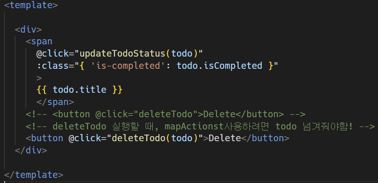

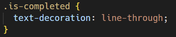

2. `methods` 내부에서 `updateTodoStatus` 함수 만들기

   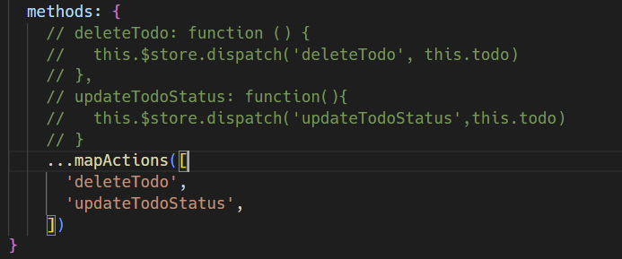

3. `index.js`에서 `actions` 내부에 `updateTodoStatus` 함수 만들기

   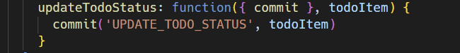

4. `mutations`에서 `UPDATA_TODO_STATUS`만들기

   * "전개 구문" 사용하여 코드 축소 가능

   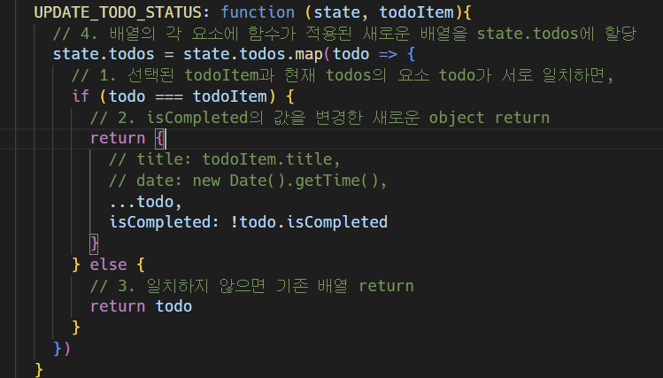

#### 5. Getters

* store에서 계산된 값을 받아서 사용함 

* `...mapGetters([])` 사용

  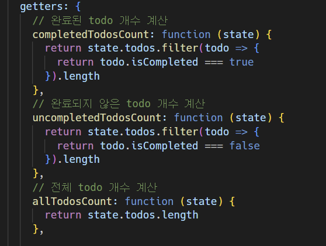

  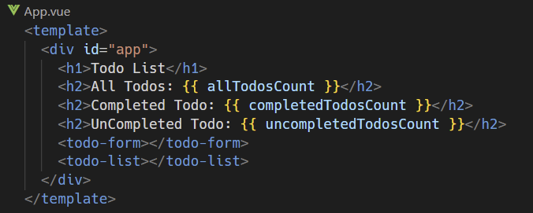

  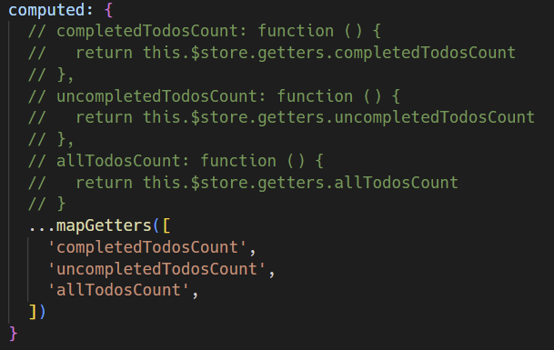

#### 6. Component Binding Helper

* JS Array Helper Method를 통해 배열 조작을 편하게 하는 것과 유사
  * 논리적인 코드 자체가 변하는 것이 아니라 "쉽게" 사용할 수 있도록 되어 있음에 초점

1. **mapState**

   * computed와 Store의 state를 매핑

   * Vuex Store의 하위 구조를 반환하여 component 옵션을 생성함

   * 매핑된 computed 이름이 state 이름과 같을 때 문자열 배열을 전달할 수 있음

   * 하지만 다른 computed 값을 함께 사용할 수 없기 때문에 최종 객체를 computed에 전달할 수 있도록 객체 전개 연산자(Object Spread Operator)로 객체를 복사하여 작성

     * mapState()는 객체를 반환함

       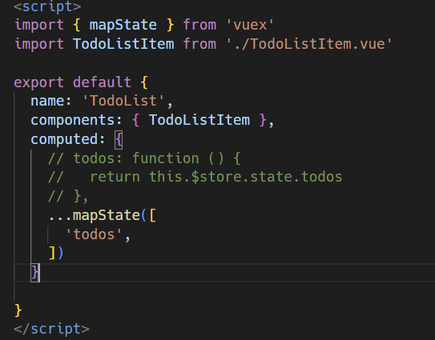
   
2. **mapActions**

   * action을 전달하는 컴포넌트 method 옵션을 만듦

   * actions를 객체 전개 연산자(Object Spread Operator)로 계산하여 추가하기

   * [주의]

     * mapActions를 사용하면, 이전에 dispatch()를 사용했을 때 payload로 넘겨줬던 this.todo를 pass prop으로 변경해서 전달해야 함

     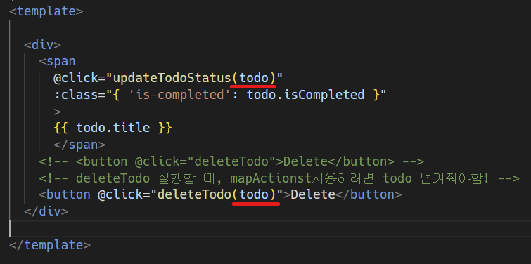

     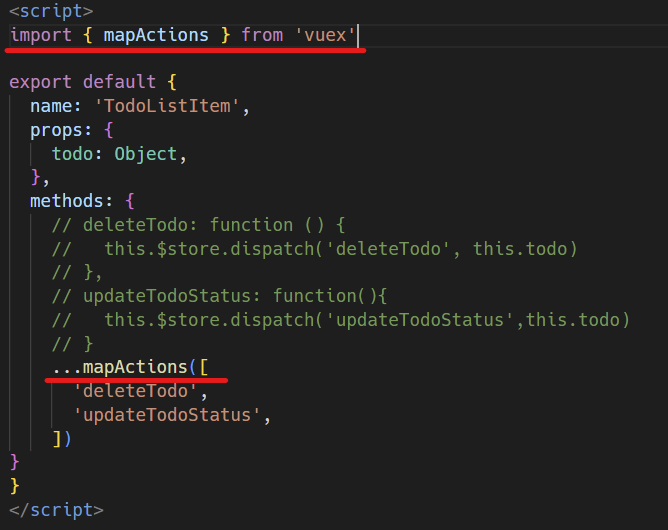

#### 7. Local storage

1. 라이브러리 사용하기

   * vuex state를 자동으로 브라우저의 LocalStorage에 저장해주는 라이브러리 중 하나

   * 페이지가 새로고침 되어도 Vuex state를 유지시킴

   * 설치

     ```bash
     $ npm i vuex-persistedstate
     ```

     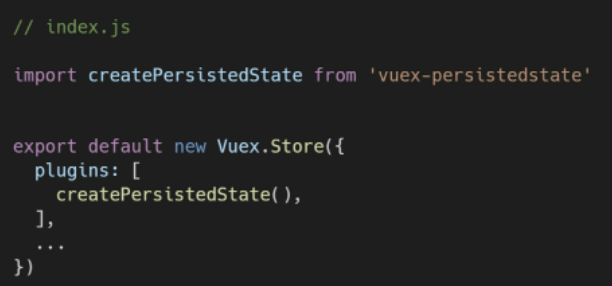

   * 사용하기
     1. localStorage.getItem('todos')
     2. const prevData = localStorage.getItem('todos')
     3. JSOS.parse('prevData')

2. 코드 작성

   ```javascript
   mutations: {
       LOAD_TODOS(state) {
         const todosString = localStorage.getItem('todos')
         state.todos = todosString
       },
       CREATE_TODO: function(state, todoItem){
         state.todos.push(todoItem)
   
       },
   ... 
   },
    actions: {
       saveTodos({ state }){
         const jsonData = JSON.stringify(state.todos)
         localStorage.setItem('todos', jsonData)
       },
       createTodo: function (context, todoItem) {
         context.commit('CREATE_TODO', todoItem)
         // const { commit } = context
         // commit('CREATE_TODO')
         context.dispatch('saveTodos')
   
       }, 
   ...
    },
   ```

   ```javascript
   // TodoList.vue
   
   <script>
   import { mapState } from 'vuex'
   import { mapMutations } from 'vuex'
   import TodoListItem from './TodoListItem.vue'
   
   export default {
       name: 'TodoList',
       components: { TodoListItem },
       computed: {
           // todos: function () {
           //   return this.$store.state.todos
           // },
           ...mapState([
               'todos',
           ])
       },
       methods: {
           ...mapMutations(['LOAD_TODOS'])
       },
       create() {
           this.LOAD_TODOS()
       }
   }
   </script>
   ```

   

<br>
