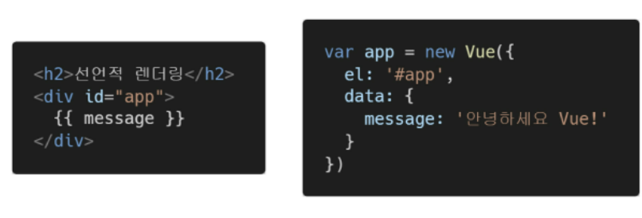
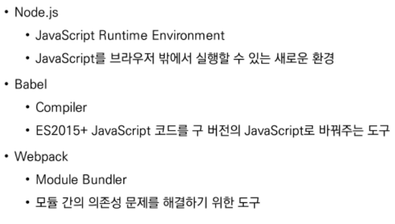
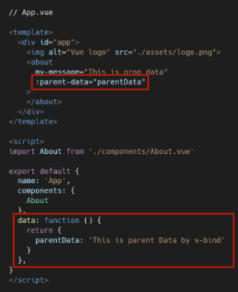
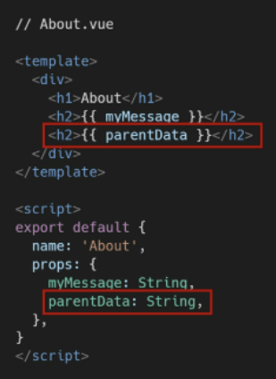
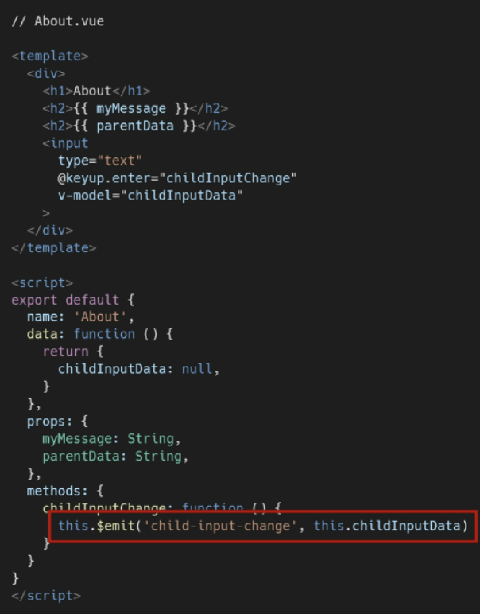
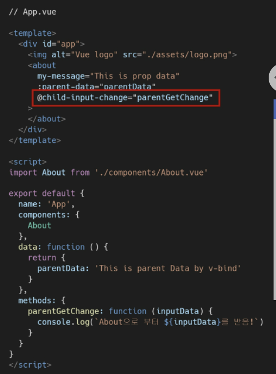
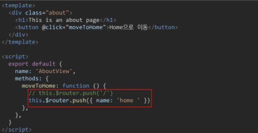
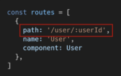
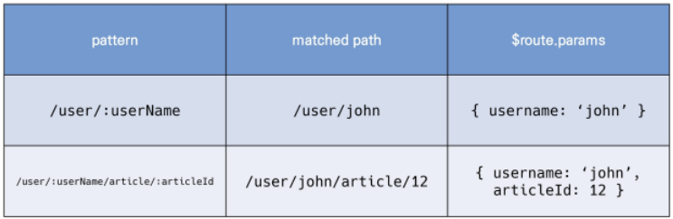

# 05.14

# 과목평가 공부

[TOC]

## 1. Vue 기초

### 1. Intro

* 대표적인 프론트 엔드 프레임워크 : Vue.js, React, Angular

  * Vue.js
    * 사용자 인터 페이스를 만들기 위한 진보적인 자바스크립트 프레임워크
    * 현대적인 tool과 다양한 라이브러리를 통해 SPA(Single page Application)를 완벽하게 지원
    * Evan You에 의해 발표
    * 구글의 Angular 개발자 출신
  * SPA(Single page Application) : 현재 페이지를 동적으로 렌더링함으로써 사용자와 소통하는 웹애플리케이션. 단일 페이지로 구성되며 서버로부터 최초에만 페이지를 다운로드하고, 이후에는 동적으로 DOM을 구성한다. 처음 페이지를 받은 이후 부터는 새로운 전체 페이지를 불러오는 것이 아닌, 현재 페이지 중 필요한 부분만 동적으로 다시 작성한다.

  * CSR 
    * Client Side Rendering
    * 서버에서 화면을 구성하는 SSR 방식과 달리 클라이언트에서 화면을 구성
    * 최초 요청시 HTML, CSS, JS 등 데이터를 제외한 각종 리소스를 응답받고 이후 클라이언트에서는 필요한 데이터만 요청해 JS로 DOM을 렌더링 하는 방식
    * 즉, 처음엔 뼈대만 받고 브라우저에서 동적으로 DOM을 그림
    * SPA가 사용하는 렌더링 방식
    * [장점] : 서버와 클라이언트 간 트래픽 감소, 사용자 경험(UX) 향상
    * [단점] : SSR에 비해 전체 페이지 최종 렌더링 시점이 느림, SEO(검색 엔진 최적화)에 어려움이 있음 (최초 문서에 데이터 마크업이 없기 때문)
  * SSR
    * Server Side Rendering
    * 서버에서 클라이언트에게 보여줄 페이지를 모두 구성하여 전달하는 방식
    * JS 웹 프레임 워크 이전에 사용되던 전통적인 렌더링 방식
    * [장점] : 초기 구동속도가 빠름, SEO(검색 엔진 최적화)에 적합
    * [단점] : 모든 요청마다 새로운 페이지를 구성하여 전달, 반복되는 전체 새로고침으로 인해 사용자 경험이 떨어짐, 상대적으로 트래픽이 많아 서버의 부담이 클 수 있음.

### 2. Why Vue.js?

* Vue.js : DOM과 Data가 연결되어 있고 Data를 변경하면 이에 연결된 DOM은 알아서 변경
* 즉, 우리가 신경 써야 할 것은 오직 Data에 대한 관리(Developer Exp 향상)

### 3. MVVM

1. M(Model)  : javaScript object. 키와 벨류 값으로 이루어진 객체이다. **data**라는 이름으로 존재. 이 data가 바뀌면 View(DOM)가 반응
2. V(뷰에서 View는 DOM(HTML)) : Data의 변화에 따라서 바뀌는 대상
3. VM(ViewModel) : 뷰 인스턴스이다. View와 Model 사이에서 Data와 DOM에 관련된 모든 일을 처리한다. ViewModel을 활용해 Data를 얼마만큼 잘 처리해서 보여줄 것인지(DOM)를 고민하는 것이다.   

### 4. Quick Start of Vue.js



### 5. Template Syntax

* v-show와 v-if: V-show는 최초에 모든 요소가 렌더링 되기 때문에 v-if에 비해 상대적으로 렌더링 비용이 높으나 자주 변경되는 요소라면 한 번 렌더링 된 이후부터는 보여주지는 않는지에 대한 여부만 판단하면 되기 때문에 토글 비용이 적다. v-if는 전달 인자가 false인 경우 렌더링 되지 않기 때문에 렌더링 비용이 낮지만 자주 변경되는 요소의 경우 다시 렌더링 해야 하므로 비용이 증가할 수 있다. 
* computed와 methods: computed는 종속된 대상이 변경되지 않는 한 computed에 작성된 함수를 여러 번 호출해도 계산을 다시 하지 않고 계산되어 있던 결과를 반환한다. 이에 비해 methods를 호출하면 렌더링을 다시 할 때마다 항상 함수를 실행한다.  
* computed와 watch: computed("특정 값이 변동하면 해당 값을 다시 계산해서 보여준다.")는 특정 데이터를 직접적으로 사용/가공하여 다른 값으로 만들 때 사용한다. 속성은 계산해야 하는 목표 데이터를 정의하는 방식으로 소프트웨어 공학에서 이야기하는 선언형 프로그래밍 방식이다. watch("특정 값이 변동하면 다른 작업을 한다.")는 특정 데이터의 변화 상황에 맞춰 다른 data 등이 바뀌어야 할 때 주로 사용한다. 감시할 데이터를 지정하고 그 데이터가 바뀌면 특정 함수를 실행하는 방식이다. 소프트웨어 공학에서 이야기하는 명령형 프로그래밍 방식이다. 특정 대산이 변경되었을 때 콜백 함수를 실행시키기 위한 트리거

### 6. LifeCycle Hook

---

## 2. Vue 심화

### 1. SFC(Single File Component)

1. Component(컴포넌트) 
   * 기본 HTML 엘리먼트를 확장하여 재사용 가능한 코드를 캡슐화 하는데 도움을 줌
   * CS에서는 다시 사용할 수 있는 범용성을 위해 개발된 소프트웨어 구성 요소를 의미
   * 즉, 컴포넌트는 유지보수를 쉽게 만들어 줄 뿐만 아니라, 재사용성 측면에서도 매우 강력한 기능을 제공

2. SFC (Single File Component)

   * vue의 컴포넌트 기반 개발의 핵심 특징

   * 하나의 컴포넌트는 .vue 확장자를 가진 하나의 파일 안에서 작성되는 코드의 결과물

   * 화면의 특정 영역에 대한 `HTML, CSS, JavaScript 코드를 하나의 파일(.vue)에서 관리`

   * 즉, .vue 확장자를 가진 싱글 파일 컴포넌트를 통해 개발하는 방식

     `vue 컴포넌트 === vue 인스턴스 === .vue 파일`

3. Vue Component 구조 예시

   * 한 화면 안에서도 기능 별로 각기 다른 컴포넌트가 존재
     * 하나의 컴포넌트는 여러 개의 하위 컴포넌트를 가질 수 있음
     * Vue는 컴포넌트 기반의 개발 환경 제공
   * Vue 컴포넌트는 const app = new Vue({...})의 app을 의미하며 이는 Vue 인스턴스
     * 여기서 오해하면 안 되는 것은 컴포넌트 기반의 개발이 반드시 파일 단위로 구분되어야 하는 것은 아님 (Vue 컴포넌트는 Vue 인스턴스 `new Vue({})` 이기도 하다. )
     * 단일 .html 파일 안에서도 여러 개의 컴포넌트를 만들어 개발 가능
     * vue 인스턴스는 .vue 파일 안에 작성된 코드의 집합이다.

### 2. Vue CLI

> Vue CLI는 Vue.js 개발을 위한 표준 도구이다.
>
> 프로젝트의 구성을 도와주는 역할을 하며
>
> Vue 개발 생태계에서 표준 tool 기준을 목표로 한다.
>
> 확장 플러그인, GUI, Babel 등 다양한 tool 제공

1. **Node.js**

   * 자바스크립트를 브라우저가 아닌 환경에서도 구동할 수 있도록 하는 자바스크립트 런타임 환경
     * 브라우저 밖을 벗어날 수 없던 자바스크립트 언어의 태생적 한계를 해결
   * Chrome V8 엔진을 제공하여 여러 OS 환경에서 실행할 수 있는 환경을 제공
   * 즉, 단순히 브라우저만 조작할 수 있던 자바스크립트를 SSR 아키텍처에서도 사용할 수 있도록 함

2. NPM (Node Package Manage)

   * 자바스크립트 언어를 위한 패키지 관리자

     * python에 pip가 있다면 Node.js에는 NPM
     * pip와 마찬가지로 다양한 의존성 패키지를 관리

   * Node.js의 기본 패키지 관리자

   * Node.js 설치 시 함께 설치됨

   * [설치] 

     ```bash
     $ npm install -g @vue/cli
     ```

     [프로젝트 생성]

     ```bash
     $ vue create my-first-app
     ```

     [프로젝트 디렉토리 이동]

     ```bash
     $ cd my-first-app
     ```

     [서버 실행]

     ```bash
     $ npm run serve
     ```

3. Babel & Webpack

   * **Babel**

     * Javascript compiler
     * `자바 스크립트의 ECMAScript 2015+ 코드를 이전 버전으로 번역/변환해 주는 도구`
     * 과거 자바스크립트의 파편화와 표준화의 영향으로 코드의 스펙트럼이 매우 다양
       * 이 때문에 최신 문법을 사용해도 이전 브라우저 혹은 환경에서 동작하지 않는 상황이 발생
     * 원시 코드(최신 버전)를 목적 코드(구 버전)로 옮기는 번역기가 등장하면서 개발자는 더 이상 내 코드가 특정 브라우저에서 동작하지 않는 상황에 대해 크게 고민하지 않을 수 있게 됨

   * **Webpack**

     * static module bundler
     * `모듈 간의 의존성 문제를 해결하기 위한 도구`
     * 프로젝트에 필요한 모든 모듈을 매핑하고 내부적으로 종속성 그래프를 빌드함

   * Static Module Bundler

     * 모듈은 단지 파일 하나를 의미 (ex. js 파일 하나 === 모듈 하나)
     * [배경]
       * 브라우저만 조작할 수 있었던 시기의 자바스크립트는 모듈 관련 문법 없이 사용 됨
       * 하지만 JS와 애플리케이션이 복잡해지고 크기가 커지자 전역 scope를 공유하는 형태의 기존 개발 방식의 한계점이 드러남
       * 그래서 라이브러리를 만들어 필요한 모듈을 언제든지 불러오거나 코드를 모듈 단위로 작성하는 등의 다양한 시도가 이루어짐
       * 여러 모듈 시스템 : ESM, AMD, CommonJS, UMD...
     * [Module 의존성 문제]
       * 모듈의 수가 많아지고 라이브러리 혹은 모듈 간의 의존성(연결성)이 깊어지면서 특정한 곳에서 발생한 문제가 어떤 모듈 간의 문제인지 파악하기 어려움
       * 즉, Webpack은 이 `모듈 간의 의존성 문제를 해결하기 위해 등장`
     * 모듈 의존성 문제를 해결해주는 작업을 Bundling이라고 함
     * 이러한 일을 해주는 도구가 Bundler이고, Webpack은 다양한 Bundler 중 하나
     * 여러 모듈을 하나로 묶어주고 묶인 파일은 하나(혹은 여러 개)로 합쳐짐
     * Bundling된 결과물은 더 이상 순서에 영향을 받지 않고 동작하게 됨
     * snowpack,  parcel, rollup.js 등의 webpack 이외에도 다양한 모듈 번들러 존재
     * Vue CLI는 이러한 Babel, Webpack에 대한 초기 설정이 자동으로 되어 있음

     

### 3. Pass props & Emit event

* 컴포넌트 작성

  * Vue app은 자연스럽게 중첩된 컴포넌트 트리로 구성됨
  * 컴포넌트간 부모-자식 관계가 구성되며 이들 사이에 필연적으로 의사 소통이 필요함
  * 부모는 자식에게 데이터를 전달(`pass props`)하며, 자식은 자신에게 일어난 일을 부모에게 알림(`Emit event`)
  * 부모는 props를 통해 자식에게 '데이터'를 전달하고, 자식은 events를 통해 부모에게 '메시지'를 보냄

* 컴포넌트 구조

  1. 템플릿 (HTML)
     * HTML의 body부분
     * 각 컴포넌트를 작성
  2. 스크립트 (javaScript)
     * JavsScript가 작성되는 곳
     * 컴포넌트 정보, 데이터, 메서드 등 vue 인스턴스를 구성하는 대부분이 작성 됨
  3. 스타일 (CSS)
     * CSS가 작성되며 컴포넌트의 스타일을 담당

* 컴포넌트 등록 3단계

  1. 불러오기 (import)
  2. 등록하기 (register)
  3. 보여주기 (print)

  ```vue
  <template>
    <div id="app">
      
        <!-- 3. 보여주기 -->
        <about></about>
    </div>
  </template>
  
  <script>
  // 1. 불러오기
  import About from './components/About.vue'
      
  export default {
    name: 'App',
      components: {
        // 2. 등록하기
        About
      }
  }
  </script>
  ```

* **Props**

  * props는 부모(상위) 컴포넌트의 정보를 전달하기 위한 사용자 지정 특성이다.
  * 자식(하위) 컴포넌트는 props 옵션을 사용하여 수신하는 props를 명시적으로 선언해야 함
  * 즉, 데이터는 props 옵션을 사용하여 자식 컴포넌트로 전달됨
  * [주위]
    * 모든 컴포넌트 인스턴스에는 자체 격리된 범위가 있음
    * 즉, 자식 컴포넌트의 템플릿에서 상위 데이터를 직접 참조할 수 없음

  

  

  * 선언시에는 camelCase 사용, HTML에선 kebab-case 사용
  * 컴포넌트의 'data'는 반드시 함수여야 함
    * 기본적으로 각 인스턴스는 모두 같은 data 객체를 공유하므로 새로운 data 객체를 반환(return) 하여야 함
  * 단방향 데이터 흐름
    * 모든 props는 하위 속성과 상위 속성 사이의 `단방향 바인딩`을 형성
    * 부모의 속성이 변경되면 자식 속성에게 전달되지만, 반대방향으로는 안 됨
      * 자식 요소가 의도치 않게 부모 요소의 상태를 변경하여 앱의 데이터 흐름을 이해하기 어렵게 만드는 일을 방지
    * 부모 컴포넌트가 업데이트될 때마다 자식 요소의 모든 prop들이 최신 값으로 업데이트됨

* **Emit event**

  * Listening to Child Components Events\
  * `$emit(eventName)`
    * 현재 인스턴스에서 이벤트를 트리거
    * 추가 인자는 리스너의 콜백 함수로 전달
  * 부모 컴포넌트는 자식 컴포넌트가 사용되는 템플릿에서 v-on을 사용하여 자식 컴포넌트가 보낸 이벤트를 청취 (v-on을 이용한 사용자 지정 이벤트)
  * 컴포넌트 및 props와는 달리, 이벤트는 자동 대소문자 변환을 제공하지 않는다. 
  * HTML의 대소문자 구분을 위해 DOM 템플릿의 v-on 이벤트 리스너는 항상 자동으로 소문자 변환되기 때문에 v-on:myEvent는 자동으로 v-on:myevent로 변환된다.
  * 이러한 이유로 이벤트 이름에는 항상 kebab-case를 사용하는 것을 권장한다.

  



### 4. Vue Router

> Vue.js 공식 라우터
>
> 라우트(route)에 컴포넌트를 매핑한 후, 어떤 주소에서 렌더링할 지 알려줌
>
> SPA 상에서 라우팅을 쉽게 개발할 수 있는 기능을 제공
>
> [참고] router
>
> * 위치에 대한 최적의 경로를 지정하며, 이 경로를 따라 데이터를 다음 장치로 전향시키는 장치

* [프로젝트 생성 및 이동]

  ```bash
  $ vue create my-router-app
  $ cd my-router-app
  ```

* [Vue Router plugin 설치(Vue CLI 환경)]

  ```bash
  $ vue add router
  ```

  * 기존 프로젝트를 진행하고 있던 도중에 추가하게 되면 App.vue를 덮어쓰므로, 프로젝트 내에서 다음 명령을 실행하기 전에 필요한 경우 파일을 백업(커밋)해야 함

* [Vue Router로 인한 변화]

  1.  App.vue 코드

  2. router/index.js 생성

  3. views 디렉토리 생성

     * `<router-link>`

       사용자 네비게이션을 가능하게 하는 컴포넌트

       목표 경로는 'to' prop으로 지정됨

       HTML5 히스토리 모드에서 router-link는 클릭 이벤트를 차단하여 브라우저가 페이지를 다시 로드하지 않도록 함

       a 태그지만 우리가 알고 있는 GET 요청을 보내는 a 태그와 조금 다르게, 기본 GET 요청을 보내는 이벤트를 제거한 형태로 구성됨

     * `<router-view>`

       주어진 라우트에 대해 일치하는 컴포넌트를 렌더링하는 컴포넌트

       실제 component가 DOM에 부착되어 보이는 자리를 의미

       router-link를 클릭하면 해당 경로와 연결되어 있는 index.js에 정의한 컴포넌트가 위치

* History mode

  * HTML History API를 사용해서 router를 구현한 것
  * 브라우저의 히스토리는 남기지만 실제 페이지는 이동하지 않는 기능을 지원
  * 즉, 페이지를 다시 로드하지 않고 URL을 탐색할 수 있음
    * SPA의 단점 중 하나인 "URL이 변경되지 않는다"를 해결
  * [참고]
    * DOM의 Window 객체는 history 객체를 통해 브라우저의 세션 기록에 접근할 수 있는 방법을 제공
    * history 객체는 사용자를 자신의 방문 기록 앞과 뒤로 보내거나, 기록의 특정 지점으로 이동하는 등 유용한 메서드와 속성을 가짐

  1. Named Routes

     * 이름을 가지는 라우트

     * 명명된 경로로 이동하려면 객체를 vue-router 컴포넌트 요소의 prop에 전달 

  2. 프로그래밍 방식 네비게이션

     * router-link를 사용하여 선언적 탐색을 위한 a 태그를 만드는 것 외에도, router의 인스턴스 메서드를 사용하여 프로그래밍 방식으로 같은 작업을 수행할 수 있음.

     * vue 인스턴스 내부에서 라우터 인스턴스 `$router`로 접근할 수 있음

     * 따라서 다른 URL로 이동하려면 `this.$router.push를 호출할 수 있음
       * 이 메서드는 새로운 항목을 히스토리 스택에 넣기 때문에 사용자가 브라우저의 뒤로 가기 버튼을 클릭하면 이전 URL로 이동하게 됨

     * router-link를 클릭할 때 내부적으로 호출되는 메서드이므로 `router-link :to="..."`를 클릭하면, `router.push(...)`를 호출하는 것과 같음

  

  3. Dynamic Route Matching

     * 동적 인자 전달
     * 주어진 패턴을 가진 라우트를 동일한 컴포넌트에 매핑해야 하는 경우
     * 예를 들어 모든 User에 대해 동일한 레이아웃을 가지지만, 다른 User ID로 렌더링 되어야 하는 User 컴포넌트 예시

     

     

* components와 views 
  * 기본적으로 작성된 구조에서 components 폴더와 views 폴더 내부에 각기 다른 컴포넌트가 존재하게 됨
  * 컴포넌트를 작성해 갈 때 정해진 구조가 있는 것은 아니며, 주로 아래와 같이 구조화하여 활용함
  * `App.vue`
    * 최상위 컴포넌트
  * `Views/`
    * router(index.js)에 매핑되는 컴포넌트를 모아두는 폴더
    * ex) App 컴포넌트 내부에 AboutView & HomeView 컴포넌트 등록
  * `components/`
    * router에 매핑된 컴포넌트 내부에 작성하는 컴포넌트를 모아두는 폴더
    * ex) Home 컴포넌트 내부에 HelloWorld 컴포넌트 등록
* Vue Router가 필요한 이유
  1. SPA 등장 이전
     * 서버가 모든 라우팅을 통제
     * 요청 경로에 맞는 HTML를 제공
  2. SPA 등장 이후
     * 서버는 index.html 하나만 제공
     * 이후 모든 처리는 HTML 위에서 JS 코드를 활용해 진행
     * 즉, 요청에 대한 처리를 더 이상 서버가 하지 않음(할 필요가 없어짐)
  3. 라우팅 처리 차이
     * SSR
       * 라우팅에 대한 결정권을 서버가 가짐
     * CSR
       * 클라이언트는 더 이상 서버로 요청을 보내지 않고 응답받은 HTML 문서 안에서 주소가 변경되면 특정 주소에 맞는 컴포넌트를 렌더링
       * 라우팅에 대한 결정권을 클라이언트가 가짐
     * 결국 Vue Router는 라우팅의 결정권을 가진 Vue.js에서 라우팅을 편리하게 할 수 있는 Tool을  제공해주는 라이브러리

### 5. Youtube Project

