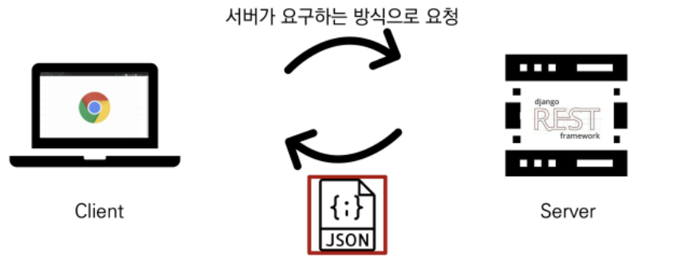
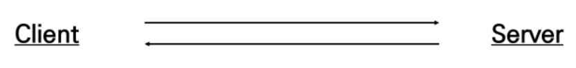
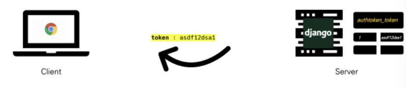
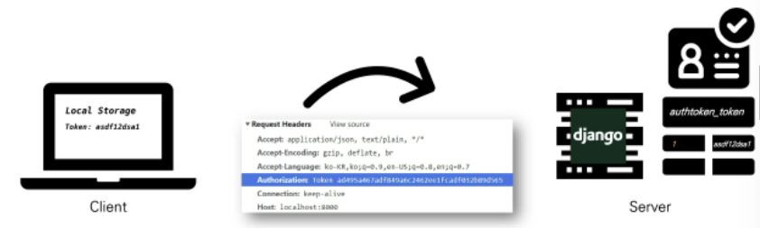

# 05.16

## VUE+API

[TOC]

### 1. Server &Client

1. Server `정보 제공`

   * 클라이언트에게 '정보', '서비스'를 제공하는 컴포터
   * 정보 & 서비스
     * Django를 통해 응답한 template(HTML)
     * DRF를 통해 응답한 JSON

2. Client `정보 요청 & 표현`

   * 서버에게 그 서버가 맡는(서버가 제공하는) **서비스를 요청**하고, 서비스 요청을 위해 필요한 인자를 **서버가 요구하는 방식에 맞게 제공**하며, 서버로부터 반환되는 응답을 **사용자에게 적절한 방식으로 표현**하는 기능을 가진 시스템

     

     

### 2. CORS

1. **Same-origin policy (SOP)**
   * 동일 출처 정책
   
   * 특정 출처(origin)에서 불러온 문서나 스크립트가 다른 출처에서 가져온 리소스와 상호작용 하는 것을 제한하는 보안 방식
   
   * 잠재적으로 해로울 수 있는 문서를 분리함으로써 공격받을 수 있는 경로를 줄임
   
   * Origin(출처)
     * 두 URL의 Protocol, Port, Host가 모두 같아야 동일한 출처라 할 수 있다. 
     * URL `http://store.company.com/dir/page.html`의 출처를 비교한 예시
       1. `http://store.company.com/dir/inner/another.html` 성공- 경로만 다름
       2. `http://store.company.com/dir/page.html` 성공 - 경로만 다름
       3. `https://store.company.com/secure.html` 실패 - 프로토콜 다름
       4. `http://store.company.com:81/dir/etc.html` 실패 - 포트 다름
       5. `http://news.company.com/dir/other.html` 실패 - 호스트 다름
     
   * Same-origin 예시
   
     
   
     protocol, Host, Port가 동일 해야함!!
   
2. **Cross-origin Resource Sharing (CORS)**

   * 교차 출처 리소스(자원) 공유
   * **추가 HTTP header를 사용**하여, 특정 출처에서 실행중인 웹 애플리케이션이 다른 출처의 자원에 접근 할 수 있는 권한을 부여하도록 브라우저에 알려주는 체제
   * 리소스가 자신의 출처(Domain, Protocol, Port)와 다를 때 교차 출처 HTTP 요청을 실행
   * 보안 상의 이유로 브라우저는 교차 출처 HTTP 요청을 제한 (SOP)
     * 예를 들어 XMLHttpReaquest는 SOP를 따름
   * 다른 출처의 리소스를 불러오려면 그 출처에서 올바른 CORS header를 포함한 응답을 반환해야 함
   * Cross-Origin Resource Sharubg Policy (CORS Policy)
     * 교차 출처 리소스(자원) 공유 정책
     * 다른 출처(origin)에서 온 리소스를 공유하는 것에 대한 정책

   * 교차 출처 접근 허용하기
     * CORS를 사용해 교차 출처 접근을 허용하기
     * CORS는 HTTP의 일부로, 어떤 호스트에서 자신의 컨텐츠를 불러갈 수 있는지 서버에 지정할 수 있는 방법
   * **Why CORS?**
     1. 브라우저 & 웹 애플리케이션 보호
        * 악의적인 사이트의 데이터를 가져오지 않도록 사전 차단
        * 응답으로 받는 자원에 대한 최소한의 검증
        * 서버는 정상적으로 응답하지만 브라우저에서 차단
     2. Server의 자원 관리
        * 누가 해당 리소스에 접근 할 수 있는지 관리 가능

   * **How CORS?**

     * CORS 표준에 의해 추가된 HTTP Header를 통해 이를 통제

     * CORS HTTP 응답 헤더 예시 : Access-Control-Allow-Origin (이 응답이 주어진 출처로부터 요청 코드와 공유될 수 있는지를 나타냄)

       `*`는 모든 도메인에서 접근할 수 있다. 

   * CORS 시나리오 예시

     

     

     :small_red_triangle: 요청 헤더의 Origin을 보면 `localhost:8080`으로 부터 요청이 왔다는 것을 알 수 있다. 서버는 이에 대한 응답으로 Access-Control-Allow-Origin 헤더를 다시 전송한다. 만약 서버 리소스 소유자가 오직 localhost:8080의 요청에 대해서만 리소스에 대한 접근을 허용하려는 경우, `*`가 아닌 `Access-Control-Allow-Origin: localhost:8080`을 전송해야 한다.

     1. Vue.js에서 A 서버로 요청

     2. A 서버는 Access-Control-Allow-Origin에 특정한 origin을 포함 시켜 응답(서버는 CORS Policy와 직접적인 연관이 없고 그저 요청에 응답함)

     3. 브라우저는 응답에서 Access-Control-Allow-Origin을 확인 후 허용 여부를 결정

     4. 프레임워크 별로 이를 지원하는 라이브러리가 존재

        ```bash
        $ pip install django-cors-headers
        ```

        ```python
        # settings.py
        
        INSTALLED_APPS = [
            ...,
            'corsheaders',
            ...
        ]
        
        MIDDLEWARE = [
            ...
            # CommonMiddleware보다 위에 위치
            'corsheaders.middleware.CorsMiddleware',
            ...
            'django.middleware.common.CommonMiddleware',
            ...
        ]
        
        CORS_ALLOWED_ORIGINS = [
            'http://localhost:8000',
        ]
        ```

        

### 3. Authentication & Authorization

1. **Authentication**

   * 인증, 입증
   * 자신이라고 주장하는 사용자가 누구인지 확인하는 행위
   * 모든 보안 프로세스의 첫 번째 단계(가장 기본 요소)
   * 즉, 내가 누구인지를 확인하는 과정
   * 401 Unauthorized
     * 비록 HTTP 표준에서는 "미승인(Unauthorized)"을 하고 있지만 의미상 이 응답은 "비인증(unauthenticated )"을 의미
   * `Django -> 게시판 서비스 로그인`

2. **Authorization**

   * 권한 부여, 허가
   * 사용자에게 특정 리소스 또는 기능에 대한 액세스 권한을 부여하는 과정(절차)
   * 보안 환경에서 권한 부여는 항상 인증을 따라야 함
     * 예를 들어, 사용자는 조직에 대한 액세스 권한을 부여 받기 전에 먼저 자신의 ID가 진짜인지 먼저 확인해야함
   * 서류의 등급, 웹 페이지에서 글을 조회 & 삭제 & 수정 할 수 있는 방법, 제한 구역
     * 인증이 되었어도 모든 권한을 부여 받는 것은 아님
   * 403 Forbidden
     * 401과 다른 점은 서버는 클라이언트가 누군지 알고 있음
   * `Django -> 일반 유저 vs 관리자 유저`

3. Authentication and authorization work together

   * 회원가입을 하고 로그인을 하면 할 수 있는 권한 생성 
   * Django에서 `로그인을 했더`라도 `다른 사람의 글까지 수정/삭제가 가능하진 않음`

4. **DRF Authentication** (다양한 인증 방식)

   1. Session Based
   2. Token Based
      - Basic Token
      - JWT
   3. Oauth

5. :star: Basic Token Authentication

   * 사용자를 확인하고 새로운 토큰 값을 줌

   

   

   .assets/image-20220516143619951.png)

### 4. JWT

> JSON Web Token
>
> JSON 포맷을 활용하여 요소 간 안전하게 정보를 교환하기 위한 표준 포맷
>
> 암호화 알고리즘에 의한 디지털 서명이 되어 있기 때문에 JWT 자체로 검증 가능
>
> JWT 자체가 필요한 정보를 모두 갖기 때문에 (self-contained) 이를 검증하기 위한 다른 검증 수단(ex.table)이 필요 없음
>
> [사용처] 
>
> * Authentication, Information Exchange

1. JWT 특징

   * 기본 토큰 인증 체계와 달리 JWT 인증 확인은 데이터베이스를 사용하여 토큰의 유효성을 검사할 필요가 없음
     * 즉, JWT는 데이터베이스에서 유효성 검사가 필요 없음
     * JWT 자체가 인증에 필요한 정보를 모두 갖기 때문(self-contained)
     * 이는 세션 혹은 기본 토큰을 기반으로 한 인증과의 핵심 차이점
     * 토큰 탈취시 서버 측에서 토큰 무효화가 불가능(블랙리스팅 테이블 활용)
     * 매우 짧은 유효기간(5min)과 Refresh 토큰을 활용하여 구현
     * MSA(Micro Server Architecture) 구조에서 서버간 인증에 활용
     * One Source(JWT) Multi Use 가능

   ```bash
   $ pip install django-allauth
   $ pip install dj-rest-auth
   ```

   ```python
   # settings.py
   
   INSTALLED_APPS = [
       ...,
       'rest_framework',
       'rest_framework.authtoken',
   	
   	# DRF auth 담당
   	'dj_rest_auth',  # signup 제외 모든
   	'dj_rest_auth.registration',  # 회원가입
   	
   	'allauth',
   	'allauth.account',
   	
   	# allauth 사용을 위해 필요
   	'django.contrib.sites',
       ...
   ]
   
   # django.contrib.sites 에서 등록 필요
   SITE_ID = 1
   
   # drf 설정
   REST_FRAMEWORK = {
   	# 기본 인증 방식
   	'DEFAULT_AUTHNTICATION_CLASSES': [
   		'rest_framework.authentication.TokenAuthentication',
   	],
   	
   	# 기본 권한 설정
   	'DEFAULT_PERMISSION_CLASSES': [
   		#'rest_framework.permissions.AllowAny',  # 기본적으로 모두에게 허용
   		'rest_framework.permissions.IsAuthenticated',  # 기본적으로 인증받아야 사용
   	]
   }
   ```

   ```python
   # urls.py
   
   from django.contrib import admin
   from django.urls import path, include
   
   urlpatterns = [
   	...
       path('dj-rest-auth/', include('dj_rest_auth.urls')),
       path('dj-rest-auth/registration/', include('dj_rest_auth.registration.urls')),
   ]
   
   ```
   
   

