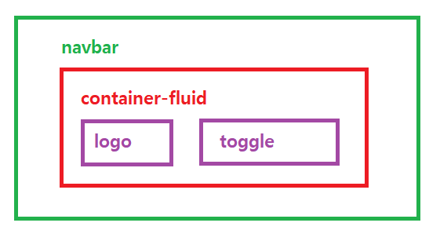

# 02.11

## Web : 공부


:mortar_board: **toggle 만들기(햄버거 버튼)**  

```python
<nav class="navbar">
  <div class="container-fluid">
    <a class="navbar-brand" href="#">Navbar</a>                                (1)
    <button class="navbar-toggler" type="button" data-bs-toggle="collapse" data-bs-target="#navbarSupportedContent" aria-controls="navbarSupportedContent" aria-expanded="false" aria-label="Toggle navigation">
      <span class="navbar-toggler-icon"></span>
    </button>                                                                  (2)
    <div>
    ...                                                                        (3)
    </div>
  </div>
</div>
```

위의 구조를 시각화 하면 다음과 같다. `container-fluid`에서 `d-flex justify-content-center align-center`를 하게되면 (1) logo와 (2) toggle이 왼쪽과 오른쪽에 배치된다.  다만 (3)에는 toggle(햄버거 버튼)이 풀릴 때 보일 menu를 작성해주면 된다. 예를 들어, 다음과 같이 (3)에 작성할 수 있다. 

```python
<ul>
  <li></li>
  <li></li>
  <li></li>
</ul>
```



