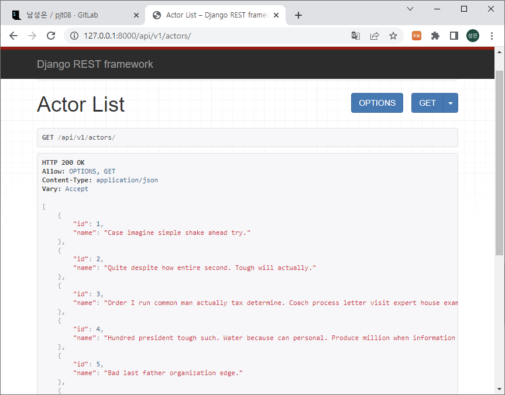
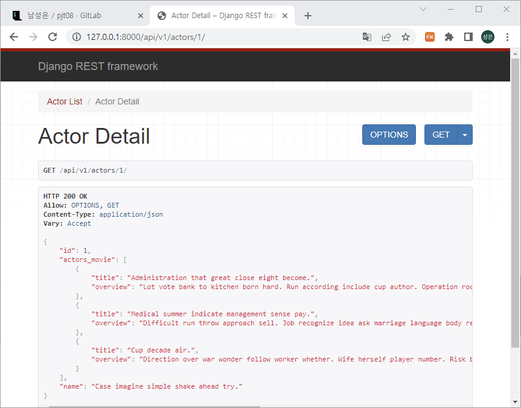
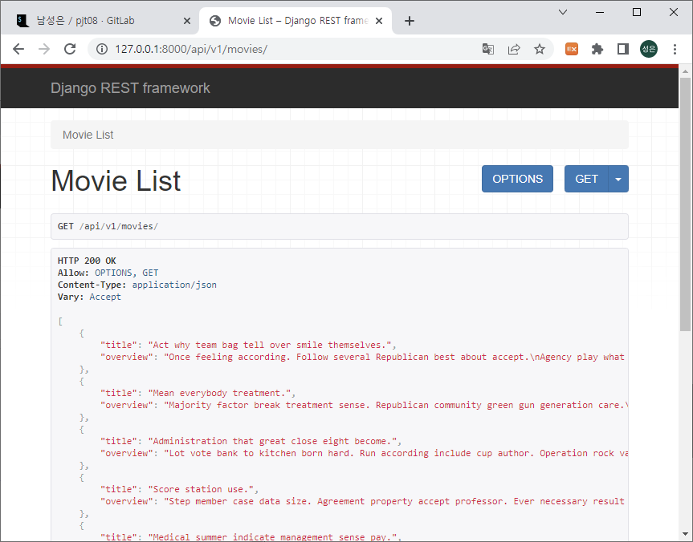
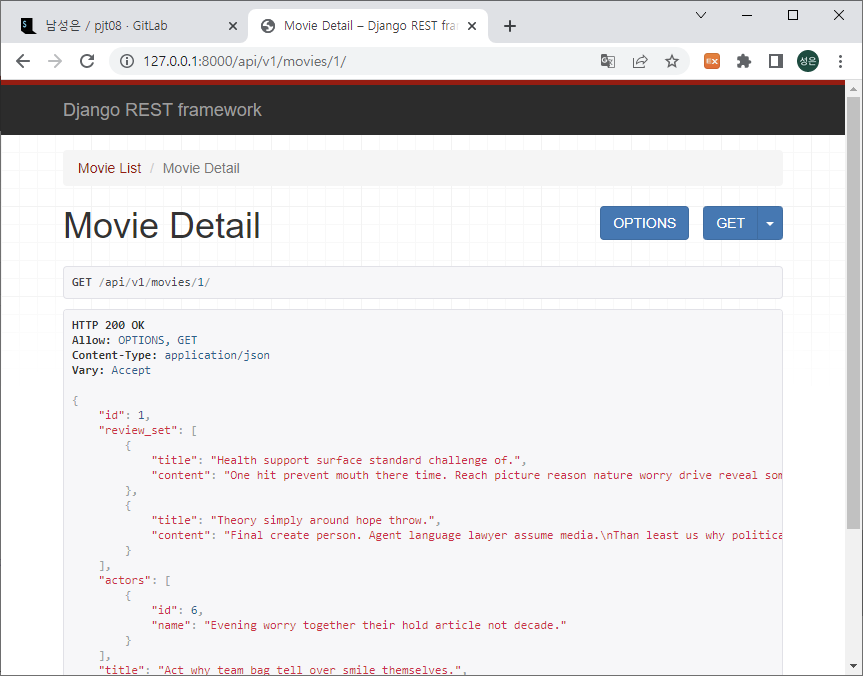
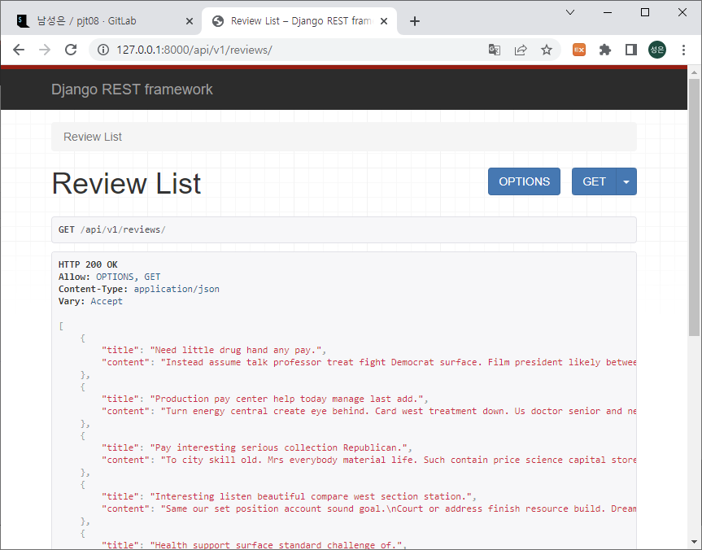
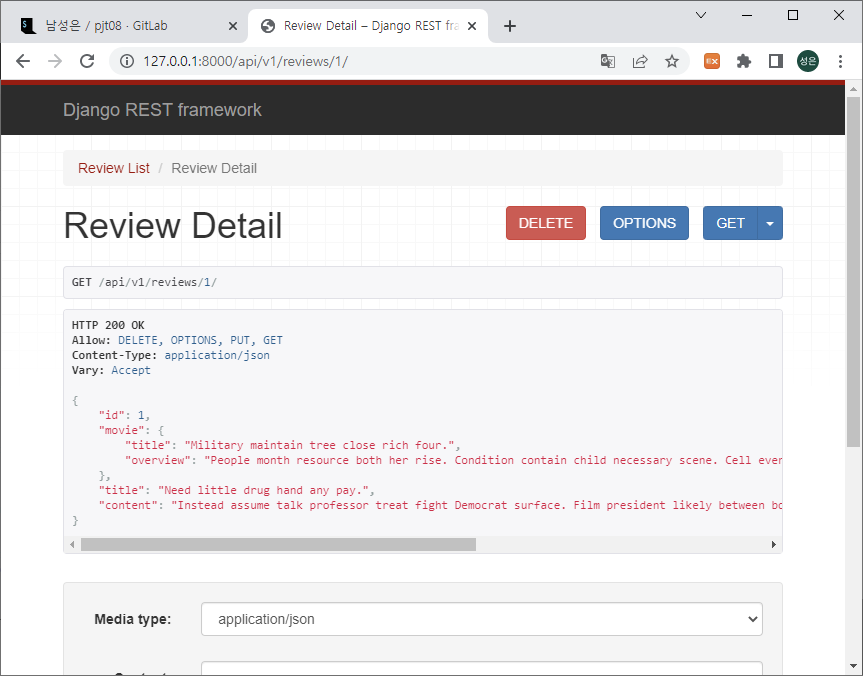
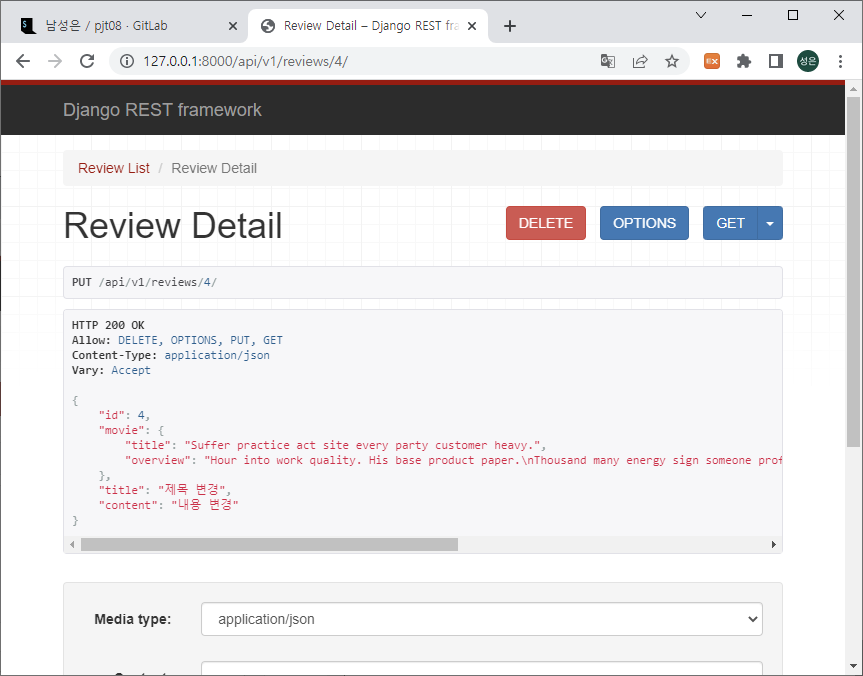
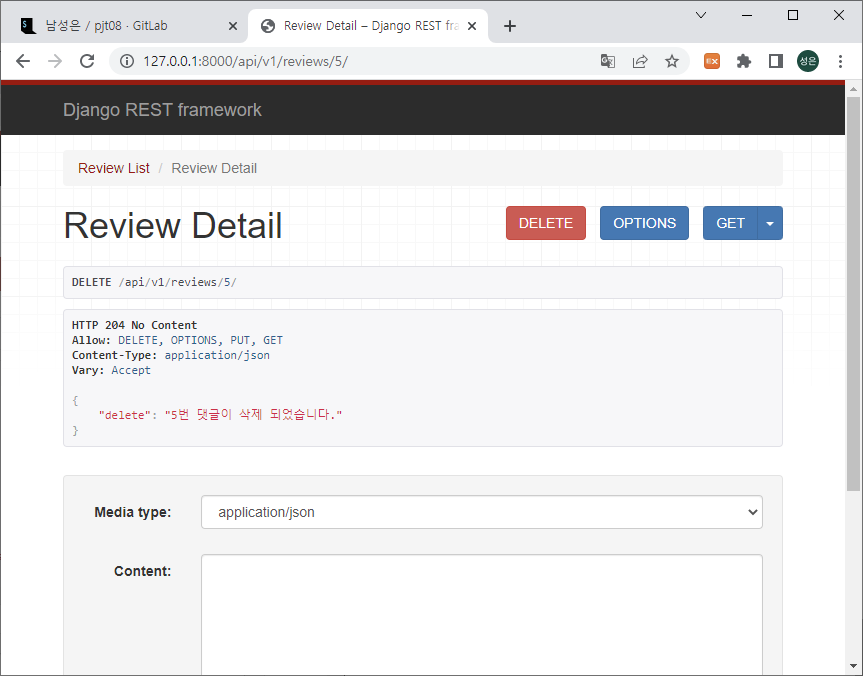
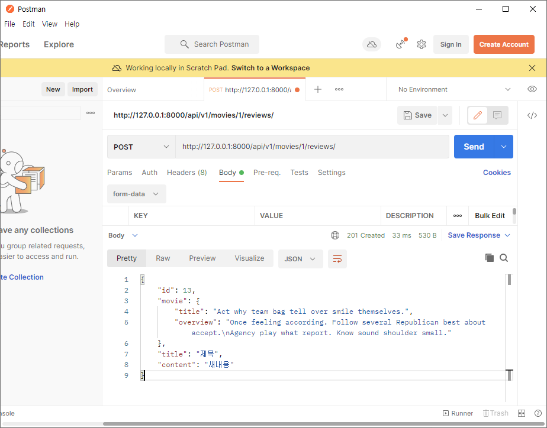

# README😘

## PJT08 - 2022.04.22.

**남성은[서울 6반], 오채명[서울 6반]** 

[TOC]

## 프로젝트 평👀

### 오채명👍

---

#### :red_circle: 어려웠던 점

이번 페어프로그래밍은  `1. 기본 셋팅` `2. models.py 작성` `3. serializers.py 작성` `4. urls.py` `5. views.py` `6. 중간 중간 오류 점검`의 구조로 진행 되었다. 성은님께서 드라이버를 맞아 주셔서 기본 셋팅을 준비해 주셨다. 가장 어려운 부분은 model과 serializer를 작성하는 과정이었다. 우선 model은 명세에 있는 그대로 작성하였으나 `1:N`과 `M:N`을 신경 써주어야 했기 때문에 어려웠다. 

`1:N`은 model작성 과정에서 `ForeignKey`를 이용해 나타내었고, `M:M`은 serializer 작성 과정에서 `ManyToManyField`를 통해 구현했다. 이 과정에서 교재를 찾아보며 까먹었던 부분을 진행했고, 이 부분에서 가장 많은 시간을 썼지만 그만큼 이해가 된 것 같아서 좋았다. urls.py와 views.py를 성은님과 번갈아가며 작성했고, 마지막에 최종 확인하여 프로젝트를 마무리 할 수 있었다. 


#### :book: 보완해야 할 점과 학습내용

그간 코드를 작성 했을 때에와는 다르게 urls.py와 views.py를 순서대로 작성했던 점에서 전체적인 구조를 이해하고 있다는 느낌이 들었다. 세세한 부분까지는 교재와 구글링의 힘을 빌려야 하지만 왜 여기서 인스턴스를 조회하는지, 파라미터로는 어떤 값이 들어가야하는지 등의 부분을 이해하게 되었던 것 같다. 작성 순서에 있어서 코드를 이해하며 외우는 스킬이 필요할 것 같다.


#### :star: 총평

오늘로 네번째 페어 프로그래밍을 진행하면서 페어프로그래밍이 점차 익숙해지게 되었다. 처음에는 내 실력이 들통날까봐, 내 코드를 누군가 보고있다는 부담감에 어려울 것 같았지만 첫번째 페어프로그래밍 부터 괜찮게 진행되었다. 우선 성은님과 두번째 페어프로그래밍으로 번갈아가며 드라이버를 맡았다. 이 과정에서 페어프로그래밍의 구조를 이해할 수 있게 되었다. 그리고 성은님께서 드라이버의 역할을 맡아주셨을 때는 감시자가 아닌 조력자로서의 느낌을 많이 받았다. 오류가 발생했을 때는 같이 고민해주며 이런 방식으로 해보면 좋을 것 같다 등의 의견을 내주시고, 같이 코드를 보며 오타를 수정하는 등 힘이 많이 되었다. 최대한 교수님의 도움을 받지 말자는 마인드로 함께 진행하다보니 재미있게 진행되었던 것 같다. 성은님께서 적극적인 모습으로 페어프로그래밍에 임해 주셔서 감사하고,  다음 페어 프로그래밍에서도 짐이 되지 않도록 더 공부해야겠다. 


### 남성은🤞

---

#### :red_circle: 어려웠던 점

- ERD로 복잡하게 주어진 명세를 직접 반영해보는 것이 처음이었는데, 생각보다 어렵고 어떤식으로 클래스를 구현해낼지 쉽게 머릿속에 그려지지 않았다. 중간에 생기는 오류들을 해결하는데 하나를 고치면 다른 곳도 연달아 고쳐야하는 경우가 다반사였고 그러다보니 구조가 머릿속에서 자꾸 둥둥 떠나디는 거 같았다.
- 처음에 `models.py`에서 클래스를 만드는데 프로젝트 중반까지도 class를 (models.Model)로 상속받아야 하는 것을 잊고 진행하다가 runserver에서 막히자 한참을 헤맸다... 어려운걸 해야한다는 생각에 기초를 까먹어버린 실수였다.
- `modles.py`와 `serializers.py`에서 생성하는 class들의 인자 및 메서드들의 인자들이 자꾸 헷갈렸다... 프로젝트 이후에도 계속 복기하고 적어봐야지 헷갈리지 않을 수 있을 것 같다.
- 중간에 참조하는 필드를 JSON으로 출력할 때, 참조해온 모델이 자꾸 id값으로만 출력되는 것을 해결하는 것이 어려웠다. 채경님이 구글링으로 찾아주신 방법대로 함으로써 이를 해결할 수 있었다.
- 일대다 참조의 경우에는 위에서 말한대로 해결을 했으나 다대다 관계에서 또 헤매고 있었다. 알고보니 many=True 옵션값을 넣어주지 않아서 출력값이 자꾸 null로 출력되는 문제였다.


#### :book: 보완해야 할 점과 학습내용

- 데이터 모델링 과정에서 ERD를 기반으로 해서 모델링을 구현하는 과정이 거의 프로젝트 구현의 절반을 차지한다고 느꼈다. 사실 오늘은 이걸 기존에 해온대로 큰 고민없이 모델과 시리얼라이즈를 짰는데 생각보다 중간에 생기는 오류가 많고 해결에 어려움을 겪었다. 앞으로는 이 부분에 대한 의논을 먼저 충분히 하고 구상을 해야겠다고 느꼈다.

- 오히려 어려운걸 배울수록 기본적인 부분에서 까먹고 실수를 하는 과정이 좀 있었다... 기초부터 다시 한 번 복기해봐야겠다고 다짐했다.

- 역참조는 계속 신경을 쓰다보니 틀리지 않을 수 있었는데 오히려 참조하는 과정에서 문제가 있었다. 이 문제는 

  일대다 참조의 경우 출력하고자 하는 변수를 `sirealizers.py`에서 설정해줌으로써 해결할 수 있었고 다대다 참조의 경우에는 위와 방법은 같으나 many=True옵션값을 추가로 설정해줌으로써 해결할 수 있었다.

  ```python
  # 해결 전: 자꾸 참조하는 필드의 정보가 id값으로만 출력
  
  class MovieSerializer(serializers.ModelSerializer):
      review_set = ReviewListSerializer(many=True, read_only=True) # 일대다 역참조
  
      class Meta:
          model = Movie
          fields = '__all__'
          read_only_fields = ('actors',)
  
  
  class ActorSerializer(serializers.ModelSerializer):
      actors_movie = MovieListSerializer(many=True, read_only=True) # 다대다 역참조
      
      class Meta:
          model = Actor
          fields = '__all__'
  
  
  class ReviewSerializer(serializers.ModelSerializer):
  
      class Meta:
          model = Review
          fields = '__all__'
          read_only_fields = ('movie',)
  ```

  ```python
  # 해결 후
  
  class MovieSerializer(serializers.ModelSerializer):
      review_set = ReviewListSerializer(many=True, read_only=True)	# 일대다 역참조
      actors = ActorListSerializer(many=True, read_only=True)			# 다대다 참조
  
      class Meta:
          model = Movie
          fields = '__all__'
          read_only_fields = ('actors',)
  
  
  class ActorSerializer(serializers.ModelSerializer):
      actors_movie = MovieListSerializer(many=True, read_only=True)	# 다대다 역참조
      
      class Meta:
          model = Actor
          fields = '__all__'
  
  
  class ReviewSerializer(serializers.ModelSerializer):
      movie = MovieListSerializer(read_only=True)		# 일대다 참조
  
      class Meta:
          model = Review
          fields = '__all__'
          read_only_fields = ('movie',)
  ```


#### :star: 총평

페어프로그래밍의 장점을 느낄 수 있었다. 혼자서는 해결하지 못했을(혹은 엄청 오래 걸렸을) 문제들을 금방 해결할 수 있었고,  의논을 해가면서 모델링 과정에서 아이디어를 내자 이해가 안되던 구상들이 머릿속에서 점차 자리를 잡아간다는 느낌을 받았다.

최대한 둘의 힘으로 프로젝트를 명세 그대로 구현해보고 싶었는데, 감사하게도 채명님의 도움을 굉장히 많이 받았다. 잘 알지 못했던 부분을 여쭤보면 친절히 알려주셨고 둘 모두에게 어려운 부분은 같이 구글링이나 교재를 참고해가면서 해결방법을 찾았는데 채명님께서 정말 잘 찾아주셔서 중간에 생긴 문제들을 모두 해결할 수 있었다.

처음엔 정말 협업이 두려웠는데 이제는 협업이 오히려 재밌어졌다!! 아무래도 혼자서 뚫기 어려운 난관들을 더 효율적이고 쉽게 해결할 수 있어서인 것 같다. 지금까지의 배운 점들을 쭉 처음부터 진행해보면서 나에게 부족한 부분이 뭔지, 그리고 그 해결방법이 뭔지를 세세하게 알아나갈 수 있어서 좋은 시간이었다!


## ✨결과물✨

### ✔구현결과 사진✔

---

#### [api/v1/actors/]




#### [api/v1/actors/1]




#### [api/v1/movies]




#### [api/v1/movies/1]




#### [api/v1/review]




#### [api/v1/reviews/1]

- **GET**

  


- **PUT** (4번게시글)

  

  

- **DELETE** (5번게시글)

  


#### [api/v1/movies/1/reviews]




### ✔주요 파일들✔

---

#### [pjt8]

- **urls.py**

  ```python
  from django.contrib import admin
  from django.urls import path, include
  
  
  urlpatterns = [
      path('admin/', admin.site.urls),
      path('api/v1/', include('movies.urls')),
  ]
  ```

---

#### [movies]

- **admin.py**

  ```python
  from django.contrib import admin
  from .models import Actor, Movie, Review
  # Register your models here.
  
  class ActorAdmin(admin.ModelAdmin):
      list_display = ('pk', 'name')
  
  admin.site.register(Actor, ActorAdmin)
  admin.site.register(Movie)
  admin.site.register(Review)
  ```

- **models.py**

  ```python
  from django.db import models
  
  # Create your models here.
  class Actor(models.Model):
      name = models.CharField(max_length=100)
  
  
  class Movie(models.Model):
      actors = models.ManyToManyField(Actor, related_name='actors_movie')
      title = models.CharField(max_length=100)
      overview = models.TextField()
      release_date = models.DateTimeField()
      poster_path = models.TextField()
  
  
  class Review(models.Model):
      movie = models.ForeignKey(Movie, on_delete=models.CASCADE)
      title = models.CharField(max_length=100)
      content = models.TextField()

- **serializers.py**

  ```python
  from rest_framework import serializers
  from .models import Actor, Movie, Review
  
  
  class ActorListSerializer(serializers.ModelSerializer):
  
      class Meta:
          model = Actor
          fields = ('id', 'name',)
  
  
  class MovieListSerializer(serializers.ModelSerializer):
  
      class Meta:
          model = Movie
          fields = ('title', 'overview',)
  
  
  class ReviewListSerializer(serializers.ModelSerializer):
  
      class Meta:
          model = Review
          fields = ('title', 'content',)
  
  
  class MovieSerializer(serializers.ModelSerializer):
      review_set = ReviewListSerializer(many=True, read_only=True)
      actors = ActorListSerializer(many=True, read_only=True)
  
      class Meta:
          model = Movie
          fields = '__all__'
          read_only_fields = ('actors',)
  
  
  class ActorSerializer(serializers.ModelSerializer):
      actors_movie = MovieListSerializer(many=True, read_only=True)
      
      class Meta:
          model = Actor
          fields = '__all__'
  
  
  class ReviewSerializer(serializers.ModelSerializer):
      movie = MovieListSerializer(read_only=True)
  
      class Meta:
          model = Review
          fields = '__all__'
          read_only_fields = ('movie',)

- **urls.py**

  ```python
  from . import views
  from django.urls import path
  
  
  urlpatterns = [
      path('actors/', views.actor_list),
      path('actors/<int:actor_pk>/', views.actor_detail),
      path('reviews/', views.review_list),
      path('reviews/<int:review_pk>/', views.review_detail),
      path('movies/', views.movie_list),
      path('movies/<int:movie_pk>/', views.movie_detail),
      path('movies/<int:movie_pk>/reviews/', views.create_review),
  ]

- **views.py**

  ```python
  from django.shortcuts import get_list_or_404, get_object_or_404
  from django.shortcuts import render
  from .models import Actor, Movie, Review
  from .serializers import (
      ActorListSerializer,
      ActorSerializer,
      MovieListSerializer,
      MovieSerializer,
      ReviewListSerializer,
      ReviewSerializer
  )
  from rest_framework.response import Response
  from rest_framework.decorators import api_view
  from rest_framework import status
  
  
  @api_view(['GET'])
  def actor_list(request):
      actors = get_list_or_404(Actor)
      serializer = ActorListSerializer(actors, many=True)
      return Response(serializer.data)
  
  
  @api_view(['GET'])
  def actor_detail(request, actor_pk):
      actor = get_object_or_404(Actor, pk=actor_pk)
      serializer = ActorSerializer(actor)
      return Response(serializer.data)
  
  
  @api_view(['GET'])
  def review_list(request):
      reviews = get_list_or_404(Review)
      serializer = ReviewListSerializer(reviews, many=True)
      return Response(serializer.data)
  
  
  @api_view(['GET', 'PUT', 'DELETE'])
  def review_detail(request, review_pk):
      review = get_object_or_404(Review, pk=review_pk)
      if request.method == 'GET':
          serializer = ReviewSerializer(review)
          return Response(serializer.data)
  
      elif request.method == 'PUT':
          serializer = ReviewSerializer(review, request.data)
          if serializer.is_valid(raise_exception=True):
              serializer.save()
              return Response(serializer.data)
  
      
      elif request.method == 'DELETE':
          review.delete()
          data = {
              'delete': f'{ review_pk }번 댓글이 삭제 되었습니다.',
          }
          return Response(data, status=status.HTTP_204_NO_CONTENT)
  
  
  @api_view(['GET'])
  def movie_list(request):
      movies = get_list_or_404(Movie)
      serializer = MovieListSerializer(movies, many=True)
      return Response(serializer.data)
  
  
  @api_view(['GET'])
  def movie_detail(request, movie_pk):
      movie = get_object_or_404(Movie, pk=movie_pk)
      serializer = MovieSerializer(movie)
      return Response(serializer.data)
  
  
  @api_view(['POST'])
  def create_review(request, movie_pk):
      movie = get_object_or_404(Movie, pk=movie_pk)
      serializer = ReviewSerializer(data=request.data)
      if serializer.is_valid(raise_exception=True):
          serializer.save(movie=movie)
          return Response(serializer.data, status=status.HTTP_201_CREATED)

